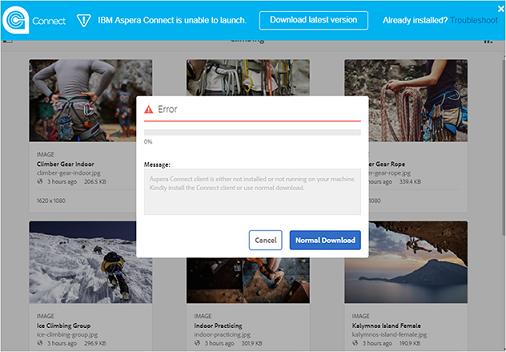
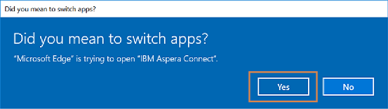

# Speed up the Brand Portal downloads {#guide-to-accelerate-downloads-from-brand-portal}

Brand Portal allows enhancing the download performance of large asset files by integrating with IBM Aspera Connect, which is an install-on-demand application. The application uses proprietary technology to remove TCP overheads and helps improve transfer speed of the asset files. This integration ensures enhanced download experience.

>[!NOTE]
>
>Downloadsnelheid verschilt voor gebruikers omdat dit afhankelijk is van factoren zoals netwerkbandbreedte, serverlatentie en geografische locatie van clients.

Als deze optie is ingeschakeld, kunnen gebruikers van Brand Portal de tijd die nodig is om de gewenste elementbestanden te downloaden, aanzienlijk verkorten via Brand Portal of de gedeelde koppeling door de Aspera Connect-client te installeren.

## Vereisten om bestanden sneller te downloaden {#prerequisites-to-accelerate-file-download}

To download the files faster, ensure the following:

* **[!UICONTROL Enable Download Acceleration]** (standaard uitgeschakeld) in [!UICONTROL General Settings] het deelvenster met beheergereedschappen.
* Poort 33001 (zowel TCP als UDP) is open op de firewall. For more information on the prerequisites, see [Aspera Connect Client documentation](https://downloads.asperasoft.com/en/documentation/8).
* Install Aspera Connect using Administrator privileges.
* For platform support of Aspera transfer client, see [Aspera Connect platform support matrix](https://www.asperasoft.com/company/support/transfer-clients/).

## Download domains {#download-domains}

Following are the download domains for different geographies:

| Region Code | Domein |
|---|---|
| NA OF1 | downloads-na1.brand-portal.adobe.com |
| NA VA5 | downloads-na2.brand-portal.adobe.com |
| EMEA LON5 | downloads-emea1.brand-portal.adobe.com |
| APAC SIN2 | downloads-apac1.brand-portal.adobe.com |

## Sample download performance using file accelerator {#expected-download-performance-using-file-accelerator}

The following table shows download performance for 2 GB file using Aspera Connect file download accelerator:

*The observed results do vary due to factors such as network bandwidth, server latency, and client location, considering Brand Portal server is at Oregon (United States).*

| Client location | Latency between client and server (milliseconds) | Speed with Aspera Connect File Transfer Accelerator (MBps) | Time taken to download 2 GB file with  Aspera File Transfer Accelerator (seconds) |
|---------------------------|-----------------------------------|---------------------------------------------|-------------------------------------------------------------------------|
| V.S. West (N. Californië) | 18 | 36 | 57 |
| U.S. West (Oregon) | 42 | 36 | 57 |
| U.S. East (N. Virginia) | 85 | 35 | 58 |
| APAC (Tokyo) | 124 | 36 | 57 |
| Noida (India) | 275 | 13.36 | 153 |
| Sydney | 175 | 29 | 70 |
| Londen | 179 | 35 | 58 |
| Singapore | 196 | 34 | 60 |

## Download workflow using file accelerator {#download-workflow-using-file-accelerator}

To download assets faster from Brand Portal:

1. Log in to Brand Portal using a supported browser.
1. Browse and select the desired asset file, folder, or collection to download. Tap/ click download option.
Download dialog appears with [Enable download acceleration] option selected.
   

   >[!NOTE]
   >
   >The functionality to send email notification with the link to download assets is presently not supported while faster downloads are enabled.

   

1. Tap/click the **[!UICONTROL Download]** option.
To speed up the download experience on your Brand Portal tenant account, you need to have Aspera Connect client application installed on your system.

1. **Download Aspera Connect Client**
If Aspera Connect client is not installed on your system or the existing installed Aspera Connect client is out of date, a prompt is displayed on browser page from where you can download the system-specific Aspera Connect client by selecting **[!UICONTROL Download Latest Version]**.

   

   To download the latest version of Aspera Connect from [https://downloads.asperasoft.com/connect2/](https://downloads.asperasoft.com/connect2/), select **[!UICONTROL Download Now]** and follow the instructions.

1. **Install Aspera Connect Client**
To install IBM Aspera Connect client setup, run the setup from  .msi  file of IBM Aspera Connect client application and follow the installation wizard.

1. Once the client is successfully installed, either refresh the browser page and initiate the download steps again or select **[!UICONTROL Restart]** in asset **[!UICONTROL Download]** dialog box (Step #2).
When using Aspera Connect for the first time, the browser prompts to open the link using **[!UICONTROL IBM Aspera Connect]**. Schakel deze optie in als u dit dialoogvenster in de toekomst wilt overslaan. **[!UICONTROL Remember my choice for FASP links]**

   >[!NOTE]
   >
   >This message is different on the different browsers.

1. Een dialoogvenster bevestigt of de overdracht moet worden voortgezet. Selecteer **[!UICONTROL Allow]** om te beginnen.
Schakel deze optie in als u dit dialoogvenster in de toekomst wilt overslaan. **[!UICONTROL Use my choice for all connections with this host]**
Het downloaden begint. In een dialoogvenster ziet u de voortgang van het downloaden. Gebruik het dialoogvenster om te downloaden **[!UICONTROL pause]**, **[!UICONTROL resume]** of **[!UICONTROL cancel]** te downloaden.
De toepassing Aspera Connect biedt een Activiteitenvenster op het systeem waarin de gebruiker alle overdrachtssessies kan weergeven en beheren. For more information, refer [Aspera Connect Client documentation](https://downloads.asperasoft.com/en/documentation/8).

On successful completion of the download, a dialog box shows the location where assets are downloaded onto the user&#39;s system. If there is a failure, it shows error.

>[!NOTE]
>
>There is a known limitation in Aspera Connect client application that no prompt to select download location appears if **[!UICONTROL Always ask me where to save downloaded files]** is enabled under the tab [!UICONTROL Transfers] within [!UICONTROL Preferences]. Before any download begins, provide the location in the text box **[!UICONTROL Save downloaded files to]**.

## Using file accelerator on Microsoft Edge browser {#using-file-accelerator-on-microsoft-edge-browser}

Microsoft Edge runs in Enhanced Protected Mode (EPM) preventing communication with the Aspera Connect server, while on same private network or with a Trusted Site. Daarom wordt telkens wanneer een verbinding met de server tot stand wordt gebracht, een pop-up weergegeven.

To use accelerated download functionality on Microsoft Edge, remove the Brand Portal site from the trusted site list.

1. Open the Control Panel (press **[!UICONTROL Window key + X]**, then select **[!UICONTROL Control Panel]**).
1. Go to **[!UICONTROL Network and Internet > Internet Options]**. Click the **[!UICONTROL Security]** tab.
1. Klik op de knop **[!UICONTROL Trusted sites zone]** en klik vervolgens op **[!UICONTROL Sites]**.
1. Remove Brand Portal site from the list.

## Aspera Connect client Preferences {#aspera-connect-client-preferences}

There are a few useful preferences which can be set in IBM Aspera Connect Client preference by right clicking the icon and selecting **[!UICONTROL Preferences]**.

You can set the default download location.

Also, the Aspera Connect client can be marked to automatically start on system startup so that the connect client is running and available for the download to begin faster.

## Problemen met downloadversnelling oplossen {#troubleshoot-issues-with-download-acceleration}

If download acceleration is not working for you, follow these steps to troubleshoot:

1. Check that ports are not blocked, by visiting [https://test-connect.asperasoft.com](https://test-connect.asperasoft.com/) from your machine.

   If ports are not OK, then reach out to your network team and ensure that Ports 33001 (both TCP &amp; UDP) are not blocked in the firewall.

1. If the ports are OK then check if your network is not slow, by measuring the available bandwidth using [https://www.speedtest.net/](https://www.speedtest.net/).

   Als de bandbreedte weinig (1-10 Mbps) of in Kbps is, dan gebruik de Voorkeur van de RUIMTE en probeer om de bandbreedte te beperken gelijk aan de beschikbare bandbreedte.

1. To confirm whether the downloads from Aspera demo server are working, use [https://demo.asperasoft.com/aspera/user](https://demo.asperasoft.com/aspera/user).\
   (login:  asperaweb , password:  demoaspera )

1. If none of the above troubleshooting steps work, deselect the option Enable Download Acceleration and use the normal download.
