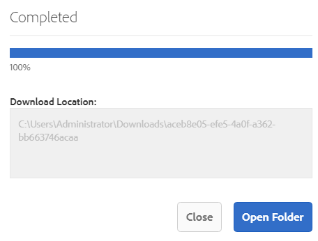

# Brand Portal-downloads versnellen {#guide-to-accelerate-downloads-from-brand-portal}

<!-- This topic is woefully out of date. It talks at length about using a third party application whose URLs have a variety of problems. Topic should either be deleted or updated entirely to not talk about a specific third party application that Adobe has no control over. It also appears that the third party app is NOT free anymore. -->

Adobe Experience Manager Assets Brand Portal maakt het mogelijk de downloadprestaties van grote bestanden met middelen te verbeteren door integratie met IBM® Aspera Connect, een toepassing die op aanvraag wordt geïnstalleerd. De toepassing gebruikt merkgebonden technologie om de overheadkosten van TCP te verwijderen en helpt de overdrachtsnelheid van de activadossiers te verbeteren. Deze integratie zorgt voor een verbeterde downloadervaring.

>[!NOTE]
>
>Downloadsnelheid varieert voor gebruikers omdat deze afhankelijk is van factoren zoals netwerkbandbreedte, serverwachttijd en de geografische locatie van clients.

De configuratie van **[!UICONTROL Fast Download]** is standaard ingeschakeld, waardoor het downloaden van de gewenste elementbestanden van Brand Portal aanzienlijk sneller verloopt.

## Vereisten om bestanden sneller te downloaden {#prerequisites-to-accelerate-file-download}

Als u de bestanden sneller wilt downloaden, moet u het volgende doen:

* Navigeer naar **[!UICONTROL Tools]** > **[!UICONTROL Download]** en controleer of de **[!UICONTROL Fast Download]** -configuratie is ingeschakeld in **[!UICONTROL Download Settings]** .
* Zorg ervoor dat poort 33001 (zowel TCP als UDP) is geopend op de firewall.
* **installeer IBM® Aspera Connect 3.9.9** in de uitbreiding van uw browser gebruikend beheerdervoorrechten ([ IBM® Aspera Connect Downloads ](https://www.ibm.com/support/fixcentral/swg/selectFixes?parent=ibm%7EOther%20software&amp;product=ibm/Other+software/IBM+Aspera+Connect&amp;release=3.9.9&amp;platform=All&amp;function=all)).

>[!NOTE]
>
>Er is een bekend probleem met IBM® Aspera Connect. Snel downloaden werkt niet met IBM® Aspera Connect versie 3.10 en hoger.

## Domeinen downloaden {#download-domains}

Hier volgen de downloaddomeinen voor verschillende geografische gebieden:

| Gebiedscode | Domein |
|---|---|
| NA OF1 | downloads-na1.brand-portal.adobe.com |
| NA VA5 | downloads-na2.brand-portal.adobe.com |
| EMEA LON5 | downloads-emea1.brand-portal.adobe.com |
| APAC SIN2 | downloads-apac1.brand-portal.adobe.com |

## Voorbeeld van downloadprestaties met gebruik van bestandsaccelerator {#expected-download-performance-using-file-accelerator}

In de volgende tabel ziet u de downloadprestaties voor een bestand van 2 GB met de Aspera Connect-bestandsdownloadaccelerator:

*de waargenomen resultaten variëren toe te schrijven aan factoren zoals netwerkbandbreedte, serverlatentie, en cliëntplaats, het overwegen van de server van Brand Portal is bij Oregon (Verenigde Staten).*

| Clientlocatie | Latentie tussen client en server (milliseconden) | Snelheid met Aspera Connect File Transfer Accelerator (MBps) | Tijd die nodig is om een bestand van 2 GB te downloaden met Aspera File Transfer Accelerator (seconden) |
|---------------------------|-----------------------------------|---------------------------------------------|-------------------------------------------------------------------------|
| VS West (N. Californië) | 18 | 36 | 57 |
| V.S. West (Oregon) | 42 | 36 | 57 |
| V.S. East (N. Virginia) | 85 | 35 | 58 |
| APAC (Tokyo) | 124 | 36 | 57 |
| Noida, India | 275 | 13,36 | 153 |
| Sydney | 175 | 29 | 70 |
| Londen | 179 | 35 | 58 |
| Singapore | 196 | 34 | 60 |

## Elementen downloaden {#download-assets}

Zo downloadt u elementen sneller van Brand Portal:

1. Meld u aan bij uw Brand Portal-huurder. Standaard wordt de weergave **[!UICONTROL Files]** geopend die alle gepubliceerde elementen en mappen bevat.

   Voer een van de volgende handelingen uit:

   * Selecteer de elementen of mappen die u wilt downloaden. Klik op het pictogram **[!UICONTROL Download]** op de werkbalk boven in het scherm.

     

   * Als u bepaalde elementuitvoeringen van een element wilt downloaden, plaatst u de aanwijzer boven het element en klikt u op het pictogram **[!UICONTROL Download]** dat beschikbaar is in de miniaturen van de handeling Snel.

     

1. Het dialoogvenster **[!UICONTROL Download]** met alle geselecteerde elementen wordt geopend.

   Schakel het selectievakje **[!UICONTROL `Create separate folder for each asset`]** in als u de Brand Portal-maphiërarchie wilt behouden terwijl u elementen downloadt.

   De downloadknop geeft het aantal geselecteerde items weer. Klik op **[!UICONTROL Download items]** als u klaar bent met het toepassen van de regels. Meer over leren hoe te om de regels toe te passen, zie [ downloadactiva ](../using/brand-portal-download-assets.md#download-assets).

   

1. De instelling **[!UICONTROL Fast Download]** wordt standaard ingeschakeld in **[!UICONTROL Download Settings]** . Daarom wordt een bevestigingsvenster weergegeven waarin u middelen kunt downloaden met IBM® Aspera Connect.

   Als u voor het eerst middelen hebt gedownload en IBM® Aspera Connect niet in uw browser hebt geïnstalleerd, wordt u gevraagd deze te installeren. Als de bestaande versie verouderd is, wordt u ook ertoe aangezet om de [ de downloadaccelerator van de Ruimtedownload ](https://www.ibm.com/support/fixcentral/swg/selectFixes?parent=ibm%7EOther%20software&amp;product=ibm/Other+software/IBM+Aspera+Connect&amp;release=3.9.9&amp;platform=All&amp;function=all) te installeren.

   

1. **installeer Aspera Connect Cliënt**

   Als u de IBM® Aspera Connect-clientinstallatie wilt installeren, voert u de installatie uit vanuit het .msi-bestand van de IBM® Aspera Connect-clienttoepassing en volgt u de installatiewizard.

   

1. Als de client is geïnstalleerd, vernieuwt u de browserpagina en start u de downloadstappen opnieuw.

1. Klik op **[!UICONTROL Allow]** als u **[!UICONTROL Fast Download]** wilt blijven gebruiken. Alle geselecteerde vertoningen worden gedownload in een ZIP-map met IBM® Aspera Connect.

   Nadat het downloaden is voltooid, wordt in een dialoogvenster de locatie weergegeven waar de middelen naar het systeem van de gebruiker worden gedownload.

   

   Klik op **[!UICONTROL Deny]** als u IBM® Aspera Connect niet wilt gebruiken. Als **[!UICONTROL Fast Download]** wordt ontkend of ontbreekt, vult het systeem een Bericht van de Fout. Klik op de knop **[!UICONTROL Normal Download]** om door te gaan met het downloaden van elementen.

>[!NOTE]
>
>Als de instelling **[!UICONTROL Fast Download]** door de beheerder is uitgeschakeld, worden de geselecteerde uitvoeringen rechtstreeks gedownload in een ZIP-map zonder gebruik te maken van IBM® Aspera Connect.

<!-- 
On successful completion of the download, a dialog box shows the location where assets are downloaded onto the user's system. If there is a failure, it shows error.

   >[!NOTE]
   >
   >There is a known limitation in Aspera Connect client application that no prompt to select download location appears if **[!UICONTROL Always ask me where to save downloaded files]** is enabled under the tab **[!UICONTROL Transfers]** within **[!UICONTROL Preferences]**. Before any download begins, provide the location in the text box **[!UICONTROL Save downloaded files to]**.

1. Log in to Brand Portal using a supported browser.
1. Browse and select the folders or assets you want to download. From the toolbar at the top, click the **[!UICONTROL Download]** icon. the **[!UICONTROL Download]** dialog appears with the **[!UICONTROL Asset(s)]** and **[!UICONTROL Enable download acceleration]** check boxes selected by default. 

   

   >[!NOTE]
   >
   >The functionality to send email notification with the link to download assets is presently not supported while faster downloads are enabled.

   

1. Click **[!UICONTROL Download]**.

   To speed up the download experience on your Brand Portal tenant account, you need to have Aspera Connect client application installed in your browser's extension.

1. **Download Aspera Connect Client**

   If Aspera Connect client is not installed on your system or the existing Aspera Connect client is out of date, a prompt is displayed on the browser page from where you can download the system-specific Aspera Connect client by selecting **[!UICONTROL Download Latest Version]**.

   

   To download the latest version of Aspera Connect from [https://downloads.asperasoft.com/connect2/](https://downloads.asperasoft.com/connect2/), select **[!UICONTROL Download Now]** and follow the instructions.

1. **Install Aspera Connect Client**

   To install IBM Aspera Connect client setup, run the setup from  .msi  file of IBM Aspera Connect client application and follow the installation wizard.

1. Once the client is successfully installed, refresh the browser page and initiate the download steps again.

   When using Aspera Connect for the first time, the browser prompts to open the link using **[!UICONTROL IBM Aspera Connect]**. To skip this dialog in future, enable **[!UICONTROL Remember my choice for FASP links]**.

   >[!NOTE]
   >
   >This message is different on the different browsers.

1. A dialog box confirms whether to proceed the transfer or not. Select **[!UICONTROL Allow]** to begin.
To skip this dialog in future, enable **[!UICONTROL Use my choice for all connections with this host]**.
Download begins. A dialog box shows the progress of the download. Use the dialog box to **[!UICONTROL pause]**, **[!UICONTROL resume]**, or **[!UICONTROL cancel]** the download.
Aspera Connect application provides an Activity Window on the system where user can view and manage all transfer sessions. For more information, refer [Aspera Connect Client documentation](https://downloads.asperasoft.com/en/documentation/8).

On successful completion of the download, a dialog box shows the location where assets are downloaded onto the user's system. If there is a failure, it shows error.

   >[!NOTE]
   >
   >There is a known limitation in Aspera Connect client application that no prompt to select download location appears if **[!UICONTROL Always ask me where to save downloaded files]** is enabled under the tab **[!UICONTROL Transfers]** within **[!UICONTROL Preferences]**. Before any download begins, provide the location in the text box **[!UICONTROL Save downloaded files to]**.
-->

## Bestandsaccelerator gebruiken in Microsoft® Edge browser {#using-file-accelerator-on-microsoft-edge-browser}

Microsoft® Edge wordt uitgevoerd in de Enhanced Protected Mode (EPM), waardoor communicatie met de Aspera Connect-server, op hetzelfde privénetwerk of met een vertrouwde site wordt voorkomen. Daarom wordt telkens wanneer een verbinding met de server tot stand wordt gebracht, een pop-up weergegeven.

Als u de functie voor versnelde download wilt gebruiken op Microsoft® Edge, verwijdert u de Brand Portal-site uit de lijst Vertrouwde site.

1. Open het Configuratiescherm (**[!UICONTROL Window key + X]** en selecteer vervolgens **[!UICONTROL Control Panel]** ).
1. Ga naar **[!UICONTROL Network and Internet]** > **[!UICONTROL Internet Options]** . Klik op de tab **[!UICONTROL Security]** .
1. Klik op **[!UICONTROL Trusted sites zone]** en vervolgens op **[!UICONTROL Sites]** .
1. Verwijder de Brand Portal-site uit de lijst.

## Voorkeuren voor Aspera Connect-client {#aspera-connect-client-preferences}

Er zijn een paar handige voorkeuren die in de voorkeur van de IBM® Aspera Connect-client kunnen worden ingesteld door met de rechtermuisknop op het pictogram te klikken en **[!UICONTROL Preferences]** te selecteren.

U kunt de standaarddownloadlocatie instellen.

De Aspera Connect-client kan ook worden gemarkeerd zodat deze automatisch wordt gestart bij het opstarten van het systeem. En de Connect-client wordt uitgevoerd en kan sneller worden gedownload.

## Problemen met downloadversnelling oplossen {#troubleshoot-issues-with-download-acceleration}

Als downloadversnelling niet voor u werkt, probeert u de volgende suggesties:

1. Controleer of de poorten niet geblokkeerd zijn. Gebruik Google Search om opties te zoeken waarmee u kunt controleren of poorten zijn geblokkeerd, op basis van het gebruikte besturingssysteem.  <!-- THIS URL IS 404 AND DOES NOT REDIRECT [https://test-connect.asperasoft.com](https://test-connect.asperasoft.com/) from your computer. -->

   Als de havens niet O.K. zijn, dan bereik uit aan uw netwerkteam en zorg ervoor dat de Havens 33001 (zowel TCP &amp; UDP) niet in de firewall worden geblokkeerd.

1. Als de havens OK zijn, dan controleer als uw netwerk niet langzaam door de beschikbare bandbreedte te meten gebruikend [ https://www.speedtest.net/ ](https://www.speedtest.net/) is.

   Als de bandbreedte weinig (1-10 Mbps) of in Kbps is, dan gebruik de Voorkeur van de RUIMTE en probeer om de bandbreedte te beperken gelijk aan de beschikbare bandbreedte.

   <!-- The URL in this step is giving a 404 error. 1. To confirm whether the downloads from Aspera demo server are working, use [https://demo.asperasoft.com/aspera/user](https://demo.asperasoft.com/aspera/user).  
   (login:  asperaweb , password:  demoaspera ) -->

1. Als geen van de bovenstaande stappen voor het oplossen van problemen werkt, schakelt u de optie Downloadversnelling inschakelen uit en gebruikt u de normale download.
