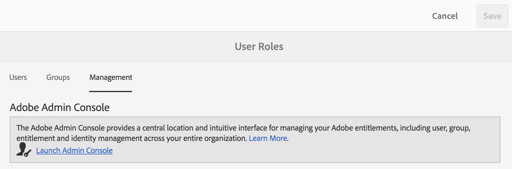

# Gebruikers, groepen en gebruikersrollen beheren {#manage-users-groups-and-user-roles}

Beheerders kunnen Adobe Admin Console gebruiken om AEM Assets te maken voor gebruikers van het Brand Portal en productprofielen en om hun rollen te beheren met behulp van de gebruikersinterface van het Brand Portal. Deze bevoegdheid is niet beschikbaar voor Viewers en Editors.

In [[!UICONTROL Admin Console]](http://adminconsole.adobe.com/enterprise/overview), kunt u alle producten bekijken verbonden aan uw organisatie. Een product kan elke Experience Cloud-oplossing zijn, zoals Adobe Analytics, Adobe Target of AEM Brand Portal. U moet het AEM-merkportaalproduct kiezen en productprofielen maken.

<!--
Comment Type: draft

<note type="note">

Product Profiles (formerly known as product configurations*). 

* The nomenclature has changed from product configurations to product profiles in the new Adobe Admin Console.

</note>
-->

Deze productprofielen worden om de acht uur gesynchroniseerd met de gebruikersinterface van het Brand Portal en zijn zichtbaar als groepen in het Brand Portal. Nadat u gebruikers hebt toegevoegd en productprofielen hebt gemaakt en gebruikers hebt toegevoegd aan deze productprofielen, kunt u rollen toewijzen aan gebruikers en groepen in Brand Portal.

>[!NOTE]
>
>Als u groepen wilt maken in Brand Portal, gebruikt u [!UICONTROL Admin Console]dit programma in plaats van **[!UICONTROL Products > Product Profiles]****[!UICONTROL User page > User Groups]**. Productprofielen in Adobe [!UICONTROL Admin Console] worden gebruikt om groepen te maken in Brand Portal.

## Een gebruiker toevoegen {#add-a-user}

Als u een productbeheerder bent, gebruikt u Adobe [[!UICONTROL Admin Console]](http://adminconsole.adobe.com/enterprise/overview) om gebruikers te maken en deze toe te wijzen aan productprofielen (*voorheen bekend als productconfiguraties*), die als groepen in Brand Portal worden weergegeven. U kunt groepen gebruiken om bulkbewerkingen uit te voeren, zoals rolbeheer en het delen van elementen.

>[!NOTE]
>
>Nieuwe gebruikers die geen toegang hebben tot Brand Portal, kunnen toegang aanvragen via het aanmeldingsscherm van het Brand Portal. Raadpleeg [Verzoek om toegang tot Brand Portal](../using/brand-portal.md#request-access-to-brand-portal)voor meer informatie. Nadat u in het systeemvak kennisgevingen van verzoeken om toegang hebt ontvangen, klikt u op de betreffende melding en vervolgens op **[!UICONTROL Grant Access]**. U kunt ook de koppeling volgen in de ontvangen e-mail met het toegangsverzoek. Als u vervolgens een gebruiker wilt toevoegen via [Adobe [!UICONTROL Admin Console]](http://adminconsole.adobe.com/enterprise/overview), volgt u stap 4-7 in de onderstaande procedure.

>[!NOTE]
>
>U kunt zich rechtstreeks of vanuit Brand Portal aanmelden bij [Adobe [!UICONTROL Admin Console]](http://adminconsole.adobe.com/enterprise/overview) . Als u zich direct aanmeldt, volgt u de stappen 4 tot en met 7 in de onderstaande procedure om een gebruiker toe te voegen.

1. Klik op de AEM-werkbalk boven in het scherm op het Adobe-logo voor toegang tot beheergereedschappen.

   

1. Klik in het deelvenster met beheergereedschappen op **[!UICONTROL Users]**.

   

1. Klik in de [!UICONTROL User Roles] pagina op het **[!UICONTROL Management]** tabblad en klik vervolgens op **[!UICONTROL Launch Admin Console]**.

   

1. Voer in Admin Console een van de volgende handelingen uit om een nieuwe gebruiker te maken:

   * Klik op de werkbalk boven in het scherm **[!UICONTROL Overview]**. Klik op de [!UICONTROL Overview] pagina op de productkaart **[!UICONTROL Assign Users]** van het Brand Portal.
   

   * Klik op de werkbalk boven in het scherm **[!UICONTROL Users]**. Op de [!UICONTROL Users] pagina wordt standaard [!UICONTROL Users] in de linkerspoorstaaf geselecteerd. Klik op **[!UICONTROL Add User]**.
   

1. Typ in het dialoogvenster Gebruikers toevoegen de e-mailadres van de gebruiker die u wilt toevoegen of selecteer de gebruiker in de lijst met suggesties die worden weergegeven terwijl u typt.

   

1. Wijs de gebruiker aan minstens één productprofiel (vroeger genoemd als productconfiguraties) toe zodat de gebruiker tot het Portaal van het Merk kan toegang hebben. Selecteer het gewenste productprofiel in het **[!UICONTROL Please select a profile for this product]** veld.
1. Klik op **[!UICONTROL Save]**. Er wordt een welkomstbericht verzonden naar de gebruiker die u hebt toegevoegd. De uitgenodigde gebruiker kan tot het Portaal van het Merk toegang hebben door de verbinding in welkome e-mail te klikken en binnen te ondertekenen gebruikend een [!UICONTROL Adobe ID]. Voor meer informatie, zie de [Eerste login ervaring](../using/brand-portal-onboarding.md).

   >[!NOTE]
   >
   >Als een gebruiker zich niet kan aanmelden bij Brand Portal, gaat de beheerder van de organisatie naar Adobe [!UICONTROL Admin Console] en controleert hij of de gebruiker aanwezig is en aan ten minste één productprofiel is toegevoegd.

   Zie [Beheerdersrechten verlenen aan gebruikers](../using/brand-portal-adding-users.md#provideadministratorprivilegestousers)voor informatie over het verlenen van beheerdersrechten aan de gebruiker.

## Een productprofiel toevoegen {#add-a-product-profile}

Productprofielen (voorheen productconfiguraties genoemd) in [!UICONTROL Admin Console] worden gebruikt om groepen te maken in Brand Portal, zodat u bulkbewerkingen kunt uitvoeren, zoals rolbeheer en het delen van bedrijfsmiddelen in Brand Portal. **Merkortaal** is het standaardproductprofiel dat beschikbaar is; u kunt meer productprofielen maken en gebruikers toevoegen aan de nieuwe productprofielen.

>[!NOTE]
>
>U kunt zich direct aanmelden bij [[!UICONTROL Admin Console]](http://adminconsole.adobe.com/enterprise/overview) of via Brand Portal. Als u zich [!UICONTROL Admin Console] rechtstreeks aanmeldt, volgt u stap 4-7 in de onderstaande procedure om een productprofiel toe te voegen.

1. Klik op de AEM-werkbalk boven in het scherm op het Adobe-logo voor toegang tot beheergereedschappen.

   

1. Klik in het deelvenster met beheergereedschappen op **[!UICONTROL Users]**.

   

1. Klik in de [!UICONTROL User Roles] pagina op het **[!UICONTROL Management]** tabblad en klik vervolgens op **[!UICONTROL Launch Admin Console]**.

   

1. Klik op de werkbalk boven in het scherm **[!UICONTROL Products]**.
1. Deze optie is standaard [!UICONTROL Products] geselecteerd op de [!UICONTROL Product Profiles] pagina. Klik op **[!UICONTROL New Profile]**.

   

1. Geef op de [!UICONTROL Create a New Profile] pagina de profielnaam, de weergavenaam, de profielbeschrijving op en kies of u gebruikers via e-mail op de hoogte wilt stellen wanneer ze aan het profiel worden toegevoegd of uit het profiel worden verwijderd.

   

1. Klik op **[!UICONTROL Done]**. De groep van de productconfiguratie, bijvoorbeeld **[!UICONTROL Sales group]**, wordt toegevoegd aan het Portaal van het Merk.

   

## Gebruikers aan een productprofiel toevoegen {#add-users-to-a-product-profile}

Om gebruikers aan een groep van het Portaal van het Merk toe te voegen, voeg hen aan het overeenkomstige productprofiel (vroeger genoemd als productconfiguraties) in toe [!UICONTROL Admin Console]. U kunt gebruikers afzonderlijk of bulksgewijs toevoegen.

>[!NOTE]
>
>U kunt zich direct aanmelden bij [[!UICONTROL Admin Console]](http://adminconsole.adobe.com/enterprise/overview) of via Brand Portal. Als u zich direct bij de Admin Console aanmeldt, volgt u stap 4-7 in de onderstaande procedure om gebruikers aan een productprofiel toe te voegen.

1. Klik op de AEM-werkbalk boven in het scherm op het Adobe-logo voor toegang tot beheergereedschappen.

   

1. Klik in het deelvenster met beheergereedschappen op **[!UICONTROL Users]**.

   

1. Klik in de [!UICONTROL User Roles] pagina op het **[!UICONTROL Management]** tabblad en klik vervolgens op **[!UICONTROL Launch Admin Console]**.

   ![Starten [!DNL Admin Console]](assets/launch_admin_console.png)

1. Klik op de werkbalk boven in het scherm **[!UICONTROL Products]**.
1. Deze optie is standaard [!UICONTROL Products] geselecteerd op de [!UICONTROL Product Profiles] pagina. Open bijvoorbeeld het productprofiel waaraan u een gebruiker wilt toevoegen [!UICONTROL Sales group].

   

1. Ga als volgt te werk om afzonderlijke gebruikers aan het productprofiel toe te voegen:

   * Klik op **[!UICONTROL Add User]**.
   

   * Typ op de [!UICONTROL Add User to Sales group] pagina de e-mailadres van de gebruiker die u wilt toevoegen of selecteer de gebruiker in de lijst met suggesties die worden weergegeven terwijl u typt.
   

   * Klik op **[!UICONTROL Save]**.

1. Ga als volgt te werk om gebruikers in grote hoeveelheden toe te voegen aan het productprofiel:

   * Choose **[!UICONTROL ellipsis (...) > Add users by CSV]**.
   

   * Download een CSV-sjabloon in de **[!UICONTROL Add Users by CSV]** pagina of sleep een CSV-bestand.
   

   * Klik op **[!UICONTROL Upload]**.
   Als u gebruikers hebt toegevoegd aan het standaardproductprofiel, namelijk Brand Portal, wordt een welkomstbericht verzonden naar de e-mail-id van de gebruikers die u hebt toegevoegd. De uitgenodigde gebruikers kunnen tot het Portaal van het Merk toegang hebben door de verbinding in welkome e-mail te klikken en binnen te ondertekenen gebruikend een [!UICONTROL Adobe ID]. Voor meer informatie, zie de [Eerste login ervaring](../using/brand-portal-onboarding.md).

   Gebruikers die aan een aangepast of nieuw productprofiel zijn toegevoegd, ontvangen geen e-mailberichten.

## Beheerdersrechten aan gebruikers opgeven {#provide-administrator-privileges-to-users}

U kunt de systeembeheerder of de bevoegdheden van de productbeheerder aan een Poortgebruiker van het Merk verstrekken. Geef geen andere beheerrechten op die beschikbaar zijn in [!UICONTROL Admin Console], zoals de beheerder van het productprofiel, de beheerder van de gebruikersgroep en de ondersteuningsbeheerder. Voor meer informatie over deze rollen, zie [Administratieve rollen](https://helpx.adobe.com/enterprise/using/admin-roles.html).

>[!NOTE]
>
>U kunt zich direct aanmelden bij [[!UICONTROL Admin Console]](https://adminconsole.adobe.com/enterprise/overview) of via Brand Portal. Als u zich [!UICONTROL Admin Console] rechtstreeks aanmeldt, volgt u stap 4-8 in de onderstaande procedure om een gebruiker aan een productprofiel toe te voegen.

1. Klik op de AEM-werkbalk boven in het scherm op het Adobe-logo voor toegang tot beheergereedschappen.

   

1. Klik in het deelvenster met beheergereedschappen op **[!UICONTROL Users]**.

   

1. Klik in de [!UICONTROL User Roles] pagina op het **[!UICONTROL Management]** tabblad en klik vervolgens op **[!UICONTROL Launch Admin Console]**.

   

1. Klik op de werkbalk boven in het scherm **[!UICONTROL Users]**.
1. Op de [!UICONTROL Users] pagina wordt standaard [!UICONTROL Users] in de linkerspoorstaaf geselecteerd. Klik op de gebruikersnaam van de gebruiker aan wie u beheerdersrechten wilt verlenen.

   

1. Zoek in de pagina met gebruikersprofielen de **[!UICONTROL Administrative Rights]** sectie onderaan en kies **[!UICONTROL ellipsis (...) > Edit admin rights]**.
   

1. Selecteer Systeembeheerder of Productbeheerder op de [!UICONTROL Edit Admin] pagina.

   

   >[!NOTE]
   >
   >Brand Portal ondersteunt alleen de rollen Systeembeheerder en Productbeheerder.
   >
   >
   >Adobe raadt u aan de rol Systeembeheerder niet te gebruiken omdat hierdoor beheerdersrechten voor de hele organisatie worden toegekend voor alle producten van een organisatie. Bijvoorbeeld, heeft een systeembeheerder van een organisatie die drie marketing wolkenproducten omvat de volledige reeks voorrechten voor alle drie producten. Slechts kan een Beheerder van het Systeem AEM Assets vormen zodat de activa van AEM Assets aan het Portaal van het Merk kunnen worden gepubliceerd. For more information, see [Configure AEM Assets with Brand Portal](../using/configure-aem-assets-with-brand-portal.md).
   >
   >In tegenstelling, verleent de rol van de Beheerder van het Product beheerder beheerdervoorrechten voor slechts een specifiek product. Als u een meer korrelig toegangsbeheer binnen het Portaal van het Merk wilt afdwingen, gebruik de rol van de Beheerder van het Product en selecteer het product als Portaal van het Merk.

   >[!NOTE]
   >
   >Brand Portal biedt geen ondersteuning voor bevoegdheden van de beheerder van het productprofiel (voorheen bekend als configuratiebeheerder). Wijs geen beheerdersrechten voor het productprofiel toe aan een gebruiker.

1. Controleer de selectie van het beheertype en klik op **[!UICONTROL Save]**.

   >[!NOTE]
   >
   >Als u de beheerdersrechten voor een gebruiker wilt intrekken, brengt u de gewenste wijzigingen aan op de **[!UICONTROL Edit Admin]** pagina en klikt u op **[!UICONTROL Save]**.

## Gebruikersrollen beheren {#manage-user-roles}

Een beheerder kan rollen voor gebruikers in het Portaal van het Merk wijzigen.

Naast de rol van Beheerder, steunt het Portaal van het Merk de volgende rollen:

* [!UICONTROL Viewer]: Gebruikers met deze rol kunnen de bestanden en mappen weergeven die een beheerder met hen deelt. Viewers kunnen ook middelen zoeken en downloaden. Viewers kunnen echter geen inhoud (bestanden, mappen [!UICONTROL collections]) delen met andere gebruikers.
* [!UICONTROL Editor]: Gebruikers met deze rol hebben alle rechten van een Viewer. Bovendien kunnen Editors inhoud (mappen, koppelingen [!UICONTROL collections]en koppelingen) delen met andere gebruikers.

1. Klik op de AEM-werkbalk boven in het scherm op het Adobe-logo voor toegang tot beheergereedschappen.

   

1. Klik in het deelvenster met beheergereedschappen op **[!UICONTROL Users]**.

   

1. Op de [!UICONTROL User Roles] pagina is het [!UICONTROL Users] tabblad standaard geselecteerd. Voor de gebruiker van wie rol u wilt veranderen, selecteer **[!UICONTROL Editor]** of **[!UICONTROL Viewer]** van **[!UICONTROL Role]** drop-down.

   

   Als u de rol van meerdere gebruikers tegelijk wilt wijzigen, selecteert u de gebruikers en kiest u de gewenste rol in de **[!UICONTROL Role]** vervolgkeuzelijst.

   >[!NOTE]
   >
   >De [!UICONTROL Role] lijst voor gebruikers van de Beheerder is gehandicapt. U kunt deze gebruikers niet selecteren om hun rollen te wijzigen.

   >[!NOTE]
   >
   >De gebruikersrol is ook gehandicapt als de gebruiker een lid van de groep van de Redacteur is. Als u bewerkingsrechten van de gebruiker wilt intrekken, verwijdert u de gebruiker uit de groep Editor of wijzigt u de rol van de gehele groep in Viewer.

1. Klik op **[!UICONTROL Save]**. De rol wordt gewijzigd voor de overeenkomstige gebruiker. Als u meerdere gebruikers hebt geselecteerd, worden de rollen voor alle gebruikers gelijktijdig gewijzigd.

   >[!NOTE]
   >
   >Wijzigingen in gebruikersmachtigingen worden pas op de **[!UICONTROL User Roles]** pagina weergegeven nadat de gebruikers zich opnieuw hebben aangemeld bij Brand Portal.

## Groeprollen en -rechten beheren {#manage-group-roles-and-privileges}

Een beheerder kan specifieke voorrechten met een [groep](../using/brand-portal-adding-users.md#main-pars-title-278567577) gebruikers op het Portaal van het Merk associëren. Op het **[!UICONTROL Groups]** tabblad op de **[!UICONTROL User Roles]** pagina kunnen beheerders:

* Rollen toewijzen aan gebruikersgroepen
* Gebruikersgroepen beperken om originele uitvoeringen van afbeeldingsbestanden te downloaden (.jpeg, .tiff, .png, .bmp, .gif, .pjpeg, x-portable-anymap, x-portable-bitmap, x-portable-graymap, x-portable-pixmap, x-rgb, x-xbitmap, x-xpixmap, x-icon, image/photoshop, image/x Photoshop, .psd, image/vnd.adobe.photoshop) van Brand Portal.

>[!NOTE]
>
>Voor de elementen die als de koppeling worden gedeeld, is de machtiging om toegang te krijgen tot originele uitvoeringen van afbeeldingsbestanden van toepassing op basis van de machtigingen van de gebruiker die de elementen deelt.

Voer de volgende stappen uit om de rol en het recht op toegang tot originele uitvoeringen voor specifieke groepsleden te wijzigen:

1. Navigeer op de **[!UICONTROL User Roles]** pagina naar het **[!UICONTROL Groups]** tabblad.
1. Selecteer de groepen waarvoor u rollen wilt wijzigen.
1. Selecteer de gewenste rol in de **[!UICONTROL Role]** vervolgkeuzelijst.

   De leden van een groep toegang geven tot originele uitvoeringen van afbeeldingsbestanden (.jpeg, .tiff, .png, .bmp, .gif, .pjpeg, x-portable-anymap, x-portable-bitmap, x-portable-graymap, x-portable-pixmap, x-rgb, x-xbitmap, x-xpixmap, x-icon, image/shop , image/x-photoshop, .psd, image/vnd.adobe.photoshop) die zij van het portaal of de gedeelde verbinding downloaden, houden de **[!UICONTROL Access to  Original]** optie voor die groep geselecteerd. Deze optie is standaard **[!UICONTROL Access to Original]** geselecteerd voor alle gebruikers. Als u wilt voorkomen dat een gebruikersgroep toegang krijgt tot de oorspronkelijke uitvoeringen, schakelt u de optie uit die overeenkomt met die groep.

   

   >[!NOTE]
   >
   >Als een gebruiker wordt toegevoegd aan meerdere groepen en als een van deze groepen beperkingen heeft, gelden de beperkingen voor die gebruiker.
   >
   >
   >Beperkingen op de toegang tot originele uitvoeringen van afbeeldingsbestanden zijn ook niet van toepassing op beheerders, ook al zijn deze leden van beperkte groepen.

1. Klik op **[!UICONTROL Save]**. De rol wordt gewijzigd voor de overeenkomstige groepen.

   >[!NOTE]
   >
   >De user-to-group vereniging, of het groepslidmaatschap van een gebruiker, wordt gesynchroniseerd aan het Portaal van het Merk om de 8 uur. Wijzigingen in gebruikers- of groepsrollen zijn van kracht nadat de volgende synchronisatietaak is uitgevoerd.

