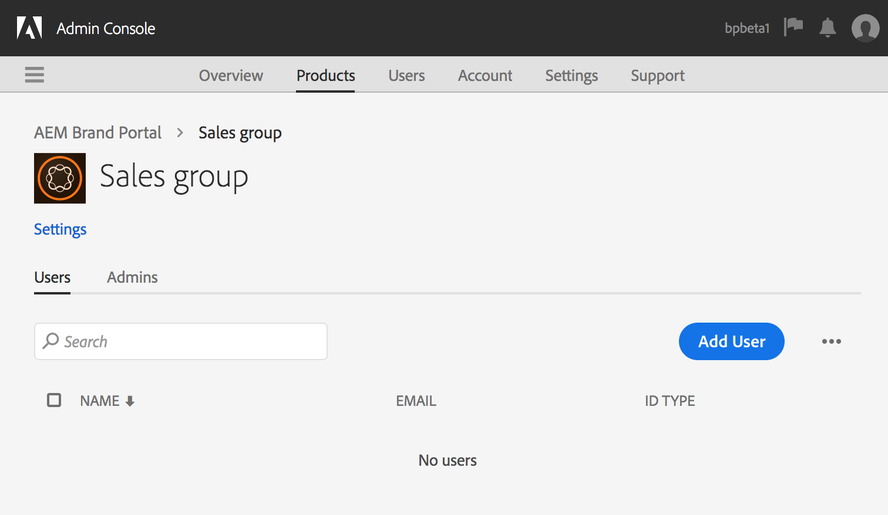

# Gebruikers, groepen en gebruikersrollen beheren {#manage-users-groups-and-user-roles}

Beheerders kunnen Adobe Admin Console gebruiken om Experience Manager Assets Brand Portal-gebruikers en productprofielen te maken en hun rollen te beheren met behulp van de Brand Portal-gebruikersinterface. Deze bevoegdheid is niet beschikbaar voor Viewers en Editors.

In [[!UICONTROL Admin Console] ](https://adminconsole.adobe.com/enterprise/overview), kunt u alle producten bekijken verbonden aan uw organisatie. Een product kan elke oplossing voor Experiencen Cloud zijn, zoals Adobe Analytics, Adobe Target of Experience Manager Assets Brand Portal. U moet het AEM Brand Portal-product kiezen en productprofielen maken.

<!--
Comment Type: draft

<note type="note">

Product Profiles (formerly known as product configurations*). 

* The nomenclature has changed from product configurations to product profiles in the new Adobe Admin Console.

</note>
-->

Deze productprofielen worden om de 8 uur gesynchroniseerd met de Brand Portal-gebruikersinterface en zijn zichtbaar als groepen in Brand Portal. Nadat u gebruikers hebt toegevoegd en productprofielen hebt gemaakt en gebruikers hebt toegevoegd aan deze productprofielen, kunt u rollen toewijzen aan gebruikers en groepen in Brand Portal.

>[!NOTE]
>
>Als u groepen in Brand Portal wilt maken, gebruikt u **[!UICONTROL Products > Product Profiles]** in plaats van **[!UICONTROL User page > User Groups]** om groepen te maken op basis van Adobe [!UICONTROL Admin Console] . Productprofielen in Adobe [!UICONTROL Admin Console] worden gebruikt om groepen te maken in Brand Portal.

## Een gebruiker toevoegen {#add-a-user}

Als u een productbeheerder bent, gebruik Adobe [[!UICONTROL Admin Console] ](https://adminconsole.adobe.com/enterprise/overview) om gebruikers tot stand te brengen en hen toe te wijzen aan productprofielen (*vroeger gekend als productconfiguraties*), die als groepen in Brand Portal tonen. U kunt groepen gebruiken om bulkbewerkingen uit te voeren, zoals rolbeheer en het delen van elementen.

>[!NOTE]
>
>Nieuwe gebruikers die geen toegang hebben tot Brand Portal, kunnen toegang aanvragen via het aanmeldingsscherm van Brand Portal. Voor meer informatie, verwijs naar [ Toegang van het Verzoek tot Brand Portal ](../using/brand-portal.md#request-access-to-brand-portal). Nadat u in het systeemvak kennisgevingen van verzoeken om toegang hebt ontvangen, klikt u op de desbetreffende melding en vervolgens op **[!UICONTROL Grant Access]** . U kunt ook de koppeling volgen in de ontvangen e-mail met het toegangsverzoek. Daarna, om een gebruiker door [ Adobe [!UICONTROL Admin Console] toe te voegen ](https://adminconsole.adobe.com/enterprise/overview), volg Stappen 4-7 in de hieronder procedure.

>[!NOTE]
>
>U kunt login aan [ Adobe [!UICONTROL Admin Console] ](https://adminconsole.adobe.com/enterprise/overview) direct of van Brand Portal. Als u zich direct aanmeldt, volgt u de stappen 4 tot en met 7 in de onderstaande procedure om een gebruiker toe te voegen.

1. Klik op de AEM werkbalk boven in het scherm op het logo van de Adobe voor toegang tot de beheergereedschappen.

   

1. Klik in het deelvenster met beheergereedschappen op **[!UICONTROL Users]** .

   

1. Klik op de pagina [!UICONTROL User Roles] op de tab **[!UICONTROL Management]** en klik vervolgens op **[!UICONTROL Launch Admin Console]** .

    te lanceren

1. Voer in Admin Console een van de volgende handelingen uit om een nieuwe gebruiker te maken:

   * Klik in de werkbalk boven in het scherm op **[!UICONTROL Overview]** . Klik op de pagina [!UICONTROL Overview] op **[!UICONTROL Assign Users]** op de Brand Portal-productkaart.

   

   * Klik in de werkbalk boven in het scherm op **[!UICONTROL Users]** . Op de pagina [!UICONTROL Users] wordt [!UICONTROL Users] in de linkerrails standaard geselecteerd. Klik op **[!UICONTROL Add User]**.

    toe

1. Typ in het dialoogvenster Gebruikers toevoegen de e-mailadres van de gebruiker die u wilt toevoegen of selecteer de gebruiker in de lijst met suggesties die worden weergegeven terwijl u typt.

    toe

1. Wijs de gebruiker toe aan ten minste één productprofiel (voorheen productconfiguraties genoemd) zodat de gebruiker toegang heeft tot Brand Portal. Selecteer het juiste productprofiel in het veld **[!UICONTROL Please select a profile for this product]** .
1. Klik op **[!UICONTROL Save]**. Er wordt een welkomstbericht verzonden naar de nieuwe gebruiker. De uitgenodigde gebruiker kan op de verbinding in welkome e-mail klikken om tot Brand Portal toegang te hebben. De gebruiker kan zich aanmelden met de e-mailid ([!UICONTROL Adobe ID], [!UICONTROL Enterprise ID] of [!UICONTROL Fedrated ID] ) die in de Admin Console is geconfigureerd. Voor meer informatie, zie [ Eerste-tijd login ervaring ](../using/brand-portal-onboarding.md).

   >[!NOTE]
   >
   >Als een gebruiker zich niet kan aanmelden bij Brand Portal, gaat de beheerder van de organisatie naar de Adobe [!UICONTROL Admin Console] en controleert hij of de gebruiker aanwezig is en aan ten minste één productprofiel is toegevoegd.

   Voor informatie over het verlenen van administratieve voorrechten aan de gebruiker, zie [ beheerdervoorrechten aan gebruikers ](../using/brand-portal-adding-users.md#provideadministratorprivilegestousers) verstrekken.

## Een productprofiel toevoegen {#add-a-product-profile}

Productprofielen (voorheen productconfiguraties genoemd) in [!UICONTROL Admin Console] worden gebruikt om groepen in Brand Portal te maken, zodat u in Brand Portal bulkbewerkingen kunt uitvoeren, zoals rolbeheer en het delen van bedrijfsmiddelen. **Brand Portal** is het standaardproductprofiel beschikbaar; u kunt meer productprofielen tot stand brengen en gebruikers toevoegen aan de nieuwe productprofielen.

>[!NOTE]
>
>U kunt zich direct aanmelden bij [[!UICONTROL Admin Console] ](https://adminconsole.adobe.com/enterprise/overview) of bij Brand Portal. Als u zich rechtstreeks aanmeldt bij [!UICONTROL Admin Console] , volgt u stap 4-7 in de onderstaande procedure om een productprofiel toe te voegen.

1. Klik op de AEM werkbalk boven in het scherm op het logo van de Adobe voor toegang tot de beheergereedschappen.

   

1. Klik in het deelvenster met beheergereedschappen op **[!UICONTROL Users]** .

   

1. Klik op de pagina [!UICONTROL User Roles] op de tab **[!UICONTROL Management]** en klik vervolgens op **[!UICONTROL Launch Admin Console]** .

   

1. Klik in de werkbalk boven in het scherm op **[!UICONTROL Products]** .
1. Op de pagina [!UICONTROL Products] is [!UICONTROL Product Profiles] standaard geselecteerd. Klik op **[!UICONTROL New Profile]**.

   

1. Geef op de pagina [!UICONTROL Create a New Profile] de profielnaam, weergavenaam, profielbeschrijving op en kies of u gebruikers via e-mail op de hoogte wilt stellen wanneer ze aan het profiel worden toegevoegd of uit het profiel worden verwijderd.

   

1. Klik op **[!UICONTROL Done]**. De productconfiguratiegroep, bijvoorbeeld **[!UICONTROL Sales group]** , wordt toegevoegd aan Brand Portal.

   

## Gebruikers aan een productprofiel toevoegen {#add-users-to-a-product-profile}

Als u gebruikers wilt toevoegen aan een Brand Portal-groep, voegt u deze toe aan het corresponderende productprofiel (voorheen productconfiguraties genoemd) in [!UICONTROL Admin Console] . U kunt gebruikers afzonderlijk of in bulk toevoegen.

>[!NOTE]
>
>U kunt zich direct aanmelden bij [[!UICONTROL Admin Console] ](https://adminconsole.adobe.com/enterprise/overview) of bij Brand Portal. Als u zich direct bij de Admin Console aanmeldt, volgt u stap 4-7 in de onderstaande procedure om gebruikers aan een productprofiel toe te voegen.

1. Klik in de werkbalk boven in het scherm op het logo van de Experience Manager voor toegang tot de beheergereedschappen.

   

1. Klik in het deelvenster met beheergereedschappen op **[!UICONTROL Users]** .

   

1. Klik op de pagina [!UICONTROL User Roles] op de tab **[!UICONTROL Management]** en klik vervolgens op **[!UICONTROL Launch Admin Console]** .

   ![ Starten [!DNL Admin Console]](assets/launch_admin_console.png)

1. Klik in de werkbalk boven in het scherm op **[!UICONTROL Products]** .
1. Op de pagina [!UICONTROL Products] is [!UICONTROL Product Profiles] standaard geselecteerd. Open het productprofiel waaraan u een gebruiker wilt toevoegen, bijvoorbeeld [!UICONTROL Sales group] .

   

1. Ga als volgt te werk om afzonderlijke gebruikers aan het productprofiel toe te voegen:

   * Klik op **[!UICONTROL Add User]**.

   

   * Typ op de pagina [!UICONTROL Add User to Sales group] de e-mailadres van de gebruiker die u wilt toevoegen of selecteer de gebruiker in de lijst met suggesties die worden weergegeven terwijl u typt.

    toe

   * Klik op **[!UICONTROL Save]**.

1. Ga als volgt te werk om gebruikers in grote hoeveelheden toe te voegen aan het productprofiel:

   * Kies **[!UICONTROL ellipsis (...) > Add users by CSV]** .

   

   * Download een CSV-sjabloon in de **[!UICONTROL Add Users by CSV]** -pagina of sleep een CSV-bestand.

    toe

   * Klik op **[!UICONTROL Upload]**.

   Als u gebruikers hebt toegevoegd aan het standaardproductprofiel, dat wil zeggen Brand Portal, wordt een welkomstbericht verzonden naar de e-mail-id van de gebruikers die u hebt toegevoegd. De uitgenodigde gebruikers hebben toegang tot Brand Portal door op de koppeling in de welkomste e-mail te klikken en zich aan te melden met een [!UICONTROL Adobe ID] . Voor meer informatie, zie [ Eerste-tijd login ervaring ](../using/brand-portal-onboarding.md).

   Gebruikers die aan een aangepast of nieuw productprofiel zijn toegevoegd, ontvangen geen e-mailberichten.

## Beheerdersrechten aan gebruikers opgeven {#provide-administrator-privileges-to-users}

U kunt de systeembeheerder of de bevoegdheden van de productbeheerder aan een gebruiker van Brand Portal verstrekken. Geef geen andere beheerrechten op die beschikbaar zijn in [!UICONTROL Admin Console] , zoals de beheerder van het productprofiel, de beheerder van de gebruikersgroep en de ondersteuningsbeheerder. Om meer over deze rollen te weten, zie [ Administratieve rollen ](https://helpx.adobe.com/enterprise/using/admin-roles.html).

>[!NOTE]
>
>U kunt zich direct aanmelden bij [[!UICONTROL Admin Console] ](https://adminconsole.adobe.com/enterprise/overview) of bij Brand Portal. Als u zich rechtstreeks aanmeldt bij [!UICONTROL Admin Console] , volgt u stap 4-8 in de onderstaande procedure om een gebruiker aan een productprofiel toe te voegen.

1. Klik op de AEM werkbalk boven in het scherm op het logo van de Adobe voor toegang tot de beheergereedschappen.

   

1. Klik in het deelvenster met beheergereedschappen op **[!UICONTROL Users]** .

   

1. Klik op de pagina [!UICONTROL User Roles] op de tab **[!UICONTROL Management]** en klik vervolgens op **[!UICONTROL Launch Admin Console]** .

   

1. Klik in de werkbalk boven in het scherm op **[!UICONTROL Users]** .
1. Op de pagina [!UICONTROL Users] wordt [!UICONTROL Users] in de linkerrails standaard geselecteerd. Klik op de gebruikersnaam van de gebruiker aan wie u beheerdersrechten wilt verlenen.

    toe

1. Zoek op de pagina met gebruikersprofielen de sectie **[!UICONTROL Administrative Rights]** onderaan en kies **[!UICONTROL ellipsis (...) > Edit admin rights]** .
   

1. Selecteer Systeembeheerder of Productbeheerder op de pagina [!UICONTROL Edit Admin] .

    uit

   >[!NOTE]
   >
   >Brand Portal ondersteunt alleen de rollen Systeembeheerder en Productbeheerder.
   >
   >De Adobe adviseert dat u vermijdt gebruikend de rol van de Beheerder van het Systeem omdat het organisatie-brede beheerdervoorrechten voor alle producten van een organisatie verleent. Bijvoorbeeld, heeft een systeembeheerder van een organisatie die drie marketing wolkenproducten omvat de volledige reeks voorrechten voor alle drie producten. Alleen een systeembeheerder kan Experience Manager Assets zodanig configureren dat middelen van Experience Manager Assets naar Brand Portal kunnen worden gepubliceerd. Voor meer informatie, zie [ Experience Manager Assets met Brand Portal ](../using/configure-aem-assets-with-brand-portal.md) vormen.
   >
   >In tegenstelling, verleent de rol van de Beheerder van het Product beheerder beheerdervoorrechten voor slechts een specifiek product. Als u een meer korrelig toegangsbeheer binnen Brand Portal wilt afdwingen, gebruikt u de rol van de Beheerder van het Product en selecteert u het product als Brand Portal.

   >[!NOTE]
   >
   >Brand Portal biedt geen ondersteuning voor bevoegdheden van de beheerder van het productprofiel (voorheen bekend als configuratiebeheerder). Wijs geen beheerdersrechten voor het productprofiel toe aan een gebruiker.

1. Controleer de selectie van het beheertype en klik op **[!UICONTROL Save]** .

   >[!NOTE]
   >
   >Als u de beheerdersrechten voor een gebruiker wilt intrekken, brengt u de gewenste wijzigingen aan op de pagina **[!UICONTROL Edit Admin]** en klikt u op **[!UICONTROL Save]** .

## Gebruikersrollen beheren {#manage-user-roles}

Een beheerder kan rollen voor gebruikers in Brand Portal wijzigen.

Naast de rol Beheerder ondersteunt Brand Portal de volgende rollen:

* [!UICONTROL Viewer]: Gebruikers met deze rol kunnen de bestanden en mappen weergeven die een beheerder met hen deelt. Viewers kunnen ook middelen zoeken en downloaden. Viewers kunnen echter geen inhoud (bestanden, mappen, [!UICONTROL collections]) delen met andere gebruikers.
* [!UICONTROL Editor]: gebruikers met deze rol hebben alle rechten van een Viewer. Bovendien kunnen Editors inhoud (mappen, [!UICONTROL collections], koppelingen) delen met andere gebruikers.

1. Klik op de AEM werkbalk boven in het scherm op het logo van de Adobe voor toegang tot de beheergereedschappen.

   

1. Klik in het deelvenster met beheergereedschappen op **[!UICONTROL Users]** .

   

1. Op de pagina [!UICONTROL User Roles] is de tab [!UICONTROL Users] standaard geselecteerd. Voor de gebruiker wiens rol u wilt wijzigen, selecteert u **[!UICONTROL Editor]** of **[!UICONTROL Viewer]** in de vervolgkeuzelijst **[!UICONTROL Role]** .

   

   Als u de rol van meerdere gebruikers tegelijk wilt wijzigen, selecteert u de gebruikers en kiest u de gewenste rol in de vervolgkeuzelijst **[!UICONTROL Role]** .

   >[!NOTE]
   >
   >De lijst [!UICONTROL Role] voor gebruikers van beheerders is uitgeschakeld. U kunt deze gebruikers niet selecteren om hun rollen te wijzigen.

   >[!NOTE]
   >
   >De gebruikersrol is ook gehandicapt als de gebruiker een lid van de groep van de Redacteur is. Als u bewerkingsrechten van de gebruiker wilt intrekken, verwijdert u de gebruiker uit de groep Editor of wijzigt u de rol van de gehele groep in Viewer.

1. Klik op **[!UICONTROL Save]**. De rol wordt gewijzigd voor de overeenkomstige gebruiker. Als u meerdere gebruikers hebt geselecteerd, worden de rollen voor alle gebruikers gelijktijdig gewijzigd.

   >[!NOTE]
   >
   >Wijzigingen in gebruikersmachtigingen worden pas op de pagina **[!UICONTROL User Roles]** weergegeven nadat de gebruikers zich opnieuw hebben aangemeld bij Brand Portal.

## Groeprollen en -rechten beheren {#manage-group-roles-and-privileges}

Een beheerder kan specifieke voorrechten met a [ groep ](../using/brand-portal-adding-users.md#main-pars-title-278567577) van gebruikers op Brand Portal associëren. Met de tab **[!UICONTROL Groups]** op de pagina **[!UICONTROL User Roles]** kunnen beheerders:

* Rollen toewijzen aan gebruikersgroepen
* Gebruikersgroepen beperken om originele uitvoeringen van afbeeldingsbestanden te downloaden (.jpeg, .tiff, .png, .bmp, .gif, .pjpeg, x-portable-anymap, x-portable-bitmap, x-portable-graymap, x-portable-pixmap, x-rgb, x-xbitmap, x-xpixmap, x-icon, image/photoshop, image/x photoshop, .psd, image/vnd.adobe.photoshop) uit Brand Portal.

>[!NOTE]
>
>Voor de elementen die als de koppeling worden gedeeld, is de machtiging om toegang te krijgen tot originele uitvoeringen van afbeeldingsbestanden van toepassing op basis van de machtigingen van de gebruiker die de elementen deelt.

Voer de volgende stappen uit om de rol en het recht op toegang tot originele uitvoeringen voor specifieke groepsleden te wijzigen:

1. Navigeer op de pagina **[!UICONTROL User Roles]** naar de tab **[!UICONTROL Groups]** .
1. Selecteer de groepen waarvoor u rollen wilt wijzigen.
1. Selecteer de gewenste rol in de vervolgkeuzelijst **[!UICONTROL Role]** .

   De leden van een groep toegang geven tot oorspronkelijke vertoningen van afbeeldingsbestanden (.jpeg, .tiff, .png, .bmp, .gif, .pjpeg, x-portable-anymap, x-portable-bitmap, x-portable-graymap, x-portable-pixmap, x-rgb, x-xbitmap, x-xpixmap, x-icon, image/shop , image/x-photoshop, .psd, image/vnd.adobe.photoshop) die zij van het portaal of de gedeelde verbinding downloaden, houden de **[!UICONTROL Access to  Original]** optie geselecteerd voor die groep. Standaard is de optie **[!UICONTROL Access to Original]** geselecteerd voor alle gebruikers. Als u wilt voorkomen dat een gebruikersgroep toegang krijgt tot de oorspronkelijke uitvoeringen, schakelt u de optie uit die overeenkomt met die groep.

   

   >[!NOTE]
   >
   >Als een gebruiker wordt toegevoegd aan meerdere groepen en als een van deze groepen beperkingen heeft, gelden de beperkingen voor die gebruiker.
   >
   >Beperkingen op de toegang tot originele uitvoeringen van afbeeldingsbestanden zijn ook niet van toepassing op beheerders, ook al zijn deze leden van beperkte groepen.

1. Klik op **[!UICONTROL Save]**. De rol wordt gewijzigd voor de overeenkomstige groepen.

   >[!NOTE]
   >
   >De user-to-group vereniging, of het groepslidmaatschap van een gebruiker, wordt gesynchroniseerd aan Brand Portal om de 8 uur. Wijzigingen in gebruikers- of groepsrollen zijn van kracht nadat de volgende synchronisatietaak is uitgevoerd.
