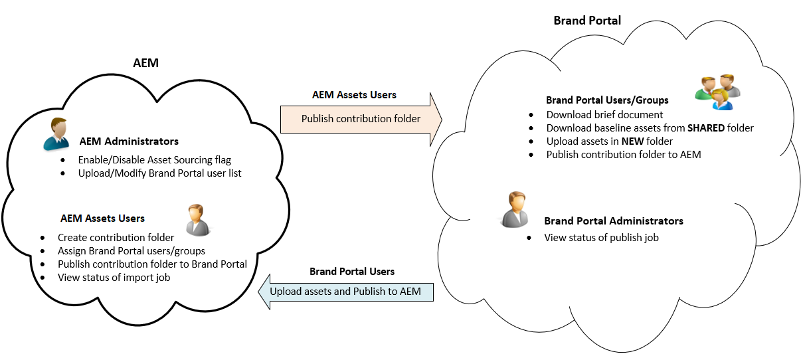

# Overzicht van Asset Souring {#overview-asset-sourcing-in-bp}

**Middelen van Activa** staat de gebruikers van Experience Manager Assets (beheerders/niet-admin gebruikers) toe om nieuwe omslagen met een extra **bezit van de Bijdrage van Activa** tot stand te brengen, die de nieuwe omslag verzekeren open aan activa voorlegging door de gebruikers van Brand Portal wordt gecreeerd. Dit brengt automatisch een werkschema in werking, dat tot twee extra subomslagen leidt, genoemd **GEDEELD** en **NIEUW**, binnen de pas gecreëerde **omslag van de Bijdrage**. De beheerder definieert de vereiste door een korte beschrijving te uploaden van de typen elementen die moeten worden toegevoegd aan de map met bijdragen. Zij uploaden een reeks basislijnactiva aan de **GEDEELDE** omslag, die de gebruikers van Brand Portal van de noodzakelijke verwijzingsinformatie voorziet. De beheerder kan actieve gebruikers van Brand Portal toegang tot de bijdrageomslag dan verlenen alvorens de pas gecreëerde **omslag van de Bijdrage** aan Brand Portal te publiceren. Wanneer de gebruiker wordt gebeëindigd toevoegend inhoud in de **NIEUWE** omslag, kunnen zij de bijdrageomslag terug naar het de auteurmilieu van Experience Manager publiceren. Het kan enkele minuten duren voordat de import is voltooid en de nieuw gepubliceerde inhoud in Experience Manager Assets wordt weerspiegeld.

Bovendien blijft alle bestaande functionaliteit ongewijzigd. Brand Portal-gebruikers kunnen middelen weergeven, zoeken en downloaden vanuit de map met bijdragen en vanuit de andere toegestane mappen. En beheerders kunnen de bijdragemap verder delen, eigenschappen wijzigen en elementen toevoegen aan verzamelingen.

>[!VIDEO](https://video.tv.adobe.com/v/29365/?quality=12)

## Vereisten {#prerequisites}

* Experience Manager Assets as a Cloud Service-instantie, Experience Manager Assets 6.5.2 of hoger.
* Controleer of uw Experience Manager Assets-exemplaar is geconfigureerd met Brand Portal. Zie, [ vormen Experience Manager Assets met Brand Portal ](../using/configure-aem-assets-with-brand-portal.md).

<!--
* Ensure that your Brand Portal tenant is configured with one AEM Assets author instance.
-->

>[!NOTE]
>
>De functie Asset Sourcing is standaard ingeschakeld in Experience Manager Assets as a Cloud Service, Experience Manager Assets 6.5.9 en hoger.
>
>De bestaande configuraties blijven werken aan de eerdere versies.

>[!NOTE]
>
>Experience Manager Assets 6.5.4 kent een probleem. Brand Portal-gebruikers kunnen de middelen van de bijdragemap niet naar Experience Manager Assets publiceren tijdens de upgrade naar Adobe Developer Console.
>
>Het probleem is opgelost in Experience Manager Assets 6.5.5. U kunt uw instantie van Experience Manager Assets aan het recentste de dienstpak bevorderen en [ bevorderen uw configuraties ](https://experienceleague.adobe.com/en/docs/experience-manager-65/content/assets/brandportal/configure-aem-assets-with-brand-portal#upgrade-integration-65) op Adobe Developer Console.

<!--

>For immediate fix on AEM 6.5.4, it is recommended to [download the hotfix](https://www.adobeaemcloud.com/content/marketplace/marketplaceProxy.html?packagePath=/content/companies/public/adobe/packages/cq650/hotfix/cq-6.5.0-hotfix-33041) and install on your author instance.
-->

<!--
## Configure Asset Sourcing {#configure-asset-sourcing}

**Asset Sourcing** is configured from within the AEM Assets author instance. The administrators can enable the Asset Sourcing feature flag configuration from the **AEM Web Console Configuration** and upload the active Brand Portal users list in **AEM Assets**.

>[!NOTE]
>
>Asset Sourcing is by default enabled on AEM Assets as a Cloud Service. The AEM administrator can directly upload the active Brand Portal users to allow them access to the Asset Sourcing feature.

>[!NOTE]
>
>Before you begin with the configuration, ensure that your AEM Assets instance is configured with Brand Portal. See, [Configure AEM Assets with Brand Portal](../using/configure-aem-assets-with-brand-portal.md). 

The following video demonstrates, how to configure Asset Sourcing on your AEM Assets author instance:

>[!VIDEO](https://video.tv.adobe.com/v/29771)
-->

<!--
### Enable Asset Sourcing {#enable-asset-sourcing}

AEM administrators can enable the Asset Sourcing feature flag from within the AEM Web Console Configuration (a.k.a Configuration Manager).

>[!NOTE]
>
>This step is not applicable for AEM Assets as a Cloud Service.

**To enable Asset Sourcing:**
1. Log in to your AEM Assets author instance and open Configuration Manager. 
Default URL: http:// localhost:4502/system/console/configMgr.
1. Search using the keyword **Asset Sourcing** to locate **[!UICONTROL Asset Sourcing Feature Flag Config]**.
1. Click **[!UICONTROL Asset Sourcing Feature Flag Config]** to open the configuration window.
1. Select the **[!UICONTROL feature.flag.active.status]** check box.
1. Click **[!UICONTROL Save]**.

-->

### De gebruikerslijst van Brand Portal uploaden {#upload-bp-user-list}

Experience Manager Assets-beheerders kunnen het Brand Portal-gebruikersconfiguratiebestand (.csv) met de actieve Brand Portal-gebruikerslijst in Experience Manager Assets uploaden om ze toegang te geven tot de functie voor het zoeken naar middelen.

Een bijdragemap kan alleen worden gedeeld met de actieve Brand Portal-gebruikers die zijn gedefinieerd in de gebruikerslijst. De beheerder kan ook nieuwe gebruikers toevoegen aan het configuratiebestand en de gewijzigde gebruikerslijst uploaden.

>[!NOTE]
>
>Controleer of uw Experience Manager Assets-exemplaar is geconfigureerd met Brand Portal. Zie, [ vormen Experience Manager Assets met Brand Portal ](../using/configure-aem-assets-with-brand-portal.md).

>[!NOTE]
>
>De indeling van het CSV-bestand is gelijk aan de indeling die wordt ondersteund in de Admin Console voor het importeren van bulkgebruikers. E-mail, voornaam en achternaam zijn verplicht.

De beheerders kunnen nieuwe gebruikers in Admin Console toevoegen. Ga naar [ leiden Gebruikers ](brand-portal-adding-users.md) voor gedetailleerde informatie. Nadat u gebruikers in de Admin Console hebt toegevoegd, kunnen deze gebruikers worden toegevoegd aan het configuratiebestand van de Brand Portal-gebruiker en krijgen ze vervolgens toestemming om toegang te krijgen tot de map met bijdragen.

**om de de gebruikerslijst van Brand Portal te uploaden:**

1. Meld u aan bij uw Experience Manager Assets-exemplaar.
1. Navigeer in het deelvenster [!UICONTROL Tools] naar **[!UICONTROL Assets]** > **[!UICONTROL Brand Portal Users]** .

1. Het venster Brand Portal Upload Contributors wordt geopend.
Blader van uw lokale machine en upload het dossier van de a **configuratie (.csv)** die de actieve de gebruikerslijst van Brand Portal bevatten.
1. Klik op **[!UICONTROL Save]**.

   

Beheerders kunnen toegang tot specifieke gebruikers bieden vanuit deze gebruikerslijst terwijl ze een bijdragemap configureren. Alleen de gebruikers die zijn toegewezen aan een map met bijdragen hebben toegang tot de map met bijdragen en publiceren elementen van Brand Portal naar Experience Manager Assets.

## Zie ook {#reference-articles}

* [Een bijdragemap configureren en publiceren naar Brand Portal](brand-portal-publish-contribution-folder-to-brand-portal.md)

* [Bijdragemap publiceren naar Experience Manager Assets](brand-portal-publish-contribution-folder-to-aem-assets.md)
