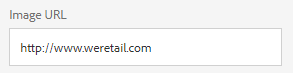

# Achtergrond, koptekst en e-mailbericht aanpassen {#customize-wallpaper-header-and-email-message}

Brand Portal-beheerders kunnen beperkte aanpassingen aanbrengen in de interface die voor gebruikers wordt weergegeven. U kunt een specifieke achtergrondafbeelding (achtergrond) kiezen voor de Brand Portal-aanmeldingspagina. U kunt ook een koptekstafbeelding toevoegen en e-mails voor het delen van elementen aanpassen aan het merk van de klant.

## De achtergrond voor het aanmeldingsscherm aanpassen {#customize-the-login-screen-wallpaper}

Als een achtergrondafbeelding met aangepaste branding ontbreekt, wordt een standaardachtergrond weergegeven op de aanmeldingspagina.

1. Klik in de werkbalk boven in het scherm op het logo van de Experience Manager voor toegang tot de beheergereedschappen.

   

1. Klik in het deelvenster met beheergereedschappen op **[!UICONTROL Branding]** .

   

1. Op de linkertrack van de **[!UICONTROL Configure Branding]** -pagina is **[!UICONTROL Wallpaper]** standaard geselecteerd. De standaardachtergrondafbeelding die op de aanmeldingspagina wordt weergegeven, wordt weergegeven.

   

1. Als u een nieuwe achtergrondafbeelding wilt toevoegen, klikt u op het pictogram **[!UICONTROL Choose Image]** op de werkbalk boven in het scherm.

   

   Voer een van de volgende handelingen uit:

   * Als u een afbeelding vanaf uw computer wilt uploaden, klikt u op **[!UICONTROL Upload]** . Navigeer naar de gewenste afbeelding en upload deze.
   * Als u een bestaande Brand Portal-afbeelding wilt gebruiken, klikt u op **[!UICONTROL Select from existing]** . Kies een afbeelding met de elementkiezer.

   

1. Geef een koptekst en beschrijving op voor de achtergrondafbeelding. Als u de wijzigingen wilt opslaan, klikt u op **[!UICONTROL Save]** op de werkbalk boven in het venster.

1. Klik op de werkbalk boven in het scherm op het pictogram **[!UICONTROL Preview]** om een voorbeeld van de Brand Portal-interface met de afbeelding te genereren.

   

   

1. Als u de standaardachtergrond wilt activeren of deactiveren, voert u de volgende handelingen uit op de pagina **[!UICONTROL Configure Branding > Wallpaper]** :

   * Als u de standaardachtergrondafbeelding wilt weergeven op de Brand Portal-aanmeldingspagina, klikt u op **[!UICONTROL Deactivate Wallpaper]** op de werkbalk boven in het scherm. Een bericht bevestigt dat de aangepaste afbeelding is gedeactiveerd.

   

   * Als u de aangepaste afbeelding op de Brand Portal-aanmeldingspagina wilt herstellen, klikt u op **[!UICONTROL Activate Wallpaper]** op de werkbalk. Een bericht bevestigt dat de afbeelding is hersteld.

   

   * Klik op **[!UICONTROL Save]** om de wijzigingen op te slaan.

## De koptekst aanpassen {#customize-the-header}

De koptekst wordt weergegeven op verschillende Brand Portal-pagina&#39;s nadat u zich hebt aangemeld bij Brand Portal.

1. Klik in de werkbalk boven in het scherm op het logo van de Experience Manager voor toegang tot de beheergereedschappen.

   

1. Klik in het deelvenster met beheergereedschappen op **[!UICONTROL Branding]** .

   

1. Als u de paginakoptekst voor de Brand Portal-interface wilt aanpassen, selecteert u op de pagina **[!UICONTROL Configure Branding]** **[!UICONTROL Header Image]** in de linkertrack. De standaardkoptekstafbeelding wordt weergegeven.

   

1. Als u een koptekstafbeelding wilt uploaden, klikt u op het pictogram **[!UICONTROL Choose Image]** en kiest u **[!UICONTROL Upload]** .

   Als u een bestaande Brand Portal-afbeelding wilt gebruiken, kiest u **[!UICONTROL Select existing]** .

   

   Kies een afbeelding met de elementkiezer.

   

1. Als u een URL in de koptekstafbeelding wilt opnemen, geeft u deze op in het vak **[!UICONTROL Image URL]** . U kunt externe of interne URL&#39;s opgeven. Interne koppelingen kunnen bijvoorbeeld ook relatieve koppelingen zijn.
   [!UICONTROL `/mediaportal.html/content/dam/mac/tenant_id/tags`].
Deze koppeling leidt gebruikers naar de map tags.
Als u de wijzigingen wilt opslaan, klikt u op **[!UICONTROL Save]** op de werkbalk boven in het venster.

   

1. Klik op de werkbalk boven in het scherm op het pictogram **[!UICONTROL Preview]** om een voorvertoning van de Brand Portal-interface met de koptekstafbeelding te genereren.

   
   

1. Als u de koptekstafbeelding wilt activeren of deactiveren, voert u de volgende handelingen uit op de pagina **[!UICONTROL Configure Branding > Header Image]** :

   * Als u wilt voorkomen dat een koptekstafbeelding op Brand Portal-pagina&#39;s wordt weergegeven, klikt u op **[!UICONTROL Deactivate Header]** op de werkbalk boven in het scherm. Een bericht bevestigt dat de afbeelding is gedeactiveerd.

   

   * Als u de koptekstafbeelding weer wilt weergeven op Brand Portal-pagina&#39;s, klikt u op **[!UICONTROL Activate Header]** op de werkbalk boven in het scherm. Een bericht bevestigt dat de afbeelding is geactiveerd.

   

   * Klik op **[!UICONTROL Save]** om de wijzigingen op te slaan.

## Het e-mailbericht aanpassen {#customize-the-email-messaging}

Wanneer elementen als een koppeling worden gedeeld, ontvangen gebruikers een e-mail met de koppeling. Beheerders kunnen het bericht, dat wil zeggen het logo, de beschrijving en de voettekst, van deze e-mails aanpassen.

1. Klik in de werkbalk boven in het scherm op het logo van de Experience Manager voor toegang tot de beheergereedschappen.

   

1. Klik in het deelvenster met beheergereedschappen op **[!UICONTROL Branding]** .

   

1. Wanneer elementen worden gedeeld als koppelingen of via e-mail worden gedownload en wanneer **[!UICONTROL collections]** wordt gedeeld, worden e-mailmeldingen verzonden naar gebruikers. Als u het e-mailbericht wilt aanpassen, selecteert u op de pagina **[!UICONTROL Configure Branding]** **[!UICONTROL Email Message]** in de linkertrack.

   

1. Als u een logo wilt toevoegen aan uitgaande e-mails, klikt u op **[!UICONTROL Upload]** op de werkbalk boven in het scherm.

1. Geef in de sectie **[!UICONTROL Description]** de kop- en voettekst van de e-mail op. Als u de wijzigingen wilt opslaan, klikt u op **[!UICONTROL Save]** op de werkbalk boven in het venster.

   >[!NOTE]
   >
   >Als u de aanbevolen grootte voor het logo niet gebruikt of als de kop- en voettekst groter is dan het aanbevolen aantal woorden, kan de inhoud van het e-mailbericht onregelmatig lijken.
