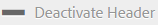

# Achtergrond, koptekst en e-mailbericht aanpassen {#customize-wallpaper-header-and-email-message}

De beheerders van het Portaal van het merk kunnen beperkte aanpassingen aan de interface maken die aan gebruikers wordt getoond. U kunt een specifieke achtergrondafbeelding (achtergrond) kiezen voor de aanmeldingspagina van het Brand Portal. U kunt ook een koptekstafbeelding toevoegen en de e-mails voor het delen van elementen aanpassen aan het merk van de klant.

## De achtergrond voor het aanmeldingsscherm aanpassen {#customize-the-login-screen-wallpaper}

Als een achtergrondafbeelding met aangepaste branding ontbreekt, wordt een standaardachtergrond weergegeven op de aanmeldingspagina.

1. Klik op de AEM-werkbalk boven in het scherm op het Adobe-logo voor toegang tot beheergereedschappen.

   

1. Klik in het deelvenster met beheergereedschappen op **[!UICONTROL Branding]**.

   

1. Op de linkerspoorstaaf van de **[!UICONTROL Configure Branding]** pagina wordt **[!UICONTROL Wallpaper]** standaard geselecteerd. De standaardachtergrondafbeelding die op de aanmeldingspagina wordt weergegeven, wordt weergegeven.

   

1. Als u een nieuwe achtergrondafbeelding wilt toevoegen, klikt u op het **[!UICONTROL Choose Image]** pictogram op de werkbalk boven in het scherm.

   

   Voer een van de volgende handelingen uit:

   * Als u een afbeelding vanaf uw computer wilt uploaden, klikt u op **[!UICONTROL Upload]**. Navigeer naar de gewenste afbeelding en upload deze.
   * Als u een bestaande Brand Portal-afbeelding wilt gebruiken, klikt u op **[!UICONTROL Select from existing]**. Kies een afbeelding met de elementkiezer.

   

1. Geef een koptekst en beschrijving op voor de achtergrondafbeelding. Als u de wijzigingen wilt opslaan, klikt u **[!UICONTROL Save]** op de werkbalk boven in het venster.

1. Klik in de werkbalk boven in het scherm op het **[!UICONTROL Preview]** pictogram om een voorvertoning van de interface Brand Portal met de afbeelding te genereren.

   

   

1. Voer de volgende handelingen op de **[!UICONTROL Configure Branding > Wallpaper]** pagina uit om de standaardachtergrond te activeren of te deactiveren:

   * Als u de standaardachtergrondafbeelding wilt weergeven op de aanmeldingspagina van het Brand Portal, klikt u op de werkbalk boven in het scherm. **[!UICONTROL Deactivate Wallpaper]** Een bericht bevestigt dat de aangepaste afbeelding is gedeactiveerd.

   

   * Als u de aangepaste afbeelding wilt herstellen op de aanmeldingspagina van het Brand Portal, klikt u op **[!UICONTROL Activate Wallpaper]** de werkbalk. Een bericht bevestigt dat de afbeelding is hersteld.

   

   * Click **[!UICONTROL Save]** to save the changes.

## De koptekst aanpassen {#customize-the-header}

De koptekst wordt weergegeven op verschillende pagina&#39;s van het Brand Portal nadat u zich hebt aangemeld bij het Brand Portal.

1. Klik op de AEM-werkbalk boven in het scherm op het Adobe-logo voor toegang tot beheergereedschappen.

   

1. Klik in het deelvenster met beheergereedschappen op **[!UICONTROL Branding]**.

   

1. Als u de paginakoptekst voor de interface Brand Portal wilt aanpassen, selecteert u op de **[!UICONTROL Configure Branding]** **[!UICONTROL Header Image]** pagina de gewenste koptekst in de linkertrack. De standaardkoptekstafbeelding wordt weergegeven.

   

1. Als u een koptekstafbeelding wilt uploaden, klikt u op het **[!UICONTROL Choose Image]** pictogram en kiest u **[!UICONTROL Upload]**.

   Als u een bestaande Brand Portal-afbeelding wilt gebruiken, kiest u **[!UICONTROL Select from existing]**.

   

   Kies een afbeelding met de elementkiezer.

   

1. Als u een URL in de koptekstafbeelding wilt opnemen, geeft u deze op in het **[!UICONTROL Image URL]** vak. U kunt externe of interne URL&#39;s opgeven. Interne koppelingen kunnen bijvoorbeeld ook relatieve koppelingen zijn.
   [!UICONTROL `/mediaportal.html/content/dam/mac/tenant_id/tags`].
Deze koppeling leidt gebruikers naar de map tags.
Als u de wijzigingen wilt opslaan, klikt u **[!UICONTROL Save]** op de werkbalk boven in het venster.

   

1. Klik in de werkbalk boven in het scherm op het **[!UICONTROL Preview]** pictogram om een voorbeeld te genereren van de interface Brand Portal met de koptekstafbeelding.

   
   

1. Voer de volgende handelingen op de **[!UICONTROL Configure Branding > Header Image]** pagina uit om de koptekstafbeelding te activeren of te deactiveren:

   * Als u wilt voorkomen dat een koptekstafbeelding op de pagina&#39;s van het Brand Portal wordt weergegeven, klikt u op de werkbalk boven in het scherm. **[!UICONTROL Deactivate Header]** Een bericht bevestigt dat de afbeelding is gedeactiveerd.

   

   * Als u de koptekstafbeelding weer wilt weergeven op de pagina&#39;s van het Brand Portal, klikt u op de werkbalk boven in het scherm. **[!UICONTROL Activate Header]** Een bericht bevestigt dat de afbeelding is geactiveerd.

   

   * Click **[!UICONTROL Save]** to save the changes.

## Het e-mailbericht aanpassen {#customize-the-email-messaging}

Wanneer elementen als een koppeling worden gedeeld, ontvangen gebruikers een e-mail met de koppeling. Beheerders kunnen het bericht, dat wil zeggen het logo, de beschrijving en de voettekst, van deze e-mails aanpassen.

1. Klik op de AEM-werkbalk boven in het scherm op het Adobe-logo voor toegang tot beheergereedschappen.

   

1. Klik in het deelvenster met beheergereedschappen op **[!UICONTROL Branding]**.

   

1. Wanneer middelen als koppelingen worden gedeeld of via e-mail worden gedownload en wanneer ze **[!UICONTROL collections]** worden gedeeld, worden e-mailmeldingen verzonden naar gebruikers. Als u het e-mailbericht wilt aanpassen, selecteert u op de **[!UICONTROL Configure Branding]** pagina **[!UICONTROL Email Message]** de linkertrack.

   

1. Als u een logo wilt toevoegen aan uitgaande e-mails, klikt u **[!UICONTROL Upload]** op de werkbalk boven in het scherm.

1. Geef in de **[!UICONTROL Description]** sectie de kop- en voettekst van de e-mail op. Als u de wijzigingen wilt opslaan, klikt u **[!UICONTROL Save]** op de werkbalk boven in het venster.

   >[!NOTE]
   >
   >Als u de aanbevolen grootte voor het logo niet gebruikt of als de kop- en voettekst groter is dan het aanbevolen aantal woorden, kan de inhoud van het e-mailbericht onregelmatig lijken.
