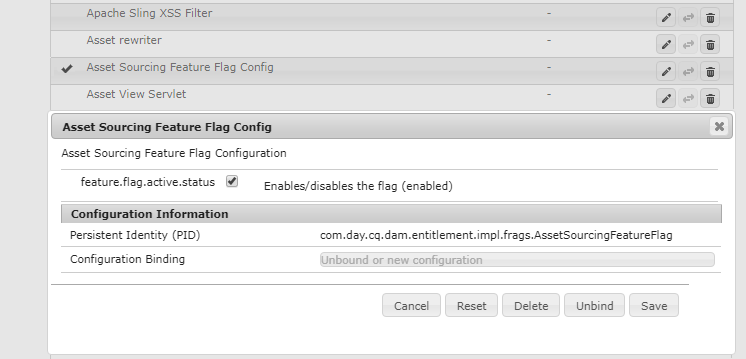

# Asset Souring configureren {#configure-asset-sourcing}

AEM beheerders kunnen **middelen** van Activa van binnen de AEM auteursinstantie vormen. De beheerder laat de configuratie van de de eigenschapmarkering van de Levering van Activa van **AEM Configuratie** van de Console van het Web toe en uploadt de actieve lijst van gebruikers van het Portaal van het Merk in **AEM Assets**.

>[!NOTE]
>
>Voordat u met de configuratie begint, moet u ervoor zorgen dat uw AEM Assets-instantie is geconfigureerd met Brand Portal. See, [Configure AEM Assets with Brand Portal](../using/configure-aem-assets-with-brand-portal.md).

In de volgende video wordt gedemonstreerd hoe u Asset Sourcing kunt configureren op uw AEM auteur-instantie:

>[!VIDEO](https://video.tv.adobe.com/v/29771)

## Asset Souring inschakelen {#enable-asset-sourcing}

AEM beheerders kunnen het Middelen van Activa van binnen de Configuratie van de Console van het AEM Web (a.k.a de Manager van de Configuratie) toelaten.

**Asset Sourcing inschakelen:**
1. Meld u aan bij de AEM van de auteur en open Configuration ManagerDefault URL: http:// localhost:4502/system/console/configMgr
1. Zoeken met het trefwoord **Asset Sourcing** om te zoeken **[!UICONTROL Asset Sourcing Feature Flag Config]**
1. Klik **[!UICONTROL Asset Sourcing Feature Flag Config]** om het configuratievenster te openen
1. Select the **[!UICONTROL feature.flag.active.status]** check box.
1. Klik op **[!UICONTROL Save]**.

## Lijst met gebruikers van Brand Portal uploaden {#upload-bp-user-list}

AEM beheerders kunnen het CSV-bestand (Brand Portal-gebruikersconfiguratiebestand) uploaden dat een actieve gebruikerslijst voor Brand Portal in AEM Assets bevat. Een bijdragemap kan alleen worden gedeeld met de actieve gebruikers van het Brand Portal die zijn gedefinieerd in de gebruikerslijst. Beheerders kunnen ook nieuwe gebruikers toevoegen aan het configuratiebestand en de gewijzigde gebruikerslijst uploaden.

>[!NOTE]
>
>De indeling van het CSV-bestand is gelijk aan de indeling die door de Admin Console wordt ondersteund bij het importeren van bulkgebruikers. E-mail, voornaam en achternaam zijn verplicht.

Beheerders kunnen nieuwe gebruikers toevoegen in AEM Admin Console. Zie Gebruikers  beheren voor meer informatie. Na het toevoegen van gebruikers in Admin Console, kunnen deze gebruikers aan het dossier van de de gebruikersconfiguratie van het Portaal van het Merk worden toegevoegd en dan toestemming toegewezen om tot de bijdrageomslag toegang te hebben.

**Ga als volgt te werk om de gebruikerslijst van Brand Portal te uploaden:**
1. Meld u aan bij de instantie AEM auteurStandaard-URL: http:// localhost:4502/aem/start.html
1. From **Tools**  panel, navigate to **[!UICONTROL Assets > Brand Portal Users]**

   

1. Het venster Contribuanten uploaden naar Brand Portal wordt geopend.
Blader vanaf uw lokale computer en upload het **configuratiebestand** (.csv) met de actieve gebruikerslijst voor het Brand Portal.
1. Klik op **[!UICONTROL Save]**.

   

Beheerders kunnen toegang tot specifieke gebruikers/groepen bieden vanuit deze gebruikerslijst tijdens het configureren van de bijdragemap.

Zie Contribute-map configureren voor meer informatie.
