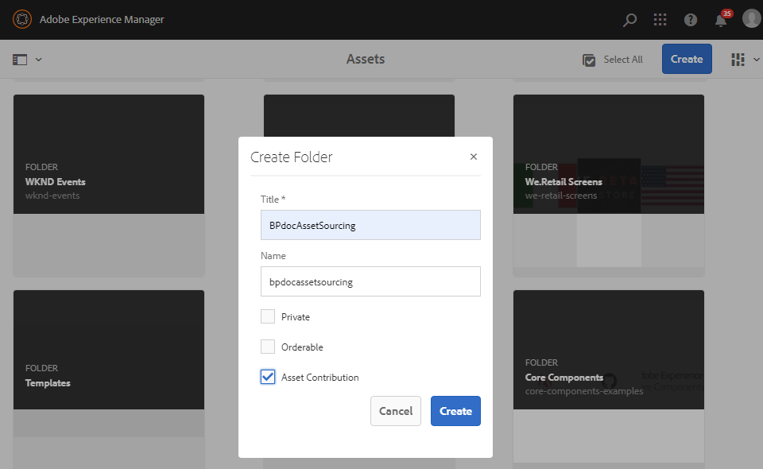

# Premiemap {#create-contribution-folder} maken

AEM beheerders en gebruikers zonder beheerdersrechten die toestemming hebben om een nieuwe map te maken, kunt u een bijdragemap maken in AEM Assets.
Als u een map met bijdragen wilt maken, maakt u een nieuwe map van het type Asset Contribution. Zo zorgt u ervoor dat de nieuwe map die u maakt, kan worden verzonden door gebruikers van Brand Portal.  Dit leidt automatisch tot een werkschema dat tot twee extra subomslagen, genoemd GEDEELD en NIEUW, binnen de bijdrageomslag leidt.

>[!NOTE]
>
>U kunt mappen voor meerdere bijdragen maken in een map, maar u mag geen bijdragemap maken in een andere bijdragemap.

Een bijdragemap maken:
1. Meld u aan bij de AEM auteur.

   De standaard-URL is http:// localhost:4502/aem/start.html.

1. Ga naar **[!UICONTROL Assets]** > **[!UICONTROL Files]**. Alle bestaande mappen in de AEM Assets-opslagplaats worden weergegeven.

1. Klik **[!UICONTROL Create]** om een nieuwe omslag tot stand te brengen. **[!UICONTROL Create Folder]** wordt geopend.

1. Voer **[!UICONTROL Title]** en **[!UICONTROL Name]** van de map in en selecteer het selectievakje **[!UICONTROL Asset Contribution]**.
Het wordt aanbevolen kleine letters zonder ruimte te gebruiken om de map een naam te geven.

1. Klik op **[!UICONTROL Create]**. U kunt de bijdragemap weergeven in de AEM Assets-opslagplaats.

   >[!NOTE]
   >
   >Een gebruiker die geen beheerder is, kan een map voor middelenbijdragen maken en delen, maar kan deze niet wijzigen of verwijderen.

   

1. Klik om de bijdragemap te openen. Er worden twee submappen weergegeven.-**[!UICONTROL SHARED]** en **[!UICONTROL NEW]** worden automatisch gemaakt in de bijdragemap.

   

U kunt nu [de eigenschappen van de bijdragemap configureren](brand-portal-configure-contribution-folder-properties.md).

