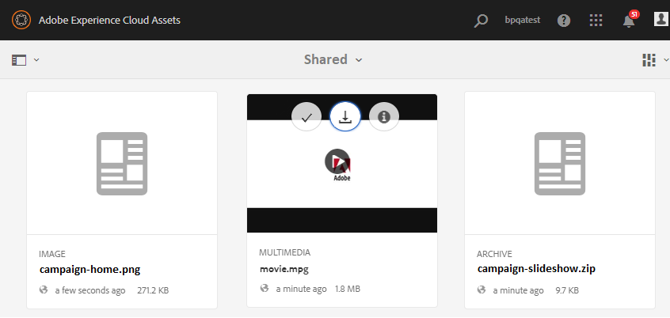

# Elementvereisten downloaden {#using-asset-souring-in-bp}

De gebruikers van het Portaal van het merk ontvangen automatisch e-mail/pulse berichten wanneer een bijdrageomslag door de gebruiker AEM wordt gedeeld, die hen toestaat om het korte (activa vereiste) document te downloaden, evenals basiselementen (verwijzing inhoud) te downloaden, van de **GEDEELDE** omslag om hen te verzekeren de activavereisten begrijpen.

De gebruiker van het Portaal van het merk voert de volgende activiteiten uit om activavereisten te downloaden:

* **Download overzicht**: Download de samenvatting (document met middelenvereisten) die is toegevoegd aan de bijdragemap en die informatie bevat over elementen zoals het type middelen, het doel, de ondersteunde indelingen, de maximale grootte van de middelen, enz.
* **Basiselementen** downloaden: Download de basislijnelementen die kunnen worden gebruikt om de vereiste typen elementen te begrijpen. De gebruikers van het Portaal van het merk kunnen deze activa als verwijzing gebruiken om nieuwe activa voor bijdrage tot stand te brengen.

Het dashboard voor Brand Portal weerspiegelt alle bestaande mappen die zijn toegestaan aan de gebruiker van het Brand Portal en de nieuw gedeelde bijdragemap. In dit voorbeeld heeft de gebruiker van het Brand Portal alleen toegang tot de zojuist gemaakte map met bijdragen. Er wordt geen andere bestaande map gedeeld met de gebruiker.

**Elementvereisten downloaden:**

1. Meld u aan bij uw Brand Portal-exemplaar.
1. Selecteer de bijdragemap in het dashboard voor het Brand Portal.
1. Klik op **[!UICONTROL Properties]** . Het venster Eigenschappen wordt geopend en hierin worden de gegevens van de map Asset Contribution weergegeven.
   
1. Klik **[!UICONTROL Download Brief]**  om het document met elementvereisten te downloaden naar uw lokale computer.
   
1. Ga terug naar het dashboard van de Portaalpagina van het Merk.
1. Klik om de map met bijdragen te openen. Er worden twee submappen **[!UICONTROL SHARED]** en **[!UICONTROL NEW]** in de map met bijdragen weergegeven. De map SHARED bevat alle basiselementen (referentie-inhoud) die door de beheerders worden gedeeld.
1. U kunt de **[!UICONTROL SHARED]** map met alle basislijnelementen downloaden naar uw lokale computer.
U kunt ook de **[!UICONTROL SHARED]** map openen en op het pictogram **Downloaden** klikken  om afzonderlijke bestanden/mappen te downloaden.
   

Doorloop het korte document (document met elementvereisten) en verwijs naar de basiselementen om inzicht te krijgen in de vereisten voor elementen. Nu kunt u nieuwe middelen maken voor de bijdrage en deze uploaden naar de map met bijdragen. Zie Elementen [uploaden naar de map](brand-portal-upload-assets-to-contribution-folder.md)Contributie.

