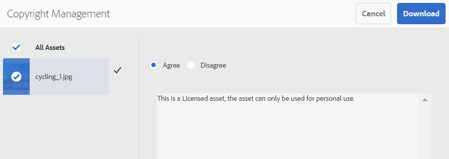

# Elementen downloaden {#download-assets-from-bp}

Adobe Experience Manager Assets Brand Portal verbetert de downloadervaring doordat gebruikers tegelijkertijd elementen en mappen kunnen downloaden die vanuit Brand Portal voor hen toegankelijk zijn. Deze methode houdt in dat goedgekeurde merkelementen veilig kunnen worden gedistribueerd voor offline gebruik. Lees op om te weten hoe te om activa (goedgekeurde activa) van Brand Portal te downloaden, en wat van de [ downloadprestaties ](#expected-download-performance) te verwachten.

>[!NOTE]
>
>In Brand Portal 2020.10.0 (en hoger) is de instelling **[!UICONTROL Fast Download]** standaard ingeschakeld, waardoor IBM® Aspera Connect wordt gebruikt voor het versnellen downloaden van de middelen. Installeer IBM® Aspera Connect 3.9.9 (`https://www.ibm.com/docs/en/aspera-connect/3.9.9`) in de browserextensie voordat u de middelen downloadt van Brand Portal. Zie de [ gids om downloads van Brand Portal ](../using/accelerated-download.md) te versnellen.
>
>Als u IBM® Aspera Connect niet wilt gebruiken en verder wilt gaan met het normale downloadproces, neemt u contact op met de Brand Portal-beheerder om de instelling voor **[!UICONTROL Fast Download]** uit te schakelen.

## Assets-download configureren {#configure-download}

Brand Portal-beheerders kunnen de instellingen voor het downloaden van middelen en gebruikersgroepen configureren voor Brand Portal-gebruikers. Hierdoor kunnen gebruikers elementen openen en downloaden via de Brand Portal-interface.

>[!NOTE]
>
>De downloadinstellingen in de gebruikersinterface bieden Brand Portal-gebruikers een zelfbedieningservaring, zodat ze elementen eenvoudig kunnen configureren en downloaden. Het beperkt het downloaden van elementen op de toepassingslaag niet. Gebruikers kunnen bijvoorbeeld nog steeds elementuitvoeringen openen en downloaden via het volledige URL-pad.

De volgende configuraties bepalen hoe u tot de activa toegang hebt en de activa van de interface van Brand Portal downloadt:

* Downloadinstellingen inschakelen
* Gebruikersgroepinstellingen configureren

### Downloadinstellingen inschakelen {#enable-download-settings}

De beheerders kunnen **[!UICONTROL Download Settings]** toelaten om de reeks vertoningen te bepalen die voor de gebruikers van Brand Portal voor download toegankelijk zijn.

De beschikbare instellingen zijn:

* **[!UICONTROL Fast Download]**

  Met IBM® Aspera Connect kunt u de middelen sneller downloaden. De instelling **[!UICONTROL Fast Download]** wordt standaard ingeschakeld in de **[!UICONTROL Download Settings]** .

* **[!UICONTROL Custom Renditions]**

  Hiermee kunt u aangepaste en (of) dynamische uitvoeringen van de elementen downloaden.

  Alle andere elementuitvoeringen dan het oorspronkelijke element en door het systeem gegenereerde uitvoeringen worden aangepaste uitvoeringen genoemd. Dit omvat statische en dynamische uitvoeringen die beschikbaar zijn voor het element. Elke gebruiker kan een aangepaste statische uitvoering maken in Experience Manager Assets, terwijl alleen de beheerder aangepaste dynamische uitvoeringen kan maken. Zie [ hoe te om beeld toe te passen vooraf instelt of dynamische vertoningen ](../using/brand-portal-image-presets.md).

* **[!UICONTROL System Renditions]**

  Hiermee kunt u door het systeem gegenereerde uitvoeringen van de elementen downloaden.

  Deze elementen zijn miniaturen die automatisch worden gegenereerd in Experience Manager Assets op basis van de workflow voor &quot;DAM-updatebestanden&quot;.

* **[!UICONTROL Asset Download]**

  Uitvoeringen worden gedownload in afzonderlijke mappen voor elk element. Deze instelling is van toepassing op mappen, verzamelingen en bulkdownloads van meer dan 20 elementen.

Meld u als beheerder aan bij de Brand Portal-medewerker en navigeer naar **[!UICONTROL Tools]** > **[!UICONTROL Download]** .

De beheerders kunnen om het even welke combinatie montages voor de gebruikers van Brand Portal toelaten om activa tot uitvoeringen toegang te hebben en te downloaden.

>[!NOTE]
>
>Alleen de beheerders kunnen de verlopen elementen downloaden. Voor meer informatie over verlopen activa, zie [ digitale rechten van activa ](../using/manage-digital-rights-of-assets.md) beheren.

### Gebruikersgroepinstellingen configureren {#configure-user-group-settings}

Naast **[!UICONTROL Download Settings]** kunnen de Brand Portal-beheerders de instellingen voor verschillende groepen gebruikers verder configureren om de originele elementen en hun uitvoeringen weer te geven en (of te downloaden).

Meld u als beheerder aan bij de Brand Portal-medewerker en navigeer naar **[!UICONTROL Tools]** > **[!UICONTROL Users]** . Navigeer op de pagina **[!UICONTROL User Roles]** naar het tabblad **[!UICONTROL Groups]** om de weergave- en (of) downloadinstellingen voor de gebruikersgroepen te configureren.

>[!NOTE]
>
>Als een gebruiker wordt toegevoegd aan meerdere groepen en als een van deze groepen beperkingen heeft, gelden de beperkingen voor de gebruiker.

Gebaseerd op de configuratie, blijft het downloadwerkschema constant voor stand-alone activa, veelvoudige activa, omslagen die activa, vergunning of unlicensed activa bevatten, en de download van activa gebruikend aandeelverbinding.

De volgende matrijs bepaalt als een gebruiker toegang tot de vertoningen afhankelijk van de [ downloadconfiguraties ](#configure-download) zou hebben:

| **de Montages van de Download: De Vertoningen van de Douane** | **de Montages van de Download: De Uitvoeringen van het Systeem** | **de Montages van de Gebruikersgroep: Download Origineel** | **de Montages van de Gebruikersgroep: De Uitvoeringen van de Download** | **Resultaat** |
|---|---|---|---|---|
| ON | ON | ON | ON | Alle uitvoeringen weergeven en downloaden |
| ON | ON | UIT | UIT | Origineel element weergeven |
| UIT | UIT | ON | ON | Origineel element weergeven en downloaden |
| ON | UIT | ON | ON | Oorspronkelijk middel en aangepaste uitvoeringen weergeven en downloaden |
| UIT | ON | ON | ON | Oorspronkelijke middel- en systeemuitvoeringen weergeven en downloaden |
| ON | UIT | UIT | UIT | Origineel element weergeven |
| UIT | ON | UIT | UIT | Origineel element weergeven |
| UIT | UIT | UIT | ON | Origineel element weergeven |
| UIT | UIT | ON | UIT | Origineel element weergeven en downloaden |
| UIT | UIT | UIT | UIT | Origineel element weergeven |

## Elementen downloaden {#download-assets}

Brand Portal-gebruikers kunnen vanuit de Brand Portal-interface meerdere elementen, mappen met elementen en verzamelingen downloaden.

>[!NOTE]
>
>Neem contact op met de Brand Portal-beheerder als u geen toestemming hebt om de elementuitvoeringen te openen of te downloaden.

Als de gebruiker toegang heeft tot uitvoeringen, krijgt de gebruiker het verbeterde dialoogvenster **[!UICONTROL Download]** met de volgende mogelijkheden:

* Alle beschikbare uitvoeringen van elementen in de downloadlijst weergeven.
* Sluit uitvoeringen van elementen uit die niet vereist zijn voor downloaden.
* Pas met één klik dezelfde set uitvoeringen toe op alle vergelijkbare elementtypen.
* Pas een andere set uitvoeringen toe voor verschillende elementtypen.
* Maak een aparte map voor elk element.
* Geselecteerde elementen en de bijbehorende uitvoeringen downloaden.

>[!NOTE]
>
>Het dialoogvenster **[!UICONTROL Download]** wordt alleen weergegeven als **[!UICONTROL Custom Renditions]** en (of) **[!UICONTROL System Renditions]** is ingeschakeld in **[!UICONTROL Download Settings]** .

### Stappen om elementen te downloaden {#bulk-download}

Hier volgen de stappen voor het downloaden van elementen of mappen met elementen van de Brand Portal-interface:

1. Meld u aan bij uw Brand Portal-huurder. Standaard wordt de weergave **[!UICONTROL Files]** geopend die alle gepubliceerde elementen en mappen bevat.

   Voer een van de volgende handelingen uit:

   * Selecteer de elementen of mappen die u wilt downloaden. Klik op het pictogram **[!UICONTROL Download]** op de werkbalk boven in het scherm.

     

   * Als u bepaalde elementuitvoeringen van een element wilt downloaden, plaatst u de aanwijzer boven het element en klikt u op het pictogram **[!UICONTROL Download]** dat beschikbaar is in de miniaturen van de handeling Snel.

     

     >[!NOTE]
     >
     >Als u de middelen voor het eerst downloadt en IBM® Aspera Connect niet in uw browser hebt geïnstalleerd, wordt u gevraagd om de Aspera-downloadaccelerator (`https://www.ibm.com/docs/en/aspera-connect/3.9.9`) te installeren.

     >[!NOTE]
     >
     >Als de gedownloade elementen ook onder licentie gedownloade elementen bevatten, wordt u doorgestuurd naar de pagina **[!UICONTROL Copyright Management]** . Selecteer op deze pagina de elementen, klik op **[!UICONTROL Agree]** en klik op **[!UICONTROL Download]** . Als u het niet eens bent, worden de gelicentieerde middelen niet gedownload.
     > 
     >De vergunning-beschermde activa hebben a [ vergunningsovereenkomst in bijlage ](https://experienceleague.adobe.com/en/docs/experience-manager-65/content/assets/administer/drm) aan hen, die door het 2&rbrace; wordt gedaan meta-gegevensbezit van de activa [&#128279;](https://experienceleague.adobe.com/en/docs/experience-manager-65/content/assets/administer/drm) in Experience Manager Assets te plaatsen.

     

1. Het dialoogvenster **[!UICONTROL Download]** met alle geselecteerde elementen wordt geopend.

   Klik op een element om de beschikbare uitvoeringen weer te geven en selecteer de selectievakjes die overeenkomen met de uitvoeringen die u wilt downloaden.

   U kunt de vertoningen voor individuele activa manueel selecteren of uitsluiten, of **klikken past** pictogram toe om de zelfde reeks vertoningen te selecteren om voor gelijkaardige activa te downloaden types (alle beelddossiers in dit voorbeeld). Klik in het dialoogvenster **[!UICONTROL Apply All]** op **[!UICONTROL Done]** om de regel toe te passen op alle vergelijkbare elementen.

   

   U kunt activa van de downloadlijst (indien vereist) ook verwijderen door op **te klikken verwijdert** pictogram.

   

   Schakel het selectievakje **[!UICONTROL `Create separate folder for each asset`]** in om de Brand Portal-mapstructuur te behouden wanneer u elementen downloadt.

   De downloadknop geeft het aantal geselecteerde items weer. Klik op **[!UICONTROL Download items]** als u klaar bent met het toepassen van de regels.

   

1. De instelling **[!UICONTROL Fast Download]** wordt standaard ingeschakeld in **[!UICONTROL Download Settings]** . Daarom wordt een bevestigingsvenster weergegeven waarin versnelde download met IBM® Aspera Connect is toegestaan.

   Klik op **[!UICONTROL Allow]** als u **[!UICONTROL Fast Download]** wilt blijven gebruiken. Alle geselecteerde vertoningen worden gedownload in een ZIP-map met IBM® Aspera Connect.

   Klik op **[!UICONTROL Deny]** als u IBM® Aspera Connect niet wilt gebruiken. Als **[!UICONTROL Fast Download]** wordt ontkend of ontbreekt, vult het systeem een Bericht van de Fout. Klik op de knop **[!UICONTROL Normal Download]** om door te gaan met het downloaden van elementen.

<!-- removed the known issue from step 2 as it is fixed in 2022.02.0 release.
   >[!CAUTION]
   >
   >(**Experience Manager Assets as a Cloud Service** only) The following known issue will be fixed in the upcoming release:
   >
   >The download dialog lists the smart crop renditions of the selected asset, however, the user cannot download the smart crop renditions.
-->

>[!NOTE]
>
>Als de instelling **[!UICONTROL Fast Download]** door de beheerder is uitgeschakeld, worden de geselecteerde uitvoeringen rechtstreeks gedownload in een ZIP-map zonder gebruik te maken van IBM® Aspera Connect.

>[!NOTE]
>
>Als de instelling **[!UICONTROL Asset Download]** is ingeschakeld in **[!UICONTROL Download Settings]** , worden de elementuitvoeringen gedownload in een aparte map voor elk element in de ZIP-map.
>  
>Als de elementen worden gedownload van een gedeelde koppeling, worden de elementuitvoeringen gedownload in een aparte map voor elk element in de ZIP-map.
>
>Wanneer u een map, verzameling of meer dan 20 elementen selecteert om te downloaden, wordt het dialoogvenster **[!UICONTROL Download]** overgeslagen. In plaats daarvan worden alle toegankelijke elementuitvoeringen, behalve de dynamische uitvoeringen, gedownload in een ZIP-map.

>[!NOTE]
>
>Brand Portal biedt ondersteuning voor het configureren van Dynamic Media in zowel de Hybride als de Scene7-modus.
>
>(*als de auteursinstantie van Experience Manager Assets op **Hybride wijze van Dynamic Media*** loopt)
>
>Als u dynamische uitvoeringen wilt voorvertonen of downloaden, schakelt u dynamische media in. Zorg ervoor dat de Pyramid tiff-uitvoering van het element bestaat bij de Experience Manager Assets-auteur-instantie waar de elementen zijn gepubliceerd. Wanneer een middel van Experience Manager Assets naar Brand Portal wordt gepubliceerd, wordt ook de Pyramid tiff-uitvoering gepubliceerd.

Als de [ beheerder u niet heeft gemachtigd om tot de originele vertoningen ](../using/brand-portal-adding-users.md#main-pars-procedure-202029708) toegang te hebben, kunt u niet de originele vertoningen van de geselecteerde activa downloaden.

<!-- This issue has been resolved, check with engineering.
>[!NOTE]
>
>Once you have downloaded the asset renditions, the **[!UICONTROL Download]** button is disabled to avoid creating duplicate copies of the renditions. To download more (missing or another copy of renditions), refresh the browser to re-enable the download button.
-->

### Elementen downloaden vanaf de pagina met elementgegevens {#download-assets-from-asset-details-page}

Naast de downloadworkflow is er een andere methode om de uitvoeringen voor afzonderlijke elementen rechtstreeks te downloaden vanaf de pagina met elementdetails.

De gebruikers kunnen verschillende elementuitvoeringen voorvertonen, specifieke uitvoeringen selecteren en rechtstreeks elementuitvoeringen downloaden vanuit het deelvenster **[!UICONTROL Renditions]** op de pagina met elementdetails zonder het dialoogvenster **[!UICONTROL Download]** te hoeven openen.

Hier volgen de stappen voor het downloaden van elementuitvoeringen van de pagina met elementdetails:

1. Meld u aan bij de Brand Portal-huurder en klik op het element om de pagina met elementdetails te openen.
1. Klik op het bedekkingspictogram links en klik op **[!UICONTROL Renditions]** .

   

1. Het **[!UICONTROL Renditions]** paneel maakt een lijst van alle toegankelijke activa die vertoningen op de activa [ worden gebaseerd downloadconfiguraties ](#configure-download).

   Selecteer de specifieke uitvoeringen die u wilt downloaden en klik op **[!UICONTROL Download items]** .

   

1. De instelling **[!UICONTROL Fast Download]** wordt standaard ingeschakeld in **[!UICONTROL Download Settings]** . Daarom wordt een bevestigingsvenster weergegeven waarin versnelde download met IBM® Aspera Connect is toegestaan.

   Klik op **[!UICONTROL Allow]** als u **[!UICONTROL Fast Download]** wilt blijven gebruiken. Alle geselecteerde vertoningen worden gedownload in een ZIP-map met IBM® Aspera Connect.

   Als u het gebruik van **[!UICONTROL Fast Download]** weigert, wordt een foutbericht door het systeem ingevuld. Klik op de knop **[!UICONTROL Normal Download]** om door te gaan met het downloaden van elementen.

<!-- removed the known issue from step 3 as it is fixed in 2022.02.0 release.
   >[!CAUTION]
   >
   >(**Experience Manager Assets as a Cloud Service** only) The following known issues will be fixed in the upcoming release:
   >
   >The **[!UICONTROL Renditions]** panel does not list all the static renditions of the assets that are published to Brand Portal after December 16, 2021.
   >
   >The **[!UICONTROL Renditions]** panel lists the smart crop renditions of the asset, however, the user cannot preview or download the smart crop renditions.
-->

>[!NOTE]
>
>Als de instelling **[!UICONTROL Fast Download]** door de beheerder is uitgeschakeld, worden de geselecteerde uitvoeringen rechtstreeks gedownload in een ZIP-map zonder gebruik te maken van IBM® Aspera Connect.

>[!NOTE]
>
>Assets die afzonderlijk worden gedownload, wordt weergegeven in het rapport voor het downloaden van middelen. Als er echter een map met elementen wordt gedownload, worden de map en de middelen niet weergegeven in het rapport voor het downloaden van middelen.

<!--
>[!NOTE]
>
>Assets that are individually downloaded are visible in the assets download report. However, if a folder containing assets is downloaded, the folder and assets are not displayed in the assets download report.
-->

<!-- Backup of content before updating the new feature docs.
## Configure asset download {#configure-download}

The download configuration allows the Brand Portal administrators to define the set of renditions available to the Brand Portal users for downloading the assets. The administrator can configure the asset **[!UICONTROL Download]** settings from the Brand Portal interface. 

The available configurations are:

* **[!UICONTROL Fast Download]** 

  Enables high-speed download of the assets. To know more, see [guide to accelerate downloads from Brand Portal](../using/accelerated-download.md).

* **[!UICONTROL Custom Renditions]** 
  
  Download custom and (or) dynamic renditions of the assets. 
  All the asset renditions other than the original asset and system-generated renditions are called as custom renditions. It includes static as well as dynamic renditions available for the asset. Any user can create a custom static rendition in AEM Assets, whereas, only the AEM administrator can create custom dynamic renditions. To know more, see [how to apply image presets or dynamic renditions](../using/brand-portal-image-presets.md)

* **[!UICONTROL System Renditions]** 

  Download system-generated renditions of the assets. These are the thumbnails which are automatically generated in AEM Assets based on the "DAM update asset" workflow. 

Log in to your Brand Portal tenant as an administrator and navigate to **[!UICONTROL Tools]** > **[!UICONTROL Download]**. By default, the **[!UICONTROL Fast Download]** configuration is enabled in the **[!UICONTROL Download Settings]**. 

The administrators can enable any combination to configure the asset download process.

Based on the configuration, the download workflow remains constant for stand-alone assets, multiple assets, folders containing assets, licensed or unlicensed assets, and downloading assets using share link. 

* If both **[!UICONTROL Custom Renditions]** and **[!UICONTROL System Renditions]** configurations are turned-off, the original renditions of the assets are downloaded without any additional dialog being presented to the users.    

* If any of the **[!UICONTROL Custom Renditions]** or **[!UICONTROL System Renditions]** configuration is enabled, an additional **[!UICONTROL Download]** dialog box appears wherein you can choose whether to download the original asset along with its renditions, or download only specific renditions. 

>[!NOTE]
>
>Only the administrators can download the expired assets. For more information about expired assets, see [manage digital rights of assets](../using/manage-digital-rights-of-assets.md).

## Steps to download assets {#steps-to-download-assets}

Following are the steps to download assets or folders containing assets from Brand Portal:

1. From the Brand Portal interface, do one of the following:

   * Select the folders or assets you want to download. From the toolbar at the top, click the **[!UICONTROL Download]** icon.

     

   * To download a specific asset or folder, hover the pointer over the asset or folder and click the **[!UICONTROL Download]** icon available in the quick action thumbnails.

     

     >[!NOTE]
     >
     >If you are downloading the assets for the first time and do not have IBM Aspera Connect installed in your browser, it will prompt you to install the Aspera download accelerator. 

     >[!NOTE]
     >
     >If the assets you are downloading also include licensed assets, you are redirected to the **[!UICONTROL Copyright Management]** page. In this page, select the assets, click **[!UICONTROL Agree]**, and then click **[!UICONTROL Download]**. If you choose to disagree, licensed assets are not downloaded. 
     > 
     >License-protected assets have [license agreement attached]() to them, which is done by setting asset's [metadata property]() in Experience Manager Assets.

     

     
     >[!NOTE]
     >
     >Ensure to select all the required asset renditions while downloading them from the asset details page, and click **[!UICONTROL Download]**. The selected renditions are downloaded to your local machine.
     > 
     >Once you download, the **[!UICONTROL Download]** button is disabled to avoid creating duplicate copies of the downloaded renditions. To download more (missing or another copy of renditions), refresh the browser to re-enable the download button.

     If any of the **[!UICONTROL Custom Renditions]** or **[!UICONTROL System Renditions]** configuration is enabled in the **[!UICONTROL Download Settings]**, the **[!UICONTROL Download]** dialog appears with the **[!UICONTROL Asset(s)]** check box selected by default. If the **[!UICONTROL Fast Download]** configuration is enabled, the **[!UICONTROL Enable download acceleration]** check box is selected by default.

     

     >[!NOTE]
     >
     >If the downloading assets are image files, and you select only the **[!UICONTROL Asset(s)]** check box in the **[!UICONTROL Download]** dialog but are not [authorized by the administrator to have access to the original renditions of image files](../using/brand-portal-adding-users.md#main-pars-procedure-202029708) then no image files are downloaded and a notification appears, stating that you have been restricted by the administrator to access original renditions.

     

1. To download the renditions in addition to the original assets, select the **[!UICONTROL Rendition(s)]** check box. However, if you want to download the system-generated renditions along with the custom renditions, clear the **[!UICONTROL Exclude System Renditions]** check box.

   

   * To download only the renditions, clear the **[!UICONTROL Asset(s)]** check box.

     >[!NOTE]
     >
     >By default, only the assets are downloaded. However, original renditions of image files are not downloaded if you are not [authorized by the administrator to have access to the original renditions of image files](../using/brand-portal-adding-users.md#main-pars-procedure-202029708).

    * To share the selected assets with other users through a link, select the **[!UICONTROL Email]** check box. An email notification is sent to the users with the download link. To know how to download assets from shared links, see [downloading assets from shared links](../using/brand-portal-link-share.md#main-pars-header-1703469193).  

      

      >[!NOTE]
      >
      >The download link on email notification expires after 45 days.
      >
      >The administrators can customize email messages, that is, logo, description, and footer, using the [Branding](../using/brand-portal-branding.md) feature.

    * You can select a predefined image preset or create a custom dynamic rendition from the **[!UICONTROL Download]** dialog box. 

      To apply a [custom image preset to the asset and its renditions](../using/brand-portal-image-presets.md#applyimagepresetswhendownloadingimages), select the **[!UICONTROL Dynamic Rendition(s)]** check box. Specify the image preset properties (such as size, format, color space, resolution, and image modifier) to apply the custom image preset while downloading the asset and its renditions. To download only the dynamic renditions, clear the **[!UICONTROL Asset(s)]** check box.

      

      >[!NOTE]
      >
      >Brand Portal supports configuring Dynamic Media in both - Hybird and Scene 7 mode. 
      >
      >(*If AEM author instance is running on **Dynamic Media Hybrid mode***)
      >
      >To preview or download dynamic renditions of an asset, ensure that the dynamic media is enabled and the asset's Pyramid tiff rendition exists at the AEM Assets author instance from where the assets have been published. When an asset is published to Brand Portal, its Pyramid tiff rendition is also published.
      
  
    * To preserve the Brand Portal folder hierarchy while downloading assets, select the **[!UICONTROL Create separate folder for each asset]** check box. By default, the Brand Portal folder hierarchy is ignored and all the assets are downloaded in one folder in your local system.

1. Click **[!UICONTROL Download]**.

   The assets (and renditions if selected) are downloaded as a zip file to your local folder. However, no zip file is created if a single asset is downloaded without any of the renditions. 

   If you are not [authorized by the administrator to have access to the original renditions](../using/brand-portal-adding-users.md#main-pars-procedure-202029708), the original renditions of the selected assets are not downloaded. 

   >[!NOTE]
   >
   >Assets that are individually downloaded are visible in the assets download report. However, if a folder containing assets is downloaded, the folder and assets are not displayed in the assets download report.
-->

## Downloadprestaties verwacht {#expected-download-performance}

Het downloaden van bestanden kan per clientlocatie verschillen, afhankelijk van factoren zoals lokale internetverbinding en serverwachttijd. De verwachte downloadprestaties voor 2-GB dossier dat bij verschillende cliëntplaatsen wordt waargenomen zijn als volgt, met de server van Brand Portal bij Oregon in de Verenigde Staten:

| Clientlocatie | Latentie tussen client en server | Downloadsnelheid verwacht | Tijd die nodig is om een bestand van 2 GB te downloaden |
|-------------------------|-----------------------------------|-------------------------|------------------------------------|
| US West (N. Californië) | 18 milliseconden | 7,68 MB/s | 4 minuten |
| US West (Oregon) | 42 milliseconden | 3,84 MB/s | 9 minuten |
| US East (N. Virginia) | 85 milliseconden | 1,61 MB/s | 21 minuten |
| APAC (Tokyo) | 124 milliseconden | 1,13 MB/s | 30 minuten |
| Noida | 275 milliseconden | 0,5 MB/s | 68 minuten |
| Sydney | 175 milliseconden | 0,49 MB/s | 69 minuten |
| Londen | 179 milliseconden | 0,32 MB/s | 106 minuten |
| Singapore | 196 milliseconden | 0,5 MB/s | 68 minuten |

>[!NOTE]
>
>Er worden gegevens met betrekking tot de kationen waargenomen onder testomstandigheden, die kunnen variëren voor gebruikers op verschillende locaties met een gevarieerde latentie en bandbreedte.
