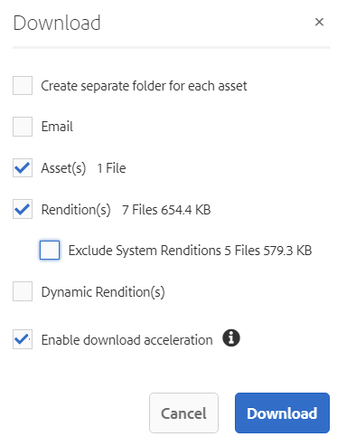
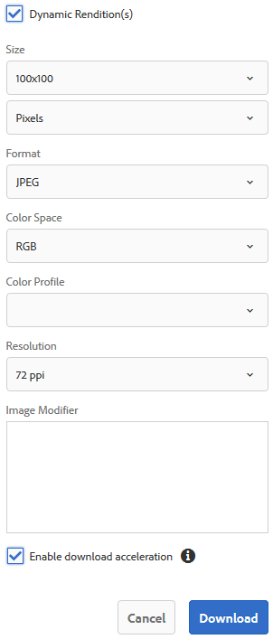

# Elementen downloaden {#download-assets}

<!-- Before update in Download experience - 26th Aug 2020 by Vishabh.
 All users can simultaneously download multiple assets and folders accessible to them from Brand Portal. This way, approved brand assets can be securely distributed for offline use. Read on to know how to download approved assets from Brand Portal, and what to expect from the [download performance](../using/brand-portal-download-assets.md#main-pars-header).
-->

Adobe Experience Manager Assets Brand Portal verbetert de downloadervaring doordat gebruikers tegelijkertijd meerdere middelen en mappen kunnen downloaden die voor hen toegankelijk zijn via Brand Portal. Op deze manier kunnen goedgekeurde merkmiddelen veilig worden gedistribueerd voor offline gebruik. Lees verder om te weten hoe u goedgekeurde middelen kunt downloaden van Brand Portal en wat u kunt verwachten van de [downloadprestaties](../using/brand-portal-download-assets.md#expected-download-performance).

>[!NOTE]
>
>Installeer IBM Aspera Connect 3.9.9 in de browserextensie voordat u de middelen downloadt van Brand Portal.

<!--
**Types of renditions in Brand Portal:**

* Original asset rendition

  It is the original binary of the asset uploaded in AEM Assets. 
  
  
* System renditions

  These are the thumbnail renditions which are automatically generated in AEM Assets based on the "DAM update asset" workflow. 
  
* Custom renditions

  These are the additional renditions that an asset might have and its dynamic renditions. Any user can create additional custom renditions, whereas, only the AEM administrator can create dynamic renditions of an image in AEM Assets. To know more, see [how to apply image presets or dynamic renditions](../using/brand-portal-image-presets.md).     
-->

## Assets-download configureren {#configure-download}

De downloadconfiguratie staat de beheerders van het Portaal van het Merk toe om de reeks vertoningen te bepalen beschikbaar aan de gebruikers van het Portaal van het Merk voor het downloaden van de activa. De beheerder kan de activa **[!UICONTROL Download]** montages van de interface van het Portaal van het Merk vormen.

De beschikbare configuraties zijn:

* **[!UICONTROL Fast Download]**

   Hiermee kunt u de elementen snel downloaden. Zie [gids voor het versnellen van downloads vanaf Brand Portal](../using/accelerated-download.md)voor meer informatie.

* **[!UICONTROL Custom Renditions]**

   Download aangepaste en (of) dynamische uitvoeringen van de elementen.
Alle andere elementuitvoeringen dan het oorspronkelijke element en door het systeem gegenereerde uitvoeringen worden aangeroepen als aangepaste uitvoeringen. Dit omvat statische en dynamische uitvoeringen die beschikbaar zijn voor het element. Elke gebruiker kan een aangepaste statische uitvoering maken in AEM Assets, terwijl alleen de AEM beheerder aangepaste dynamische uitvoeringen kan maken. Zie [hoe u voorinstellingen voor afbeeldingen of dynamische vertoningen kunt toepassen voor meer informatie](../using/brand-portal-image-presets.md)

* **[!UICONTROL System Renditions]**

   Door het systeem gegenereerde uitvoeringen van de elementen downloaden. Dit zijn de miniaturen die automatisch worden gegenereerd in AEM Assets op basis van de workflow voor &quot;DAM-updatebestanden&quot;.

Meld u als beheerder aan bij uw Brand Portal-gebruiker en navigeer naar **[!UICONTROL Tools]** > **[!UICONTROL Download]**. Standaard is de **[!UICONTROL Fast Download]** configuratie ingeschakeld in de **[!UICONTROL Download Settings]** map.

De beheerders kunnen om het even welke combinatie toelaten om het proces van de activadownload te vormen.

Gebaseerd op de configuratie, blijft het downloadwerkschema constant voor stand-alone activa, veelvoudige activa, omslagen die activa, vergunning of unlicensed activa bevatten, en het downloaden van activa gebruikend aandeelverbinding.

* Als zowel **[!UICONTROL Custom Renditions]** als **[!UICONTROL System Renditions]** configuraties zijn uitgeschakeld, worden de oorspronkelijke uitvoeringen van de elementen gedownload zonder dat er een extra dialoogvenster aan de gebruikers wordt getoond.

<!--
If all the three download configurations are turned-off, or only the **[!UICONTROL Fast Download]** configuration is enabled, the original assets are directly downloaded on your local system with no additional step required.
Test.. 
-->

* Als een van de opties **[!UICONTROL Custom Renditions]** of de **[!UICONTROL System Renditions]** configuratie is ingeschakeld, wordt een extra **[!UICONTROL Download]** dialoogvenster weergegeven waarin u kunt kiezen of u het oorspronkelijke element samen met de uitvoeringen wilt downloaden of alleen bepaalde uitvoeringen wilt downloaden.

>[!NOTE]
>
>Alleen de beheerders kunnen de verlopen elementen downloaden. Zie [Digitale rechten van elementen](../using/manage-digital-rights-of-assets.md)beheren voor meer informatie over verlopen elementen.

## Stappen om elementen te downloaden {#steps-to-download-assets}

Hier volgen de stappen voor het downloaden van elementen of mappen met elementen van Brand Portal:

1. Voer een van de volgende handelingen uit vanuit de interface Brand Portal:

   * Selecteer de mappen of middelen die u wilt downloaden. Klik op het **[!UICONTROL Download]** pictogram op de werkbalk boven in het scherm.

      

   * Als u een specifiek middel of een specifieke map wilt downloaden, plaatst u de aanwijzer boven het element of de map en klikt u op het **[!UICONTROL Download]** pictogram in de miniaturen van de snelle handeling.

      

      >[!NOTE]
      >
      >Als u de middelen voor het eerst downloadt en IBM Aspera Connect niet in uw browser hebt geïnstalleerd, wordt u gevraagd om de Aspera-downloadaccelerator te installeren.

      >[!NOTE]
      >
      >Als de elementen die u downloadt ook elementen met licentie bevatten, wordt u doorgestuurd naar de **[!UICONTROL Copyright Management]** pagina. Selecteer op deze pagina de elementen, klik op **[!UICONTROL Agree]** en klik op **[!UICONTROL Download]**. Als u het niet eens bent, worden de gelicentieerde middelen niet gedownload.
      > 
      >Bij voor licentie beveiligde elementen is een [licentieovereenkomst gekoppeld](https://helpx.adobe.com/experience-manager/6-5/assets/using/drm.html#DigitalRightsManagementinAssets) , die wordt uitgevoerd door de eigenschap  metadata van het element in te stellen in Experience Manager Assets.

      

      >[!NOTE]
      >
      >Zorg ervoor dat u alle vereiste elementuitvoeringen selecteert terwijl u deze downloadt van de pagina met elementdetails en klik op **[!UICONTROL Download]**. De geselecteerde vertoningen worden gedownload naar uw lokale computer.
      > 
      >Wanneer u het bestand hebt gedownload, is de **[!UICONTROL Download]** knop uitgeschakeld om te voorkomen dat er dubbele kopieën van de gedownloade uitvoeringen worden gemaakt. Als u meer (ontbrekende of een andere kopie van vertoningen) wilt downloaden, vernieuwt u de browser om de downloadknop weer in te schakelen.

      Als een van de opties **[!UICONTROL Custom Renditions]** of de **[!UICONTROL System Renditions]** configuratie in het dialoogvenster is ingeschakeld, wordt het **[!UICONTROL Download Settings]** dialoogvenster weergegeven met het **[!UICONTROL Download]** **[!UICONTROL Asset(s)]** selectievakje standaard ingeschakeld. Als de **[!UICONTROL Fast Download]** configuratie is ingeschakeld, is het **[!UICONTROL Enable download acceleration]** selectievakje standaard ingeschakeld.

      

      >[!NOTE]
      >
      >Als het downloaden van elementen afbeeldingsbestanden is en u alleen het **[!UICONTROL Asset(s)]** selectievakje in het **[!UICONTROL Download]** dialoogvenster inschakelt, maar de beheerder niet [toestaat toegang te hebben tot de oorspronkelijke uitvoeringen van afbeeldingsbestanden](../using/brand-portal-adding-users.md#main-pars-procedure-202029708) , worden er geen afbeeldingsbestanden gedownload en verschijnt er een melding dat de beheerder u heeft beperkt tot het openen van originele uitvoeringen.

      

1. Als u de uitvoeringen naast de originele elementen wilt downloaden, schakelt u het **[!UICONTROL Rendition(s)]** selectievakje in. Als u echter de door het systeem gegenereerde uitvoeringen samen met de aangepaste uitvoeringen wilt downloaden, schakelt u het **[!UICONTROL Exclude System Renditions]** selectievakje uit.

   

   * Als u alleen de uitvoeringen wilt downloaden, schakelt u het **[!UICONTROL Asset(s)]** selectievakje uit.

      >[!NOTE]
      >
      >Standaard worden alleen de elementen gedownload. Oorspronkelijke uitvoeringen van afbeeldingsbestanden worden echter niet gedownload als de beheerder u geen toegang [verleent tot de originele uitvoeringen van afbeeldingsbestanden](../using/brand-portal-adding-users.md#main-pars-procedure-202029708).

   * Als u de geselecteerde elementen via een koppeling wilt delen met andere gebruikers, schakelt u het **[!UICONTROL Email]** selectievakje in. Er wordt een e-mailbericht verzonden naar de gebruikers met de downloadkoppeling. Als u wilt weten hoe u elementen kunt downloaden van gedeelde koppelingen, raadpleegt u het [downloaden van elementen van gedeelde koppelingen](../using/brand-portal-link-share.md#main-pars-header-1703469193).

      

      >[!NOTE]
      >
      >De downloadkoppeling in e-mailberichten verloopt na 45 dagen.
      >
      >De beheerders kunnen e-mailberichten, dat wil zeggen het logo, de beschrijving en de voettekst, aanpassen met de functie [Branding](../using/brand-portal-branding.md) .

   * U kunt een vooraf gedefinieerde voorinstelling voor een afbeelding selecteren of een aangepaste dynamische uitvoering maken in het **[!UICONTROL Download]** dialoogvenster.

      Als u een [aangepaste voorinstelling voor afbeeldingen wilt toepassen op het element en de uitvoeringen](../using/brand-portal-image-presets.md#applyimagepresetswhendownloadingimages)ervan, schakelt u het **[!UICONTROL Dynamic Rendition(s)]** selectievakje in. Geef de eigenschappen van de voorinstellingen voor de afbeelding op (zoals grootte, indeling, kleurruimte, resolutie en afbeeldingswijziging) om de aangepaste voorinstelling voor de afbeelding toe te passen tijdens het downloaden van het element en de uitvoeringen. Als u alleen de dynamische uitvoeringen wilt downloaden, schakelt u het **[!UICONTROL Asset(s)]** selectievakje uit.

      

      >[!NOTE]
      >
      >Het Portaal van het merk steunt het vormen Dynamische Media op zowel - Hyird als wijze 7.
      >
      >(*Als AEM auteurinstantie op **Dynamische Media Hybride wijze***loopt)
      >
      >Als u dynamische uitvoeringen van een element wilt voorvertonen of downloaden, zorgt u ervoor dat de dynamische media is ingeschakeld en de Pyramid-TIFF-uitvoering van het element bestaat in de AEM Assets-auteur-instantie vanwaar de elementen zijn gepubliceerd. Wanneer een middel wordt gepubliceerd naar Brand Portal, wordt ook de Pyramid tiff-uitvoering gepubliceerd.

   * Schakel het **[!UICONTROL Create separate folder for each asset]** selectievakje in als u de maphiërarchie van het Brand Portal wilt behouden tijdens het downloaden van elementen. Standaard wordt de maphiërarchie Brand Portal genegeerd en worden alle elementen in één map op uw lokale systeem gedownload.

1. Klik op **[!UICONTROL Download]**.

   De elementen (en de vertoningen als geselecteerd) worden gedownload als gecomprimeerd dossier aan uw lokale omslag. Er wordt echter geen ZIP-bestand gemaakt als één element wordt gedownload zonder een van de uitvoeringen.

   Als de beheerder u geen toegang [geeft tot de oorspronkelijke vertoningen](../using/brand-portal-adding-users.md#main-pars-procedure-202029708), worden de oorspronkelijke vertoningen van de geselecteerde elementen niet gedownload.

   >[!NOTE]
   >
   >Elementen die afzonderlijk worden gedownload, worden weergegeven in het rapport voor het downloaden van elementen. Als er echter een map met elementen wordt gedownload, worden de map en de middelen niet weergegeven in het rapport voor het downloaden van middelen.

## Downloadprestaties verwacht {#expected-download-performance}

Het downloaden van bestanden kan per clientlocatie verschillen, afhankelijk van factoren zoals lokale internetverbinding en serverwachttijd. De verwachte downloadprestaties voor 2-GB dossier dat bij verschillende cliëntplaatsen wordt waargenomen zijn als volgt, met de server van het Portaal van het Merk bij Oregon in Verenigde Staten:

| Clientlocatie | Latentie tussen client en server | Downloadsnelheid verwacht | Tijd die nodig is om een bestand van 2 GB te downloaden |
|-------------------------|-----------------------------------|-------------------------|------------------------------------|
| US West (N. Californië) | 18 milliseconden | 7,68 MB/s | 4 minuten |
| US West (Oregon) | 42 milliseconden | 3,84 MB/s | 9 minuten |
| US East (N. Virginia) | 85 milliseconden | 1,61 MB/s | 21 minuten |
| APAC (Tokio) | 124 milliseconden | 1,13 MB/s | 30 minuten |
| Noida | 275 milliseconden | 0,5 MB/s | 68 minuten |
| Sydney | 175 milliseconden | 0,49 MB/s | 69 minuten |
| Londen | 179 milliseconden | 0,32 MB/s | 106 minuten |
| Singapore | 196 milliseconden | 0,5 MB/s | 68 minuten |

>[!NOTE]
>
>Er worden gegevens met betrekking tot de kationen waargenomen onder testomstandigheden, die kunnen variëren voor gebruikers op verschillende locaties met een gevarieerde latentie en bandbreedte.

