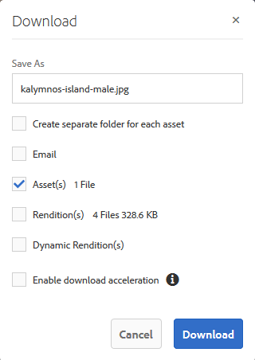

# Elementen downloaden {#download-assets}

Alle gebruikers kunnen veelvoudige activa en omslagen gelijktijdig downloaden toegankelijk aan hen van het Portaal van het Merk. Op deze manier kunnen goedgekeurde merkmiddelen veilig worden gedistribueerd voor offline gebruik. Lees verder om te weten hoe u goedgekeurde middelen kunt downloaden van Brand Portal en wat u kunt verwachten van de [downloadprestaties](../using/brand-portal-download-users.md#main-pars-header).

>[!NOTE]
>
>Alleen beheerders kunnen verlopen elementen downloaden. Zie [Digitale rechten van elementen](../using/manage-digital-rights-of-assets.md)beheren voor meer informatie over verlopen elementen.

## Stappen om elementen te downloaden {#steps-to-download-assets}

Voer de volgende stappen uit om elementen of mappen met elementen voor Brand Portal te downloaden:

1. Voer een van de volgende handelingen uit vanuit de interface Brand Portal:

   * Selecteer de mappen of middelen die u wilt downloaden. Klik op het **[!UICONTROL Download]** pictogram op de werkbalk boven in het scherm.
   

   * Als u één map of element wilt downloaden, plaatst u de aanwijzer boven de map of het element. Klik op het **[!UICONTROL Download]** pictogram van de snelactieminiaturen die beschikbaar zijn.
   

   >[!NOTE]
   >
   >Als de elementen die u downloadt ook elementen met licentie bevatten, wordt u doorgestuurd naar de **[!UICONTROL Copyright Management]** pagina. Selecteer op deze pagina de elementen, klik op **[!UICONTROL Agree]** en klik op **[!UICONTROL Download]**. Als u het niet eens bent, worden de gelicentieerde middelen niet gedownload.\
   >Bij voor licentie beveiligde elementen is een [licentieovereenkomst gekoppeld](https://helpx.adobe.com/experience-manager/6-5/assets/using/drm.html#DigitalRightsManagementinAssets) , die wordt uitgevoerd door de eigenschap  metadata van het element in AEM Assets in te stellen.

   

   Het **[!UICONTROL Download]** dialoogvenster wordt weergegeven, waarbij de **[!UICONTROL Asset(s)]** optie standaard is geselecteerd.

   

   >[!NOTE]
   >
   >Als de elementen die u downloadt afbeeldingsbestanden zijn en u alleen de **[!UICONTROL Asset(s)]** optie in het dialoogvenster Downloaden selecteert, maar niet door de beheerder is [gemachtigd om toegang te hebben tot de oorspronkelijke vertoningen van afbeeldingsbestanden](../using/brand-portal-adding-users.md#main-pars-procedure-202029708) , worden er geen afbeeldingsbestanden gedownload en verschijnt een melding met de melding dat de beheerder u heeft beperkt tot het openen van originele uitvoeringen.

   

1. Selecteer **[!UICONTROL Rendition(s)]**. Als u echter wilt dat automatisch gegenereerde uitvoeringen samen met aangepaste uitvoeringen kunnen worden gedownload, schakelt u deze optie uit **[!UICONTROL Exclude Auto Generated Renditions]**. Deze optie is standaard geselecteerd.

   

   Schakel de optie uit als u alleen de uitvoeringen wilt downloaden **[!UICONTROL Asset(s)]**.

   >[!NOTE]
   >
   >Standaard worden alleen de elementen gedownload. Oorspronkelijke uitvoeringen van afbeeldingsbestanden worden echter niet gedownload als de beheerder u geen toegang [verleent tot de originele uitvoeringen van afbeeldingsbestanden](../using/brand-portal-adding-users.md#main-pars-procedure-202029708).

   * Als u het downloaden van elementbestanden vanaf Brand Portal wilt versnellen, selecteert u de optie en **[!UICONTROL Enable download acceleration]** volgt u de wizard . Raadpleeg de [handleiding voor het versnellen van downloads vanaf Brand Portal](../using/accelerated-download.md)voor meer informatie over het sneller downloaden van bedrijfsmiddelen.

   * Als u een [aangepaste voorinstelling voor afbeeldingen wilt toepassen op het element en de uitvoeringen](../using/brand-portal-image-presets.md#applyimagepresetswhendownloadingimages)ervan, selecteert u **[!UICONTROL Dynamic Rendition(s)]**. Geef aangepaste eigenschappen voor voorinstellingen voor afbeeldingen op (grootte, indeling, kleurruimte, resolutie en afbeeldingswijziging) om de aangepaste voorinstelling voor afbeeldingen toe te passen tijdens het downloaden van het element en de uitvoeringen. Als u alleen de dynamische uitvoeringen wilt downloaden, schakelt u **[!UICONTROL Asset(s)]** het selectievakje uit.
   

   >[!NOTE]
   >
   >Als u dynamische uitvoeringen van een willekeurig element wilt voorvertonen (of downloaden), zorgt u ervoor dat de dynamische media is ingeschakeld en dat de Pyramid tiff-uitvoering van het element bestaat bij de AEM-auteur-instantie, waar de elementen zijn gepubliceerd. Wanneer een middel wordt gepubliceerd naar Brand Portal, wordt ook de Pyramid tiff-uitvoering gepubliceerd. Er is geen manier om de piramide-tiff-uitvoering te genereren van Brand Portal.

   * Selecteer **[!UICONTROL Create separate folder for each asset]** als u de maphiërarchie van het Brand Portal wilt behouden tijdens het downloaden van elementen. Standaard wordt de maphiërarchie Brand Portal genegeerd en worden alle elementen in één map op uw lokale systeem gedownload.

   * Als u een e-mailbericht wilt verzenden naar gebruikers met een koppeling voor het downloaden van de middelen, selecteert u **[!UICONTROL Email]**.
   

   >[!NOTE]
   >
   >Koppeling downloaden bij e-mailmelding verloopt na 45 dagen.
   >
   >Beheerders kunnen e-mailberichten (logo, beschrijving en voettekst) aanpassen met de functie [Branding](../using/brand-portal-branding.md) .

1. Klik op **[!UICONTROL Download]**.

   De elementen (en de vertoningen als geselecteerd) worden gedownload als dossier van het PIT aan uw lokale omslag. Er wordt echter geen .zip-bestand gemaakt als één element zonder de uitvoeringen wordt gedownload, zodat het snel kan worden gedownload.

   Oorspronkelijke uitvoeringen van de geselecteerde elementen worden niet gedownload als de beheerder u geen toegang [verleent tot de oorspronkelijke uitvoeringen](../using/brand-portal-adding-users.md#main-pars-procedure-202029708).

   >[!NOTE]
   >
   >Elementen die afzonderlijk zijn geselecteerd en gedownload, worden weergegeven in het rapport met gedownloade elementen. Als er echter een map met elementen wordt gedownload, worden de map en de middelen niet weergegeven in het rapport met gedownloade middelen.

   Als u wilt weten hoe u elementen kunt downloaden van gedeelde koppelingen, raadpleegt u het [downloaden van elementen van gedeelde koppelingen](../using/brand-portal-link-share.md#main-pars-header-1703469193).

## Downloadprestaties verwacht {#expected-download-performance}

Het downloaden van bestanden kan per clientlocatie verschillen, afhankelijk van factoren zoals lokale internetverbinding en serverwachttijd. De verwachte downloadprestaties voor 2 GB bestand die op verschillende clientlocaties worden waargenomen, zijn als volgt, met Brand Portal-server op Oregon in de Verenigde Staten:

| Clientlocatie | Latentie tussen client en server | Downloadsnelheid verwacht | Tijd die nodig is om een 2 GB-bestand te downloaden |
|-------------------------|-----------------------------------|-------------------------|------------------------------------|
| US West (N. Californië) | 18 milliseconden | 7,68 MB/s | 4 minuten |
| US West (Oregon) | 42 milliseconden | 3,84 MB/s | 9 minuten |
| US East (N. Virginia) | 85 milliseconden | 1,61 MB/s | 21 minuten |
| APAC (Tokio) | 124 milliseconden | 1,13 MB/s | 30 minuten |
| Noida | 275 milliseconden | 0,5 MB/s | 68 minuten |
| Sydney | 175 milliseconden | 0,49 MB/s | 69 minuten |
| Londen | 179 milliseconden | 0,32 MB/s | 106 minuten |
| Singapore | 196 milliseconden | 0,5 MB/s | 68 minuten |

**Opmerking**: Er worden gegevens met betrekking tot de kationen waargenomen onder testomstandigheden, die kunnen variëren voor gebruikers op verschillende locaties met een gevarieerde latentie en bandbreedte.
