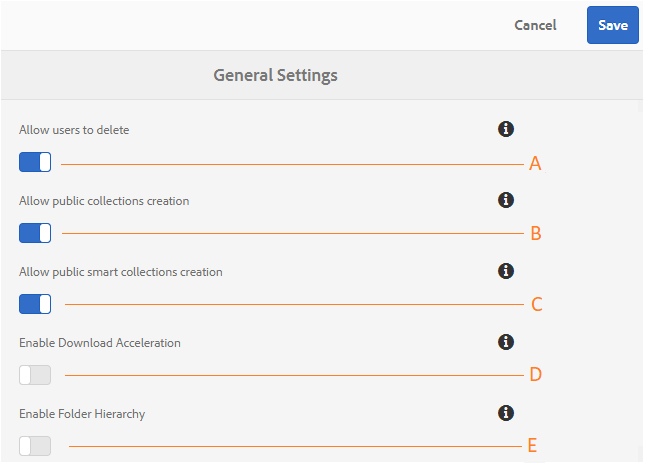

# Algemene huurdersconfiguraties beheren {#administer-general-tenant-configurations}

Met AEM Assets Brand Portal kunnen organisaties de volgende mogelijkheden configureren voor specifieke huurders:

* Verwijderen van bedrijfsmiddelen door beheerders
* Openbare collectie maken door gebruikers die geen beheerder zijn
* Creatie van slimme openbare verzamelingen door gebruikers zonder beheerdersrechten
* Downloadversnelling
* Bovenliggende hiërarchie van gedeelde mappen zichtbaar voor gebruikers zonder beheerdersrechten

Deze configuraties zijn geleverd als **[!UICONTROL General Settings]** configuraties in het deelvenster met beheergereedschappen.

**Een** configuratie waarmee beheerders elementen uit het Brand Portal kunnen verwijderen. (Standaard is ingeschakeld)

**B** Configuratie om de gebruikers niet-admin toe te staan om openbare inzamelingen tot stand te brengen. (Standaard is ingeschakeld)

**C** Configuration om de gebruikers niet-admin toe te staan om openbare slimme inzamelingen tot stand te brengen. (Standaard is ingeschakeld)

**D** Configuration om downloadversnelling toe te staan van activa die van het portaal en van de gedeelde verbindingen worden gedownload. (Standaard is uitgeschakeld)

**E** Configuration to display folder shiërarchie (from the root) of shared folders to non-admin users (Editors, Viewers, Guest Users). (Standaard is uitgeschakeld)

## Algemene configuraties inschakelen/uitschakelen {#enable-disable-general-configurations}

Om elk van deze configuraties toe te laten/onbruikbaar te maken:

1. Meld u aan met beheerdersrechten.
1. Selecteer het AEM-logo voor toegang tot beheergereedschappen op de werkbalk boven in het scherm.
1. Selecteer in het deelvenster met beheergereedschappen **[!UICONTROL General]** de optie om de **[!UICONTROL General Settings]** pagina te openen.
1. Gebruik de respectieve knevelschakelaar om het even welke Algemene configuraties toe te laten/onbruikbaar te maken.
1. **[!UICONTROL Save]** de wijzigingen.
1. Afmelden om de wijzigingen van kracht te laten worden.

## Beheerdergebruikers toestaan elementen van Brand Portal te verwijderen {#allow-admin-users-to-delete-assets-from-brand-portal}

**[!UICONTROL Allow users to delete]** Met configuratie kunnen organisaties gebruikers met beheerdersrechten toestaan (of beperken) om elementen en mappen te verwijderen uit Brand Portal.

## Openbare collecties maken door niet-beheerders toestaan {#allow-public-collections-creation-by-non-admins}

[[!UICONTROL Allow public collections creation]](../using/brand-portal-share-collection.md#main-pars-text-1915052376) de configuratie controleert of de niet beheerders openbare inzamelingen op het Portaal van het Merk kunnen tot stand brengen. De configuratie is standaard ingeschakeld. Door de configuratieorganisaties onbruikbaar te maken kunnen het hebben van talrijke openbare inzamelingen op hun portaal verhinderen zodat de systeemruimte kan worden bewaard.

## Maken van openbare slimme verzamelingen door niet-beheerders toestaan {#allow-public-smart-collections-creation-by-non-admins}

[[!UICONTROL Allow public smart collections creation]](../using/brand-portal-searching.md#main-pars-header-500620467) de configuratie controleert of niet-beheerders hun onderzoeken als slimme inzamelingen kunnen bewaren en hen openbaar voor die huurder maken. De configuratie is standaard ingeschakeld. Door de configuratieorganisaties onbruikbaar te maken kan het hebben van een enorm aantal openbare slimme inzamelingen verhinderen die door niet-admin gebruikers op het Portaal van het Merk van de organisatie worden gecreeerd.

## Downloadversnelling toestaan {#allow-download-acceleration}

[[!UICONTROL Allow download acceleration]](../using/accelerated-download.md) Met de configuratie kunnen organisaties versnelde downloads van middelen van Brand Portal en gedeelde koppelingen toestaan, door te integreren met IBM Aspera Connect, een toepassing die op aanvraag wordt geïnstalleerd. De toepassing gebruikt merkgebonden technologie om de overheadkosten van TCP te verwijderen.

## Maphiërarchie inschakelen {#enable-folder-hierarchy}

[[!UICONTROL Enable Folder Hierarchy]](../using/brand-portal-sharing-folders.md#non-admin-user-access-to-shared-folders) De configuratie staat de beheerders toe om te controleren hoe de gebruikers niet-admin (Editors, Kijkers, en de Gebruikers van de Gast) de gedeelde omslagen na het programma openen zien.
