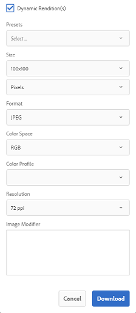

# Voorinstellingen voor afbeeldingen of dynamische vertoningen toepassen {#apply-image-presets-or-dynamic-renditions}

Net als bij een macro is een voorinstelling voor afbeeldingen een vooraf gedefinieerde verzameling opdrachten voor grootte en opmaak die onder een naam zijn opgeslagen. Met voorinstellingen voor afbeeldingen kunnen AEM Assets Brand Portal dynamisch afbeeldingen van verschillende grootten, indelingen en eigenschappen leveren.

Een voorinstelling voor afbeeldingen wordt gebruikt om dynamische uitvoeringen te genereren van afbeeldingen die u kunt voorvertonen en downloaden. Wanneer u een voorvertoning weergeeft van afbeeldingen en de bijbehorende uitvoeringen, kunt u een voorinstelling kiezen om de afbeeldingen opnieuw op te maken volgens de specificaties die zijn ingesteld door uw beheerder.

(*Als AEM auteurinstantie op **Dynamic Media Hybride wijze***) loopt om dynamische vertoningen van een activa in het Portaal van het Merk te bekijken, zorg ervoor dat zijn Piramid tiff vertoning bij de AEM auteursinstantie van waar u aan het Portaal van het Merk publiceert bestaat. Wanneer u het element publiceert, wordt de PTIFF-uitvoering ook gepubliceerd naar Brand Portal.

>[!NOTE]
>
>Wanneer u afbeeldingen en de bijbehorende uitvoeringen downloadt, is er geen optie om te kiezen uit de bestaande voorinstellingen. In plaats daarvan kunt u de eigenschappen van een aangepaste voorinstelling voor afbeeldingen opgeven. Zie [Voorinstellingen voor afbeeldingen toepassen bij het downloaden van afbeeldingen](../using/brand-portal-image-presets.md#main-pars-text-1403412644) voor meer informatie.

Zie [Voorinstellingen afbeelding beheren](https://docs.adobe.com/docs/en/AEM/6-0/administer/integration/dynamic-media/image-presets.html) voor meer informatie over de vereiste parameters bij het maken van voorinstellingen voor afbeeldingen.

## Een voorinstelling voor een afbeelding maken {#create-an-image-preset}

De AEM beheerders kunnen voorinstellingen voor afbeeldingen maken die als dynamische uitvoeringen op de pagina met elementdetails worden weergegeven. U kunt een geheel nieuwe voorinstelling voor afbeeldingen maken of een bestaande voorinstelling met een nieuwe naam opslaan. Wanneer u een voorinstelling voor afbeeldingen maakt, kiest u een grootte voor de levering van de afbeelding en de opmaakopdrachten. Wanneer een afbeelding voor weergave wordt geleverd, wordt de weergave ervan geoptimaliseerd volgens de gekozen opdrachten.

>[!NOTE]
>
>Dynamische uitvoeringen van een afbeelding worden gemaakt met de Piramide TIFF. Als de Piramid TIFF niet beschikbaar is voor een element, kunnen dynamische uitvoeringen voor dat element niet worden opgehaald in het Brand-portaal.
>
>Als AEM auteurinstantie op **Dynamic Media Hybrid wijze** loopt, dan worden de vertoningen van de vertoningen van TIF van beeldBeelden gecreeerd en in AEM bewaarplaats bewaard.
>
>Als AEM auteurinstantie op **Dynamic Media Scene 7 wijze** loopt, dan bestaan de Verlopen van de Piramid TIFF van beeldactiva op Scene 7 server.
>
>Wanneer dergelijke middelen op brandportal worden gepubliceerd, worden voorinstellingen voor afbeeldingen toegepast en dynamische uitvoeringen weergegeven.

1. Klik op de AEM werkbalk boven in het scherm op het Adobe-logo voor toegang tot de beheergereedschappen.

1. Klik in het deelvenster met beheergereedschappen op **[!UICONTROL Image Presets]**.

   

1. Klik op **[!UICONTROL Create]** op de pagina met voorinstellingen voor afbeeldingen.

   

1. Voer op de pagina **[!UICONTROL Edit Image Preset]** waarden in op de tabbladen **[!UICONTROL Basic]** en **[!UICONTROL Advanced]**, zoals van toepassing, inclusief een naam. De opties worden beschreven in [Voorinstellingsopties voor afbeeldingen](https://docs.adobe.com/docs/en/AEM/6-0/administer/integration/dynamic-media/image-presets.html#Image%20preset%20options). Voorinstellingen worden weergegeven in het linkerdeelvenster en kunnen direct samen met andere assets worden gebruikt.

   

   >[!NOTE]
   >
   >U kunt de pagina **[!UICONTROL Edit Image Preset]** ook gebruiken om de eigenschappen van een bestaande voorinstelling te bewerken. Als u een voorinstelling voor afbeeldingen wilt bewerken, selecteert u deze op de pagina met voorinstellingen voor afbeeldingen en klikt u op **[!UICONTROL Edit]**.

1. Klik op **[!UICONTROL Save]**. De voorinstelling voor de afbeelding wordt gemaakt en weergegeven op de pagina met voorinstellingen voor de afbeelding.
1. Als u een voorinstelling voor afbeeldingen wilt verwijderen, selecteert u deze op de pagina met voorinstellingen voor afbeeldingen en klikt u op **[!UICONTROL Delete]**. Klik in de bevestigingspagina op **[!UICONTROL Delete]** om de verwijdering te bevestigen. De voorinstelling voor de afbeelding wordt verwijderd van de pagina met voorinstellingen voor de afbeelding.

## Afbeeldingsvoorinstellingen toepassen bij voorvertonen van afbeeldingen {#apply-image-presets-when-previewing-images}

Als u een voorvertoning weergeeft van afbeeldingen en de bijbehorende uitvoeringen, kiest u een van de bestaande voorinstellingen om de afbeeldingen opnieuw op te maken volgens de specificaties die zijn ingesteld door uw beheerder.

1. Klik in de interface Brand Portal op een afbeelding om deze te openen.
1. Klik op het bedekkingspictogram aan de linkerkant en kies **[!UICONTROL Renditions]**.

   

1. Selecteer in de lijst **[!UICONTROL Renditions]** de toepasselijke dynamische vertoning, bijvoorbeeld **[!UICONTROL Thumbnail]**. De voorvertoningsafbeelding wordt weergegeven op basis van uw keuze voor de vertoning.

   

## Afbeeldingsvoorinstellingen toepassen bij het downloaden van afbeeldingen {#apply-image-presets-when-downloading-images}

Wanneer u afbeeldingen en de bijbehorende uitvoeringen downloadt van Brand Portal, kunt u geen voorinstellingen voor bestaande afbeeldingen kiezen. U kunt de eigenschappen van voorinstellingen voor afbeeldingen echter aanpassen op basis waarvan u de afbeeldingen opnieuw wilt opmaken.

1. Voer een van de volgende handelingen uit vanuit de interface Brand Portal:

   * Houd de aanwijzer boven de afbeelding die u wilt downloaden. Klik op het pictogram **[!UICONTROL Download]** van de beschikbare miniaturen voor snelle handelingen.

   

   * Selecteer de afbeelding die u wilt downloaden. Klik op het pictogram **[!UICONTROL Download]** op de werkbalk boven in het scherm.

   

1. Selecteer in het dialoogvenster **[!UICONTROL Download]** de vereiste opties, afhankelijk van het feit of u het element met of zonder de uitvoeringen wilt downloaden.

   

1. Als u dynamische uitvoeringen van het element wilt downloaden, selecteert u de optie **[!UICONTROL Dynamic Rendition(s)]**.
1. Pas vooraf ingestelde eigenschappen van een afbeelding aan op basis waarvan u de afbeelding en de vertoningen tijdens het downloaden dynamisch opnieuw wilt opmaken. Geef de grootte, indeling, kleurruimte, resolutie en afbeeldingswijziging op.

   

1. Klik op **[!UICONTROL Download]**. De aangepaste dynamische uitvoeringen worden gedownload in een ZIP-bestand, samen met de afbeelding en vertoningen die u hebt gedownload. Er wordt echter geen ZIP-bestand gemaakt als één element wordt gedownload, waardoor het snel kan worden gedownload.
