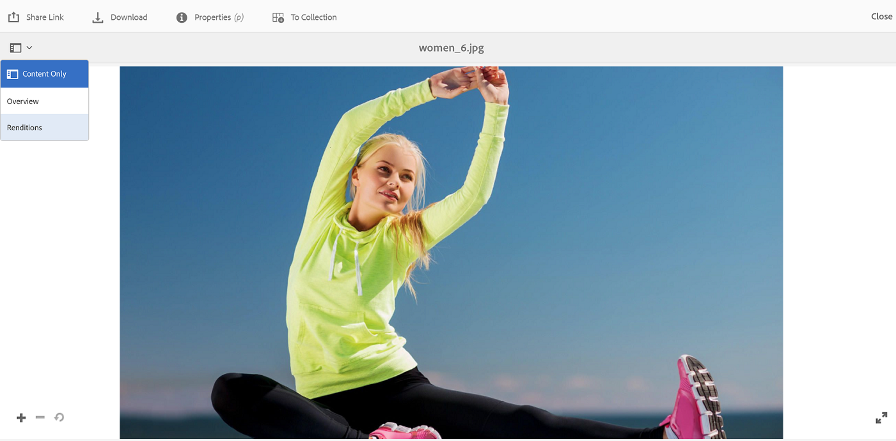

# Voorinstellingen voor afbeeldingen of dynamische uitvoeringen toepassen {#apply-image-presets-or-dynamic-renditions}

Net als bij een macro is een voorinstelling voor afbeeldingen een vooraf gedefinieerde verzameling opdrachten voor grootte en opmaak die onder een naam zijn opgeslagen. Met voorinstellingen voor afbeeldingen kan Experience Manager Assets Brand Portal dynamisch afbeeldingen van verschillende grootten, indelingen en eigenschappen leveren.

Een voorinstelling voor afbeeldingen wordt gebruikt om dynamische uitvoeringen te genereren van afbeeldingen die u kunt voorvertonen en downloaden. Wanneer u een voorvertoning weergeeft van afbeeldingen en de bijbehorende uitvoeringen, kunt u een voorinstelling kiezen om de afbeeldingen opnieuw op te maken volgens de specificaties die zijn ingesteld door uw beheerder.

(*als de auteursinstantie van Experience Manager Assets op **Hybride wijze van Dynamic Media*** loopt). Als u dynamische uitvoeringen van een element wilt weergeven in Brand Portal, zorgt u ervoor dat de uitvoering van de Piramid-TIFF bestaat in de Experience Manager Assets-auteur-instantie van de locatie waar u publiceert naar Brand Portal. Wanneer u het element publiceert, wordt de PTIFF-uitvoering ook gepubliceerd naar Brand Portal.

>[!NOTE]
>
>Wanneer u afbeeldingen en de bijbehorende uitvoeringen downloadt, kunt u geen voorinstellingen kiezen. In plaats daarvan kunt u de eigenschappen van een aangepaste voorinstelling voor afbeeldingen opgeven. Voor meer informatie, zie [ beeld toepassen vooraf instelt wanneer het downloaden van beelden ](../using/brand-portal-image-presets.md#main-pars-text-1403412644).

Voor meer informatie over de parameters die worden vereist terwijl het creëren van beeld stelt vooraf in, zie [ het Leiden Beeld vooraf instelt ](../using/brand-portal-image-presets.md).

## Een voorinstelling voor afbeeldingen maken {#create-an-image-preset}

De Experience Manager Assets-beheerders kunnen voorinstellingen voor afbeeldingen maken die als dynamische uitvoeringen op de pagina met middelendetails worden weergegeven. U kunt een geheel nieuwe voorinstelling voor afbeeldingen maken of een bestaande voorinstelling met een nieuwe naam opslaan. Wanneer u een voorinstelling voor afbeeldingen maakt, kiest u een grootte voor de levering van de afbeelding en de opmaakopdrachten. Wanneer een afbeelding wordt geleverd om te worden weergegeven, wordt de weergave geoptimaliseerd op basis van de gekozen opdrachten.

>[!NOTE]
>
>Dynamische uitvoeringen van een afbeelding worden gemaakt met de Piramide-TIFF. Als de Pyramid-TIFF niet beschikbaar is voor een element, kunnen dynamische uitvoeringen voor dat element niet worden opgehaald in Brand Portal.
>
>Als de instantie van de Auteur van Experience Manager Assets op **Hybride wijze van Dynamic Media** loopt, dan worden de vertoningen van de TIFF van de Piramide van beeldactiva gecreeerd en in de bewaarplaats van Experience Manager Assets bewaard.
>
>Nochtans, als een de auteursinstantie van Experience Manager Assets op **wijze van Dynamic Media Scene7** loopt, dan bestaan de TIFF van de Piramide vertoningen van beeldactiva op de server van Scene7.
>
>Wanneer dergelijke elementen naar Brand Portal worden gepubliceerd, worden voorinstellingen voor afbeeldingen toegepast en worden dynamische uitvoeringen weergegeven.

1. Klik in de werkbalk boven in het scherm op het logo van de Experience Manager voor toegang tot de beheergereedschappen.

1. Klik in het deelvenster met beheergereedschappen op **[!UICONTROL Image Presets]** .

   

1. Klik op **[!UICONTROL Create]** op de pagina met voorinstellingen voor afbeeldingen.

   

1. Voer op de pagina **[!UICONTROL Edit Image Preset]** waar nodig waarden in op de tabbladen **[!UICONTROL Basic]** en **[!UICONTROL Advanced]** , inclusief een naam. Voorinstellingen worden weergegeven in het linkerdeelvenster en kunnen direct samen met andere assets worden gebruikt.

   

   >[!NOTE]
   >
   >U kunt de pagina **[!UICONTROL Edit Image Preset]** ook gebruiken om de eigenschappen van een bestaande voorinstelling voor afbeeldingen te bewerken. Als u een voorinstelling voor afbeeldingen wilt bewerken, selecteert u deze op de pagina met voorinstellingen voor afbeeldingen en klikt u op **[!UICONTROL Edit]** .

1. Klik op **[!UICONTROL Save]**. De voorinstelling voor de afbeelding wordt gemaakt en weergegeven op de pagina met voorinstellingen voor de afbeelding.
1. Als u een voorinstelling voor afbeeldingen wilt verwijderen, selecteert u deze op de pagina met voorinstellingen voor afbeeldingen en klikt u op **[!UICONTROL Delete]** . Klik op de bevestigingspagina op **[!UICONTROL Delete]** om de verwijdering te bevestigen. De voorinstelling voor de afbeelding wordt verwijderd van de pagina met voorinstellingen voor de afbeelding.

## Afbeeldingsvoorinstellingen toepassen bij voorvertoningen van afbeeldingen {#apply-image-presets-when-previewing-images}

Als u een voorvertoning weergeeft van afbeeldingen en de bijbehorende uitvoeringen, kiest u een van de bestaande voorinstellingen om de afbeeldingen opnieuw op te maken volgens de specificaties die zijn ingesteld door uw beheerder.

1. Klik in de Brand Portal-interface op een afbeelding om deze te openen.
1. Klik op het bedekkingspictogram aan de linkerkant en kies **[!UICONTROL Renditions]** .

   

1. Selecteer in de lijst **[!UICONTROL Renditions]** de toepasselijke dynamische vertoning, bijvoorbeeld **[!UICONTROL Thumbnail]** . De voorvertoningsafbeelding wordt weergegeven op basis van uw keuze voor de vertoning.

   

## Afbeeldingsvoorinstellingen toepassen bij het downloaden van afbeeldingen {#apply-image-presets-when-downloading-images}

Wanneer u afbeeldingen en de bijbehorende uitvoeringen downloadt uit Brand Portal, kunt u geen voorinstellingen voor bestaande afbeeldingen kiezen. U kunt de eigenschappen van voorinstellingen voor afbeeldingen echter aanpassen op basis waarvan u de afbeeldingen opnieuw wilt opmaken.

1. Voer een van de volgende handelingen uit vanuit de Brand Portal-interface:

   * Houd de aanwijzer boven de afbeelding die u wilt downloaden. Klik op het pictogram **[!UICONTROL Download]** in de sneltoetsminiaturen die beschikbaar zijn.

   

   * Selecteer de afbeelding die u wilt downloaden. Klik op het pictogram **[!UICONTROL Download]** op de werkbalk boven in het scherm.

   

1. Selecteer in het dialoogvenster **[!UICONTROL Download]** de vereiste opties, afhankelijk van het feit of u het element met of zonder de uitvoeringen wilt downloaden.

   

1. Als u dynamische uitvoeringen van het element wilt downloaden, selecteert u de optie **[!UICONTROL Dynamic Renditions]** .
1. Pas de eigenschappen van de voorinstellingen voor afbeeldingen aan om de indeling van de afbeelding en de uitvoeringen tijdens het downloaden dynamisch te wijzigen. Geef de grootte, indeling, kleurruimte, resolutie en afbeeldingswijziging op.

   

1. Klik op **[!UICONTROL Download]**. De aangepaste dynamische uitvoeringen worden gedownload in een ZIP-bestand, samen met de afbeelding en vertoningen die u hebt gedownload. Er wordt echter geen ZIP-bestand gemaakt als één element wordt gedownload, zodat het snel kan worden gedownload.
