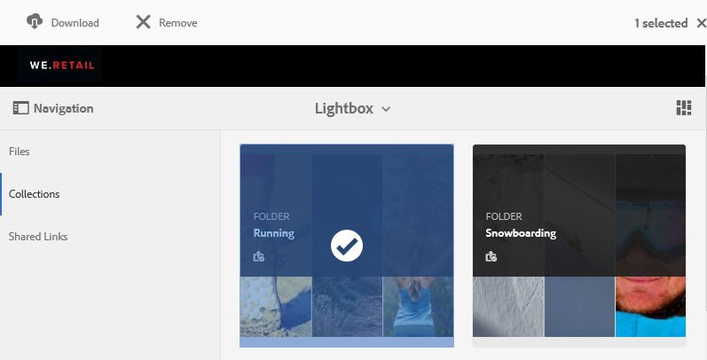

# De lichtbakverzameling beheren {#manage-the-lightbox-collection}

**[!UICONTROL Lightbox]** is een speciaal type verzameling dat eenvoudig toegang biedt tot elementen. Elke gebruiker heeft een exclusieve **[!UICONTROL Lightbox]** die automatisch wordt gemaakt wanneer hij of zij zich voor het eerst bij Brand Portal aanmeldt. De **[!UICONTROL Lightbox]** -verzameling kan niet worden verwijderd.

## Elementen toevoegen aan lichtbak {#add-assets-to-lightbox}

Ga als volgt te werk om elementen toe te voegen aan **[!UICONTROL Lightbox]** :

1. Navigeer naar de locatie van de elementen die u wilt toevoegen aan **[!UICONTROL Lightbox]** en selecteer de elementen.

   

1. Klik op de werkbalk boven in het scherm op het pictogram Toevoegen aan verzameling.

   

1. Op de pagina **[!UICONTROL Add To Collection]** is de verzameling **[!UICONTROL Lightbox]** standaard geselecteerd.

   Klik op **[!UICONTROL Add]**. De geselecteerde elementen worden toegevoegd aan de **[!UICONTROL Lightbox]** .

   

1. Als u de elementen wilt bekijken die aan **[!UICONTROL Lightbox]** zijn toegevoegd, klikt u op **[!UICONTROL Collections]** in de linkertrack en vervolgens op de verzameling **[!UICONTROL Lightbox]** .

   

   De elementen die aan **[!UICONTROL Lightbox]** zijn toegevoegd, worden weergegeven op de pagina **[!UICONTROL Lightbox]** .

   

## Elementen verwijderen uit lichtbak {#remove-assets-from-lightbox}

1. Als u de elementen in [!UICONTROL Lightbox] wilt bekijken, klikt u op **[!UICONTROL Collections]** in het linkerspoor en klikt u op de verzameling [!UICONTROL Lightbox] .

   

1. Selecteer de map die u uit de verzameling wilt verwijderen en klik op **[!UICONTROL Remove]** op de werkbalk boven in de verzameling.

   

1. Klik in het waarschuwingsbericht op **[!UICONTROL Remove]** om het verwijderen te bevestigen.

De map wordt verwijderd uit de **[!UICONTROL Lightbox]** -verzameling.
