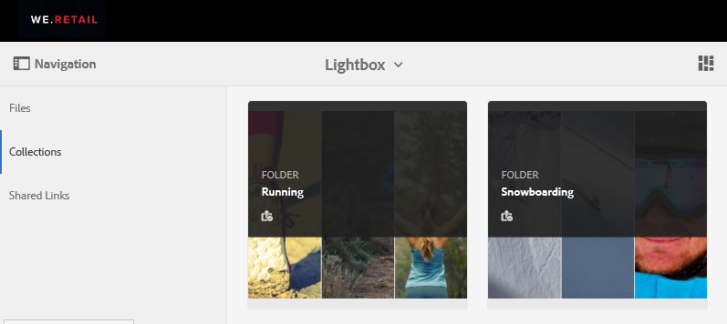

# De lichtbakverzameling beheren {#manage-the-lightbox-collection}

**[!UICONTROL Lightbox]** is een speciaal type verzameling dat eenvoudig toegang biedt tot activa. Elke gebruiker heeft een exclusieve **[!UICONTROL Lightbox]** die automatisch wordt gemaakt wanneer zij zich voor het eerst aanmelden bij Brand Portal. De **[!UICONTROL Lightbox]** verzameling kan niet worden verwijderd.

## Elementen toevoegen aan lichtbak {#add-assets-to-lightbox}

Elementen toevoegen aan **[!UICONTROL Lightbox]** Ga als volgt te werk:

1. Navigeer naar de locatie van de elementen die u wilt toevoegen **[!UICONTROL Lightbox]** en selecteert u de elementen.

   

1. Klik op de werkbalk boven in het scherm op het pictogram Toevoegen aan verzameling.

   

1. Op de **[!UICONTROL Add To Collection]** pagina, de **[!UICONTROL Lightbox]** verzameling is standaard geselecteerd.

   Klik op **[!UICONTROL Add]**. De geselecteerde elementen worden toegevoegd aan de **[!UICONTROL Lightbox]**.

   

1. De aan **[!UICONTROL Lightbox]**, klikt u op **[!UICONTROL Collections]** op de linkerspoorstaaf, en klik dan **[!UICONTROL Lightbox]** verzameling.

   

   De elementen die zijn toegevoegd aan **[!UICONTROL Lightbox]** in het dialoogvenster **[!UICONTROL Lightbox]** pagina.

   

## Elementen verwijderen uit lichtbak {#remove-assets-from-lightbox}

1. De elementen in [!UICONTROL Lightbox], klikt u op **[!UICONTROL Collections]** op de linkerspoorstaaf, dan klik [!UICONTROL Lightbox] verzameling.

   

1. Selecteer de map die u uit de verzameling wilt verwijderen en klik vervolgens op **[!UICONTROL Remove]** van de werkbalk bovenaan.

   

1. Klik in het waarschuwingsbericht op **[!UICONTROL Remove]** om de verwijdering te bevestigen.

De map wordt verwijderd uit de map **[!UICONTROL Lightbox]** verzameling.
