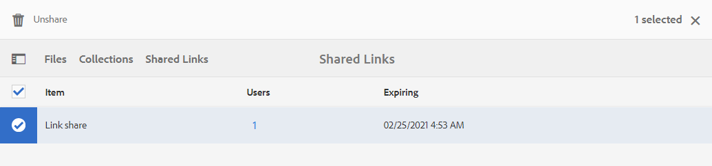

# Elementen delen als een koppeling {#share-assets-as-a-link}

Adobe Experience Manager Assets Brand Portal-beheerders kunnen koppelingen van meerdere middelen delen met geautoriseerde interne gebruikers en externe entiteiten, waaronder partners en leveranciers. Editors kunnen alleen de elementen weergeven en delen die met hen worden gedeeld.

Het delen van elementen via een koppeling is een handige manier om deze beschikbaar te maken voor externe partijen, aangezien de ontvangers zich niet hoeven aan te melden bij Brand Portal om toegang te krijgen tot de middelen.

<!-- Link sharing access is restricted to editors and administrators. 
-->

Zie [Gebruikers, groepen en gebruikersrollen beheren](../using/brand-portal-adding-users.md#manage-user-roles) voor meer informatie.

>[!NOTE]
>
>Maximaal 5 GB gedownload via de functie voor delen van koppelingen in Brand Portal.

Hieronder vindt u de stappen voor het delen van elementen als een koppeling:

1. Meld u aan bij uw Brand Portal-huurder. Standaard wordt de weergave **[!UICONTROL Files]** geopend, die alle gepubliceerde elementen en mappen bevat.

1. Selecteer de elementen of mappen die u wilt delen of navigeer naar de weergave **[!UICONTROL Collections]** om de gemaakte verzamelingen te delen.

   

1. Klik op het pictogram **[!UICONTROL Share Link]** op de werkbalk boven in het scherm.

   Het dialoogvenster **[!UICONTROL Link Sharing]** wordt weergegeven.

   

   * Typ in het vak E-mailadres de e-mailadres van de gebruiker met wie u de koppeling wilt delen. U kunt de koppeling delen met meerdere gebruikers. Als de gebruiker lid is van uw organisatie, selecteert u de desbetreffende e-mailadres in de suggesties in de vervolgkeuzelijst. Als de gebruiker extern is, typt u de volledige e-mailid en drukt u op **[!UICONTROL Enter]**; e-mailadres wordt toegevoegd aan de lijst met gebruikers.

      

   * Typ in het tekstvak **[!UICONTROL Subject]** een onderwerp voor het element dat u wilt delen.
   * Typ desgewenst een bericht in het tekstvak **[!UICONTROL Message]**.
   * Gebruik in het veld **[!UICONTROL Expiration]** de datumkiezer om een vervaldatum en -tijd voor de koppeling op te geven. De vervaldatum is standaard ingesteld op 7 dagen vanaf de datum waarop u de koppeling deelt.
   * Schakel het selectievakje **[!UICONTROL Allow downlod of original file]** in zodat de ontvangers de oorspronkelijke vertoning kunnen downloaden.

   De elementen die via de koppeling worden gedeeld, verlopen na het overschrijden van de datum en tijd die in het veld **[!UICONTROL Expiration]** zijn opgegeven. Zie [Digitale rechten van elementen beheren](../using/manage-digital-rights-of-assets.md#asset-expiration) voor informatie over het gedrag van verlopen elementen en wijzigingen in de toegestane activiteiten op basis van gebruikersrollen in Brand Portal.

   >[!NOTE]
   >
   >De standaardvervaltijd voor de verbinding is 7 dagen. De koppeling moet naar de gebruikers worden gemaild via het dialoogvenster **[!UICONTROL Link Sharing]**. Kopieer en deel de koppeling niet afzonderlijk.

1. Klik op **[!UICONTROL Share]**. Een bericht bevestigt dat de koppeling wordt gedeeld met de gebruikers. Gebruikers ontvangen een e-mail met de gedeelde koppeling.

   

   >[!NOTE]
   >
   >Beheerders kunnen het e-mailbericht aanpassen. Dit omvat het aanpassen van het logo, de beschrijving en de voettekst met de functie [Branding](../using/brand-portal-branding.md).

## Elementen downloaden van gedeelde koppelingen {#download-assets-from-shared-links}

Klik op de koppeling in de e-mail om het gedeelde element te openen. De pagina AEM delen van koppeling wordt geopend.

De gedeelde elementen downloaden:

1. Klik op de elementen of mappen en klik vervolgens op het pictogram **[!UICONTROL Download]** op de werkbalk.

   

   >[!NOTE]
   >
   >Op dit moment kunt u, afhankelijk van de bestandsindeling, alleen voor bepaalde elementen een voorvertoning en miniatuur genereren. Zie [Ondersteuning van voorvertoningen en miniaturen voor asset-indelingen](#preview-thumbnail-support) voor meer informatie over de ondersteunde bestandsindelingen.

1. Het dialoogvenster **[!UICONTROL Download]** wordt weergegeven.

   

1. Standaard is de instelling **[!UICONTROL Fast Download]** ingeschakeld in **[!UICONTROL Download Settings]**. Daarom lijkt er een bevestigingsvenster te zijn waarin het downloaden met IBM Aspera Connect wordt voortgezet.

   Als u **[!UICONTROL Fast Download]** wilt blijven gebruiken, klikt u op **[!UICONTROL Allow]**.

   Alle geselecteerde uitvoeringen worden gedownload in een ZIP-map met een aparte map voor elk element.

   >[!NOTE]
   >
   >Voor elk element wordt een aparte map gemaakt terwijl de elementen worden gedownload van een gedeelde koppeling.
   >
   >Als een map, verzameling of meer dan 20 elementen zijn geselecteerd om te worden gedownload, wordt het dialoogvenster **[!UICONTROL Download]** overgeslagen en worden alle elementenuitvoeringen die voor de gebruiker toegankelijk zijn, met uitzondering van de dynamische uitvoeringen, gedownload in een ZIP-map met een aparte map voor elk element.

   >[!NOTE]
   >
   >Oorspronkelijke uitvoeringen worden niet gedownload via de gedeelde koppeling als de gebruiker die de elementen als een koppeling heeft gedeeld, niet [gemachtigd is door de beheerder om toegang te hebben tot de oorspronkelijke uitvoeringen](../using/brand-portal-adding-users.md#manage-group-roles-and-privileges).

>[!NOTE]
>
>Brand Portal beperkt het downloaden van elementen die groter zijn dan 5 GB per bestandsgrootte.

<!--
1. The **[!UICONTROL Download]** dialog box appears.

   

    * To speed up the download of asset files shared as the link, select **[!UICONTROL Enable download acceleration]** option and [follow the wizard](../using/accelerated-download.md#download-workflow-using-file-accelerator). To know more about the fast download of assets on Brand Portal refer [Guide to accelerate downloads from Brand Portal](../using/accelerated-download.md).
    
1. To download the renditions of assets in addition to the assets from the shared link, select **[!UICONTROL Rendition(s)]** option. When you do so, **[!UICONTROL Exclude System Renditions]** option appears that is selected by default. This prevents the download of out-of-the-box renditions along with approved assets or their custom renditions.

   However, to allow auto-generated renditions to download along with custom renditions, deselect the **[!UICONTROL Exclude System Renditions]** option.

   >[!NOTE]
   >
   >Original renditions are not downloaded using the shared link if the user who shared the assets as a link is not [authorized by the administrator to have access to the original renditions](../using/brand-portal-adding-users.md#manage-group-roles-and-privileges).

   

1. Click **[!UICONTROL Download]**. The assets (and renditions if selected) are downloaded as a ZIP file to your local folder. However, no zip file is created if a single asset is downloaded without any of the renditions, thereby ensuring speedy download.

>[!NOTE]
>
>Brand Portal restricts downloading assets larger than 5GB per file size.
-->

## Ondersteuning voor voorvertoningen en miniaturen van asset-indelingen {#preview-thumbnail-support}

De volgende matrix geeft een overzicht van de indelingen voor elementen waarvoor Brand Portal miniaturen en voorvertoningen ondersteunt:

| Elementformaat | Ondersteuning voor miniaturen | Ondersteuning voor voorvertoningen |
|--------------|-------------------|-----------------|
| PNG | ✓ | ✓ |
| GIF | ✓ | ✓ |
| TIFF | ✓ | ✕ |
| JPEG | ✓ | ✓ |
| BMP | ✓ | ✕ |
| PNM* | NA | NA |
| PGM* | NA | NA |
| PBM* | NA | NA |
| PPM* | NA | NA |
| PSD | ✓ | ✕ |
| EPS | NA | ✕ |
| DNG | ✓ | ✕ |
| PICT | ✓ | ✕ |
| PSB* | ✓ | ✕ |
| JPG | ✓ | ✓ |
| AI | ✓ | ✕ |
| DOC | ✕ | ✕ |
| DOCX | ✕ | ✕ |
| ODT* | ✕ | ✕ |
| PDF | ✓ | ✕ |
| HTML | ✕ | ✕ |
| RTF | ✕ | ✕ |
| TXT | ✓ | ✕ |
| XLS | ✕ | ✕ |
| XLSX | ✕ | ✕ |
| ODS | ✕ | ✕ |
| PPT | ✓ | ✕ |
| PPTX | ✕ | ✕ |
| ODP | ✕ | ✕ |
| INDD | ✓ | ✕ |
| PS | ✕ | ✕ |
| QXP | ✕ | ✕ |
| EPUB | ✓ | ✕ |
| AAC | ✕ | ✕ |
| MIDI | ✕ | ✕ |
| 3GP | ✕ | ✕ |
| MP3 | ✕ | ✕ |
| MP4 | ✕ | ✕ |
| OGA | ✕ | ✕ |
| OGG | ✕ | ✕ |
| RA | ✕ | ✕ |
| WAV | ✕ | ✕ |
| WMA | ✕ | ✕ |
| DVI | ✕ | ✕ |
| FLV | ✕ | ✕ |
| M4V | ✕ | ✕ |
| MPG | ✕ | ✕ |
| OGV | ✕ | ✕ |
| MOV | ✕ | ✕ |
| WMV | ✕ | ✕ |
| SWF | ✕ | ✕ |
| TGZ | NA | ✕ |
| JAR | ✓ | ✕ |
| RAR | NA | ✕ |
| TAR | NA | ✕ |
| ZIP | ✓ | ✕ |

In de volgende legenda worden de symbolen uitgelegd die in de matrix worden gebruikt:

| Symbool | Betekenis |
|---|---|
| ✓ | Deze bestandsindeling ondersteunt deze functie |
| ✕ | Deze functie wordt niet ondersteund door deze bestandsindeling |
| NA | Deze functie is niet van toepassing op deze bestandsindeling |
| * | Voor deze functie is aanvullende ondersteuning voor deze bestandsindeling vereist op AEM auteurinstantie, maar niet op Brand Portal nadat elementen naar Brand Portal zijn gepubliceerd |

## Delen van elementen die worden gedeeld als een koppeling {#unshare-assets-shared-as-a-link} opheffen

Ga als volgt te werk als u eerder gedeelde elementen als een koppeling wilt opheffen:

1. Als u zich aanmeldt bij Brand Portal, wordt de weergave **[!UICONTROL File]** standaard geopend. Navigeer naar de weergave **[!UICONTROL Shared Links]** om de elementen weer te geven die u als koppelingen hebt gedeeld.

1. Controleer de koppelingen die u hebt gedeeld vanuit de weergegeven lijst.

   

1. Als u een koppeling uit de lijst wilt verwijderen, selecteert u de koppeling en klikt u op het pictogram **[!UICONTROL Unshare]** op de werkbalk boven in het venster.

   

   >[!NOTE]
   >
   >De weergave van gedeelde koppelingen is gebruikersspecifiek. Deze eigenschap toont niet alle verbindingen die door alle gebruikers van een huurder worden gedeeld.

1. Klik in het waarschuwingsbericht op **[!UICONTROL Continue]** om het delen te bevestigen. De vermelding voor de koppeling wordt verwijderd uit de lijst met gedeelde koppelingen.
