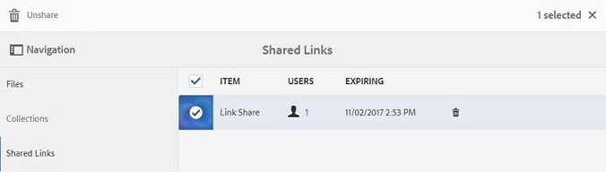

# Elementen delen als koppeling {#share-assets-as-a-link}

Beheerders van AEM Assets Brand Portal kunnen koppelingen van meerdere middelen delen met geautoriseerde interne gebruikers en externe entiteiten, waaronder partners en leveranciers. Editors kunnen alleen de elementen weergeven en delen die met hen worden gedeeld.

Het delen van elementen via een koppeling is een handige manier om deze beschikbaar te maken voor externe partijen, aangezien de ontvangers zich niet hoeven aan te melden bij Brand Portal voor toegang tot de middelen.

De verbinding die toegang deelt is beperkt tot editors en beheerders.

Voor meer informatie, zie het [Leiden gebruikers, groepen, en gebruikersrollen](../using/brand-portal-adding-users.md#manage-user-roles).

>[!NOTE]
>
>Maximaal 5 GB ZIP-download is toegestaan met de functie voor delen van koppelingen op Brand Portal.

Hieronder vindt u de stappen voor het delen van elementen als een koppeling:

1. Klik op het bedekkingspictogram aan de linkerkant en kies **[!UICONTROL Navigation]**.

   

1. Klik vanuit de zijbalk links op deze knop **[!UICONTROL Files]** om mappen of afbeeldingen te delen. Als u verzamelingen wilt delen, klikt u op **[!UICONTROL Collections]**.

   

1. Selecteer de mappen of verzamelingen die u als koppeling wilt delen.

   

1. Klik op het **[!UICONTROL Share Link]** pictogram op de werkbalk boven in het scherm.

   The **[!UICONTROL Link Sharing]** dialog box appears.

   

   >[!NOTE]
   >
   >In het **[!UICONTROL Share Link]** veld wordt een automatisch gemaakte elementkoppeling weergegeven. De standaardvervaltijd voor deze koppeling is 7 dagen. U kunt de koppeling kopiëren en afzonderlijk met gebruikers delen of deze delen vanuit het **[!UICONTROL Link Sharing]** dialoogvenster.

1. Typ in het vak E-mailadres de e-mailadres van de gebruiker met wie u de koppeling wilt delen. U kunt de koppeling delen met meerdere gebruikers.

   Als de gebruiker lid is van uw organisatie, selecteert u de desbetreffende e-mailadres in de suggesties in de vervolgkeuzelijst. Als de gebruiker extern is, typt u de volledige e-mailid en drukt u op **[!UICONTROL Enter]**; e-mailadres wordt toegevoegd aan de lijst met gebruikers.

   

1. Typ in het **[!UICONTROL Subject]** vak een onderwerp voor het element dat u wilt delen.
1. Typ indien nodig een bericht in het **[!UICONTROL Message]** vak.
1. Gebruik in het **[!UICONTROL Expiration]** veld de datumkiezer om een vervaldatum en -tijd voor de koppeling op te geven. De vervaldatum is standaard ingesteld op 7 dagen vanaf de datum waarop u de koppeling deelt.

   De elementen die via de koppeling worden gedeeld, verlopen na het overschrijden van de datum en tijd die in het **[!UICONTROL Expiration]** veld zijn opgegeven. Zie Digitale rechten van middelen beheren voor informatie over het gedrag van verlopen middelen en wijzigingen in de toegestane activiteiten op basis van gebruikersrollen in Brand Portal.

1. Klik op **[!UICONTROL Share]**. Een bericht bevestigt dat de koppeling wordt gedeeld met de gebruikers. Gebruikers ontvangen een e-mail met de koppeling.

   

   >[!NOTE]
   >
   >Beheerders kunnen het e-mailbericht aanpassen. Dit omvat het aanpassen van het logo, de beschrijving en de voettekst met de functie [Branding](../using/brand-portal-branding.md) .

## Elementen downloaden van gedeelde koppelingen {#download-assets-from-shared-links}

Klik op de koppeling in de e-mail om het gedeelde element weer te geven. De pagina AEM delen van koppeling wordt geopend.

De gedeelde elementen downloaden:

1. Klik op de elementen en klik vervolgens op het **[!UICONTROL Download]** pictogram op de werkbalk.

   

   >[!NOTE]
   >
   >Op dit moment kunt u, afhankelijk van de bestandsindeling, alleen voor bepaalde elementen een voorvertoning en miniatuur genereren. Zie [Voorbeeld- en miniatuurondersteuning voor de indelingen](#preview-thumbnail-support)Elementen voor meer informatie over de ondersteunde bestandsindelingen.

   >[!NOTE]
   >
   >Als de elementen die u downloadt ook elementen met licentie bevatten, wordt u doorgestuurd naar de **[!UICONTROL Copyright Management]** pagina. Selecteer op deze pagina de gelicentieerde elementen, klik op **[!UICONTROL Agree]** en klik op **[!UICONTROL Download]**. Als u het niet eens bent, worden alleen de middelen zonder licentie gedownload.\
   >Aan licentiegerelateerde elementen is een [licentieovereenkomst gekoppeld](https://helpx.adobe.com/experience-manager/6-5/assets/using/drm.html#DigitalRightsManagementinAssets) , die wordt uitgevoerd door de eigenschap  metadata van het element in te stellen in [!DNL AEM Assets].

   

   The **[!UICONTROL Download]** dialog box appears.

   

   * Als u het downloaden wilt versnellen van elementbestanden die worden gedeeld als de koppeling, selecteert u de **[!UICONTROL Enable download acceleration]** optie en [volgt u de wizard](../using/accelerated-download.md#download-workflow-using-file-accelerator). Raadpleeg [Guide voor informatie over het snel downloaden van bedrijfsmiddelen op Brand Portal om downloads vanaf Brand Portal](../using/accelerated-download.md)te versnellen.

1. Selecteer **[!UICONTROL Rendition(s)]** optie als u de vertoningen van elementen naast de elementen van de gedeelde koppeling wilt downloaden. Wanneer u dit doet, verschijnt de **[!UICONTROL Exclude System Renditions]** optie die door gebrek wordt geselecteerd. Zo voorkomt u dat uitvoeringen buiten de box samen met goedgekeurde elementen of aangepaste uitvoeringen worden gedownload.

   Als u echter wilt dat automatisch gegenereerde uitvoeringen samen met aangepaste uitvoeringen kunnen worden gedownload, schakelt u de **[!UICONTROL Exclude System Renditions]** optie uit.

   >[!NOTE]
   >
   >Oorspronkelijke uitvoeringen worden niet gedownload via de gedeelde koppeling als de gebruiker die de elementen als een koppeling heeft gedeeld, van de beheerder geen [toestemming heeft gekregen om toegang te krijgen tot de oorspronkelijke uitvoeringen](../using/brand-portal-adding-users.md#manage-group-roles-and-privileges).

   

1. Tik of klik op **[!UICONTROL Download]**. De elementen (en de vertoningen als geselecteerd) worden gedownload als dossier van het PIT aan uw lokale omslag. Er wordt echter geen .zip-bestand gemaakt als één element zonder de uitvoeringen wordt gedownload, zodat het snel kan worden gedownload.

>[!NOTE]
>
>Brand Portal beperkt het downloaden van elementen die groter zijn dan 5 GB per bestandsgrootte.

## Ondersteuning voor voorvertoningen en miniaturen van asset-indelingen {#preview-thumbnail-support}

De volgende matrix geeft een overzicht van de indelingen voor elementen waarvoor Brand Portal miniatuur en voorvertoning ondersteunt:

| Elementformaat | Ondersteuning voor miniaturen | Ondersteuning voor voorvertoningen |
|--------------|-------------------|-----------------|
| PNG | ✓ | ✓ |
| GIF | ✓ | ✓ |
| TIFF | ✓ | ✕ |
| JPEG | ✓ | ✓ |
| BMP | ✓ | ✕ |
| PNM* | NA | NA |
| PGM* | NA | NA |
| PBM* | NA | NA |
| PPM* | NA | NA |
| PSD | ✓ | ✕ |
| EPS | NA | ✕ |
| DNG | ✓ | ✕ |
| PICT | ✓ | ✕ |
| PSB* | ✓ | ✕ |
| JPG | ✓ | ✓ |
| AI | ✓ | ✕ |
| DOC | ✕ | ✕ |
| DOCX | ✕ | ✕ |
| ODT* | ✕ | ✕ |
| PDF | ✓ | ✕ |
| HTML | ✕ | ✕ |
| RTF | ✕ | ✕ |
| TXT | ✓ | ✕ |
| XLS | ✕ | ✕ |
| XLSX | ✕ | ✕ |
| ODS | ✕ | ✕ |
| PPT | ✓ | ✕ |
| PPTX | ✕ | ✕ |
| ODP | ✕ | ✕ |
| INDD | ✓ | ✕ |
| PS | ✕ | ✕ |
| QXP | ✕ | ✕ |
| EPUB | ✓ | ✕ |
| AAC | ✕ | ✕ |
| MIDI | ✕ | ✕ |
| 3GP | ✕ | ✕ |
| MP3 | ✕ | ✕ |
| MP4 | ✕ | ✕ |
| OGA | ✕ | ✕ |
| OGG | ✕ | ✕ |
| RA | ✕ | ✕ |
| WAV | ✕ | ✕ |
| WMA | ✕ | ✕ |
| DVI | ✕ | ✕ |
| FLV | ✕ | ✕ |
| M4V | ✕ | ✕ |
| MPG | ✕ | ✕ |
| OGV | ✕ | ✕ |
| MOV | ✕ | ✕ |
| WMV | ✕ | ✕ |
| SWF | ✕ | ✕ |
| TGZ | NA | ✕ |
| JAR | ✓ | ✕ |
| RAR | NA | ✕ |
| TAR | NA | ✕ |
| ZIP | ✓ | ✕ |

In de volgende legenda worden de symbolen uitgelegd die in de matrix worden gebruikt:

| Symbool | Betekenis |
|---|---|
| ✓ | Deze bestandsindeling ondersteunt deze functie |
| ✕ | Deze functie wordt niet ondersteund door deze bestandsindeling |
| NA | Deze functie is niet van toepassing op deze bestandsindeling |
| * | Voor deze functie is add-on ondersteuning voor deze bestandsindeling vereist op AEM auteurinstantie, maar niet op Brand Portal nadat de middelen naar Brand Portal zijn gepubliceerd |

## Delen van elementen die worden gedeeld als koppeling opheffen {#unshare-assets-shared-as-a-link}

Ga als volgt te werk als u eerder gedeelde elementen als een koppeling wilt opheffen:

1. Als u de elementen die u als koppelingen hebt gedeeld, wilt weergeven, klikt u op het bedekkingspictogram aan de linkerkant en kiest u **[!UICONTROL Navigation]**.

   

1. From the siderail, click **[!UICONTROL Shared Links]**.

   

1. Controleer de koppelingen die u hebt gedeeld vanuit de weergegeven lijst.
1. Als u een koppeling niet meer wilt delen in de lijst, selecteert u de koppeling en klikt u op het binpictogram naast de koppelingsingang of op het **[!UICONTROL Unshare]** pictogram op de werkbalk bovenaan.

   

   >[!NOTE]
   >
   >De weergave van gedeelde koppelingen is gebruikersspecifiek. Deze eigenschap toont niet alle verbindingen die door alle gebruikers van een huurder worden gedeeld.

1. Klik in het waarschuwingsbericht om te bevestigen dat u het document niet deelt. **[!UICONTROL Continue]** De vermelding voor de koppeling wordt verwijderd uit de lijst met gedeelde koppelingen.
