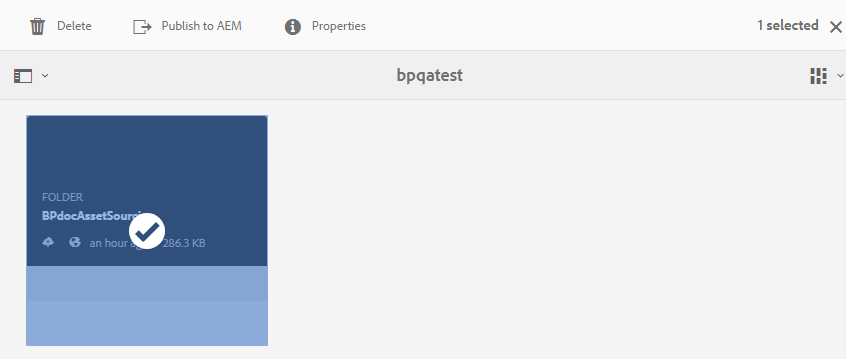

# Map met bijdragen publiceren naar AEM Assets {#publish-contribution-folder-to-aem}

Gebruikers van het Brand Portal kunnen de map met bijdragen publiceren naar AEM Assets zonder toegang tot de instantie van AEM-auteurs te hoeven hebben.

Controleer of u de [elementvereisten](brand-portal-download-asset-requirements.md) hebt doorlopen en upload de nieuw gemaakte elementen naar de map **NEW** in de map Contribution. Zie Elementen [uploaden naar de map](brand-portal-upload-assets-to-contribution-folder.md)Contributie.

**Map met bijdragen publiceren:**

1. Meld u aan bij uw Brand Portal-exemplaar.
1. Selecteer de bijdragemap in het dashboard.
1. Klik op **[!UICONTROL Publish to AEM]**

   .

   

Er wordt een e-mail-/pulsmelding verzonden naar de gebruiker en beheerders van het Brand Portal in verschillende stadia van de publicatieworkflow:
1. **In wachtrij** - er wordt een melding verzonden naar de gebruikers- en merkportalbeheerders van het Brand Portal wanneer een publicatieworkflow wordt geactiveerd in het Brand Portal.

1. **Voltooid** - Er wordt een melding verzonden naar de gebruikers en beheerders van het Brand Portal wanneer de map met bijdragen met succes is gepubliceerd naar AEM Assets.

