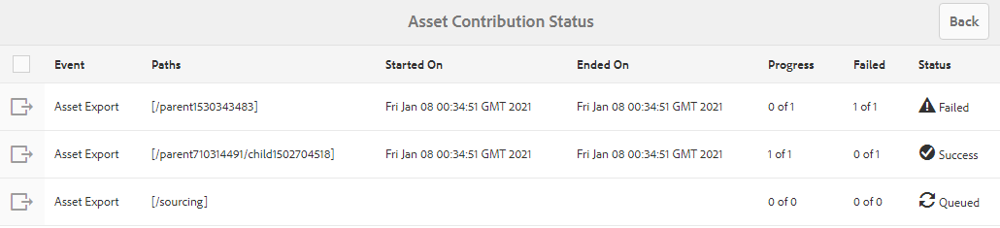

# Bijdragemap publiceren naar AEM Assets {#publish-contribution-folder-to-aem}

Gebruikers van het Brand Portal kunnen de map met bijdragen publiceren naar AEM Assets zonder dat ze toegang hoeven te hebben tot de AEM auteur.

Zorg ervoor dat u de [elementvereisten](brand-portal-download-asset-requirements.md) hebt doorlopen en uploadt u de nieuw gemaakte elementen in de map **NEW** in de bijdragemap. Zie [Elementen uploaden naar bijdragemap](brand-portal-upload-assets-to-contribution-folder.md).

**Map met bijdragen publiceren:**

1. Meld u aan bij uw Brand Portal-exemplaar.

1. Selecteer de bijdragemap in het dashboard voor het Brand Portal.
1. Klik op **[!UICONTROL Publish to AEM]**.

   

   

Er wordt een e-mail-/pulsmelding verzonden naar de gebruiker en beheerders van het Brand Portal in verschillende stadia van de publicatieworkflow:
1. **In wachtrij**  - Er wordt een melding verzonden naar de gebruikers- en merkportalbeheerders van het Brand Portal wanneer een publicatieworkflow wordt geactiveerd in het Brand Portal.

1. **Voltooid**  - Er wordt een melding verzonden naar de gebruikers en beheerders van het Brand Portal wanneer de map met bijdragen met succes is gepubliceerd naar AEM Assets.

**Status van taak publiceren**

Er zijn twee rapporten die de beheerders kunnen gebruiken om de status van de omslagen van de activabijdrage te bekijken die van het Portaal van het Merk aan AEM Assets worden gepubliceerd.

* Navigeer in Brand Portal naar **[!UICONTROL Tools]** > **[!UICONTROL Asset Contribution Status]**. Dit rapport geeft de status van alle publicatietaken in verschillende stadia van de publicatieworkflow weer.

   

* Navigeer in AEM Assets-auteurinstantie naar **[!UICONTROL Tools]** > **[!UICONTROL Jobs]**. Dit rapport geeft de uiteindelijke status (Voltooid of Fout) weer van alle publicatietaken.

   

