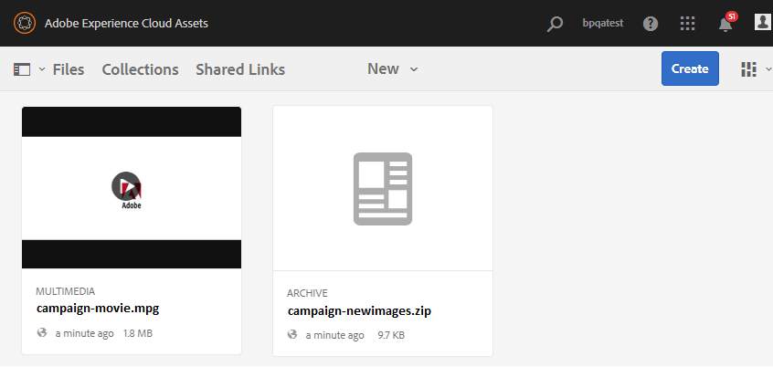
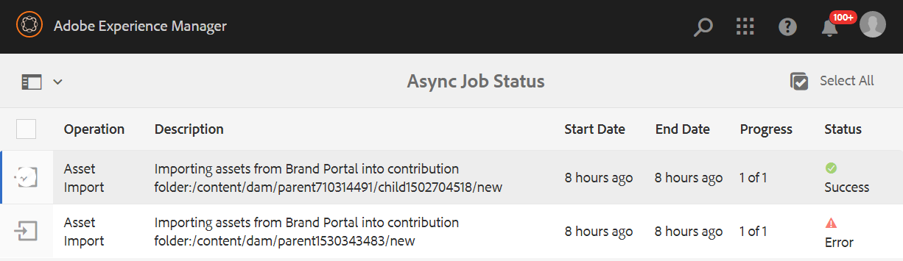

# Map met bijdragen publiceren naar Experience Manager-elementen {#using-asset-souring-in-bp}

Brand Portal-gebruikers met de juiste machtigingen kunnen meerdere elementen of mappen met meerdere elementen uploaden naar de map met bijdragen. Brand Portal-gebruikers kunnen echter alleen elementen uploaden naar de map **NEW**. De map **SHARED** is bedoeld voor de distributie van basislijnelementen (referentie-inhoud) die door Brand Portal-gebruikers kunnen worden gebruikt bij het maken van nieuwe elementen voor een bijdrage.

Brand Portal-gebruikers die toegang hebben tot de map Contribution, kunnen de volgende activiteiten uitvoeren:

* [Elementvereisten downloaden](#download-asset-requirements)
* [Nieuwe elementen uploaden naar de map voor bijdragen](#uplad-new-assets-to-contribution-folder)
* [Map met bijdragen publiceren naar Experience Manager-elementen](#publish-contribution-folder-to-aem)

## Elementvereisten downloaden {#download-asset-requirements}

Brand Portal-gebruikers ontvangen automatisch e-mail-/pulsmeldingen wanneer een bijdragemap wordt gedeeld door de gebruiker van de Experience Manager Assets. Zo kunnen ze het korte document (met de vereiste elementen) downloaden en de basiselementen (referentie-inhoud) downloaden van de map **SHARED** om te controleren of ze de elementvereisten begrijpen.

Brand Portal-gebruikers voeren de volgende activiteiten uit om de vereisten voor middelen te downloaden:

* **Download overzicht**: Download de samenvatting (document met middelenvereisten) die is toegevoegd aan de bijdragemap en die informatie bevat over elementen zoals het type middelen, het doel, de ondersteunde indelingen, de maximale grootte van de middelen, enz.
* **Basiselementen** downloaden: Download de basislijnelementen die kunnen worden gebruikt om de vereiste typen elementen te begrijpen. Brand Portal-gebruikers kunnen deze middelen gebruiken als referentie om nieuwe middelen te maken voor hun bijdrage.

Het Brand Portal-dashboard weerspiegelt alle bestaande mappen die aan de Brand Portal-gebruiker zijn toegestaan, samen met de nieuw gedeelde bijdragemap. In dit voorbeeld heeft de Brand Portal-gebruiker alleen toegang tot de zojuist gemaakte map met bijdragen. Er wordt geen andere bestaande map gedeeld met de gebruiker.

**Elementvereisten downloaden:**

1. Meld u aan bij uw Brand Portal-exemplaar.
1. Selecteer de map met bijdragen in het Brand Portal-dashboard.
1. Klik op **[!UICONTROL Properties]**. Het venster van het Bezit dat de details van de bijdrageomslag bevat opent.

   

   

1. Klik op de optie **[!UICONTROL Download Brief]** om het document met elementvereisten te downloaden naar uw lokale computer.

   

1. Ga terug naar het Brand Portal-dashboard.
1. Klik om de bijdragemap te openen. U ziet twee submappen -**[!UICONTROL SHARED]** en **[!UICONTROL NEW]** in de bijdragemap. De map SHARED bevat alle basiselementen (referentie-inhoud) die door de beheerders worden gedeeld.
1. U kunt de map **[!UICONTROL SHARED]** downloaden met alle basislijnelementen op uw lokale computer.
U kunt ook de map **[!UICONTROL SHARED]** openen en op het pictogram **Download** klikken om afzonderlijke bestanden/mappen te downloaden.

   

   

Doorloop de samenvatting (document met vereisten voor elementen) en verwijs naar de basiselementen om inzicht te krijgen in de vereisten voor elementen. Nu kunt u nieuwe middelen maken voor de bijdrage en deze uploaden naar de map met bijdragen.

## Elementen uploaden naar de bijdragemap {#uplad-new-assets-to-contribution-folder}

Nadat de gebruikers van Brand Portal de elementvereisten hebben doorlopen, kunnen ze nieuwe middelen maken voor hun bijdrage en deze uploaden naar de map NEW in de bijdragemap.

>[!NOTE]
>
>De Brand Portal-gebruikers kunnen alleen elementen uploaden naar de map NEW.
>
>De maximale uploadlimiet voor elke Brand Portal-huurder is **10** GB, die cumulatief wordt toegepast op alle mappen voor de bijdrage.

>[!NOTE]
>
>U wordt aangeraden de uploadruimte vrij te geven nadat u de map met bijdragen hebt gepubliceerd naar Experience Manager Assets, zodat deze beschikbaar is voor de andere Brand Portal-gebruikers voor een bijdrage.
>
>Als het nodig is om de uploadlimiet van uw Brand Portal-huurder te verhogen tot meer dan **10** GB, neemt u contact op met de Klantenondersteuning om de vereiste op te geven.

**Nieuwe elementen uploaden:**

1. Meld u aan bij uw Brand Portal-exemplaar.
Het Brand Portal-dashboard weerspiegelt alle bestaande mappen die aan de Brand Portal-gebruiker zijn toegestaan, samen met de nieuw gedeelde bijdragemap.

1. Selecteer de map met de bijdrage en klik om deze te openen. De map voor bijdragen bevat twee submappen: **[!UICONTROL SHARED]** en **[!UICONTROL NEW]**.

1. Klik op de **[!UICONTROL NEW]** omslag.

   

1. Klik op **[!UICONTROL Create]** > **[!UICONTROL Files]** om afzonderlijke bestanden of mappen (.zip) met meerdere elementen te uploaden.

   

1. Blader naar elementen (bestanden of mappen) en upload deze naar de map **[!UICONTROL NEW]**.

   

Nadat u alle elementen of mappen naar de map NEW hebt geüpload, publiceert u de map met bijdragen naar Experience Manager Assets.

## Map met bijdragen publiceren naar Experience Manager-elementen {#publish-contribution-folder-to-aem}

Brand Portal-gebruikers kunnen de map met bijdragen publiceren naar Experience Manager Assets zonder toegang te hebben tot de instantie van de auteur van de Experience Manager.

Zorg ervoor dat u de elementvereisten hebt doorlopen en dat u de nieuw gemaakte middelen in de map **NEW** in de map met bijdragen hebt geüpload.

**Map met bijdragen publiceren:**

1. Meld u aan bij uw Brand Portal-exemplaar.

1. Selecteer de map met bijdragen in het Brand Portal-dashboard.
1. Klik op **[!UICONTROL Publish to AEM]**.

   

   

Er wordt een e-mail-/pulsmelding verzonden naar de Brand Portal-gebruiker en -beheerders in verschillende stadia van de publicatieworkflow:

1. **In wachtrij**  - Er wordt een melding verzonden naar de Brand Portal-gebruiker en Brand Portal-beheerders wanneer een publicatieworkflow in Brand Portal wordt geactiveerd.

1. **Voltooid**  - Er wordt een melding verzonden naar de Brand Portal-gebruiker en Brand Portal-beheerders wanneer de map met de bijdrage correct is gepubliceerd naar Experience Manager Assets.

Na publicatie van de zojuist gemaakte elementen naar Experience Manager Assets kunnen de Brand Portal-gebruikers deze verwijderen uit de map NEW. De Brand Portal-beheerder kan de elementen echter verwijderen uit zowel de map NEW als de map SHARED.

Zodra het doel om de bijdrageomslag tot stand te brengen wordt bereikt, kan de beheerder van Brand Portal de bijdrageomslag schrappen om uploadruimte voor andere gebruikers vrij te geven.

## Status van taak publiceren {#publishing-job-status}

Er zijn twee rapporten die de beheerders kunnen gebruiken om de status van de omslagen van de activabijdrage te bekijken die van Brand Portal aan de Activa van de Experience Manager worden gepubliceerd.

* Navigeer in Brand Portal naar **[!UICONTROL Tools]** > **[!UICONTROL Asset Contribution Status]**. Dit rapport geeft de status van alle publicatietaken in verschillende stadia van de publicatieworkflow weer.

   

* Navigeer in Elementen van de Experience Manager (op gebouw of beheerde dienst) aan **[!UICONTROL Assets]** > **[!UICONTROL Jobs]**. Dit rapport geeft de uiteindelijke status (Voltooid of Fout) weer van alle publicatietaken.

   

* Navigeer in Elementen van de Experience Manager als Cloud Service naar **[!UICONTROL Assets]** > **[!UICONTROL Jobs]**.

   U kunt ook rechtstreeks vanuit de globale navigatie naar **[!UICONTROL Jobs]** navigeren.

   Dit rapport geeft de uiteindelijke status (Succesvol of Fout) weer van alle publicatietaken, inclusief de import van activa van Brand Portal naar Experience Manager Assets als Cloud Service.

   

<!--
>[!NOTE]
>
>Currently, no report is generated in AEM Assets as a Cloud Service for the Asset Sourcing workflow. 
-->
