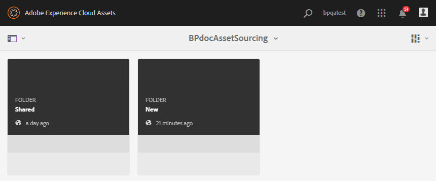

# Contribute-map in AEM Assets {#configure-contribution-folder} configureren

Voor gezamenlijke bronnen van middelen kunnen AEM gebruikers (beheerders en gebruikers zonder beheerdersrechten) nieuwe mappen van het type **Asset Contribution** maken, zodat de nieuwe map die u maakt, kan worden verzonden door gebruikers van Brand Portal.  Dit leidt automatisch tot een werkschema dat tot twee extra subomslagen, genoemd **SHARED** en **NEW**, binnen de pas gecreëerde **Bijdrage** omslag leidt.

AEM gebruiker bepaalt dan de activavereisten door een kort over de types van activa te uploaden die aan de bijdrageomslag, evenals een reeks basisactiva, aan **SHARED** omslag moeten worden toegevoegd om ervoor te zorgen de gebruikers van het Portaal van het Merk de informatie hebben zij nodig. De beheerder kan actieve gebruikers van het Brand Portal dan toegang tot de bijdrageomslag verlenen alvorens de pas gecreëerde omslag van de Bijdrage aan het Portaal van het Merk te publiceren.

In de volgende video wordt gedemonstreerd hoe u een Contribute-map in AEM Assets kunt configureren:

>[!VIDEO](https://video.tv.adobe.com/v/30547)

AEM gebruiker voert de volgende activiteiten uit terwijl het vormen van een bijdrageomslag:

* [Map voor bijdragen maken](#create-contribution-folder)
* [Elementvereisten uploaden en contribuanten toewijzen](#configure-contribution-folder-properties)
* [Basiselementen uploaden](#uplad-new-assets-to-contribution-folder)
* [Map met bijdragen van AEM Assets naar Brand Portal publiceren](#publish-contribution-folder-to-brand-portal)

## Premiemap {#create-contribution-folder} maken

AEM beheerders en gebruikers zonder beheerdersrechten die toestemming hebben om een nieuwe map te maken, kunt u een bijdragemap maken in AEM Assets.
Als u een map met bijdragen wilt maken, maakt u een nieuwe map van het type Asset Contribution. Zo zorgt u ervoor dat de nieuwe map die u maakt, kan worden verzonden door gebruikers van Brand Portal.  Dit leidt automatisch tot een werkschema dat tot twee extra subomslagen, genoemd GEDEELD en NIEUW, binnen de bijdrageomslag leidt.

>[!NOTE]
>
>U kunt meerdere mappen voor bijdragen maken in een map. Maak geen bijdragemap in een andere bijdragemap.

**Een bijdragemap maken:**
1. Meld u aan bij uw AEM Assets-exemplaar.

1. Ga naar **[!UICONTROL Assets]** > **[!UICONTROL Files]**. Alle bestaande mappen in de AEM Assets-opslagplaats worden weergegeven.

1. Klik **[!UICONTROL Create]** om een nieuwe omslag tot stand te brengen. **[!UICONTROL Create Folder]** wordt geopend.

1. Voer **[!UICONTROL Title]** en **[!UICONTROL Name]** van de map in en selecteer het selectievakje **[!UICONTROL Asset Contribution]**.
Het wordt aanbevolen kleine letters zonder ruimte te gebruiken om de map een naam te geven.

1. Klik op **[!UICONTROL Create]**. U kunt de bijdragemap weergeven in de AEM Assets-opslagplaats.

   >[!NOTE]
   >
   >Een gebruiker die geen beheerder is, kan een map voor middelenbijdragen maken en delen, maar kan deze niet wijzigen of verwijderen.

   

1. Klik om de bijdragemap te openen. Er worden twee submappen weergegeven.-**[!UICONTROL SHARED]** en **[!UICONTROL NEW]** worden automatisch gemaakt in de bijdragemap.

   

U kunt de eigenschappen van de bijdragemap ook configureren tijdens het maken van de bijdragemap.

## Eigenschappen voor bijdragemappen configureren {#configure-contribution-folder-properties}

AEM beheerder voert de volgende activiteiten uit terwijl het vormen van de eigenschappen van een bijdrageomslag.

* **Beschrijving** toevoegen: Geef een beschrijving op hoog niveau van de map met bijdragen.
* **Uploadinstructie**: Document voor vereist element uploaden dat informatie over elementen bevat.
* **Medewerkers** toevoegen: Voeg merkgebruikers toe om hen toegang tot de bijdrageomslag te verlenen.

Het vereiste van activa verwijst naar de details die door beheerders worden verstrekt om contribuanten (gebruikers van het Portaal van het Merk) te helpen de behoefte en de vereisten van de bijdrageomslag begrijpen. De beheerder uploadt een document met middelenvereisten dat een korte beschrijving bevat van het type activa dat aan de bijdrageomslag en activa verwante informatie, bijvoorbeeld, doel, type van beelden, maximumgrootte, enz. zou moeten worden toegevoegd.

**Eigenschappen voor bijdragemappen configureren:**

1. Meld u aan bij uw AEM Assets-exemplaar.

1. Navigeer naar **[!UICONTROL Assets > Files]** en zoek de map met de bijdrage.
1. Selecteer de map met bijdragen en klik op **[!UICONTROL Properties]** om het venster Eigenschappen van map te openen.

   

   

1. Navigeer naar het tabblad **[!UICONTROL Asset Contribution]**.
1. Voer op hoog niveau **[!UICONTROL Description]** van de bijdragemap in.
1. Klik **[!UICONTROL Upload Brief]** om van uw lokale machine te doorbladeren en **Document van de Vereiste van Activa te uploaden**.

   

1. Voeg in het veld **[!UICONTROL Add User]** de gebruikers van Brand Portal toe met wie u de map met bijdragen wilt delen. Deze gebruikers kunnen inhoud tot de bijdrageomslag toegang hebben en uploaden gebruikend de interface van het Portaal van het Merk.
1. Klik op **[!UICONTROL Save]**.

   

>[!NOTE]
>
>De zoekresultaten zijn gebaseerd op de gebruikerslijst van het Merkortaal die in AEM Assets is geconfigureerd. Zorg ervoor dat u de bijgewerkte gebruikerslijst voor Brand Portal hebt.

## Elementen uploaden naar bijdragemap {#uplad-new-assets-to-contribution-folder}

De gebruikers van het Merk Portal kunnen de activavereisten downloaden om de behoefte van bijdrage te begrijpen.
Vervolgens kunnen ze nieuwe middelen maken voor de bijdrage en deze uploaden naar de map NEW in de map met de bijdrage.

>[!NOTE]
>
>De gebruikers van de Poorten van het Merk kunnen activa slechts aan de NIEUWE omslag uploaden.
>
>De maximale uploadlimiet voor elke Brand Portal-huurder is **10** GB, die cumulatief wordt toegepast op alle bijdragemappen.

Nadat de nieuwe middelen naar AEM Assets zijn gepubliceerd, kunnen de gebruikers van het Brand Portal deze uit de map NEW verwijderen. De beheerder van het Brand Portal kan de elementen uit de map NEW en Shared verwijderen.

Zodra de doelstelling van het creëren van de bijdrageomslag wordt bereikt, kan de beheerder van het Portaal van het Merk de bijdrageomslag schrappen om uploadruimte voor andere gebruikers vrij te geven.

>[!NOTE]
>
>Aanbevolen wordt om de uploadruimte vrij te geven na publicatie van de map met bijdragen aan AEM Assets, zodat deze beschikbaar is voor de andere gebruikers van het Brand Portal.
>
>Als er een behoefte is om de uploadlimiet van uw Poorthuurder van het Merk voorbij **10** GB uit te breiden, contacteer de Steun van de Adobe die het vereiste specificeert.

**Nieuwe elementen uploaden:**

1. Meld u aan bij uw Brand Portal-exemplaar.
Het dashboard voor het Brand Portal geeft alle bestaande mappen weer die zijn toegestaan aan de gebruiker van het Brand Portal, samen met de nieuwe gedeelde bijdragemap.

1. Selecteer de map met de bijdrage en klik om deze te openen. De map voor bijdragen bevat twee submappen: **[!UICONTROL SHARED]** en **[!UICONTROL NEW]**.

1. Klik op de **[!UICONTROL NEW]** omslag.

   

1. Klik op **[!UICONTROL Create]** > **[!UICONTROL Files]** om afzonderlijke bestanden of mappen (.zip) met meerdere elementen te uploaden.

   

1. Blader naar elementen (bestanden of mappen) en upload deze naar de map **[!UICONTROL NEW]**.

   

Nadat u alle elementen of mappen naar de map NEW hebt geüpload, publiceert u de map met bijdragen naar AEM Assets.

## Map met bijdragen publiceren naar Brand-portal {#publish-contribution-folder-to-brand-portal}

Zodra de bijdragemap is geconfigureerd, kan AEM gebruiker (beheerder/niet-beheerder) de bijdragemap van AEM Assets naar Brand Portal publiceren. Gebruikers van het Brand Portal die toegang hebben tot de bijdragemap, ontvangen een e-mail-/pulsmelding wanneer de publicatieactie is voltooid.

**Map met bijdragen publiceren:**

1. Meld u aan bij uw AEM Assets-exemplaar.

1. Navigeer naar **[!UICONTROL Assets > Files]** en zoek de map met bijdragen waarin u wilt publiceren naar Brand Portal.
1. Selecteer de map met bijdragen en klik op **[!UICONTROL Quick Publish]** > **[!UICONTROL Publish to Brand Portal]**.

   

   U ontvangt een succesbericht zodra de map met bijdragen naar Brand Portal is gepubliceerd.

Er wordt een e-mail-/pulsmelding verzonden naar de gebruikers van het Brand Portal die zijn toegewezen aan de map met bijdragen. De gebruikers van het Merk Portal hebben toegang tot de bijdragemap en kunnen beginnen met hun bijdrage. Zie [Elementen uploaden naar de bijdragemap en publiceren naar AEM Assets](brand-portal-publish-contribution-folder-to-aem-assets.md).
