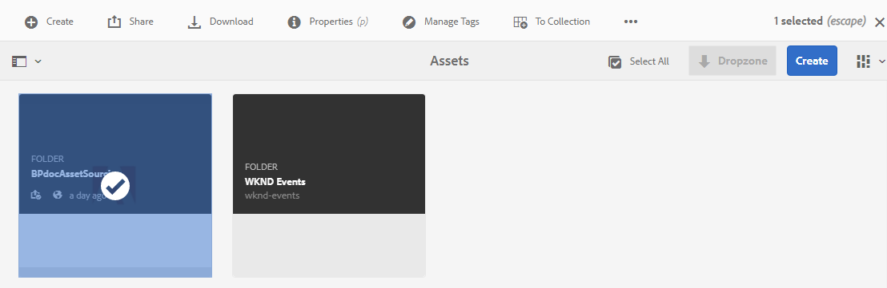

# Contribute-map in Experience Manager Assets configureren {#configure-contribution-folder}

Voor gezamenlijke bronnen van middelen kunnen Experience Manager Assets-gebruikers (beheerders en gebruikers zonder beheerdersrechten) nieuwe mappen van het type maken **Bijdrage activa**, zodat Brand Portal-gebruikers de nieuwe map kunnen verzenden.  Dit activeert automatisch een workflow die twee extra submappen maakt, genaamd **GEDEELD** en **NIEUW**, binnen de nieuwe **Bijdrage** map.

Experience Manager Assets-gebruiker definieert vervolgens de elementvereisten door een korte beschrijving te uploaden van de typen elementen die moeten worden toegevoegd aan de map Contribution en een set basiselementen naar de **GEDEELD** om ervoor te zorgen dat Brand Portal-gebruikers beschikken over de informatie die ze nodig hebben. De beheerder kan actieve Brand Portal-gebruikers vervolgens toegang tot de map met bijdragen geven voordat ze de nieuwe Contribute-map publiceren naar Brand Portal.

In de volgende video wordt gedemonstreerd hoe u een Contribute-map in Experience Manager Assets kunt configureren:

>[!VIDEO](https://video.tv.adobe.com/v/30547)

Experience Manager Assets-gebruiker voert de volgende activiteiten uit tijdens het configureren van een bijdragemap:

* [Map voor bijdragen maken](#create-contribution-folder)
* [Elementvereisten uploaden en contribuanten toewijzen](#configure-contribution-folder-properties)
* [Basiselementen uploaden](#uplad-new-assets-to-contribution-folder)
* [Bijdragemap van Experience Manager Assets naar Brand Portal publiceren](#publish-contribution-folder-to-brand-portal)

## Map voor bijdragen maken {#create-contribution-folder}

Experience Manager Assets-beheerders en gebruikers zonder beheerdersrechten die toestemming hebben om een nieuwe map te maken, kunnen een bijdragemap maken in Experience Manager Assets.
Als u een map met bijdragen wilt maken, maakt u een nieuwe map van het type Asset Contribution. Zo zorgt u ervoor dat de nieuwe map die u maakt, kan worden verzonden door Brand Portal-gebruikers.  Dit leidt automatisch tot een werkschema dat tot twee extra subomslagen, genoemd GEDEELD en NIEUW, binnen de bijdrageomslag leidt.

>[!NOTE]
>
>De beheerders kunnen veelvoudige omslagen van de middelenbijdrage binnen een omslag tot stand brengen.
>
>Een map met middelenbijdragen bevat de mappen NEW en SHARED voor de distributie en bijdrage van de elementen. Maak geen map met middelen, mappen of bijdragen in een bijdragemap.

U kunt de eigenschappen van de bijdragemap afzonderlijk configureren en de bijdragemap maken. In dit voorbeeld configureren we de eigenschappen afzonderlijk.

**Een bijdragemap maken:**

1. Meld u aan bij uw Experience Manager Assets-exemplaar.

1. Ga naar **[!UICONTROL Assets]** > **[!UICONTROL Files]**. Alle bestaande mappen in de Experience Manager Assets-opslagplaats worden weergegeven.

1. Klikken **[!UICONTROL Create]** om een nieuwe map te maken. **[!UICONTROL Create Folder]** wordt geopend.

1. Enter **[!UICONTROL Title]** en **[!UICONTROL Name]** van de map en selecteer de **[!UICONTROL Asset Contribution]** selectievakje.
Het wordt aanbevolen kleine letters zonder ruimte te gebruiken om de map een naam te geven.

1. Klik op **[!UICONTROL Create]**. U kunt de bijdragemap weergeven in de Experience Manager Assets-opslagplaats.

   >[!NOTE]
   >
   >Een gebruiker die geen beheerder is, kan een map voor middelenbijdragen maken en delen, maar kan deze niet wijzigen of verwijderen.

   

1. Klik om de map met bijdragen te openen. U ziet twee submappen-**[!UICONTROL SHARED]** en **[!UICONTROL NEW]** worden automatisch gemaakt in de map met bijdragen.

   

## Eigenschappen voor bijdragemappen configureren {#configure-contribution-folder-properties}

De beheerder van Experience Manager Assets voert de volgende activiteiten uit terwijl het vormen van de eigenschappen van een bijdrageomslag.

* **Beschrijving toevoegen**: Geef een beschrijving op hoog niveau van de map met bijdragen.
* **Uploadinstructie**: Document voor vereist element uploaden dat informatie over elementen bevat.
* **Medewerkers toevoegen**: Voeg Brand Portal-gebruikers toe om ze toegang te verlenen tot de map met bijdragen.

Het vereiste van activa verwijst naar de details die door beheerders worden verstrekt om contribuanten (gebruikers van Brand Portal) te helpen de behoefte en de vereisten van de bijdrageomslag begrijpen. De beheerder uploadt een document met middelenvereisten dat een korte beschrijving bevat van het type activa dat aan de bijdrageomslag en activa verwante informatie, bijvoorbeeld, doel, type van beelden, maximumgrootte, enz. zou moeten worden toegevoegd.

**Eigenschappen voor bijdragemappen configureren:**

1. Meld u aan bij uw Experience Manager Assets-exemplaar.

1. Navigeren naar **[!UICONTROL Assets > Files]** en zoek de map met de bijdrage.
1. Selecteer map voor bijdrage en klik op **[!UICONTROL Properties]** om het venster Eigenschappen van map te openen.

   

   

1. Navigeren naar **[!UICONTROL Asset Contribution]** tab.
1. Ga op hoog niveau in **[!UICONTROL Description]** van de map met Help.
1. Klikken **[!UICONTROL Upload Brief]** om vanaf uw lokale computer te bladeren en een **Element-document**.

   

1. In de **[!UICONTROL Add User]** toevoegen, voegt u Brand Portal-gebruikers toe met wie u de map met bijdragen wilt delen. Deze gebruikers kunnen met de Brand Portal-interface toegang krijgen tot inhoud en deze uploaden naar de map met bijdragen.
1. Klik op **[!UICONTROL Save]**.

   

>[!NOTE]
>
>De zoekresultaten zijn gebaseerd op de Brand Portal-gebruikerslijst die in Experience Manager Assets is geconfigureerd. Controleer of u de bijgewerkte gebruikerslijst van Brand Portal hebt.

De beheerders kunnen de `user.csv` bestand van [!DNL Admin Console] en gebruik dit als de basissjabloon voor het toevoegen van Brand Portal-gebruikers. Ga naar [!UICONTROL Users] en klik op de knop [!UICONTROL Export users list to csv] om de `users.csv` bestand. De volgende voorbeeldgebruikers geven een overzicht van de kenmerken die vereist zijn voor het toevoegen van de gebruikers. De enige verplichte eigenschap voor een gebruikervermelding is de `Email` en alle andere kenmerken zijn optioneel.

[Bestand ophalen](assets/users.csv)

## Elementen uploaden naar de bijdragemap {#uplad-new-assets-to-contribution-folder}

Experience Manager Assets-gebruiker uploadt een set basislijnelementen naar de **GEDEELD** om ervoor te zorgen dat Brand Portal-gebruikers beschikken over de informatie die ze nodig hebben.

**Basiselementen uploaden:**

1. Meld u aan bij uw Experience Manager Assets-exemplaar.

1. Navigeren naar **[!UICONTROL Assets > Files]** en zoek de map met de bijdrage.

1. Selecteer de map met de bijdrage en klik om deze te openen.

1. Klik op de knop **[!UICONTROL NEW]** map.

   

1. Klikken **[!UICONTROL Create]** > **[!UICONTROL Files]** om afzonderlijke bestanden of mappen (.zip) met meerdere elementen te uploaden.

   

1. Blader naar elementen (bestanden of mappen) en upload deze naar de **[!UICONTROL NEW]** map.

   

Nadat u alle elementen of mappen naar de map NEW hebt geüpload, publiceert u de map met bijdragen naar Experience Manager Assets.

## Bijdragemap publiceren naar Brand Portal {#publish-contribution-folder-to-brand-portal}

Als de map met bijdragen is geconfigureerd, kan Experience Manager Assets-gebruiker (beheerder/niet-beheerder) de map met bijdragen publiceren van Experience Manager Assets naar Brand Portal. Brand Portal-gebruikers die toegang hebben tot de map met bijdragen, ontvangen een e-mail-/pulsmelding wanneer de publicatieactie is voltooid.

**Map met bijdragen publiceren:**

1. Meld u aan bij uw Experience Manager Assets-exemplaar.

1. Navigeren naar **[!UICONTROL Assets > Files]** en zoek de map met de bijdrage waarin u wilt publiceren naar Brand Portal.
1. Selecteer map voor bijdrage en klik op **[!UICONTROL Quick Publish]** > **[!UICONTROL Publish to Brand Portal]**.

   

   U ontvangt een succesbericht zodra de map met bijdragen naar Brand Portal is gepubliceerd.

Er wordt een e-mail-/pulsmelding verzonden naar de Brand Portal-gebruikers die zijn toegewezen aan de bijdragemap. De Brand Portal-gebruikers hebben toegang tot de map met bijdragen en kunnen hun bijdrage starten. Zie, [Elementen uploaden naar de map met bijdragen en publiceren naar Experience Manager Assets](brand-portal-publish-contribution-folder-to-aem-assets.md).
