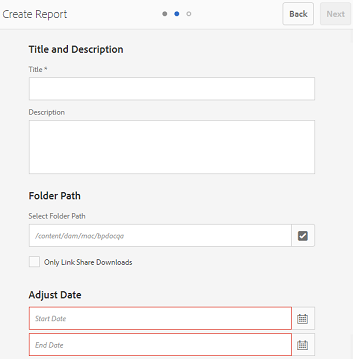

# Werken met rapporten {#work-with-reports}

De rapportagefunctie is van essentieel belang voor het beoordelen van het gebruik van Brand Portal en het weten hoe interne en externe gebruikers met goedgekeurde middelen omgaan. Beheerders kunnen het rapport Brand Portal-verbruik weergeven. Dit rapport is altijd beschikbaar op de pagina Asset Reports. Rapporten voor gebruikersaanmeldingen en gedownloade, verlopen, gepubliceerde en via koppelingen gedeelde elementen kunnen echter worden gegenereerd en weergegeven op de pagina Asset Reports. Deze rapporten zijn nuttig in het analyseren van middelenplaatsing, die u zeer belangrijke succesmetriek laat afleiden om de goedkeuring van goedgekeurde activa binnen en buiten uw organisatie te meten.

De interface van het rapportbeheer is intuïtief en omvat fijnkorrelige opties en controles om tot bewaarde rapporten toegang te hebben. U kunt rapporten weergeven, downloaden of verwijderen van de pagina Asset Reports, waar alle eerder gegenereerde rapporten worden weergegeven.

## Rapporten weergeven {#view-reports}

Voer de volgende stappen uit om een rapport weer te geven:

1. Tik op het logo van de Experience Manager of klik op de werkbalk boven in het scherm om beheergereedschappen te openen.

   

1. Klik in het deelvenster met beheergereedschappen op **[!UICONTROL Create/Manage Reports]** openen **[!UICONTROL Asset Reports]** pagina.

   

1. Toegang **[!UICONTROL Usage]** rapporten en andere gegenereerde rapporten op de pagina Asset Reports.

   >[!NOTE]
   >
   >Gebruiksrapport is een standaardrapport dat in Brand Portal wordt gegenereerd. Kan het niet maken of verwijderen. U kunt echter wel de rapporten Download, Expiration, Publish, Link Share en User Logins maken, downloaden en verwijderen.

   Klik op de rapportkoppeling om een rapport weer te geven. U kunt ook het rapport selecteren en op het pictogram Weergave op de werkbalk tikken of erop klikken.

   **[!UICONTROL Usage Report]** geeft informatie weer over het aantal actieve Brand Portal-gebruikers, de opslagruimte die door alle elementen wordt ingenomen en het totale aantal elementen in Brand Portal. De merkportalgebruikers die niet aan enig productprofiel in de Admin Console worden toegewezen worden beschouwd als inactieve gebruikers en niet weerspiegeld in het **[!UICONTROL Usage Report]**.
Het rapport toont ook de toegestane capaciteit voor elk van deze informatiemetriek.

   

   **[!UICONTROL User Logins]** het rapport bevat informatie over de gebruikers die zich bij Brand Portal hebben aangemeld. Het rapport toont vertoningsnamen, e-mail IDs, persona&#39;s (admin, kijker, redacteur, gast), groepen, laatste login, activiteitenstatus, en login telling van elke gebruiker van de plaatsing van Brand Portal 6.4.2 tot de tijd van rapportgeneratie.

   

   **[!UICONTROL Download]** rapportlijsten en details over alle elementen die in een specifieke datum en tijdwaaier worden gedownload.

   

   >[!NOTE]
   >
   >De activa **[!UICONTROL Download]** In dit rapport worden alleen de elementen weergegeven die afzonderlijk zijn geselecteerd en gedownload van Brand Portal. Als een gebruiker een map met elementen heeft gedownload, geeft het rapport de map of de elementen in de map niet weer.

   **[!UICONTROL Expiration]** het rapport maakt een lijst en details van alle activa die in een specifiek tijdkader verliepen.

   

   **[!UICONTROL Publish]** Het rapport bevat een lijst en informatie over alle elementen die in een opgegeven tijdsperiode van Experience Manager Assets naar Brand Portal zijn gepubliceerd.

   

   >[!NOTE]
   >
   >In het publicatierapport wordt geen informatie weergegeven over inhoudsfragmenten, omdat de inhoudsfragmenten niet naar de Brand Portal kunnen worden gepubliceerd.

   **[!UICONTROL Link Share report]** geeft een lijst weer van alle elementen die via koppelingen van de Brand Portal-interface in een specifiek tijdframe worden gedeeld. Het rapport informeert ook wanneer het middel via verbinding werd gedeeld, door welke gebruiker, wanneer de verbinding verloopt, en het aantal gedeelde verbindingen voor de huurder (en gebruikers met wie de activaverbinding werd gedeeld). De kolommen van het Rapport van het Aandeel van de Verbinding zijn niet klantgericht.

   

   >[!NOTE]
   >
   >Het rapport Delen van koppeling geeft geen gebruikers weer die toegang hebben tot het element dat via de koppeling wordt gedeeld of dat het element via de koppeling heeft gedownload.
   >
   >Voor het volgen van downloads door de gedeelde verbinding, moet u downloadrapport produceren na het selecteren **[!UICONTROL Only Link Share Downloads]** optie aan **[!UICONTROL Create Report]** pagina. De gebruiker (Gedownload door) is in dit geval echter anoniem.

## Rapporten genereren {#generate-reports}

Beheerders kunnen de volgende standaardrapporten genereren en beheren, zodra deze zijn gegenereerd, worden deze opgeslagen om [benaderd](../using/brand-portal-reports.md#main-pars-header) later:

* Aanmeldingsgegevens gebruiker
* Downloaden
* Verlopen
* Publicatie
* Delen van koppeling

De kolommen in het rapport Downloaden, Verlopen en Publiceren kunnen worden aangepast voor weergave. Voer de volgende stappen uit om een rapport te genereren:

1. Tik op het logo van de Experience Manager of klik op de werkbalk boven in het scherm om beheergereedschappen te openen.

1. Tik/klik in het deelvenster met beheergereedschappen op **[!UICONTROL Create/Manage Reports]** openen **[!UICONTROL Asset Reports]** pagina.

   

1. Tik/klik op de pagina Elementrapporten **[!UICONTROL Create]**.
1. Van de **[!UICONTROL Create Report]** pagina, selecteert u een rapport dat u wilt maken en tikt/klikt u op **[!UICONTROL Next]**.

   

1. Configureer rapportdetails. Geef een titel, beschrijving, mapstructuur op (waar het rapport statistieken moet uitvoeren en genereren) en geef een datumbereik op voor **[!UICONTROL Download]**, **[!UICONTROL Expiration]**, en **[!UICONTROL Publish]** rapporten.

   

   Overwegende dat **[!UICONTROL Link Share Report]** heeft alleen de parameters titel, beschrijving en datumbereik nodig.

   

   >[!NOTE]
   >
   >Speciale tekens # en % in de rapporttitel worden vervangen door een afbreekstreepje (-) bij het genereren van het rapport.

1. Tikken/klikken **[!UICONTROL Next]** om de kolommen met Download-, Expiration- en Publish-rapporten te configureren.
1. Schakel de desbetreffende selectievakjes naar wens in of uit. Als u bijvoorbeeld de namen van gebruikers (die elementen hebben gedownload) wilt weergeven in **[!UICONTROL Download]** rapport, selecteren **[!UICONTROL Downloaded By]**. De volgende afbeelding illustreert het selecteren van standaardkolommen in het rapport Downloaden.

   

   U kunt douanekolommen aan deze rapporten ook toevoegen om meer gegevens voor uw douanevereisten te tonen.

   Ga als volgt te werk om aangepaste kolommen toe te voegen aan het rapport Downloaden, Publiceren of Verlopen:

   1. Tik/klik op een aangepaste kolom om deze weer te geven **[!UICONTROL Add]** binnen [!UICONTROL Custom Columns].
   1. Geef de naam van de kolom op in **[!UICONTROL Column Name]** veld.
   1. Selecteer de eigenschap waaraan de kolom moet worden toegewezen met behulp van de eigenschapkiezer.

      
U kunt ook het pad typen in het veld Pad eigenschap.

      

      Tik op of klik om meer aangepaste kolommen toe te voegen **Toevoegen** en herhaal stap 2 en 3.

1. Tik of klik op **[!UICONTROL Create]**. Een bericht meldt dat de rapportgeneratie is in werking gesteld.

## Rapporten downloaden {#download-reports}

Voer een van de volgende handelingen uit om een rapport op te slaan en te downloaden als CSV-bestand:

* Selecteer een rapport op de pagina Asset Reports en tik/klik op **[!UICONTROL Download]** van de werkbalk bovenaan.

* Open een rapport op de pagina Asset Reports. Selecteren **[!UICONTROL Download]** boven aan de rapportpagina.

## Rapporten verwijderen {#delete-reports}

Om een bestaand rapport te schrappen, selecteer het rapport van **[!UICONTROL Asset Reports]** pagina en tik/klik **[!UICONTROL Delete]** van de werkbalk bovenaan.

>[!NOTE]
>
>**[!UICONTROL Usage]** rapport kan niet worden verwijderd.
