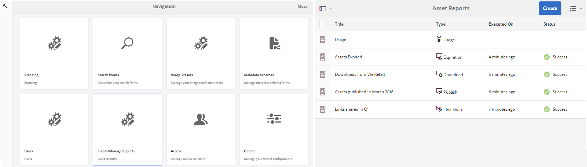
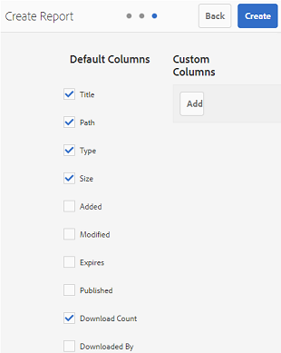

# Werken met rapporten {#work-with-reports}

De rapporteringscapaciteit is nuttig om het gebruik van het Portaal van het Merk te beoordelen, en het weten hoe de interne en externe gebruikers met goedgekeurde activa in wisselwerking staan. Beheerders kunnen het rapport Brand Portal-verbruik weergeven. Dit rapport is altijd beschikbaar op de pagina Asset Reports. Rapporten voor gebruikersaanmeldingen en gedownloade, verlopen, gepubliceerde en via koppelingen gedeelde elementen kunnen echter worden gegenereerd en weergegeven op de pagina Asset Reports. Deze rapporten zijn nuttig in het analyseren van middelenplaatsing, die u zeer belangrijke succesmetriek laat afleiden om de goedkeuring van goedgekeurde activa binnen en buiten uw organisatie te meten.

De interface van het rapportbeheer is intuïtief en omvat fijnkorrelige opties en controles om tot bewaarde rapporten toegang te hebben. U kunt rapporten weergeven, downloaden of verwijderen van de pagina Asset Reports, waar alle eerder gegenereerde rapporten worden weergegeven.

## Rapporten {#view-reports} weergeven

Voer de volgende stappen uit om een rapport weer te geven:

1. Tik op of klik op het AEM om beheergereedschappen te openen via de werkbalk boven in het scherm.

   

1. Klik in het deelvenster met beheergereedschappen op **[!UICONTROL Create/Manage Reports]** om de pagina **[!UICONTROL Asset Reports]** te openen.

   

1. Open het **[!UICONTROL Usage]**-rapport en andere gegenereerde rapporten op de pagina Asset Reports.

   >[!NOTE]
   >
   >Gebruiksrapport is standaard aanwezig in Brand Portal. Kan het niet maken of verwijderen. U kunt echter wel de rapporten Download, Expiration, Publish, Link Share en User Logins maken, downloaden en verwijderen.

   Tik op de rapportkoppeling om een rapport weer te geven. U kunt ook het rapport selecteren en op het pictogram Weergave op de werkbalk tikken of erop klikken.

   **[!UICONTROL Usage Report]** geeft informatie weer over het aantal huidige gebruikers van het Brand Portal, de opslagruimte die door alle elementen wordt ingenomen en het totale aantal elementen in het Brand Portal. Het rapport toont ook de toegestane capaciteit voor elk van deze informatiemetriek.

   

   **[!UICONTROL User Logins]** het rapport geeft informatie over de gebruikers die aan het Portaal van het Merk het programma hebben geopend. Het rapport toont vertoningsnamen, e-mail IDs, persona&#39;s (admin, kijker, redacteur, gast), groepen, laatste login, activiteitenstatus, en login telling van elke gebruiker van Poort 6.4.2 plaatsing van het Merk tot de tijd van rapportgeneratie.

   

   **[!UICONTROL Download]** rapportlijsten en details over alle elementen die in een specifieke datum en tijdwaaier worden gedownload.

   

   >[!NOTE]
   >
   >In het rapport assets **[!UICONTROL Download]** worden alleen de elementen weergegeven die afzonderlijk zijn geselecteerd en gedownload van Brand Portal. Als een gebruiker een map met elementen heeft gedownload, geeft het rapport de map of de elementen in de map niet weer.

   **[!UICONTROL Expiration]** het rapport maakt een lijst en details van alle activa die in een specifiek tijdkader verliepen.

   

   **[!UICONTROL Publish]** het rapport maakt een lijst en geeft informatie over alle activa die van AEM aan het Portaal van het Merk in een gespecificeerd tijdkader worden gepubliceerd.

   

   >[!NOTE]
   >
   >In het publicatierapport wordt geen informatie weergegeven over inhoudsfragmenten, omdat de inhoudsfragmenten niet naar de Brand Portal kunnen worden gepubliceerd.

   **[!UICONTROL Link Share report]** geeft een lijst van alle activa die door verbindingen van de interface van het Portaal van het Merk in een specifiek tijdkader worden gedeeld. Het rapport informeert ook wanneer het middel via verbinding werd gedeeld, door welke gebruiker, wanneer de verbinding verloopt, en het aantal gedeelde verbindingen voor de huurder (en gebruikers met wie de activaverbinding werd gedeeld). De kolommen van het Rapport van het Aandeel van de Verbinding zijn niet klantgericht.

   

   >[!NOTE]
   >
   >Het rapport Delen van koppeling geeft geen gebruikers weer die toegang hebben tot het element dat via de koppeling wordt gedeeld of dat het element via de koppeling heeft gedownload.
   >
   >Voor het volgen van downloads door de gedeelde verbinding, moet u downloadrapport produceren na het selecteren van **[!UICONTROL Only Link Share Downloads]** optie op **[!UICONTROL Create Report]** pagina. De gebruiker (Gedownload door) is in dit geval echter anoniem.

## Rapporten genereren {#generate-reports}

Beheerders kunnen de volgende standaardrapporten genereren en beheren, wanneer deze eenmaal zijn gegenereerd, worden deze opgeslagen om later [benaderd](../using/brand-portal-reports.md#main-pars-header) te worden:

* Aanmeldingsgegevens gebruiker
* Downloaden
* Verlopen
* Publicatie
* Delen van koppeling

De kolommen in het rapport Downloaden, Verlopen en Publiceren kunnen worden aangepast voor weergave. Voer de volgende stappen uit om een rapport te genereren:

1. Tik op of klik op het AEM om beheergereedschappen te openen vanuit de werkbalk bovenaan.

   

1. Tik in het deelvenster met beheergereedschappen op **[!UICONTROL Create/Manage Reports]** om de pagina **[!UICONTROL Asset Reports]** te openen.

   

1. Tik/klik op **[!UICONTROL Create]** op de pagina Elementrapporten.
1. Selecteer op de pagina **[!UICONTROL Create Report]** een rapport dat u wilt maken en tik op **[!UICONTROL Next]**.

   

1. Configureer rapportdetails. Geef een titel, beschrijving, mapstructuur op (waar rapporten moeten worden uitgevoerd en gegenereerd) en geef een datumbereik op voor **[!UICONTROL Download]**-, **[!UICONTROL Expiration]**- en **[!UICONTROL Publish]**-rapporten.

   

   Terwijl **[!UICONTROL Link Share Report]** alleen de parameters titel, beschrijving en datumbereik nodig heeft.

   

   >[!NOTE]
   >
   >Speciale tekens # en % in de rapporttitel worden vervangen door een afbreekstreepje (-) bij het genereren van het rapport.

1. Tik/klik **[!UICONTROL Next]** om de kolommen van Download, Expiration, en Publish rapporten te vormen.
1. Schakel de desbetreffende selectievakjes naar wens in of uit. Als u bijvoorbeeld de namen van gebruikers (die elementen hebben gedownload) in het **[!UICONTROL Download]**-rapport wilt weergeven, selecteert u **[!UICONTROL Downloaded By]**. De volgende afbeelding illustreert het selecteren van standaardkolommen in het rapport Downloaden.

   

   U kunt douanekolommen aan deze rapporten ook toevoegen om meer gegevens voor uw douanevereisten te tonen.

   Ga als volgt te werk om aangepaste kolommen toe te voegen aan het rapport Downloaden, Publiceren of Verlopen:

   1. Tik op **[!UICONTROL Add]** in [!UICONTROL Custom Columns] om een aangepaste kolom weer te geven.
   1. Geef de naam van de kolom op in het veld **[!UICONTROL Column Name]**.
   1. Selecteer de eigenschap waaraan de kolom moet worden toegewezen met behulp van de eigenschapkiezer.

      
U kunt ook het pad typen in het veld Pad eigenschap.

      

      Tik op **Toevoegen** en herhaal stap 2 en 3 om meer aangepaste kolommen toe te voegen.

1. Tik of klik op **[!UICONTROL Create]**. Een bericht meldt dat de rapportgeneratie is in werking gesteld.

## Rapporten {#download-reports} downloaden

Voer een van de volgende handelingen uit om een rapport op te slaan en te downloaden als CSV-bestand:

* Selecteer een rapport op de pagina Asset Reports en tik op **[!UICONTROL Download]** op de werkbalk boven in het scherm.

* Open een rapport op de pagina Asset Reports. Selecteer **[!UICONTROL Download]** optie van de bovenkant van de rapportpagina.

## Rapporten {#delete-reports} verwijderen

Als u een bestaand rapport wilt verwijderen, selecteert u het rapport op de pagina **[!UICONTROL Asset Reports]** en tikt u op **[!UICONTROL Delete]** op de werkbalk boven in het venster.

>[!NOTE]
>
>**[!UICONTROL Usage]** rapport kan niet worden verwijderd.
