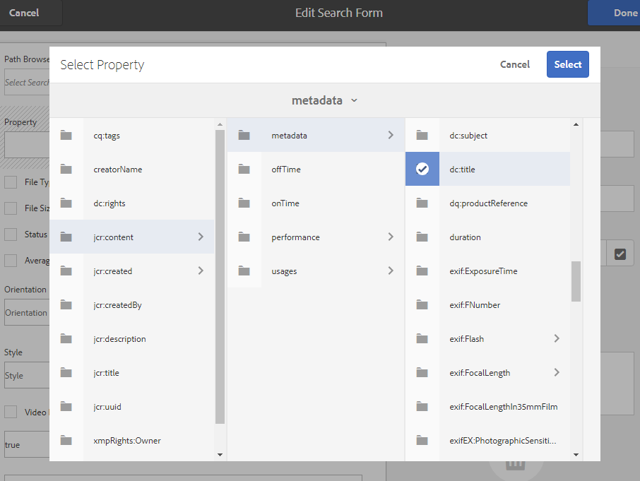

# Aangepaste zoekfacetten gebruiken {#use-custom-search-facets}

Beheerders kunnen voorspelden voor zoekopdrachten toevoegen aan het deelvenster [!UICONTROL Filters] om de zoekfunctie aan te passen en veelzijdig te maken.

Brand Portal ondersteunt [beperkte zoekopdrachten](../using/brand-portal-searching.md#search-using-facets-in-filters-panel) voor korrelige zoekopdrachten van goedgekeurde merkmiddelen, wat mogelijk is vanwege [**Filters** panel](../using/brand-portal-searching.md#search-using-facets-in-filters-panel). De facetten van het onderzoek worden ter beschikking gesteld op het paneel van Filters door **[!UICONTROL Search Form]** in de admin hulpmiddelen. Een standaardzoekformulier met de naam Asset Admin Search Rail bestaat op de pagina Search Forms in de beheerprogramma&#39;s. Beheerders kunnen het standaarddeelvenster Filters echter aanpassen door het standaardformulier voor zoekopdrachten (Asset Admin Search Rail) te bewerken door zoekvoorspelden toe te voegen, te wijzigen of te verwijderen, waardoor de zoekfunctionaliteit veelzijdig wordt.

U kunt verschillende zoekvoorspelling gebruiken om het deelvenster **[!UICONTROL Filters]** aan te passen. Voeg bijvoorbeeld de voorspelling van de eigenschap toe om te zoeken naar elementen die overeenkomen met één eigenschap die u in deze voorspelling opgeeft. Voeg de voorspelling van de opties toe om te zoeken naar elementen die overeenkomen met een of meer waarden die u voor een bepaalde eigenschap opgeeft. Voeg het datumbereik toe om te zoeken naar elementen die binnen een opgegeven datumbereik zijn gemaakt.

>[!NOTE]
>
>Met AEM kunnen organisaties de aangepaste zoekformulieren van AEM Author[ naar Brand Portal publiceren in plaats van hetzelfde formulier opnieuw te maken op Brand Portal.](../using/publish-schema-search-facets-presets.md#publish-search-facets-to-brand-portal)

## Zoekvoorspelling {#add-a-search-predicate} toevoegen

Een zoekvoorspelling toevoegen aan het **[!UICONTROL Filters]**-deelvenster:

1. Als u beheergereedschappen wilt openen, klikt u op het AEM op de werkbalk boven in het venster.

   

1. Klik in het deelvenster met beheergereedschappen op **[!UICONTROL Search Forms]**.

   

1. Selecteer **[!UICONTROL Assets Admin Search Rail]** op de pagina **[!UICONTROL Search Forms]**.

   

1. Klik op **[!UICONTROL Edit]** op de werkbalk boven in het scherm om het zoekformulier te openen.

   

1. Sleep op de pagina [!UICONTROL Edit Search Form] een voorspelling van het tabblad [!UICONTROL Select Predicate] naar het hoofdvenster. Sleep bijvoorbeeld **[!UICONTROL Property Predicate]**.

   Het veld **[!UICONTROL Property]** wordt weergegeven in het hoofdvenster en het tabblad **[!UICONTROL Settings]** aan de rechterkant geeft de voorspelling van de eigenschap aan.

   

   >[!NOTE]
   >
   >Het koptekstlabel op het tabblad **[!UICONTROL Settings]** geeft het type voorspelling aan dat u selecteert.

1. Voer op het tabblad **[!UICONTROL Settings]** een label, plaatsaanduidingstekst en beschrijving in voor de voorspelling van de eigenschap.

   * Selecteer **[!UICONTROL Partial Search]**, als u gedeeltelijk woordonderzoek (en vervangingsonderzoek) van activa-gebaseerd op de gespecificeerde bezitswaarde wilt toestaan. Standaard wordt in de voorvertoning de zoekopdracht met volledige tekst ondersteund.
   * Selecteer **[!UICONTROL Ignore Case]** als u wilt dat de elementenzoekopdracht op basis van de eigenschapswaarde niet hoofdlettergevoelig is. Standaard is het zoeken naar eigenschapswaarden in de zoekfilter hoofdlettergevoelig.

   >[!NOTE]
   >
   >Als u **[!UICONTROL Partial Search]** inschakelt, is **[!UICONTROL Ignore Case]** standaard geselecteerd.

1. Open in het veld **[!UICONTROL Property Name]** de eigenschapkiezer en selecteer de eigenschap op basis waarvan de zoekopdracht wordt uitgevoerd. U kunt ook een naam voor de eigenschap invoeren. Voer bijvoorbeeld `  jcr :content/metadata/dc:title` of `./jcr:content/metadata/dc:title` in.

   

1. Klik **[!UICONTROL Done]** om de montages te bewaren.
1. Klik in de gebruikersinterface [!UICONTROL Assets] op het bedekkingspictogram en kies **[!UICONTROL Filter]** om naar het deelvenster **[!UICONTROL Filters]** te navigeren. Het predicaat **[!UICONTROL Property]** wordt toegevoegd aan het deelvenster.

   

1. Voer in het tekstvak **[!UICONTROL Property]** een titel in voor het element dat moet worden doorzocht. Bijvoorbeeld &quot;Adobe&quot;. Wanneer u een zoekopdracht uitvoert, worden elementen met de titel &quot;Adobe&quot; weergegeven in de zoekresultaten.

## Lijst met zoekvoorspelling {#list-of-search-predicates}

Net als bij de manier waarop u een **[!UICONTROL Property]**-voorspelling toevoegt, kunt u de volgende voorspelling toevoegen aan het **[!UICONTROL Filters]**-deelvenster:

| **Naam voorspelling** | **Beschrijving** | **Eigenschappen** |
|-------|-------|----------|
| **[!UICONTROL Path Browser]** | Zoeken voorspelt dat op een bepaalde locatie naar elementen wordt gezocht. **Opmerking:** *Voor een aangemelde gebruiker toont de padbrowser op Filter alleen de inhoudsstructuur van de mappen (en hun voorouders) die met de gebruiker worden gedeeld.*   Admin-gebruikers kunnen in elke map naar elementen zoeken door met de padbrowser naar die map te navigeren.   Niet-beheerders kunnen echter naar elementen in een map (die voor hen toegankelijk is) zoeken door in de padbrowser naar die map te navigeren. | <ul><li>Veldlabel</li><li>Pad</li><li>Beschrijving</li></ul> |
| **[!UICONTROL Property]** | Zoeken in elementen op basis van een bepaalde eigenschap voor metagegevens. **Opmerking:** *Bij het selecteren van Gedeeltelijk zoeken is Hoofd-kleine letter negeren standaard* geselecteerd. | <ul><li>Veldlabel</li><li>Plaatsaanduiding</li><li>Eigenschapnaam</li><li>Gedeeltelijk zoeken</li><li>Hoofdlettergebruik negeren</li><li> Beschrijving</li></ul> |
| **[!UICONTROL Multi-Value Property]** | Vergelijkbaar met eigenschap voorspellen, maar er kunnen meerdere invoerwaarden worden gebruikt, gescheiden door een scheidingsteken (standaard COMMA[,]). Elementen die overeenkomen met een van de invoerwaarden worden geretourneerd in de resultaten. | <ul><li>Veldlabel</li><li>Plaatsaanduiding</li><li>Eigenschapnaam</li><li>Delimiter-ondersteuning</li><li>Hoofdlettergebruik negeren</li><li>Beschrijving</li></ul> |
| **[!UICONTROL Tags]** | Zoeken voorspellen om elementen te zoeken op basis van tags. U kunt het bezit van de Weg vormen om diverse markeringen in de lijst van Markeringen te bevolken. *Opmerking: Beheerders moeten mogelijk de padwaarde wijzigen, bijvoorbeeld [!UICONTROL `/etc/tags/mac/<tenant_id>/<custom_tag_namespace>`], als ze het zoekformulier publiceren vanuit AEM, waar het pad geen huurdersgegevens bevat, bijvoorbeeld [!UICONTROL `/etc/tags/<custom_tag_namespace>`]. | <ul><li>Veldlabel</li><li>Eigenschapnaam</li><li>Pad</li><li>Beschrijving</li></ul> |
| **[!UICONTROL Path]** | Zoeken voorspelt dat op een bepaalde locatie naar elementen wordt gezocht. | <ul><li>Veldlabel</li><li>Pad</li><li>Beschrijving</li></ul> |  |
| **[!UICONTROL Relative Date]** | Zoeken voorspelt dat er wordt gezocht naar elementen op basis van de relatieve datum waarop deze zijn gemaakt. | <ul><li>Veldlabel</li><li>Eigenschapnaam</li><li>Relatieve datum</li></ul> |
| **[!UICONTROL Range]** | Zoeken voorspelt hoe u elementen kunt zoeken die binnen een opgegeven reeks eigenschapswaarden liggen. In het deelvenster Filters kunt u minimum- en maximumeigenschapswaarden voor het bereik opgeven. | <ul><li>Veldlabel</li><li>Eigenschapnaam</li><li>Beschrijving</li></ul> |
| **[!UICONTROL Date Range]** | Zoeken voorspelt hoe u elementen die binnen een opgegeven bereik zijn gemaakt, kunt zoeken naar een datumeigenschap. In het deelvenster Filters kunt u begin- en einddatums opgeven. | <ul><li>Veldlabel</li><li>Plaatsaanduiding</li><li>Eigenschapnaam</li><li>Tekst bereik (van)</li><li>Tekst bereik (naar)</li><li>Beschrijving</li></ul> |
| **[!UICONTROL Date]** | Zoeken voorspelt hoe elementen op basis van een schuifregelaar worden doorzocht op basis van een eigenschap date. | <ul><li>Veldlabel</li><li>Eigenschapnaam</li><li>Beschrijving</li></ul> |
| **[!UICONTROL File Size]** | Zoeken voorspelt hoe u elementen kunt zoeken op basis van hun grootte. | <ul><li>Veldlabel</li><li>Eigenschapnaam</li><li>Pad</li><li>Beschrijving</li></ul> |
| **[!UICONTROL Asset Last Modified]** | Zoeken voorspelt hoe u elementen kunt zoeken op basis van de laatste gewijzigde datum. | <ul><li>Veldlabel</li><li>Eigenschapnaam</li><li>Beschrijving</li></ul> |
| **[!UICONTROL Approval Status]** | Zoeken voorspelt hoe u elementen kunt zoeken op basis van de eigenschap voor metagegevens van goedkeuring. De standaard bezitsnaam is **dam:status**. | <ul><li>Veldlabel</li><li>Eigenschapnaam</li><li>Beschrijving</li></ul> |
| **[!UICONTROL Checkout Status]** | Zoeken voorspelt dat er wordt gezocht naar middelen op basis van de uitcheckstatus van een middel toen het vanuit AEM Assets werd gepubliceerd. | <ul><li>Veldlabel</li><li>Eigenschapnaam</li><li>Beschrijving</li></ul> |
| **[!UICONTROL Checked Out By]** | Zoeken voorspelt hoe u elementen kunt zoeken op basis van de gebruiker die het element heeft uitgecheckt. | <ul><li>Veldlabel</li><li>Eigenschapnaam</li><li>Beschrijving</li></ul> |
| **[!UICONTROL Expiry Status]** | Zoeken voorspelt dat er op basis van de vervalstatus naar elementen wordt gezocht. | <ul><li>Veldlabel</li><li>Eigenschapnaam</li><li>Beschrijving</li></ul> |
| **[!UICONTROL Member of collection]** | Zoeken voorspelt hoe u elementen kunt zoeken op basis van het feit of een element deel uitmaakt van een verzameling. | Beschrijving |
| **[!UICONTROL Hidden]** | Deze voorspelling is niet expliciet zichtbaar voor de eindgebruikers en wordt gebruikt voor verborgen beperkingen waarmee het type zoekresultaten wordt beperkt tot **dam:Asset**. | <ul><li>Veldlabel</li><li>Eigenschapnaam</li><li>Beschrijving</li></ul> |

>[!NOTE]
>
>Gebruik **[!UICONTROL Options Predicate]**, **[!UICONTROL Publish Status Predicate]** en **[!UICONTROL Rating Predicate]** niet omdat deze voorspellingen niet functioneel zijn in Brand Portal.

## Zoekvoorspelling {#delete-a-search-predicate} verwijderen

Ga als volgt te werk om een voorspeld in een zoekopdracht te verwijderen:

1. Klik op het logo van de Adobe voor toegang tot de beheergereedschappen.

   

1. Klik in het deelvenster met beheergereedschappen op **[!UICONTROL Search Forms]**.

   

1. Selecteer **[!UICONTROL Assets Admin Search Rail]** op de pagina **[!UICONTROL Search Forms]**.

   

1. Klik op **[!UICONTROL Edit]** op de werkbalk boven in het scherm om het zoekformulier te openen.

   

1. Selecteer op de pagina [!UICONTROL Edit Search Form] in het hoofdvenster de voorspelling die u wilt verwijderen. Selecteer bijvoorbeeld **[!UICONTROL Property Predicate]**.

   Op de tab **[!UICONTROL Settings]** rechts worden de eigenschappenvoorspelde velden weergegeven.

1. Als u de voorspelling van de eigenschap wilt verwijderen, klikt u op het binpictogram. Klik in het dialoogvenster **[!UICONTROL Delete Field]** op **[!UICONTROL Delete]** om de verwijderhandeling te bevestigen.

   Het veld **[!UICONTROL Property Predicate]** wordt uit het hoofdvenster verwijderd en het tabblad **[!UICONTROL Settings]** wordt leeg.

   

1. Als u de wijzigingen wilt opslaan, klikt u op **[!UICONTROL Done]** op de werkbalk.
1. Klik in de gebruikersinterface **[!UICONTROL Assets]** op het bedekkingspictogram en kies **[!UICONTROL Filter]** om naar het deelvenster **[!UICONTROL Filters]** te navigeren. De voorspelling **[!UICONTROL Property]** wordt verwijderd uit het deelvenster.

   
