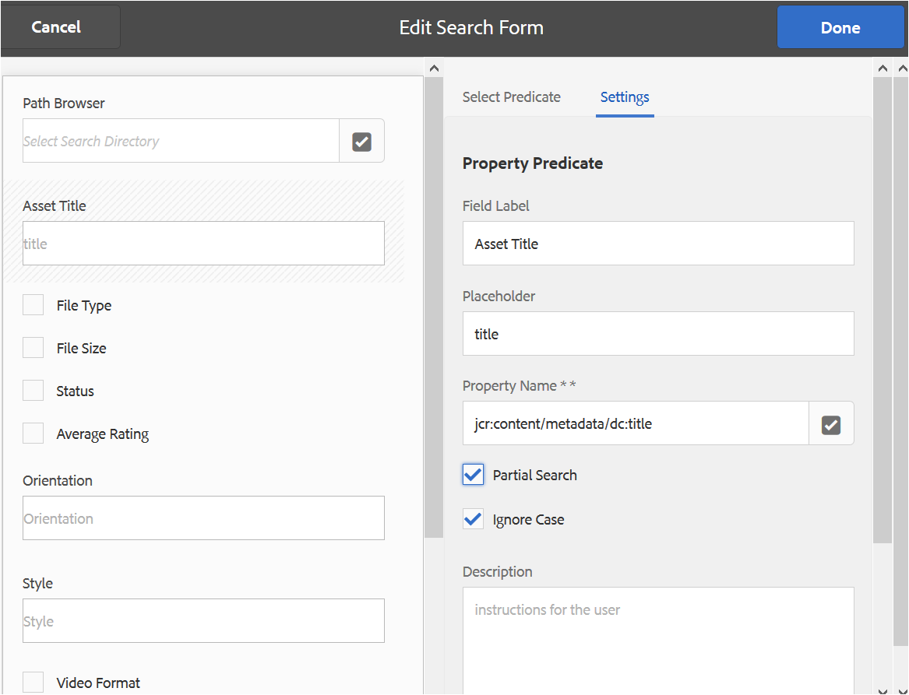

# Aangepaste zoekfacetten gebruiken {#use-custom-search-facets}

Beheerders kunnen voorspelden voor zoekopdrachten toevoegen aan de [!UICONTROL Filters] gebruiken om de zoekfunctie aan te passen en te optimaliseren.

Brand Portal-ondersteuning [facetzoekopdracht](../using/brand-portal-searching.md#search-using-facets-in-filters-panel) voor korrelzoekingen van goedgekeurde merkartikelen, hetgeen mogelijk is als gevolg van [**Filters** deelvenster](../using/brand-portal-searching.md#search-using-facets-in-filters-panel). Zoeken in facetten wordt via **[!UICONTROL Search Form]** in de beheerprogramma&#39;s. Een standaardzoekformulier met de naam Asset Admin Search Rail bestaat op de pagina Search Forms in de beheerprogramma&#39;s. Beheerders kunnen het standaarddeelvenster Filters echter aanpassen door het standaardformulier voor zoekopdrachten (Asset Admin Search Rail) te bewerken door zoekvoorspelden toe te voegen, te wijzigen of te verwijderen, waardoor de zoekfunctionaliteit veelzijdig wordt.

U kunt verschillende voorvertoningen van zoekopdrachten gebruiken om de **[!UICONTROL Filters]** deelvenster. Voeg bijvoorbeeld de voorspelling van de eigenschap toe om te zoeken naar elementen die overeenkomen met één eigenschap die u in deze voorspelling opgeeft. Voeg de voorspelling van de opties toe om te zoeken naar elementen die overeenkomen met een of meer waarden die u voor een bepaalde eigenschap opgeeft. Voeg het datumbereik toe om te zoeken naar elementen die binnen een opgegeven datumbereik zijn gemaakt.

>[!NOTE]
>
>Experience Manager Assets staat organisaties toe om [de aangepaste zoekformulieren publiceren van AEM Author](../using/publish-schema-search-facets-presets.md#publish-search-facets-to-brand-portal) naar Brand Portal, in plaats van hetzelfde formulier opnieuw te maken op Brand Portal.

## Een zoekvoorspelling toevoegen {#add-a-search-predicate}

Om een onderzoek toe te voegen voorspelt aan **[!UICONTROL Filters]** paneel:

1. Als u beheergereedschappen wilt openen, klikt u op het logo van de Experience Manager op de werkbalk boven in het scherm.

   

1. Klik in het deelvenster met beheergereedschappen op **[!UICONTROL Search Forms]**.

   

1. In de **[!UICONTROL Search Forms]** pagina, selecteert u **[!UICONTROL Assets Admin Search Rail]**.

   

1. Klik op de werkbalk boven in het scherm op **[!UICONTROL Edit]** om het zoekformulier te openen.

   

1. In de [!UICONTROL Edit Search Form] pagina, sleept u een voorspelling van de [!UICONTROL Select Predicate] aan het hoofdvenster. Sleep bijvoorbeeld **[!UICONTROL Property Predicate]**.

   De **[!UICONTROL Property]** wordt weergegeven in het hoofdvenster en in het dialoogvenster **[!UICONTROL Settings]** op de rechterbalk worden voorspelden van eigenschappen weergegeven.

   

   >[!NOTE]
   >
   >Het koptekstlabel in het dialoogvenster **[!UICONTROL Settings]** geeft het type voorspelling aan dat u selecteert.

1. In de **[!UICONTROL Settings]** voert u een label, plaatsaanduidingstekst en beschrijving in voor de voorspelling van de eigenschap.

   * Selecteren **[!UICONTROL Partial Search]**, als u gedeeltelijk woordzoekopdracht (en zoeken met jokertekens) van elementen wilt toestaan op basis van de opgegeven eigenschapswaarde. Standaard wordt in de voorvertoning de zoekopdracht met volledige tekst ondersteund.
   * Selecteren **[!UICONTROL Ignore Case]**, als u wilt dat het zoeken naar elementen op basis van de eigenschapswaarde niet hoofdlettergevoelig is. Standaard is het zoeken naar eigenschapswaarden in de zoekfilter hoofdlettergevoelig.

   >[!NOTE]
   >
   >Bij selecteren **[!UICONTROL Partial Search]** selectievakje, **[!UICONTROL Ignore Case]** is standaard geselecteerd.

1. In de **[!UICONTROL Property Name]** , opent u de eigenschapkiezer en selecteert u de eigenschap op basis waarvan de zoekopdracht wordt uitgevoerd. U kunt ook een naam voor de eigenschap invoeren. Voer bijvoorbeeld `  jcr :content/metadata/dc:title` of `./jcr:content/metadata/dc:title` in.

   >[!NOTE]
   >
   >In Brand Portal, alle eigenschappen van het Koord (behalve degenen die beginnen met `xmp`) in `jcrcontent/metadata` van `dam:asset` worden standaard geïndexeerd.
   >
   >Om het even welk bezit dat wordt geïndexeerd kan worden gebruikt terwijl het creëren van een bezit voorspelt. Als om het even welk niet-geïndexeerd bezit wordt gevormd, kan de onderzoeksvraag op een niet-geïndexeerd bezit geen onderzoeksresultaat geven.

   

1. Klikken **[!UICONTROL Done]** om de instellingen op te slaan.
1. Van de [!UICONTROL Assets] gebruikersinterface, klikt u op het bedekkingspictogram en kiest u **[!UICONTROL Filter]** om naar de **[!UICONTROL Filters]** deelvenster. Het predicaat **[!UICONTROL Property]** wordt toegevoegd aan het deelvenster.

   

1. Voer een titel in voor het element dat moet worden doorzocht in het dialoogvenster **[!UICONTROL Property]** tekstvak. Bijvoorbeeld &quot;Adobe&quot;. Wanneer u een zoekopdracht uitvoert, worden elementen met de titel &quot;Adobe&quot; weergegeven in de zoekresultaten.

## Lijst met zoekresultaten {#list-of-search-predicates}

Vergelijkbaar met de manier waarop u een **[!UICONTROL Property]** voorspellen, kunt u de volgende predikaten aan toevoegen **[!UICONTROL Filters]** paneel:

| **Naam voorspelling** | **Beschrijving** | **Eigenschappen** |
|-------|-------|----------|
| **[!UICONTROL Path Browser]** | Zoeken voorspelt dat op een bepaalde locatie naar elementen wordt gezocht. **Opmerking:** *Voor een aangemelde gebruiker geeft de padbrowser op Filter alleen de inhoudsstructuur weer van de mappen (en hun voorouders) die met de gebruiker worden gedeeld.*   Admin-gebruikers kunnen in elke map naar elementen zoeken door met de padbrowser naar die map te navigeren.   Niet-beheerders kunnen echter naar elementen in een map (die voor hen toegankelijk is) zoeken door in de padbrowser naar die map te navigeren. | <ul><li>Veldlabel</li><li>Pad</li><li>Beschrijving</li></ul> |
| **[!UICONTROL Property]** | Zoeken in elementen op basis van een bepaalde eigenschap voor metagegevens. **Opmerking:** *Als Gedeeltelijke zoekopdracht wordt geselecteerd, is Hoofdlettergebruik negeren standaard geselecteerd*. | <ul><li>Veldlabel</li><li>Plaatsaanduiding</li><li>Eigenschapnaam</li><li>Gedeeltelijk zoeken</li><li>Hoofdlettergebruik negeren</li><li> Beschrijving</li></ul> |
| **[!UICONTROL Multi-Value Property]** | Vergelijkbaar met eigenschap voorspellen, maar er zijn meerdere invoerwaarden mogelijk, gescheiden door een scheidingsteken (standaard is COMMA[,]) elementen die overeenkomen met een van de invoerwaarden worden geretourneerd in resultaten. | <ul><li>Veldlabel</li><li>Plaatsaanduiding</li><li>Eigenschapnaam</li><li>Delimiter-ondersteuning</li><li>Hoofdlettergebruik negeren</li><li>Beschrijving</li></ul> |
| **[!UICONTROL Tags]** | Zoeken voorspellen om elementen te zoeken op basis van tags. U kunt het bezit van de Weg vormen om diverse markeringen in de lijst van Markeringen te bevolken. *Opmerking: mogelijk moeten beheerders de padwaarde wijzigen, bijvoorbeeld [!UICONTROL `/etc/tags/mac/<tenant_id>/<custom_tag_namespace>`], als zij het zoekformulier publiceren vanuit AEM, waar het pad geen huurdersinformatie bevat, bijvoorbeeld [!UICONTROL `/etc/tags/<custom_tag_namespace>`]. | <ul><li>Veldlabel</li><li>Eigenschapnaam</li><li>Pad</li><li>Beschrijving</li></ul> |
| **[!UICONTROL Path]** | Zoeken voorspelt dat op een bepaalde locatie naar elementen wordt gezocht. | <ul><li>Veldlabel</li><li>Pad</li><li>Beschrijving</li></ul> |                                                     |
| **[!UICONTROL Relative Date]** | Zoeken voorspelt dat er wordt gezocht naar elementen op basis van de relatieve datum waarop deze zijn gemaakt. | <ul><li>Veldlabel</li><li>Eigenschapnaam</li><li>Relatieve datum</li></ul> |
| **[!UICONTROL Range]** | Zoeken voorspelt hoe u elementen kunt zoeken die binnen een opgegeven reeks eigenschapswaarden liggen. In het deelvenster Filters kunt u minimum- en maximumeigenschapswaarden voor het bereik opgeven. | <ul><li>Veldlabel</li><li>Eigenschapnaam</li><li>Beschrijving</li></ul> |
| **[!UICONTROL Date Range]** | Zoeken voorspelt hoe u elementen die binnen een opgegeven bereik zijn gemaakt, kunt zoeken naar een datumeigenschap. In het deelvenster Filters kunt u begin- en einddatums opgeven. | <ul><li>Veldlabel</li><li>Plaatsaanduiding</li><li>Eigenschapnaam</li><li>Tekst bereik (van)</li><li>Tekst bereik (naar)</li><li>Beschrijving</li></ul> |
| **[!UICONTROL Date]** | Zoeken voorspelt hoe elementen op basis van een schuifregelaar worden doorzocht op basis van een eigenschap date. | <ul><li>Veldlabel</li><li>Eigenschapnaam</li><li>Beschrijving</li></ul> |
| **[!UICONTROL File Size]** | Zoeken voorspelt hoe u elementen kunt zoeken op basis van hun grootte. | <ul><li>Veldlabel</li><li>Eigenschapnaam</li><li>Pad</li><li>Beschrijving</li></ul> |
| **[!UICONTROL Asset Last Modified]** | Zoeken voorspelt hoe u elementen kunt zoeken op basis van de datum waarop het laatst is gewijzigd. | <ul><li>Veldlabel</li><li>Eigenschapnaam</li><li>Beschrijving</li></ul> |
| **[!UICONTROL Approval Status]** | Zoeken voorspelt hoe u elementen kunt zoeken op basis van de eigenschap voor metagegevens van goedkeuring. De standaardeigenschapnaam is **dam:status**. | <ul><li>Veldlabel</li><li>Eigenschapnaam</li><li>Beschrijving</li></ul> |
| **[!UICONTROL Checkout Status]** | Zoeken voorspelt dat er wordt gezocht naar middelen op basis van de uitcheckstatus van een middel toen het vanuit AEM Assets werd gepubliceerd. | <ul><li>Veldlabel</li><li>Eigenschapnaam</li><li>Beschrijving</li></ul> |
| **[!UICONTROL Checked Out By]** | Zoeken voorspelt hoe u elementen kunt zoeken op basis van de gebruiker die het element heeft uitgecheckt. | <ul><li>Veldlabel</li><li>Eigenschapnaam</li><li>Beschrijving</li></ul> |
| **[!UICONTROL Expiry Status]** | Zoeken voorspelt dat er wordt gezocht naar elementen die zijn gebaseerd op de vervalstatus. | <ul><li>Veldlabel</li><li>Eigenschapnaam</li><li>Beschrijving</li></ul> |
| **[!UICONTROL Member of collection]** | Zoeken voorspelt hoe u elementen kunt zoeken op basis van het feit of een element deel uitmaakt van een verzameling. | Beschrijving |
| **[!UICONTROL Hidden]** | Dit voorspellen is niet uitdrukkelijk zichtbaar aan het eind - gebruikers en voor om het even welke verborgen beperkingen typisch gebruikt voor het beperken van het type van onderzoeksresultaten tot **dam:Asset**. | <ul><li>Veldlabel</li><li>Eigenschapnaam</li><li>Beschrijving</li></ul> |

>[!NOTE]
>
>Niet gebruiken **[!UICONTROL Options Predicate]**, **[!UICONTROL Publish Status Predicate]**, en **[!UICONTROL Rating Predicate]** aangezien deze voorspellingen niet functioneren in Brand Portal.

## Een zoekvoorspelling verwijderen {#delete-a-search-predicate}

Ga als volgt te werk om een voorspeld in een zoekopdracht te verwijderen:

1. Klik op het logo van de Adobe voor toegang tot de beheergereedschappen.

   

1. Klik in het deelvenster met beheergereedschappen op **[!UICONTROL Search Forms]**.

   

1. In de **[!UICONTROL Search Forms]** pagina, selecteert u **[!UICONTROL Assets Admin Search Rail]**.

   

1. Klik op de werkbalk boven in het scherm op **[!UICONTROL Edit]** om het zoekformulier te openen.

   

1. In de [!UICONTROL Edit Search Form] in het hoofdvenster selecteert u de voorspelling die u wilt verwijderen. Selecteer bijvoorbeeld **[!UICONTROL Property Predicate]**.

   De **[!UICONTROL Settings]** op het rechtertabblad geeft u de eigenschappenvoorspelvelden weer.

1. Als u de voorspelling van de eigenschap wilt verwijderen, klikt u op het binpictogram. Op de **[!UICONTROL Delete Field]** klikt u op **[!UICONTROL Delete]** om de verwijderactie te bevestigen.

   De **[!UICONTROL Property Predicate]** wordt uit het hoofdvenster verwijderd en wordt het veld **[!UICONTROL Settings]** wordt leeg.

   

1. Klik op **[!UICONTROL Done]** in de werkbalk.
1. Van de **[!UICONTROL Assets]** gebruikersinterface, klikt u op het bedekkingspictogram en kiest u **[!UICONTROL Filter]** om naar de **[!UICONTROL Filters]** deelvenster. De **[!UICONTROL Property]** predikaat wordt verwijderd uit het paneel.

   
