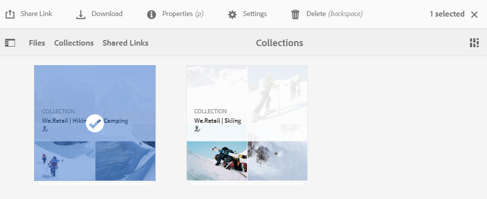
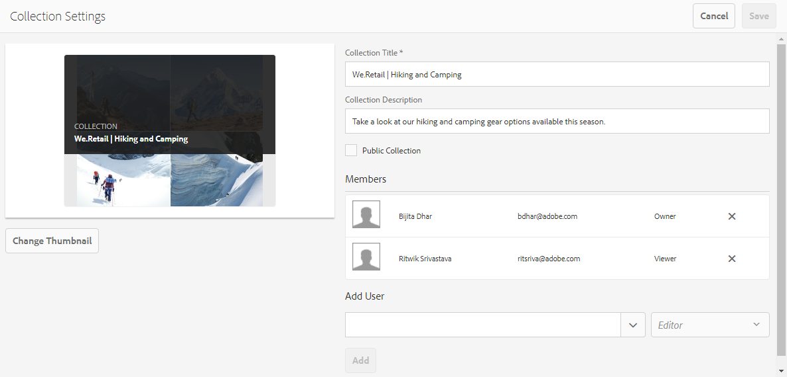
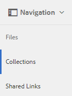

# Verzamelingen delen {#share-collections}

Een verzameling vertegenwoordigt een groep gerelateerde elementen die samen in Adobe Experience Manager Assets Brand Portal zijn opgeslagen. De gebruikers kunnen slimme inzamelingen tot stand brengen door [ volledig onderzoek of facetonderzoek toe te passen om verwante activa ](brand-portal-searching.md) uit te filteren en hen samen op te slaan voor gemakkelijke toegang en het verder te delen met andere gebruikers van Brand Portal.

<!--The administrators can share and unshare a collection with the authorized Brand Portal users. Editors and viewers can view and share the collections created by them, shared with them, and public collections.-->

Verzamelingen worden als koppelingen via een e-mail gedeeld. Iedereen met toegang tot de aandeelverbinding kan de inzameling openen. Gedeelde e-mails kunnen echter naar iedereen worden doorgestuurd. Bovendien, [ gedeelde verbindingen ](https://experienceleague.adobe.com/en/docs/experience-manager-brand-portal/using/share/brand-portal-link-share) zijn tijdelijk en toegankelijk voor een beperkte duur slechts. U kunt gebruikers ook uitnodigen als permanente leden voor verzamelingen. Er zijn de volgende typen gebruikers voor de verzamelingen:

* **de Beheerders** kunnen een inzameling met de gemachtigde gebruikers van Brand Portal delen of unshare. Ze kunnen andere gebruikers uitnodigen voor een specifieke verzameling en hun rol in die verzameling definiëren. Daarnaast kunnen beheerders openbare verzamelingen maken.

* **Editors** worden toegestaan om inzamelingen tot stand te brengen en te delen. Ze kunnen andere gebruikers uitnodigen voor een specifieke verzameling en hun rol in die verzameling definiëren. Bovendien kunnen zij inzamelingen ook delen, als zij aan de inzameling als redacteur of eigenaar zijn uitgenodigd.

* **de Kijkers** kunnen privé inzamelingen tot stand brengen slechts. Ze kunnen geen collectie delen, zelfs niet toen ze als eigenaar werden uitgenodigd.

>[!NOTE]
>
>Editors kunnen een openbare verzameling niet wijzigen in een niet-openbare verzameling en beschikken daarom niet over het selectievakje **[!UICONTROL Public Collection]** dat beschikbaar is in het dialoogvenster **[!UICONTROL Collection Settings]** .

## Een verzameling delen {#share-collection}

Hier volgen de stappen voor het delen van een verzameling met geautoriseerde Brand Portal-gebruikers:

1. Meld u aan bij uw Brand Portal-huurder. Standaard wordt de weergave **[!UICONTROL Files]** geopend die alle gepubliceerde elementen en mappen bevat.

1. Klik vanaf de snelle navigatie bovenaan op **[!UICONTROL Collections]** .

1. Voer vanuit de **[!UICONTROL Collections]** -console een van de volgende handelingen uit:

   * Houd de aanwijzer boven de verzameling die u wilt delen. Klik op het pictogram **[!UICONTROL Settings]** in de snelactieminiaturen die beschikbaar zijn voor de verzameling.

     

   * Selecteer de verzameling die u wilt delen. Klik in de werkbalk boven in het scherm op **[!UICONTROL Settings]** .

     

1. Selecteer in het dialoogvenster **[!UICONTROL Collection Settings]** de gebruikers met wie u de verzameling wilt delen en selecteer de rol die de gebruiker aan de algemene rol moet toekennen. Wijs bijvoorbeeld de rol Editor toe aan een algemene editor, de rol Viewer aan een algemene viewer.

   U kunt de verzameling ook beschikbaar maken voor alle gebruikers, ongeacht hun groepslidmaatschap en rol, door het selectievakje **[!UICONTROL Public Collection]** in te schakelen.

   >[!NOTE]
   >
   >Nochtans, kunnen niet-admin gebruikers van het creëren van openbare inzamelingen worden beperkt, om het hebben van talrijke openbare inzamelingen te vermijden zodat systeemruimte kan worden bewaard. Organisaties kunnen de **[!UICONTROL Allow public collections creation]** -configuratie uitschakelen op basis van de **[!UICONTROL General]** -instellingen die beschikbaar zijn in het deelvenster met beheergereedschappen.

   

   De editors kunnen een openbare verzameling niet wijzigen in een niet-openbare verzameling en beschikken daarom niet over een selectievakje **[!UICONTROL Public Collection]** in het dialoogvenster **[!UICONTROL Collection Settings]** .

   

1. Klik op de knop **[!UICONTROL Add]** om de gebruiker toe te voegen en klik vervolgens op **[!UICONTROL Save]** . De verzameling wordt gedeeld met de gebruikers.

   >[!NOTE]
   >
   >De rol van een gebruiker bepaalt de toegang tot de elementen en mappen in een verzameling. Als een gebruiker geen toegang heeft tot elementen, wordt een lege verzameling gedeeld met de gebruiker. De rol van een gebruiker bepaalt ook de acties die beschikbaar zijn voor verzamelingen.

## Delen van een verzameling opheffen {#unshare-a-collection}

Ga als volgt te werk om het delen van een eerder gedeelde verzameling op te heffen:

1. Selecteer in de **[!UICONTROL Collections]** -console de verzameling waarvan u het delen wilt opheffen.

   Klik in de werkbalk boven in het scherm op **[!UICONTROL Settings]** .

   

1. Klik in het dialoogvenster **[!UICONTROL Collection Settings]** onder de sectie **[!UICONTROL Members]** op het symbool **[!UICONTROL x]** naast gebruikers om deze te verwijderen uit de lijst met gebruikers die toegang hebben tot de verzameling.

   

1. Er verschijnt een waarschuwingsbericht. Klik op **[!UICONTROL Confirm]** om het delen van de verzameling op te heffen.

1. Klik op **[!UICONTROL Save]** om de wijzigingen toe te passen.

   Wanneer de gebruiker uit de gedeelde lijst is verwijderd, wordt de niet-gedeelde verzameling verwijderd uit de **[!UICONTROL Collections]** -console van de gebruiker.

<!--
1. Click the overlay icon on the left, and choose **[!UICONTROL Navigation]**.

   

1. From the siderail on the left, click **[!UICONTROL Collections]**.

   

1. From the **[!UICONTROL Collections]** console, do one of the following:

    * Hover the pointer over the collection you want to share. From the quick action thumbnails available for the collection, click the **[!UICONTROL Settings]** icon.

   

    * Select the collection you want to share. From the toolbar at the top, click **[!UICONTROL Settings]**.
    
   

1. In the [!UICONTROL Collection Settings] dialog box, select the users or groups with whom you want to share the collection and select the role for a user or a group to match their global role. For example, assign the Editor role to a global editor, the Viewer role to a global viewer.

   Alternatively, to make the collection available to all users irrespective of their group membership and role, make it public by selecting the **[!UICONTROL Public Collection]** check-box.

   >[!NOTE]
   >
   >However, non-admin users can be restricted from creating public collections, to avoid having numerous public collections so that system space can be saved. Organizations can disable the **[!UICONTROL Allow public collections creation]** configuration from [!UICONTROL General] settings available in admin tools panel.

   

   Editors cannot change a public collection to a non-public collection and, therefore, do not have **[!UICONTROL Public Collection]** check-box available in **[!UICONTROL Collection Settings]** dialog.

   

1. Select **[!UICONTROL Add]**, and then **[!UICONTROL Save]**. The collection is shared with the chosen users.

   >[!NOTE]
   >
   >A user's role governs access to the assets and folders inside a collection. If a user does not have access to assets, an empty collection is shared with the user. Also, a user's role governs the actions available for collections.

## Unshare a collection {#unshare-a-collection}

To unshare a previously shared collection, do the following:

1. From the **[!UICONTROL Collections]** console, select the collection you want to unshare.

   In the toolbar, click **[!UICONTROL Settings]**.

   

1. On the **[!UICONTROL Collection Settings]** dialog box, under **[!UICONTROL Members]**, click the **[!UICONTROL x]** symbol next to users or groups to remove them from the list of users you shared the collection with.

   

1. In the warning message box, click **[!UICONTROL Confirm]** to confirm unshare.

   Click **[!UICONTROL Save]**.

1. Log in to Brand Portal with the credentials of the user you removed from the shared list. The collection is removed from the **[!UICONTROL Collections]** console.
-->
