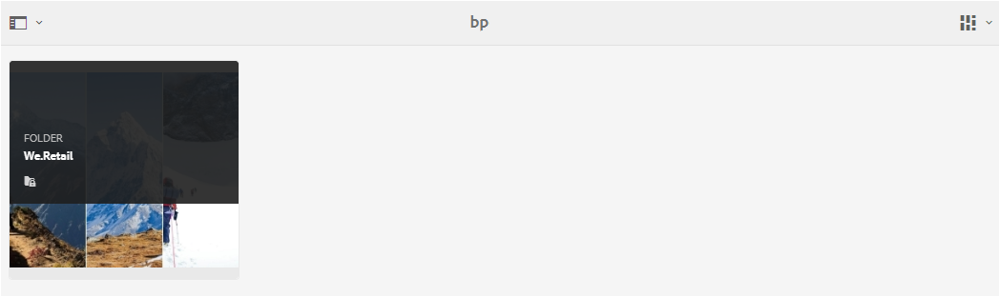

# Mappen delen op Brand Portal {#share-folders}

Middelen moeten via een vooraf geconfigureerde AEM Author-instantie naar Brand Portal worden gepubliceerd, omdat het Brand Portal geen ondersteuning biedt voor het opnemen van bedrijfsmiddelen.

## Workflow voor het delen van mappen in Brand Portal {#folder-sharing-workflow-in-brand-portal}

Hieronder worden de workflow voor het delen van mappen en gebruikerstoegang beschreven:

* Door gebrek, zijn alle omslagen die van activa AEM aan het Portaal van het Merk worden gepubliceerd zichtbaar slechts aan de Beheerder van het Portaal van het Merk, tenzij duidelijk als openbaar terwijl het vormen van replicatie.
* De beheerder gebruikt de **[!UICONTROL Folder Properties]** console om een omslag met selectieve gebruikers of groepen te delen. Alleen die gebruikers of groepen met wie de map wordt gedeeld, kunnen de map zien nadat ze zich hebben aangemeld bij Brand Portal. De map is niet zichtbaar voor andere gebruikers.
* De beheerder kan er ook voor kiezen om een map openbaar te maken via het **[!UICONTROL Public Folder]** selectievakje in de **[!UICONTROL Folder Properties]** console. Alle gebruikers zien een openbare map.

* Ongeacht gebruikersrollen en voorrechten, wanneer de gebruikers login aan het Portaal van het Merk, zien zij alle openbare omslagen, en de omslagen die direct met hen of met een groep worden gedeeld waartoe zij behoren. Privémappen of mappen die met andere gebruikers worden gedeeld, zijn niet voor alle gebruikers zichtbaar.

### Mappen delen met gebruikersgroepen op Brand Portal {#sharing-folders-with-user-groups-on-brand-portal}

Toegangsrechten voor elementen van een map zijn afhankelijk van de toegangsrechten voor de bovenliggende map, ongeacht de instellingen van onderliggende mappen. Dit gedrag wordt geregeerd door [ACLs](https://helpx.adobe.com/experience-manager/6-5/sites/administering/using/security.html#PermissionsinAEM) in AEM, aangezien de kindomslagen ACLs van hun ouderomslagen erven. Bijvoorbeeld, als een omslag A omslag B bevat die omslag C bevat, dan hebben een gebruikersgroep (of gebruikers) die toegangsrechten op omslag A hebben ook de zelfde toegangsrechten op omslag B en omslag C. De omslag B die de kindomslag van A is overerft ACLs, en de omslag C die de kindomslag van B overerft ACLs.

Op dezelfde manier hebben gebruikersgroepen (of gebruikers) met toegangsmachtigingen voor alleen map B dezelfde toegangsmachtigingen voor map C, maar niet voor map A. Daarom wordt geadviseerd dat de organisaties hun inhoud zodanig schikken dat de meeste blootgestelde activa in de kindomslag en van kinderen aan de toegang van de wortelomslag kunnen worden beperkt.

### Openbare map publiceren {#public-folder-publish}

Tenzij de **[!UICONTROL Public Folder Publish]** optie is geselecteerd tijdens het configureren van de replicatie van het Brand Portal, hebben gebruikers die geen beheerder zijn (zoals Editors en Viewers) geen toegang tot elementen die vanuit AEM Assets naar Brand Portal zijn gepubliceerd.

Als de **[!UICONTROL Public Folder Publish]** optie is uitgeschakeld, moeten beheerders deze middelen specifiek delen met gebruikers die geen beheerder zijn en gebruikmaken van de mogelijkheid om te delen.

>[!NOTE]
>
>De optie om in te schakelen **[!UICONTROL Public Folder Publish]** is beschikbaar in AEM 6.3.2.1 en later.

## Toegang tot gedeelde mappen {#access-to-shared-folders}

In de volgende matrix worden de toegangsrechten en rechten voor het delen/ontdelen van elementen voor verschillende gebruikersrollen besproken:

|  | Toegang tot alle mappen die vanuit AEM Assets zijn gepubliceerd naar Brand Portal | Toegang tot gedeelde mappen | Maprechten delen/delen opheffen |
|---------------|-----------|-----------|------------|
| Beheerder | Ja | Ja | Ja |
| Editor | Nee* | Ja, alleen indien gedeeld met hen of met de groep waartoe zij behoren | Ja, alleen voor de mappen die met hen worden gedeeld of met de groep waartoe zij behoren |
| Viewer | Nee* | Ja, alleen indien gedeeld met hen of met de groep waartoe zij behoren | Nee |
| Gastgebruiker | Nee* | Ja, alleen indien gedeeld met hen of met de groep waartoe zij behoren | Nee |

>[!NOTE]
>
>Standaard is de **[!UICONTROL Public Folder Publish]** optie uitgeschakeld tijdens het configureren van replicatie van Brand Portal met AEM-auteur. Als de optie is ingeschakeld, zijn de mappen die naar het Brand Portal worden gepubliceerd standaard toegankelijk voor alle gebruikers (ook gebruikers die geen beheerder zijn).

### Toegang van gebruikers die geen beheerder zijn tot gedeelde mappen {#non-admin-user-access-to-shared-folders}

Gebruikers die geen beheerder zijn, hebben alleen toegang tot de mappen die met hen worden gedeeld op Brand Portal. Hoe deze mappen echter op het portaal worden weergegeven wanneer ze zich aanmelden, is afhankelijk van de **[!UICONTROL Enable Folder Hierarchy]** configuratie-instellingen.

**Als de configuratie is uitgeschakeld**

Niet-admin-gebruikers zien alle mappen die met hen worden gedeeld op de bestemmingspagina, bij het aanmelden bij het Brand Portal.

**Als de configuratie is ingeschakeld**

Gebruikers die geen beheerder zijn, zien de mapstructuur (te beginnen met de hoofdmap) en de gedeelde mappen die in hun respectieve bovenliggende mappen zijn gerangschikt, bij het aanmelden bij de Brand Portal.

Deze bovenliggende mappen zijn de virtuele mappen en er kunnen geen handelingen op worden uitgevoerd. U kunt deze virtuele mappen herkennen met een vergrendelingspictogram.

In tegenstelling tot de gedeelde mappen zijn er geen actietaken zichtbaar bij het aanwijzen of selecteren van deze taken **[!UICONTROL Card View]**. **[!UICONTROL Overview]** wordt weergegeven bij het selecteren van een virtuele map in **[!UICONTROL Column View]** en **[!UICONTROL List View]**.

>[!NOTE]
>
>De standaardminiatuur van de virtuele mappen is de miniatuurafbeelding van de eerste gedeelde map.

   

## Mappen delen {#how-to-share-folders}

Ga als volgt te werk als u een map wilt delen met gebruikers op Brand Portal:

1. Klik op het bedekkingspictogram aan de linkerkant en kies **[!UICONTROL Navigation]**.

   

1. Selecteer in de zijbalk links de optie **[!UICONTROL Files]**.

   

1. Selecteer in de interface Brand Portal de map die u wilt delen.

   

1. Selecteer in de werkbalk bovenaan de optie **[!UICONTROL Share]**.

   

   De [!UICONTROL Folder Properties] console wordt weergegeven.

   

1. Geef in de **[!UICONTROL Folder Properties]** console de maptitel in het **[!UICONTROL Folder Title]** veld op als u niet wilt dat de standaardnaam wordt weergegeven aan gebruikers.
1. Selecteer in de **[!UICONTROL Add User]** lijst de gebruikers of groepen waarmee u de map wilt delen en klik op **[!UICONTROL Add]**.
Als u de map alleen met gastgebruikers en geen andere gebruikers wilt delen, selecteert u **[!UICONTROL Anonymous Users]** in het **[!UICONTROL Members]** vervolgkeuzemenu.

   

   >[!NOTE]
   >
   >Als u de map beschikbaar wilt maken voor alle gebruikers, ongeacht hun groepslidmaatschap en rol, schakelt u het selectievakje **[!UICONTROL Public Folder]** in om deze openbaar te maken.

1. Klik zo nodig **[!UICONTROL Change Thumbnail]** om de miniatuurafbeelding voor de map te wijzigen.
1. Klik op **[!UICONTROL Save]**.
1. Als u toegang wilt tot de gedeelde map, meldt u zich aan bij Brand Portal met de referenties van de gebruiker met wie u de map hebt gedeeld. Controleer de gedeelde map in de interface.

## Mappen delen ongedaan maken {#unshare-the-folders}

Voer de volgende stappen uit om het delen van een eerder gedeelde map op te heffen:

1. Selecteer in de interface Brand Portal de map waarvan u het delen wilt opheffen.

   

1. Klik op de werkbalk boven in het scherm **[!UICONTROL Share]**.
1. Klik in de **[!UICONTROL Folder Properties]** console onder **[!UICONTROL Members]** het **[!UICONTROL x]** symbool naast een gebruiker om deze te verwijderen uit de lijst met gebruikers waarmee u de map hebt gedeeld.

   

1. Klik in het waarschuwingsbericht om te bevestigen dat u het document niet deelt. **[!UICONTROL Confirm]** 
Klik op **[!UICONTROL Save]**.

1. Meld u aan bij Brand Portal met de referenties van de gebruiker die u uit de gedeelde lijst hebt verwijderd. De map is niet meer beschikbaar in de interface Brand Portal voor de gebruiker.
