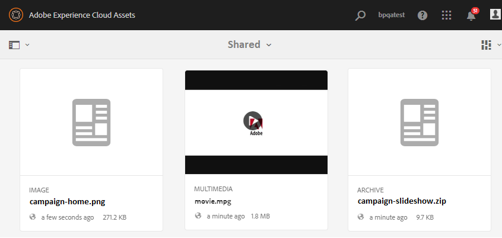

# Basislijnelementen uploaden {#upload-baseline-assets}

AEM beheerder uploadt basislijnactiva in **SHARED** omslag om de gebruikers van het Portaal van het Merk te helpen de types van activa begrijpen die tijdens bijdrage worden vereist. Deze middelen kunnen als verwijzingsinhoud door de gebruikers van het Portaal van het Merk worden gebruikt terwijl het creëren van nieuwe activa voor bijdrage.

**Basiselementen uploaden:**

1. Meld u aan bij de AEM auteur.
Standaard-URL: http:// localhost:4502/aem/start.html
1. Navigeer naar **[!UICONTROL Assets > Files]** en zoek de bijdragemap waarin u de basislijnelementen wilt uploaden.
1. Klik om de bijdragemap te openen. U ziet twee submappen -**[!UICONTROL SHARED]** en **[!UICONTROL NEW]** in de bijdragemap.
1. Klik op **[!UICONTROL SHARED]** map.
1. Klik **[!UICONTROL Create > Files]**  om afzonderlijke elementen te uploaden.
U kunt ook op **[!UICONTROL Create > Folder]** klikken om een map (.zip) met meerdere elementen te uploaden.
   
1. Blader naar basislijnelementen (bestanden/mappen) in de map **[!UICONTROL SHARED]** en upload deze.
   

Als het uploaden is voltooid, kunnen beheerders de map met bijdragen publiceren naar Brand Portal. Zie [Contribute-map publiceren naar Brand Portal](brand-portal-publish-contribution-folder-to-brand-portal.md).