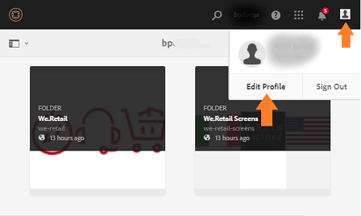

# Overzicht van AEM Assets Brand Portal {#overview-of-aem-assets-brand-portal}

Als markator, moet u soms met kanaalpartners en interne bedrijfsgebruikers samenwerken om, relevante digitale inhoud snel tot stand te brengen te beheren en te leveren aan klanten. De tijdige levering van relevante inhoud over de volledige klantenreis is kritiek aan het drijven van grotere vraag, omzetting, overeenkomst, en klantenloyaliteit.

Het is echter een uitdaging om oplossingen te ontwikkelen die efficiënte en veilige delen van goedgekeurde merklogo&#39;s, richtlijnen, campagnemiddelen of productschoten met uitgebreide interne teams, partners en wederverkopers ondersteunen.

**Adobe Experience Manager (AEM) Assets Brand** Portalis is gericht op de noodzaak van een effectieve samenwerking van de markt met de wereldwijd gedistribueerde gebruikers van het Brand Portal door middel van mogelijkheden voor middelendistributie en het leveren van middelen.

Met Asset Distribution kunt u eenvoudig goedgekeurde creatieve elementen aanschaffen, beheren en veilig distribueren aan externe partijen en interne zakelijke gebruikers op verschillende apparaten. Terwijl gebruikers van het Brand Portal dankzij de bijdrage van Asset Contribution middelen kunnen uploaden naar het Brand Portal en deze kunnen publiceren naar AEM Assets, zonder dat ze toegang hoeven te hebben tot de omgeving van de auteur. De bijdragefunctie wordt aangeroepen als **Middelen bron in Brand Portal**. Samen verbetert het de algemene ervaring van het Brand Portal op het gebied van de distributie van activa en de bijdrage van de gebruikers van het Brand Portal (externe agentschappen/teams), versnelt het de tijd-aan-markt voor activa, en vermindert het risico van niet-naleving en onbevoegde toegang.
Zie [Asset Sourcing in Brand Portal](brand-portal-asset-sourcing.md).

Met de browsergebaseerde portalomgeving kunt u elementen gemakkelijk uploaden, doorbladeren, zoeken, voorvertonen en exporteren in een goedgekeurde indeling.

## AEM Assets configureren met Brand Portal {#configure-brand-portal}

Adobe Experience Manager (AEM) Assets wordt geconfigureerd met Brand Portal via Adobe Developer Console, die een IMS-token aanschaft voor goedkeuring van uw Brand Portal-huurder.

>[!NOTE]
>
>Het configureren van AEM Assets met Brand Portal via Adobe Developer Console wordt ondersteund op AEM Assets als Cloud Service, AEM Assets 6.3 en hoger.

### Vereisten voor het configureren van AEM Assets met Brand Portal {#prerequisites}

U hebt het volgende nodig om AEM Assets te configureren met Brand Portal:

* Een AEM Assets-exemplaar voor gebruik.
* URL van Brand Portal-tenant.
* Een gebruiker met systeembeheerdersbevoegdheden op de IMS-organisatie van de Brand Portal-tenant.

Zie [AEM Assets configureren met merk Poral](../using/configure-aem-assets-with-brand-portal.md) voor meer informatie.

## Personen van gebruikers in Brand Portal {#Personas}

Het Portaal van het merk steunt de volgende gebruikersrollen:

* Gastgebruiker
* Viewer
* Editor
* Beheerder

De volgende lijst maakt een lijst van de taken die de gebruikers in deze rollen kunnen uitvoeren:

|  | **Bladeren** | **Zoeken** | **Downloaden** | **Mappen delen** | **Een verzameling delen** | **Elementen delen als koppeling** | **Toegang tot beheerhulpprogramma&#39;s** |
|--- |--- |--- |--- |--- |--- |--- |--- |
| **Gastgebruiker** | ✓* | ✓* | ✓* | x | x | x | x |
| **Viewer** | ✓ | ✓ | ✓ | x | x | x | x |
| **Editor** | ✓ | ✓ | ✓ | ✓ | ✓ | ✓ | x |
| **Beheerder** | ✓ | ✓ | ✓ | ✓ | ✓ | ✓ | ✓ |

* Gastgebruikers kunnen alleen in openbare mappen en verzamelingen bladeren, er toegang toe hebben en er naar zoeken.

<!--
&#42; Viewer users can access and download the public assets shared with them, and can add these assets to create their own collections.

>[!NOTE]
>
>There is a known issue that the share link for collections is currently visible to the viewer users. The viewer users does not have the privilege to add users to create a share link. This issue will be fixed in the upcoming release, the option to share link for the collections will not be available to the viewer users.
-->

### Gastgebruiker {#guest-user}

Om het even welke gebruiker die beperkte toegang tot activa op het Portaal van het Merk heeft zonder authentificatie te ondergaan is een gastgebruiker. De gastzitting staat gebruikers toegang tot openbare omslagen en inzamelingen toe. Als gastgebruiker, kunt u door activa details doorbladeren en volledige activamening van leden van openbare omslagen en inzamelingen hebben. U kunt openbare activa zoeken, downloaden en toevoegen aan [!UICONTROL Lightbox] inzameling.

De gastsessie beperkt u echter het maken van verzamelingen en opgeslagen zoekopdrachten en deelt deze verder. Gebruikers in een gastsessie hebben geen toegang tot de instellingen voor mappen en verzamelingen en kunnen hun middelen niet als koppeling delen. Hier is een lijst van taken die een gastgebruiker kan uitvoeren:

[Bladeren en openbare middelen openen](browse-assets-brand-portal.md)

[Openbare middelen zoeken](brand-portal-searching.md)

[Overheidsmiddelen downloaden](brand-portal-download-assets.md)

[Elementen toevoegen aan  [!UICONTROL Lightbox]](brand-portal-light-box.md#add-assets-to-lightbox)

### Viewer {#viewer}

Een standaardgebruiker in Brand Portal is doorgaans een gebruiker met de rol van Viewer. Een gebruiker met deze rol heeft toegang tot toegestane mappen, verzamelingen en elementen. De gebruiker kan ook naar elementen (oorspronkelijke of specifieke vertoningen) bladeren, deze voorvertonen, downloaden en exporteren, accountinstellingen configureren en naar elementen zoeken. Hier volgt een lijst met taken die een viewer kan uitvoeren:

[Bladeren door elementen](browse-assets-brand-portal.md)

[Middelen zoeken](brand-portal-searching.md)

[Elementen downloaden](brand-portal-download-assets.md)

### Editor {#editor}

Een gebruiker met de rol van Editor kan alle taken uitvoeren die een Viewer kan uitvoeren. Bovendien kunnen de Editor en de Editor de bestanden en mappen weergeven die een beheerder deelt. De gebruiker met de rol van een Editor kan ook inhoud (bestanden, mappen, verzamelingen) met anderen delen.

Naast de taken die een Viewer kan uitvoeren, kan een Editor de volgende extra taken uitvoeren:

[Mappen delen](brand-portal-sharing-folders.md)

[Een verzameling delen](brand-portal-share-collection.md)

[Elementen delen als koppeling](brand-portal-link-share.md)

### Beheerder {#administrator}

Een beheerder omvat een gebruiker duidelijk als systeembeheerder of Poortbeheerder van het Merk in [!UICONTROL Admin Console]. Een beheerder kan systeembeheerders en gebruikers toevoegen en verwijderen, voorinstellingen definiëren, e-mail verzenden naar gebruikers en portaalgebruik en opslagrapporten weergeven.

Een beheerder kan alle taken uitvoeren die een Redacteur de volgende extra taken kan uitvoeren:

[Gebruikers, groepen en gebruikersrollen beheren](brand-portal-adding-users.md)

[Achtergrond, paginakoppen en e-mails aanpassen](brand-portal-branding.md)

[Aangepaste zoekfacetten gebruiken](brand-portal-search-facets.md)

[Het metagegevensschema gebruiken](brand-portal-metadata-schemas.md)

[Voorinstellingen voor afbeeldingen of dynamische uitvoeringen toepassen](brand-portal-image-presets.md)

[Werken met rapporten](brand-portal-reports.md)

Naast de bovenstaande taken kan een auteur in AEM Assets de volgende taken uitvoeren:

[AEM Assets configureren met Brand Portal](../using/configure-aem-assets-with-brand-portal.md)

[Mappen publiceren naar Brand Portal](https://helpx.adobe.com/experience-manager/6-5/assets/using/brand-portal-publish-folder.html)

[Verzamelingen publiceren naar Brand Portal](https://helpx.adobe.com/experience-manager/6-5/assets/using/brand-portal-publish-collection.html)

## Alternatieve alias voor Brand Portal-URL {#tenant-alias-for-portal-url}

Merkportal 6.4.3 en hoger kunnen organisaties één alternatieve (alias) URL hebben voor de bestaande URL van hun Poorthuurder. De alias-URL kan worden gemaakt door een alternatief voorvoegsel in de URL te plaatsen.\
Merk op dat alleen het voorvoegsel van de Brand Portal-URL kan worden aangepast en niet de volledige URL. Een organisatie met een bestaand domein **[!UICONTROL geomettrix.brand-portal.adobe.com]** kan bijvoorbeeld **[!UICONTROL geomettrixinc.brand-portal.adobe.com]** op verzoek ophalen.

Nochtans, kan de instantie van de Auteur AEM [gevormd ](../using/configure-aem-assets-with-brand-portal.md) slechts met huurder identiteitskaart URL en niet met huurder alias (afwisselend) URL zijn.

>[!NOTE]
>
>Om een alias voor huurdersnaam in bestaande portaal URL te krijgen, moeten de organisaties Adobe steun met een nieuw huurdersalias aanmaakverzoek contacteren. Dit verzoek wordt verwerkt door eerst te controleren of de alias beschikbaar is en vervolgens de alias te maken.
>
>Als u de oude alias wilt vervangen of de oude alias wilt verwijderen, moet hetzelfde proces worden gevolgd.

## Toegang aanvragen tot Brand Portal {#request-access-to-brand-portal}

Gebruikers kunnen toegang tot het Brand Portal aanvragen via het aanmeldingsscherm. Deze verzoeken worden verzonden naar Poortbeheerders van het Merk, die toegang tot gebruikers door de Adobe [!UICONTROL Admin Console] verlenen. Nadat toegang is verleend, ontvangen gebruikers een e-mailbericht.

Ga als volgt te werk om toegang aan te vragen:

1. Selecteer **[!UICONTROL Click here]** corresponderend met **[!UICONTROL Need Access?]** op de aanmeldingspagina van het Brand Portal. Nochtans, om de gastzitting in te gaan, selecteer **[!UICONTROL Click here]** die aan **[!UICONTROL Guest Access?]** beantwoordt.

   

   De pagina [!UICONTROL Request Access] wordt geopend.

1. Als u toegang wilt aanvragen tot het Brand Portal van een organisatie, hebt u een geldige [!UICONTROL Adobe ID], [!UICONTROL Enterprise ID] of [!UICONTROL Federated ID] nodig.

   Meld u in de pagina [!UICONTROL Request Access] aan met uw id (scenario 1) of maak een [!UICONTROL Adobe ID] (scenario 2): 
   ![[!UICONTROL Request access]](assets/bplogin_request_access_2.png)

   **Scenario 1**
   1. Als u [!UICONTROL Adobe ID], [!UICONTROL Enterprise ID], of [!UICONTROL Federated ID] hebt, klik **[!UICONTROL Sign In]**.
De pagina [!UICONTROL Sign in] wordt geopend.
   1. Geef uw [!UICONTROL Adobe ID]-referenties op en klik op **[!UICONTROL Sign in]**. 

   

   U wordt opnieuw gericht aan [!UICONTROL Request Access] pagina. 
   **Scenario 2**
   1. Als u geen [!UICONTROL Adobe ID] hebt, om één tot stand te brengen, klik **[!UICONTROL Get an Adobe ID]** van [!UICONTROL Request Access] pagina.
De pagina [!UICONTROL Sign in] wordt geopend.
   1. Klik op **[!UICONTROL Get an Adobe ID]**.
De pagina [!UICONTROL Sign up] wordt geopend.
   1. Voer uw voornaam en achternaam, e-mailadres en wachtwoord in.
   1. Selecteer **[!UICONTROL Sign up]**. 

   

   U wordt omgeleid aan de [!UICONTROL Request Access] pagina.

1. Op de volgende pagina worden uw naam en e-mailadres weergegeven waarmee u toegang kunt aanvragen. Laat een opmerking achter voor de beheerder en klik op **[!UICONTROL Submit]**. 

   

## Productbeheerders verlenen toegang {#grant-access-to-brand-portal}

Merk Portal-productbeheerders ontvangen toegangsverzoeken in hun Merkortaal-systeemvak en via e-mails in hun postvak.

Om toegang te verlenen, moeten de productbeheerders de relevante melding in het Poortmeldingsgebied van het Merk klikken en dan **[!UICONTROL Grant Access]** klikken.
Of productbeheerders kunnen de koppeling in de e-mail met het toegangsverzoek volgen om naar Adobe [!UICONTROL Admin Console] te gaan en de gebruiker aan de relevante productconfiguratie toe te voegen.

U wordt opnieuw gericht aan [Adobe [!UICONTROL Admin Console]](https://adminconsole.adobe.com/enterprise/overview) homepage. Gebruik Adobe [!UICONTROL Admin Console] om gebruikers tot stand te brengen en hen toe te wijzen aan productprofielen (vroeger genoemd als productconfiguraties), die als groepen in het Portaal van het Merk tonen. Voor meer informatie over het toevoegen van gebruikers in [!UICONTROL Admin Console], zie [Voeg een gebruiker toe ](brand-portal-adding-users.md#add-a-user) (volg Stappen 4-7 in de procedure om een gebruiker toe te voegen).

## Poorttalen {#brand-portal-language} Merk

U kunt de Brand Portal-taal wijzigen van Adobe [!UICONTROL Experience Cloud Settings].

De taal wijzigen:

1. Selecteer [!UICONTROL User] > [!UICONTROL Edit Profile] in het bovenste menu. 

   

1. Selecteer op de pagina [!UICONTROL Experience Cloud Settings] een taal in het vervolgkeuzemenu [!UICONTROL Language].

## Meldingen {#brand-portal-maintenance-notification} over onderhoud aan Brand Portal

Voordat het Brand Portal is gepland voor onderhoud, wordt een melding weergegeven als een banner nadat u zich hebt aangemeld bij Brand Portal. Een voorbeeldmelding:

U kunt dit bericht negeren en doorgaan met het gebruik van Brand Portal. Deze melding wordt in elke nieuwe sessie weergegeven.

## Geen- en systeemgegevens {#release-and-system-information}

* [Wat is er nieuw](whats-new.md)
* [Releaseopmerkingen](brand-portal-release-notes.md)
* [Ondersteunde bestandsindelingen](brand-portal-supported-formats.md)

## Gerelateerde bronnen {#related-resources}

* [Adobe Klantenservice](https://helpx.adobe.com/marketing-cloud/contact-support.html)
* [Forums AEM](https://experienceleaguecommunities.adobe.com/t5/adobe-experience-manager/ct-p/adobe-experience-manager-community)