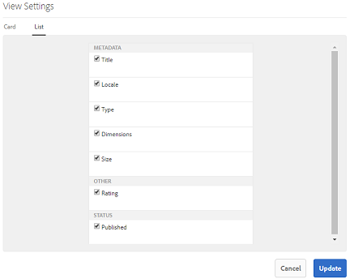
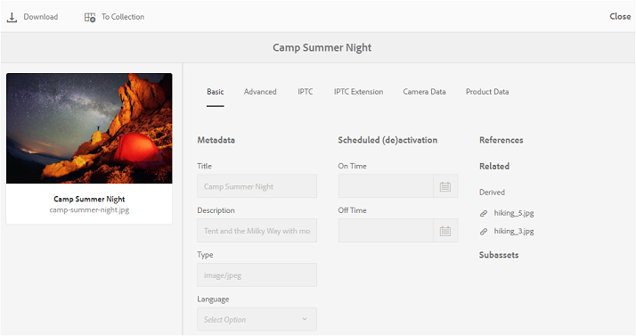

# Zoeken naar middelen op Brand Portal {#browsing-assets-on-brand-portal}

Experience Manager Assets Brand Portal biedt verschillende functies en gebruikersinterface-elementen waarmee u eenvoudig door bronnen kunt bladeren, door de hiërarchieën van elementen kunt navigeren en elementen kunt zoeken met behulp van verschillende weergaveopties.

Het logo van de Experience Manager in de werkbalk boven in het scherm geeft beheerders toegang tot het deelvenster met beheergereedschappen.

De railkiezer linksboven in Brand Portal gaat verder en geeft opties weer om in de hiërarchieën van elementen te navigeren, uw zoekopdracht te stroomlijnen en bronnen weer te geven.

U kunt elementen weergeven, navigeren en selecteren met een van de beschikbare weergaven (Kaart, Kolom en Lijst) in de weergavekiezer van Brand Portal.

## Bronnen weergeven en selecteren {#viewing-and-selecting-resources}

Het bekijken, navigeren, en het selecteren van elk zijn conceptueel het zelfde over alle meningen, maar hebben kleine variaties in behandeling, afhankelijk van de mening u gebruikt.

U kunt de bronnen weergeven, doorbladeren en selecteren (voor verdere actie) met een van de beschikbare weergaven:

* Kolomweergave
* Kaartweergave
* Lijstweergave

### Kaartweergave

In de kaartweergave worden voor elk item op het huidige niveau informatiekaarten weergegeven. Deze kaarten bevatten de volgende gegevens:

* Een visuele weergave van het element/de map.
* Type
* Titel
* Naam
* Datum en tijdstip waarop het activum vanaf AEM aan Brand Portal is gepubliceerd
* Grootte
* Dimensionen

U kunt onderaan de hiërarchie navigeren door kaarten te klikken (die zorgen om de snelle acties) of omhoog opnieuw te vermijden door [ te gebruiken breadcrumbs in de kopbal ](https://experienceleague.adobe.com/en/docs/experience-manager-65/content/sites/authoring/essentials/basic-handling).

#### Kaartweergave voor gebruikers die geen beheerder zijn

Kaarten van mappen geven in de Kaartweergave hiërarchiegegevens weer aan gebruikers die geen beheerder zijn (Editor, Viewer en gastgebruiker). Deze functionaliteit laat de gebruikers de plaats van de omslagen weten die zij, met betrekking tot de ouderhiërarchie toegang hebben.

Informatie over de maphiërarchie is vooral handig om onderscheid te maken tussen mappen met namen die lijken op andere mappen die vanuit een andere maphiërarchie worden gedeeld. Als de gebruikers die geen beheerder zijn niet op de hoogte zijn van de mapstructuur van de elementen die met hen worden gedeeld, lijken elementen/mappen met vergelijkbare namen verwarrend.

* De paden die op de betreffende kaarten worden weergegeven, worden afgekapt om in de kaartgrootten te passen. Gebruikers kunnen het volledige pad echter zien als knopinfo door de muisaanwijzer boven het ingekorte pad te plaatsen.

**optie van het Overzicht om de Eigenschappen van Activa te bekijken**

De optie Overzicht is beschikbaar voor gebruikers die geen beheerder zijn (Editors, Viewers, Gastgebruikers) en geeft de eigenschappen van de middelen in geselecteerde elementen/mappen weer. De optie Overzicht is zichtbaar:

* Kies bovenaan op de werkbalk een middel/map om een bestand/map te selecteren.
* In de vervolgkeuzelijst selecteert u de spoorstaafkiezer.

Wanneer u de optie **[!UICONTROL Overview]** selecteert terwijl een element/map is geselecteerd, kunnen gebruikers de titel, het pad en het tijdstip zien waarop het element is gemaakt. Terwijl de gebruikers op de pagina met elementdetails de optie Overzicht selecteren, metagegevens van het element kunnen bekijken.

#### Instellingen weergeven in de kaartweergave

Het dialoogvenster **[!UICONTROL View Settings]** wordt geopend door **[!UICONTROL View Settings]** te selecteren in de weergavekiezer. Hiermee kunt u de grootte van de elementminiaturen in de kaartweergave aanpassen. Op deze manier kunt u de weergave aanpassen en het aantal weergegeven miniaturen bepalen.

### Lijstweergave

De lijstmening toont informatie voor elk middel op het huidige niveau. De lijstweergave bevat de volgende details:

* Miniatuurafbeelding van elementen
* Naam
* Titel
* Landinstelling
* Type
* Dimension
* Grootte
* Classificatie
* Mappad met middelenhiërarchie
* Datum van publicatie van het element op Brand Portal

Met de padkolom kunt u de middelenlocatie in de mappenhiërarchie gemakkelijk herkennen. U kunt onderaan de hiërarchie navigeren door de middelnaam, en file te klikken door [ te gebruiken breadcrumbs in de kopbal ](https://experienceleague.adobe.com/en/docs/experience-manager-65/content/sites/authoring/essentials/basic-handling).

<!--
Comment Type: draft lastmodifiedby="mgulati" lastmodifieddate="2018-08-17T03:12:05.096-0400" type="annotation">Removed:- "Selecting assets in list view To select all items in the list, use the checkbox at the upper left of the list. When all items in the list are selected, this check box appears checked. To deselect all, click the checkbox. When only some items are selected, it appears with a minus sign. To select all, click the checkbox. To deselect all, click the checkbox again. You can change the order of items using the dotted vertical bar at the far right of each item in the list. Click the vertical selection bar and drag the item to a new position in the list."
 -->

### Instellingen weergeven in de lijstweergave

In de lijstweergave wordt het element **[!UICONTROL Name]** standaard als de eerste kolom weergegeven. Aanvullende informatie, zoals element **[!UICONTROL Title]** , **[!UICONTROL Locale]** , **[!UICONTROL Type]** , **[!UICONTROL Dimensions]** , **[!UICONTROL Size]** en **[!UICONTROL Rating]** , wordt ook weergegeven. U kunt echter wel de kolommen selecteren die u wilt weergeven met **[!UICONTROL View Settings]** .

### Kolomweergave

Met de kolomweergave kunt u door een inhoudsstructuur navigeren door een reeks trapsgewijze kolommen. In deze weergave kunt u de hiërarchie van elementen visualiseren en doorlopen.

Als u een bron selecteert in de eerste (meest linkse) kolom, worden onderliggende bronnen weergegeven in de tweede kolom rechts. Als u een bron in de tweede kolom selecteert, worden onderliggende bronnen in de derde kolom rechts weergegeven, enzovoort.

U kunt omhoog en omlaag navigeren in de boom. Klik op de naam van de bron of op de chevron rechts van de naam van de bron.

* De naam van de bron en chevron worden gemarkeerd wanneer erop wordt geklikt.
* Als u op de miniatuur tikt of erop klikt, wordt de bron geselecteerd.
* Als deze optie is geselecteerd, wordt een vinkje boven de miniatuur geplaatst en wordt de naam van de bron gemarkeerd.
* De details van de geselecteerde bron worden getoond in de definitieve kolom.

Wanneer een element is geselecteerd in de kolomweergave, wordt in de laatste kolom een visuele weergave van het element weergegeven, samen met de volgende details:

* Titel
* Naam
* Dimensionen
* Datum en tijdstip waarop het activum vanaf AEM aan Brand Portal is gepubliceerd
* Grootte
* Type
* Meer informatie bij de detailpagina van het element

<!--
Comment Type: draft

<h3>Selecting Resources</h3>
-->

<!--
Comment Type: draft

Selecting a specific resource depends on a combination of the view and the device:

-->

<!--
Comment Type: draft

<table border="1" cellpadding="1" cellspacing="0" width="100%">
<tbody>
<tr>
<td> </td>
<td>Select</td>
<td>Deselect</td>
</tr>
<tr>
<td>Column View  </td>
<td>
<ul>
<li>Desktop:  Mouseover, then use the check mark quick action</li>
<li>Mobile device:  Tap the thumbnail</li>
</ul> </td>
<td>
<ul>
<li>Desktop:  Click the thumbnail</li>
<li>Mobile device:  Tap the thumbnail</li>
</ul> </td>
</tr>
<tr>
<td>Card View  </td>
<td>
<ul>
<li>Desktop:  Mouseover, then use the check mark quick action</li>
<li>Mobile device:  Tap-and-hold the card</li>
</ul> </td>
<td>
<ul>
<li>Desktop:  Click the card</li>
<li>Mobile device:  Tap the card</li>
</ul> </td>
</tr>
<tr>
<td>List View</td>
<td>
<ul>
<li>Desktop:  Mouseover, then use the check mark quick action</li>
<li>Mobile device:  Tap the thumbnail</li>
</ul> </td>
<td>
<ul>
<li>Desktop:  Click the thumbnail</li>
<li>Mobile device:  Tap the thumbnail</li>
</ul> </td>
</tr>
</tbody>
</table>
-->

<!--
Comment Type: draft

Deselecting All
-->

<!--
Comment Type: draft

In all cases, as you select items the count of the items selected is displayed at the upper right of the toolbar.

You can deselect all items and exit selection mode by clicking the X next to the count.

-->

<!--
Comment Type: draft

In all views, all items can be deselected by clicking escape on the keyboard if you are using a desktop device.

-->

## Inhoudsstructuur {#content-tree}

Naast deze weergaven gebruikt u de structuurweergave om de hiërarchie van elementen omlaag te doorlopen terwijl u de gewenste elementen of mappen weergeeft en selecteert.

Als u de boomstructuurweergave wilt openen, klikt u op de railkiezer linksboven en selecteert u de **[!UICONTROL Content tree]** in het menu.

Navigeer vanuit de inhoudshiërarchie naar het gewenste element.

## Details van element {#asset-details}

Met de pagina met elementdetails kunt u een element weergeven, downloaden, de koppeling van het element delen, naar een verzameling verplaatsen of de eigenschappenpagina van het element weergeven. U kunt ook achtereenvolgens op de detailpagina van andere elementen in dezelfde map navigeren.

Als u de metagegevens van het element wilt weergeven of de verschillende uitvoeringen wilt bekijken, gebruikt u de railkiezer op de pagina met de elementdetails.

U kunt alle beschikbare uitvoeringen van het element weergeven op de pagina met elementdetails en een vertoning selecteren in het deelvenster **[!UICONTROL Renditions]** om een voorvertoning weer te geven.

<!-- removed as it is fixed in 2022.02.0 release
>[!CAUTION]
>
>(**Experience Manager Assets as a Cloud Service** only) The following known issues will be fixed in the upcoming release:
>
>The **[!UICONTROL Renditions]** panel does not list all the static renditions of the assets that are published to Brand Portal after December 16, 2021.
>
>The **[!UICONTROL Renditions]** panel lists the smart crop renditions of the asset, however, the user cannot preview or download the smart crop renditions.
-->

Als u de pagina met eigenschappen van elementen wilt openen, gebruikt u de optie **[!UICONTROL Properties (p)]** in de bovenste balk.

U kunt ook een lijst weergeven met alle gerelateerde elementen (bron of afgeleide elementen op AEM) op de eigenschappenpagina van een element, aangezien de elementrelatie ook van AEM naar Brand Portal wordt gepubliceerd.
