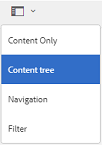

# Browse assets on Brand Portal {#browsing-assets-on-brand-portal}

AEM Assets Brand Portal provides various capabilities and user interface elements that facilitate browsing through resources, traversing asset hierarchies, and searching assets while using different view options.

AEM logo in the AEM toolbar at the top facilitates admin users to access administrative tools panel.

 

De kiezer voor het spoor linksboven in Brand Portal zet de keuzelijst neer om opties beschikbaar te maken waarmee u in de hiërarchieën van middelen kunt navigeren, uw zoekopdracht kunt stroomlijnen en bronnen kunt weergeven.

You can view, navigate through, and select assets using any of the available views (Card, Column, and List) in the view selector at the upper right in Brand Portal.

## Viewing and Selecting Resources {#viewing-and-selecting-resources}

Viewing, navigating, and selecting each are conceptually the same across all views, but have small variations in handling, depending on the view you are using.

You can view, navigate through, and select (for further action) your resources with any of the available views:

* Kolomweergave
* Card View
* List View

### Card View

In de kaartweergave worden voor elk item op het huidige niveau informatiekaarten weergegeven. Deze kaarten bevatten de volgende gegevens:

* Een visuele weergave van het element/de map.
* Type
* Titel
* Naam
* Date and time when asset was published to Brand Portal from AEM
* Grootte
* Dimensies

You can navigate down the hierarchy by tapping/clicking cards (taking care to avoid the quick actions) or up again by using the [breadcrumbs in the header](https://helpx.adobe.com/experience-manager/6-5/sites/authoring/using/basic-handling.html#TheHeader).

#### Kaartweergave voor gebruikers die geen beheerder zijn

Kaarten van mappen geven in de Kaartweergave hiërarchiegegevens weer aan gebruikers die geen beheerder zijn (Editor, Viewer en gastgebruiker). Deze functionaliteit laat de gebruikers de plaats van de omslagen kennen, die zij, met betrekking tot de ouderhiërarchie toegang hebben.
Informatie over de maphiërarchie is vooral handig om onderscheid te maken tussen de mappen waarvan de namen overeenkomen met andere mappen die vanuit een andere maphiërarchie worden gedeeld. Als de gebruikers die geen beheerder zijn niet op de hoogte zijn van de mapstructuur van de elementen die met hen worden gedeeld, lijken elementen/mappen met vergelijkbare namen verwarrend.

* De paden die op de betreffende kaarten worden weergegeven, worden afgekapt om in de kaartgrootten te passen. However, users can see the full path as a tool-tip on hovering over the truncated path.

**Overzicht, optie om de eigenschappen van elementen weer te geven**

Overview option is available to non-admin users (Editors, Viewers, Guest users) to view Asset Properties of selected assets/folders. De optie Overzicht is zichtbaar:

* in de werkbalk bovenaan bij het selecteren van een middel/map.
* in the drop-down on selecting the rail Selector.

On selecting the **[!UICONTROL Overview]** option while an asset/folder is selected, users can see the title, path, and time of asset creation. Terwijl de gebruiker met de optie Overzicht op de pagina met elementdetails de metagegevens van het element kan bekijken.

#### Instellingen weergeven in de kaartweergave

**[!UICONTROL View Settings]** wordt geopend bij het selecteren **[!UICONTROL View Settings]** vanuit de weergavekiezer. Hiermee kunt u de grootte van de elementminiaturen in de kaartweergave wijzigen. Op deze manier kunt u de weergave aanpassen en het aantal weergegeven miniaturen bepalen.

### List View

The list view displays information for each resource at the current level. List view provides the following details:

* Miniatuurafbeelding van elementen
* Naam
* Titel
* Landinstelling
* Type
* Dimensie
* Grootte
* Classificatie
* Folder path showing asset hierarchy*
* Datum van publicatie van het middel op de Brand Portal

Met de padkolom kunt u de middelenlocatie in de mappenhiërarchie gemakkelijk herkennen. You can navigate down the hierarchy by tapping/clicking the resource name, and back up by using the [breadcrumbs in the header](https://helpx.adobe.com/experience-manager/6-5/sites/authoring/using/basic-handling.html#TheHeader).

<!--
Comment Type: draft lastmodifiedby="mgulati" lastmodifieddate="2018-08-17T03:12:05.096-0400" type="annotation">Removed:- "Selecting assets in list view To select all items in the list, use the checkbox at the upper left of the list. When all items in the list are selected, this check box appears checked. To deselect all, click or tap the checkbox. When only some items are selected, it appears with a minus sign. To select all, click or tap the checkbox. To deselect all, click or tap the checkbox again. You can change the order of items using the dotted vertical bar at the far right of each item in the list. Tap/click the vertical selection bar and drag the item to a new position in the list."
 -->

### View settings in list view

In de lijstweergave wordt **[!UICONTROL Name]** standaard de eerste kolom weergegeven. De extra informatie, zoals activa **[!UICONTROL Title]**, **[!UICONTROL Locale]**, **[!UICONTROL Type]**, **[!UICONTROL Dimensions]**, **[!UICONTROL Size]**, **[!UICONTROL Rating]**, wordt ook getoond. However, you can select the columns to be shown using **[!UICONTROL View Settings]**.

### Kolomweergave

Met de kolomweergave kunt u door een inhoudsstructuur navigeren door een reeks trapsgewijze kolommen. This view helps you visualize and traverse the asset hierarchy.

Selecting a resource in the first (leftmost) column displays child resources in the second column to the right. Selecting a resource in the second column displays child resources in the third column to the right, and so on.

U kunt omhoog en omlaag navigeren in de boom door op de middelnaam of de chevron rechts van de middelnaam te tikken of te klikken.

* The resource name and chevron are highlighted when tapped or clicked.
* Tapping or clicking the thumbnail selects the resource.
* When selected, a check mark is overlaid on the thumbnail and the resource name is highlighted.
* De details van de geselecteerde bron worden getoond in de definitieve kolom.

When an asset is selected in column view, visual representation of the asset is displayed in the final column along with the following details:

* Titel
* Naam
* Dimensies
* Date and time when asset was published to Brand Portal from AEM
* Grootte
* Type
* Meer informatie, optie om op de detailpagina van het element te gaan

<!--
Comment Type: draft

<h3>Selecting Resources</h3>
-->

<!--
Comment Type: draft

Selecting a specific resource depends on a combination of the view and the device:

-->

<!--
Comment Type: draft

<table border="1" cellpadding="1" cellspacing="0" width="100%">
<tbody>
<tr>
<td> </td>
<td>Select</td>
<td>Deselect</td>
</tr>
<tr>
<td>Column View  </td>
<td>
<ul>
<li>Desktop:  Mouseover, then use the check mark quick action</li>
<li>Mobile device:  Tap the thumbnail</li>
</ul> </td>
<td>
<ul>
<li>Desktop:  Click the thumbnail</li>
<li>Mobile device:  Tap the thumbnail</li>
</ul> </td>
</tr>
<tr>
<td>Card View  </td>
<td>
<ul>
<li>Desktop:  Mouseover, then use the check mark quick action</li>
<li>Mobile device:  Tap-and-hold the card</li>
</ul> </td>
<td>
<ul>
<li>Desktop:  Click the card</li>
<li>Mobile device:  Tap the card</li>
</ul> </td>
</tr>
<tr>
<td>List View</td>
<td>
<ul>
<li>Desktop:  Mouseover, then use the check mark quick action</li>
<li>Mobile device:  Tap the thumbnail</li>
</ul> </td>
<td>
<ul>
<li>Desktop:  Click the thumbnail</li>
<li>Mobile device:  Tap the thumbnail</li>
</ul> </td>
</tr>
</tbody>
</table>
-->

<!--
Comment Type: draft

<h4>Deselecting All</h4>
-->

<!--
Comment Type: draft

In all cases, as you select items the count of the items selected is displayed at the upper right of the toolbar.

You can deselect all items and exit selection mode by clicking or tapping the X next to the count.

-->

<!--
Comment Type: draft

In all views, all items can be deselected by tapping escape on the keyboard if you are using a desktop device.

-->

## Content Tree {#content-tree}

In addition to these views, use the tree view to drill down the asset hierarchy while you view and select desired assets or folders.

Als u de structuurweergave wilt openen, tikt u op de railkiezer linksboven en selecteert u deze in het **[!UICONTROL Content tree]** menu.

Navigeer vanuit de inhoudshiërarchie naar het gewenste element.

## Asset Details {#asset-details}

Asset detail page lets you view an asset, download, share asset&#39;s link, move it to a collection, or view its properties page. Hiermee kunt u ook door de detailpagina van andere elementen in dezelfde map navigeren.

To view the asset&#39;s metadata, or view its various renditions, use the rail selector on asset detail page.

You can view all the available renditions of the asset on asset details page, and select a rendition to preview it.

To open the asset properties page, use **[!UICONTROL Properties (p)]** option from the top bar.

U kunt ook een lijst weergeven met alle gerelateerde elementen (bron of afgeleide elementen in AEM) op de eigenschappenpagina van een element, aangezien de elementrelatie ook van AEM naar Brand Portal wordt gepubliceerd.
