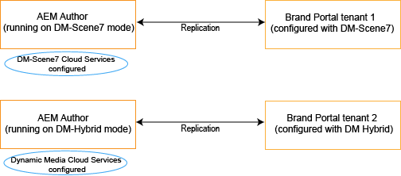

# Dynamische video-ondersteuning op Brand Portal {#dynamic-video-support-on-brand-portal}

U kunt video&#39;s adaptief voorvertonen en afspelen op Brand Portal met ondersteuning voor Dynamic Media. Download ook de dynamische uitvoeringen van de portal en de gedeelde koppelingen.
Brand Portal-gebruikers kunnen:

* Een voorvertoning weergeven van video&#39;s op de pagina Asset Details, de Kaartweergave en de voorbeeldpagina voor het delen van koppelingen.
* Video-coderingen afspelen op de pagina Asset Details.
* Geef dynamische uitvoeringen weer op het tabblad Uitvoeringen op de pagina Asset Details.
* Download videocoderingen en mappen met video&#39;s.

>[!NOTE]
>
>Om met video&#39;s te werken en hen te publiceren aan Brand Portal, zorg ervoor dat uw instantie van de Auteur van de Experience Manager opstelling of op Dynamic Media Hybrid wijze of Dynamic Media is **[!DNL Scene7]** in.

Voor het voorvertonen, afspelen en downloaden van video&#39;s stelt Brand Portal de volgende twee configuraties beschikbaar aan beheerders:

* [Dynamic Media Hybride configuratie](#configure-dm-hybrid-settings)
Als de instantie Auteur van de Experience Manager op dynamische media Hybride wijze loopt.
* [Dynamic Media [!DNL Scene7] configuratie](#configure-dm-scene7-settings)
Als de Experience Manager Author-instantie wordt uitgevoerd op dynamische media-**[!DNL Scene7]** in.
Plaats één van beide configuraties die op de configuraties worden gebaseerd u in uw instantie van de Auteur van de Experience Manager plaatst waarmee de huurder van Brand Portal wordt herhaald.

>[!NOTE]
>
>Dynamische video&#39;s worden niet ondersteund op Brand Portal-huurders die zijn geconfigureerd met Experience Manager Author die wordt uitgevoerd **[!UICONTROL Scene7Connect]** uitvoeringsmodus.

## Hoe worden dynamische video&#39;s afgespeeld? {#how-are-dynamic-videos-played}

Als Dynamic Media-configuraties ([Hybride](../using/dynamic-video-brand-portal.md#configure-dm-hybrid-settings) of [[!DNL Scene7]](../using/dynamic-video-brand-portal.md#configure-dm-scene7-settings) configuraties) worden ingesteld op Brand Portal, worden de dynamische uitvoeringen opgehaald van **[!DNL Scene7]** server. Videocoderingen worden daarom onmiddellijk voorvertoond en afgespeeld en de kwaliteit wordt verstoord.

Aangezien videocoderingen niet in de gegevensopslagplaats van Brand Portal worden opgeslagen en van worden gehaald **[!DNL Scene7]** -server, moet u ervoor zorgen dat de Dynamic Media-configuraties op Adobe Experience Manager Author Instance en Brand Portal gelijk zijn.

>[!NOTE]
>
>Videoviewers en viewervoorinstellingen worden niet ondersteund in Brand Portal. Video&#39;s worden voorvertoond en afgespeeld op standaardviewers in Brand Portal.

## Vereisten {#prerequisites}

Als u met dynamische video&#39;s wilt werken op Brand Portal, moet u:

* **Auteur van Experience Manager starten in de Dynamic Media-modus**
Start de Experience Manager Author-instantie (waarmee Brand Portal is geconfigureerd) in [Dynamic Media - [!DNL Scene7] mode](https://experienceleague.adobe.com/docs/experience-manager-65/assets/dynamic/config-dms7.html?lang=en#enabling-dynamic-media-in-scene-mode) of in [Dynamic Media - Hybride modus](https://experienceleague.adobe.com/docs/experience-manager-65/assets/dynamic/config-dynamic.html) of
* **Dynamic Media-Cloud Services configureren voor auteur van Experience Manager**
Op basis van de Dynamic Media-modus (Scene7-modus of hybride modus) waarop de Experience Manager-auteur is ingeschakeld, stelt u een van de [Dynamic Media Cloud Services ([!DNL Scene7] modus)](https://experienceleague.adobe.com/docs/experience-manager-65/assets/dynamic/config-dms7.html?lang=en#configuring-dynamic-media-cloud-services) of [Dynamic Media-Cloud Services (hybride modus)](https://experienceleague.adobe.com/docs/experience-manager-65/assets/dynamic/config-dynamic.html?lang=en#configuring-dynamic-media-cloud-services) op Experience Manager Auteur van **Gereedschappen** | **Cloud Services** | **Dynamic Media**.
* **Dynamic Media configureren op Brand Portal**
Configureer op basis van de Dynamic Media-cloudconfiguraties op Experience Manager Author [Dynamic Media-instellingen](#configure-dm-hybrid-settings) of [[!DNL Scene7] instellingen](#configure-dm-scene7-settings) uit Brand Portal-beheertools.
Controleer of [aparte Brand Portal-huurders](#separate-tenants) worden gebruikt voor instanties van de Auteur van de Experience Manager die in Dynamic Media - worden gevormd **[!UICONTROL Scene7]** en Dynamic Media - hybride modus. Vooral als u functies van Dynamic Media gebruikt **[!UICONTROL S7]** en Dynamic Media Hybrid.
* **Mappen publiceren waarop videocodering is toegepast op Brand Portal**
Toepassen [videocoderingen](https://experienceleague.adobe.com/docs/experience-manager-65/assets/dynamic/video-profiles.html) en publiceert u de map met rich media-elementen van de Experience Manager Author-instantie naar Brand Portal.
* **IPs van de Lijst van gewenste personen van de Afbraak in SPS als veilige voorproef toegelaten**
Als u Dynamic Media gebruikt-**[!DNL Scene7]** (met [beveiligde voorvertoning ingeschakeld](https://experienceleague.adobe.com/docs/dynamic-media-classic/using/upload-publish/testing-assets-making-them-public.html) voor een onderneming), wordt het advies gegeven dat **[!DNL Scene7]** bedrijfsbeheerder [lijst van gewenste personen de openbare uitgang IPs](https://experienceleague.adobe.com/docs/dynamic-media-classic/using/upload-publish/testing-assets-making-them-public.html#testing-the-secure-testing-service) voor de respectieve regio&#39;s die SPS gebruiken (**[!UICONTROL Scene7]** Flash-interface (Publishing System).
De IP&#39;s van de egress zijn als volgt:

| **Regio** | **IP van de uitgang** |
|--- |--- |
| NA | 130.248.160.68,  20.94.203.130 |
| EMEA | 185.34.189.3,  51.132.146.75 |
| APAC | 63.140.44.54 |

Om één van beiden van deze uitgang IPs toe te staan, zie [uw account voorbereiden voor een veilige testservice](https://experienceleague.adobe.com/docs/dynamic-media-classic/using/upload-publish/testing-assets-making-them-public.html#testing-the-secure-testing-service).

## Best practices voor

Voer de volgende handelingen uit om ervoor te zorgen dat u een voorvertoning van uw dynamische video-elementen kunt weergeven, deze kunt afspelen en van Brand Portal kunt downloaden (en gedeelde koppelingen):

### Afzonderlijke huurders voor Dynamic Media - Scene7 en Dynamic Media - Hybride modi {#separate-tenants}

Als u zowel Dynamic Media als **[!DNL Scene7]** modus en Dynamic Media - Hybride modusfuncties, gebruik verschillende Brand Portal-huurders voor Experience Manager Author-instanties geconfigureerd met Dynamic Media - **[!DNL Scene7]** en Dynamic Media - Hybride modi.

### Dezelfde configuratiedetails bij de instantie van de Auteur van de Experience Manager en Brand Portal

Zorg ervoor dat de configuratiegegevens in Brand Portal gelijk zijn en **[!UICONTROL Experience Manager Cloud Configuration]**. Dezelfde configuratiedetails bevatten het volgende:

* **[!UICONTROL Title]**
* **[!UICONTROL Registration ID]**
* **[!UICONTROL Video Service URL]** in **[!UICONTROL Dynamic Media - Hybrid mode]**
* **[!UICONTROL Title]**
* Referenties (**[!UICONTROL Email]** en wachtwoord)
* **[!UICONTROL Region]**
* **[!UICONTROL Company]** in Dynamic Media - **[!DNL Scene7]** mode

### Lijst van gewenste personen openbare uitgang IPs voor de wijze van Scene7 van Dynamic Media

If Dynamic Media **[!UICONTROL Scene7]**-hebben [beveiligde voorvertoning ingeschakeld](https://experienceleague.adobe.com/docs/dynamic-media-classic/using/upload-publish/testing-assets-making-them-public.html)-wordt gebruikt om video-elementen aan Brand Portal te leveren, en **[!UICONTROL Scene7]** wordt een speciale imageserver voor het opvoeren van omgevingen of interne toepassingen ingesteld. Om het even welk verzoek aan deze server controleert het oorsprongIP adres. Als het inkomende verzoek niet binnen de goedgekeurde lijst van IP adressen is, is een mislukkingsreactie teruggekeerd.
De **[!UICONTROL Scene7]** De Beheerder van het bedrijf, daarom vormt een goedgekeurde lijst van IP adressen voor hun bedrijf **[!UICONTROL Secure Testing]** milieu, door **[!UICONTROL SPS]** Flash-gebruikersinterface (Scene7 Publishing System). Zorg ervoor dat de IP van de uitgang voor uw respectieve gebied (van het volgende) aan die goedgekeurde lijst wordt toegevoegd.
Om één van beiden van deze uitgang IPs toe te staan, zie [uw account voorbereiden voor een veilige testservice](https://experienceleague.adobe.com/docs/dynamic-media-classic/using/upload-publish/testing-assets-making-them-public.html#testing-the-secure-testing-service).
De IP&#39;s van de uitgang zijn als volgt:

| **Regio** | **IP van de uitgang** |
|--- |--- |
| NA | 130.248.160.68, 20.94.203.130 |
| EMEA | 51.132.146.75, 130.248.244.202, 130.248.244.203, 130.248.244.204, 130.248.244.210, 130.248.244.211, 130.248.244.212 |
| APAC | 63.140.44.54 |

## Dynamic Media-instellingen (hybride) configureren {#configure-dm-hybrid-settings}

Als de instantie Auteur van de Experience Manager op dynamische media hybride wijze loopt, dan gebruik **[!UICONTROL Video]** tegel uit het deelvenster met beheergereedschappen om Dynamic Media-gatewayinstellingen te configureren.

>[!NOTE]
>
>De [videocoderingsprofielen](https://experienceleague.adobe.com/docs/experience-manager-65/assets/dynamic/video-profiles.html) worden niet gepubliceerd naar Brand Portal, maar worden opgehaald van de **[!UICONTROL Scene7]** server. Zorg er daarom voor dat de configuratiegegevens gelijk zijn aan de [Dynamic Media Cloud Services ([!DNL Scene7] modus)](https://experienceleague.adobe.com/docs/experience-manager-65/assets/dynamic/config-dms7.html?lang=en#configuring-dynamic-media-cloud-services) in uw instantie Auteur van de Experience Manager.

Dynamic Media-configuraties instellen op Brand Portal-huurders:

1. Selecteer het logo van de Experience Manager, zodat u toegang hebt tot de beheergereedschappen via de werkbalk boven in het scherm, in Brand Portal.
1. Selecteer in het deelvenster met beheergereedschappen de optie **[!UICONTROL Video]** tegel.

   

   **[!UICONTROL Edit Dynamic Media Configuration]** pagina wordt geopend.

   

1. Opgeven **[!UICONTROL Registration ID]** en **[!UICONTROL Video Service URL]** (DM-Gateway URL). Zorg ervoor dat deze gegevens overeenkomen met de gegevens in **[!UICONTROL Tools > Cloud Services]** in uw instantie Auteur van de Experience Manager.
1. Selecteren **Opslaan** om de configuratie op te slaan.

## Dynamic Media Scene7-instellingen configureren {#configure-dm-scene7-settings}

Als de Experience Manager Author-instantie wordt uitgevoerd op Dynamic Media- **[!UICONTROL Scene7]** modus, dan gebruiken **[!UICONTROL Dynamic Media Configuration]** tegel uit het deelvenster met beheergereedschappen om het **[!UICONTROL Scene7]** serverinstellingen.

Dynamic Media instellen **[!UICONTROL Scene7]** configuraties op Brand Portal-huurders:

1. Selecteer het logo van de Experience Manager, zodat u toegang hebt tot de beheergereedschappen via de werkbalk boven in het scherm, in Brand Portal.

2. Selecteer in het deelvenster met beheergereedschappen de optie **[!UICONTROL Dynamic Media Configuration]** tegel.

   ![DM [!UICONTROL Scene 7] configuratie op Brand Portal](assets/DMS7-Tile.png)

   **[!UICONTROL Edit Dynamic Media Configuration]** pagina wordt geopend.

   

3. Geef:

   * **[!UICONTROL Title]**
   * Referenties (**[!UICONTROL Email ID]** en **[!UICONTROL Password]**) voor toegang tot de Scene7-server
   * **[!UICONTROL Region]**

   Zorg ervoor dat deze waarden gelijk zijn aan de waarden in de Experience Manager Author-instantie.

4. Selecteer **[!UICONTROL Connect to Dynamic Media]**.

5. Geef de **[!UICONTROL Company name]**, en **[!UICONTROL Save]** de configuratie.
