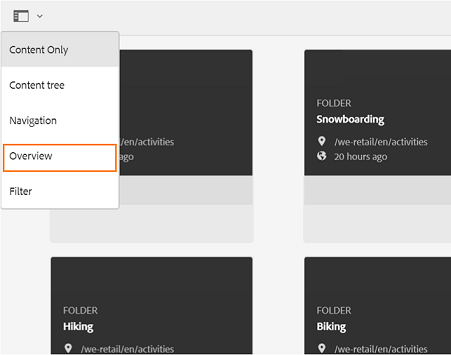

# Toegang voor gasten tot Brand Portal {#guest-access-to-brand-portal}

Experience Manager Assets Brand Portal biedt gasttoegang tot het portaal. Een gastgebruiker heeft geen geloofsbrieven nodig om het portaal in te gaan en heeft toegang tot de openbare activa (en inzamelingen) van het portaal. De gebruikers in de gastzitting kunnen activa aan lichtbak (privé inzameling) toevoegen en het zelfde downloaden tot hun zitting duurt of tenzij de gastgebruiker verkiest om [[!UICONTROL End Session]](#exit-guest-session). Een sessie voor gastgebruikers blijft 15 minuten actief, terwijl de werkelijke time-out voor gastgebruikers 2 uur bedraagt.

Gasttoegang biedt organisaties de mogelijkheid om [snel goedgekeurde middelen delen](../using/brand-portal-sharing-folders.md#how-to-share-folders) met het beoogde publiek op grote schaal, zonder dat het aan boord hoeft te zijn. Brand Portal 6.4.2 en hoger is uitgerust om meerdere gelijktijdige gastgebruikers te bedienen, wat 10% van de totale gebruikersquota per organisatie is. Door gasttoegang toe te staan, bespaart u tijd om scores van gebruikers met beperkte functionaliteit op Brand Portal te beheren en aan boord te hebben.\
Organisaties kunnen gasttoegang inschakelen (of uitschakelen) voor Brand Portal-account van de organisatie met **[!UICONTROL Allow Guest Access]** optie van **[!UICONTROL Access]** instellingen in het deelvenster met beheergereedschappen.

<!--
Comment Type: annotation
Last Modified By: mgulati
Last Modified Date: 2018-08-17T10:42:59.879-0400
Removed the first para: "AEM Assets Brand Portal allows public users to enter the portal anonymously and have restricted access to the allowed public resources as guests. Organization users with guest role need not seek access and authentication from administrators."
-->

## Beginnen met gastsessie {#begin-guest-session}

Als u Brand Portal anoniem wilt invoeren, selecteert u **[!UICONTROL Click here]** overeenkomend met **[!UICONTROL Guest Access?]** op het welkomstscherm van Brand Portal. Voer de beveiligingscontrole van Captcha in om toegang te verlenen tot het gebruik van de Brand Portal.

## Duur gastsessie {#guest-session-duration}

Een gastgebruikerssessie blijft 15 minuten actief.
Dit betekent dat de toestand van de **[!UICONTROL Lightbox]** wordt bewaard gedurende 15 minuten van de tijd van het zittingsbegin, en na dat de huidige gastzitting opnieuw begint zodat wordt de Lichtbakstaat verloren.

Een gastgebruiker heeft zich bijvoorbeeld 1500 uur aangemeld bij Brand Portal en voegt middelen toe aan **[!UICONTROL Lightbox]** voor downloaden om 15.05 uur. Als de gebruiker de **[!UICONTROL Lightbox]** De gebruiker moet de sessie opnieuw starten voordat de sessie (of de bijbehorende middelen) vóór 15:15 uur (binnen 15 minuten na aanmelding) is opgehaald. De **[!UICONTROL Lightbox]** is leeg, wat betekent dat de geüploade elementen niet meer beschikbaar zijn als de sessie verloren is gegaan.

## Gelijktijdige gastsessies toegestaan {#concurrent-guest-sessions-allowed}

Het aantal gelijktijdige gastsessies is beperkt tot 10% van de totale gebruikersquota per organisatie. Het betekent voor een organisatie met gebruikersquota van 200, maximaal 20 gastgebruikers kunnen tezelfdertijd werken. De 21ste gebruiker wordt ontzegd toegang, en kan als gast slechts toegang hebben als de zitting van om het even welke 20 actieve gastgebruikers beëindigt.

>[!NOTE]
>
>Brand Portal verzendt geen melding als het aantal gebruikers met licentie de contractueel vastgelegde waarde (quota) overschrijdt. Bovendien worden de activiteiten van de gebruikers met een licentie niet beperkt.

## Gebruikersinteractie Gast met Brand Portal {#guest-user-interaction-with-brand-portal}

### Navigatie gastinterface

Wanneer gebruikers de Brand Portal als gast betreden, kunnen ze alle [elementen en mappen gedeeld](../using/brand-portal-sharing-folders.md#sharefolders) uitsluitend openbaar of met gastgebruikers. Deze weergave is de weergave alleen voor inhoud. In deze weergave worden elementen in de kaart-, lijst- of kolomindeling weergegeven.

De gastgebruikers zien echter de mappenstructuur (te beginnen met de hoofdmap) en de gedeelde mappen die in hun respectieve bovenliggende mappen zijn gerangschikt bij het aanmelden bij de Brand Portal, als beheerders deze optie hebben ingeschakeld [Maphiërarchie inschakelen](../using/brand-portal-general-configuration.md#main-pars-header-1621071021) configuratie.

Deze bovenliggende mappen zijn de virtuele mappen en er kunnen geen handelingen op worden uitgevoerd. U kunt deze virtuele mappen herkennen met een vergrendelingspictogram.

Er zijn geen actietaken zichtbaar bij het aanwijzen of selecteren van de taken in **[!UICONTROL Card View]**, in tegenstelling tot de gedeelde mappen. **[!UICONTROL Overview]** wordt weergegeven wanneer u een virtuele map selecteert in **[!UICONTROL Column View]** en **[!UICONTROL List View]**.

>[!NOTE]
>
>De standaardminiatuur van de virtuele mappen is de miniatuurafbeelding van de eerste gedeelde map.

   

**[!UICONTROL View Settings]** optie staat gastgebruikers toe om kaartgrootte in aan te passen **[!UICONTROL Card View]** of kolommen die moeten worden weergegeven in **[!UICONTROL List View]**.

De **[!UICONTROL Content tree]** Hiermee kunt u de hiërarchie van elementen doorlopen.

Brand Portal biedt **[!UICONTROL Overview]** optie voor gastgebruikers om te bekijken **[!UICONTROL Asset Properties]** van geselecteerde elementen/mappen. De **[!UICONTROL Overview]** is zichtbaar:

* Selecteer bovenaan op de werkbalk een middel/map.
* In de vervolgkeuzelijst selecteert u de spoorkiezer.

Bij het selecteren van de **[!UICONTROL Overview]** als er een element/map is geselecteerd, kunnen gebruikers de titel, het pad en het tijdstip van het maken van het element zien. Overwegende dat op de pagina met elementdetails **[!UICONTROL Overview]** Hiermee kunnen de gebruikers metagegevens van het element zien.

**[!UICONTROL Navigation]** met de optie in het linkerspoor kunt u van bestanden naar verzamelingen navigeren en in de gastsessie teruggaan, zodat gebruikers door elementen in bestanden of verzamelingen kunnen bladeren.

**[!UICONTROL Filter]** gastgebruikers kunnen middelenbestanden en mappen filteren met behulp van zoekvoorspelden die door de beheerder zijn ingesteld.

### Mogelijkheden voor gastgebruikers

Gastgebruikers hebben toegang tot openbare middelen op Brand Portal en hebben ook weinig beperkingen, zoals verder wordt besproken.

**Gastgebruikers kunnen**:

* Open alle openbare mappen en verzamelingen die voor alle Brand Portal-gebruikers zijn bedoeld.
* Blader door leden, detailpagina en heb de volledige elementweergave van de leden van alle openbare mappen en verzamelingen.
* Middelen zoeken in openbare mappen en verzamelingen.
* Elementen toevoegen aan lichtbakverzameling. Deze veranderingen in de inzameling blijven tijdens de zitting bestaan.
* Download elementen rechtstreeks of via lichtbakverzameling.

**Gastgebruikers kunnen**:

* Maak verzamelingen en opgeslagen zoekopdrachten of deel deze verder.
* Toegang tot de instellingen voor mappen en verzamelingen.
* Elementen delen als koppelingen.

### Elementen downloaden in gastsessie

Gastgebruikers kunnen elementen die algemeen of exclusief met gastgebruikers worden gedeeld, rechtstreeks downloaden op Brand Portal. Gastgebruikers kunnen ook elementen toevoegen aan **[!UICONTROL Lightbox]** (openbare verzameling) en download de **[!UICONTROL Lightbox]** verzameling voordat de sessie verloopt.

Gebruik het downloadpictogram van:

* Miniaturen van snelle handelingen die worden weergegeven wanneer u de muisaanwijzer op het element of de verzameling plaatst
* De werkbalk bovenaan, die wordt weergegeven bij het selecteren van het element of de verzameling

Selecteren **[!UICONTROL Enable download acceleration]** op [!UICONTROL Download] dialoogvenster [de downloadprestaties verbeteren](../using/accelerated-download.md).

## Bezoekerssessie afsluiten {#exit-guest-session}

Om een gastzitting weg te gaan, gebruik **[!UICONTROL End Session]** uit de opties in de koptekst. Nochtans, als browser lusje-gebruikt voor gast zitting-inactief dan de zitting na twee uren van inactiviteit automatisch verloopt.

## Bewaking van activiteiten van gastgebruikers {#monitoring-guest-user-activities}

Beheerders kunnen de interactie van gastgebruikers met de Brand Portal controleren. Rapporten die in Brand Portal worden gegenereerd, kunnen belangrijke inzichten bieden in activiteiten van gastgebruikers. Bijvoorbeeld: **[!UICONTROL Download]** het rapport kan worden gebruikt om het aantal activa te volgen die door de gastgebruiker worden gedownload. **[!UICONTROL User Logins]** het rapport kan informeren wanneer de gastgebruiker het laatst bij het portaal en de frequentie van logins in een gespecificeerde duur het programma heeft geopend.
