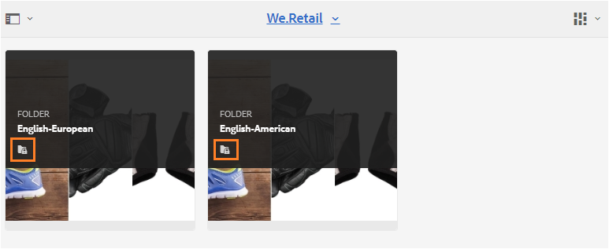

# Gasttoegang tot Brand Portal {#guest-access-to-brand-portal}

AEM Brand-portaal biedt gasten toegang tot het portaal. Een gastgebruiker heeft geen geloofsbrieven nodig om het portaal in te gaan en heeft toegang tot de openbare activa (en inzamelingen) van het portaal. De gebruikers in de gastzitting kunnen activa aan hun lichtbak (privé inzameling) toevoegen en het zelfde downloaden tot hun zitting duurt, die 2 uren van het begin van de zitting is tenzij de gastgebruiker aan [[!UICONTROL End Session]](#exit-guest-session) verkiest.

Gasttoegang biedt organisaties de mogelijkheid om goedgekeurde middelen [snel te delen met het beoogde publiek op schaal zonder dat ze aan boord hoeven te zijn. ](../using/brand-portal-sharing-folders.md#how-to-share-folders) Brand Portal 6.4.2 en hoger is uitgerust voor meerdere gelijktijdige gastgebruikers, hetgeen 10% van de totale gebruikersquota per organisatie is. Door gasttoegang toe te staan, bespaart u tijd om scores van gebruikers aan boord te beheren en te installeren die beperkte functies op het Brand Portal moeten gebruiken.\
Organisaties kunnen toegang voor gasten inschakelen (of uitschakelen) via de optie **[!UICONTROL Allow Guest Access]** van **[!UICONTROL Access]**-instellingen in het deelvenster met beheergereedschappen.

<!--
Comment Type: annotation
Last Modified By: mgulati
Last Modified Date: 2018-08-17T10:42:59.879-0400
Removed the first para: "AEM Assets Brand Portal allows public users to enter the portal anonymously and have restricted access to the allowed public resources as guests. Organization users with guest role need not seek access and authentication from administrators."
-->

## Beginnen met gastsessie {#begin-guest-session}

Als u het Brand Portal anoniem wilt invoeren, selecteert u **[!UICONTROL Click here]** voor het welkomstscherm **[!UICONTROL Guest Access?]** op Brand Portal. Ga de veiligheidscontrole van de catcha in om toegang te verlenen om het Portaal van het Merk te gebruiken.

## Duur gastsessie {#guest-session-duration}

Een gastgebruikerssessie blijft 15 minuten actief.
Dit betekent dat de staat van **[!UICONTROL Lightbox]** 15 minuten van de tijd van het zittingsbegin wordt bewaard, en na dat de huidige gastzitting opnieuw begint zodat wordt de staat Lichtbak verloren.

Bijvoorbeeld, meldt een gastgebruiker zich aan bij het Portaal van het Merk bij 1500 uren en voegt activa aan **[!UICONTROL Lightbox]** voor download bij 15:05 uren toe. Als de gebruiker de **[!UICONTROL Lightbox]**-verzameling (of de bijbehorende middelen) niet vóór 15:15 uur downloadt (binnen 15 minuten na aanmelding), moet de gebruiker de sessie opnieuw starten. De **[!UICONTROL Lightbox]** is leeg, wat betekent dat de geüploade elementen niet meer beschikbaar zijn als de sessie verloren is gegaan.

## Gelijktijdige gastsessies toegestaan {#concurrent-guest-sessions-allowed}

Het aantal gelijktijdige gastsessies is beperkt tot 10% van de totale gebruikersquota per organisatie. Dit betekent voor een organisatie met gebruikersquota van 200, maximaal 20 gastgebruikers kunnen tezelfdertijd werken. De 21ste gebruiker wordt ontzegd toegang, en kan als gast slechts toegang hebben als de zitting van om het even welke 20 actieve gastgebruikers beëindigt.

## Gebruikersinteractie van gast met Brand Portal {#guest-user-interaction-with-brand-portal}

### Navigatie gastinterface

Bij het ingaan van het Portaal van het Merk als gast, kunnen de gebruikers alle [activa en omslagen zien die](../using/brand-portal-sharing-folders.md#sharefolders) openbaar of met gastgebruikers uitsluitend worden gedeeld. Deze weergave is de weergave alleen voor inhoud. In deze weergave worden elementen in de kaart-, lijst- of kolomindeling weergegeven.

Nochtans, zien de gastgebruikers de omslagboom (die van de wortelomslag) begint en de gedeelde omslagen die binnen hun respectieve ouderomslagen bij het aanmelden bij het Portaal van het Merk worden geschikt, als de beheerders [de configuratie van de Hiërarchie van de Omslag ](../using/brand-portal-general-configuration.md#main-pars-header-1621071021) hebben toegelaten.

Deze bovenliggende mappen zijn de virtuele mappen en er kunnen geen handelingen op worden uitgevoerd. U kunt deze virtuele mappen herkennen met een vergrendelingspictogram.

In tegenstelling tot de gedeelde mappen zijn er geen actietaken zichtbaar bij het aanwijzen of selecteren van deze taken in **[!UICONTROL Card View]**. **[!UICONTROL Overview]** wordt weergegeven bij het selecteren van een virtuele map in  **[!UICONTROL Column View]** en  **[!UICONTROL List View]**.

>[!NOTE]
>
>De standaardminiatuur van de virtuele mappen is de miniatuurafbeelding van de eerste gedeelde map.

   

**[!UICONTROL View Settings]** optie staat de gastgebruikers toe om kaartgrootte in  **[!UICONTROL Card View]** of kolommen aan vertoning binnen aan te passen  **[!UICONTROL List View]**.

Met de **[!UICONTROL Content tree]** kunt u de hiërarchie van elementen doorlopen.

Het Portaal van het merk verstrekt **[!UICONTROL Overview]** optie aan gastgebruikers om **[!UICONTROL Asset Properties]** van geselecteerde activa/omslagen te bekijken. De optie **[!UICONTROL Overview]** is zichtbaar:

* Selecteer bovenaan op de werkbalk een middel/map.
* In de vervolgkeuzelijst selecteert u de spoorkiezer.
Als gebruikers de optie **[!UICONTROL Overview]** selecteren terwijl een element/map is geselecteerd, kunnen ze de titel, het pad en het tijdstip zien waarop het element wordt gemaakt. Terwijl de gebruikers met de optie **[!UICONTROL Overview]** metagegevens van het element kunnen bekijken op de pagina met elementdetails.

 

**[!UICONTROL Navigation]** met de optie in het linkerspoor kunt u van bestanden naar verzamelingen navigeren en in de gastsessie teruggaan, zodat gebruikers door elementen in bestanden of verzamelingen kunnen bladeren.

**[!UICONTROL Filter]** gastgebruikers kunnen middelenbestanden en mappen filteren met behulp van zoekvoorspelden die door de beheerder zijn ingesteld.

### Mogelijkheden voor gastgebruikers

Gastgebruikers hebben toegang tot publieke middelen op het Brand Portal en hebben ook weinig beperkingen zoals verder wordt besproken.

**Gastgebruikers kunnen**:

* Open alle openbare mappen en verzamelingen die voor alle gebruikers van het Brand Portal zijn bedoeld.
* Blader door leden, detailpagina en bekijk de volledige elementenweergave van de leden van alle openbare mappen en verzamelingen.
* Middelen zoeken in openbare mappen en verzamelingen.
* Elementen toevoegen aan lichtbakverzameling. Deze veranderingen in de inzameling blijven tijdens de zitting bestaan.
* Download elementen rechtstreeks of via lichtbakverzameling.

**Gastgebruikers kunnen dit niet**:

* Maak verzamelingen en opgeslagen zoekopdrachten of deel deze verder.
* Toegang tot de instellingen voor mappen en verzamelingen.
* Elementen delen als koppelingen.

### Elementen downloaden in gastsessie

Gastgebruikers kunnen elementen die algemeen of exclusief met gastgebruikers worden gedeeld, rechtstreeks downloaden naar Brand Portal. Gastgebruikers kunnen ook elementen toevoegen aan **[!UICONTROL Lightbox]** (openbare verzameling) en de verzameling **[!UICONTROL Lightbox]** downloaden voordat hun sessie verloopt.

Gebruik het downloadpictogram van:

* Miniaturen van snelle handelingen die worden weergegeven wanneer u de muisaanwijzer op het element of de verzameling plaatst
* De werkbalk bovenaan, die wordt weergegeven bij het selecteren van het element of de verzameling

Als u **[!UICONTROL Enable download acceleration]** selecteert in [!UICONTROL Download] dialoogvenster, kunt u [de downloadprestaties verbeteren](../using/accelerated-download.md).

## Bezoekerssessie {#exit-guest-session} afsluiten

Om een gastzitting weg te gaan, gebruik **[!UICONTROL End Session]** van de opties beschikbaar in de kopbal. Nochtans, als browser lusje-gebruikt voor gast zitting-inactief dan de zitting na twee uren van inactiviteit automatisch verloopt.

## Bewaking van activiteiten van gastgebruikers {#monitoring-guest-user-activities}

De beheerders kunnen gastgebruikersinteractie met het Portaal van het Merk controleren. De rapporten die in het Portaal van het Merk worden geproduceerd kunnen zeer belangrijke inzichten in gastgebruikersactiviteiten verstrekken. Het **[!UICONTROL Download]**-rapport kan bijvoorbeeld worden gebruikt om het aantal elementen bij te houden dat door de gastgebruiker is gedownload. **[!UICONTROL User Logins]** het rapport kan informeren wanneer de gastgebruiker het laatst bij het portaal en de frequentie van logins in een gespecificeerde duur het programma heeft geopend.
