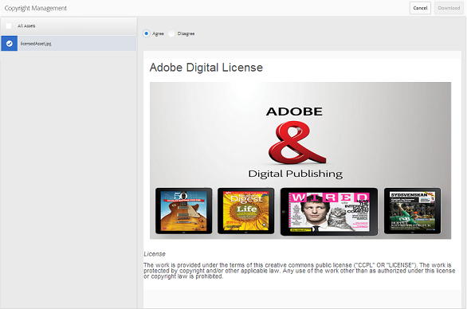

# Digitale rechten van elementen beheren {#manage-digital-rights-of-assets}

Een veilige distributie en veilig gebruik van creatieve middelen en merkmateriaal is van essentieel belang om uw merk te beschermen. Dit kan binnen de organisatie en buiten worden afgedwongen door een vervaldatum (en tijd) te koppelen aan goedgekeurde middelen die van AEM naar Brand Portal zijn gepubliceerd, of door deze middelen voor voorwaardelijk gebruik in licentie te geven. Ook, staat het Portaal van het Merk u toe om een vervaldatum voor verbindingen aan de activa te specificeren die van het Portaal van het Merk worden gedeeld.

Lees verder om te weten hoe de activa op het Portaal van het Merk worden beveiligd en de bijbehorende gebruikstoestemmingen begrijpen.

## Vervaldatum van element {#asset-expiration}

Vervaldatum van bedrijfsmiddelen is een effectieve manier om het gebruik van goedgekeurde bedrijfsmiddelen op Brand Portal in een organisatie te controleren. Alle van AEM Assets naar Brand Portal gepubliceerde middelen kunnen een vervaldatum hebben, waardoor het gebruik van deze middelen door verschillende gebruikersrollen wordt beperkt.

### Gebruiksmachtigingen met betrekking tot verlopen elementen {#usage-permissions-expired-assets}

In Brand Portal kunnen beheerders verlopen elementen weergeven, downloaden en toevoegen aan verzamelingen. Editors en Viewers kunnen echter alleen verlopen elementen weergeven en toevoegen aan verzamelingen.

Beheerders kunnen verlopen middelen publiceren van AEM Assets naar Brand Portal. Verlopen middelen kunnen echter niet via inkt worden gedeeld vanuit Brand Portal. Als u een verlopen element selecteert uit een map met zowel verlopen als niet-verlopen elementen, is de handeling **[!UICONTROL Share Link]** niet beschikbaar. Maar als u een map selecteert die verlopen en niet-verlopen elementen bevat, zijn de acties [!UICONTROL Share] en **[!UICONTROL Share Link]** beschikbaar.

>[!NOTE]
>
>Een map kan nog steeds als een koppeling worden gedeeld, zelfs als deze verlopen elementen bevat. In dit geval vermeldt de koppeling geen verlopen elementen en worden alleen de niet-verlopen elementen gedeeld.

In de volgende tabel worden de gebruiksmachtigingen van verlopen elementen weergegeven:

|  | **[!UICONTROL Link share]** | **[!UICONTROL Download]** | **[!UICONTROL Properties]** | **[!UICONTROL Add to collection]** | **[!UICONTROL Delete]** |
|---|---|---|---|---|---|
| **[!UICONTROL Administrator]** | Niet beschikbaar | Beschikbaar | Beschikbaar | Beschikbaar | Beschikbaar |
| **[!UICONTROL Editor]** | Niet beschikbaar | Niet beschikbaar | Beschikbaar | Beschikbaar | Niet beschikbaar |
| **[!UICONTROL Viewer]** | Niet beschikbaar | Niet beschikbaar | Beschikbaar | Beschikbaar | Niet beschikbaar |
| **[!UICONTROL Guest user]** | Niet beschikbaar | Niet beschikbaar | Beschikbaar | Beschikbaar | Niet beschikbaar |

>[!NOTE]
>
>Als Viewers en Editors een map met verlopen en niet-verlopen elementen downloaden, worden alleen de niet-verlopen elementen gedownload. Als een map alleen verlopen elementen bevat, wordt een lege map gedownload.

### Vervalstatus van activa {#expiration-status-of-assets}

U kunt de vervalstatus van elementen bekijken in hun **[!UICONTROL Card View]**. Een rode markering op de kaart geeft aan dat het element is verlopen.

>[!NOTE]
>
>In de lijst- en kolomweergaven wordt de vervalstatus van elementen niet weergegeven.

## Vervaldatum van asset-koppeling {#asset-link-expiration}

Tijdens het delen van elementen via koppelingen kunnen beheerders en editors een vervaldatum en -tijd instellen met het veld **[!UICONTROL Expiration]** in het dialoogvenster **[!UICONTROL Link Sharing]**. De standaardvervaldatum van verbinding is zeven dagen vanaf de datum waarop de verbinding wordt gedeeld.

Het zorgt ervoor dat de activa die als verbindingen worden gedeeld verlopen op de datum en de tijd die door de Beheerders en de Redacteurs van het Portaal van het Merk worden geplaatst, en kunnen niet meer na de vervaldatum worden bekeken en worden gedownload. Aangezien de elementen die via koppelingen worden gedeeld, ook kunnen worden bekeken door externe gebruikers die geen deel uitmaken van de organisatie, kunt u door het opgeven van de vervaldatum ervoor zorgen dat uw goedgekeurde elementen worden beveiligd en niet langer dan een bepaalde tijd aan onbekende entiteiten worden blootgesteld.

Raadpleeg [Elementen delen als een koppeling](../using/brand-portal-link-share.md) voor meer informatie over het delen van koppelingen.

## Activa met licentie {#licensed-assets}

Voor gelicentieerde activa moet een licentieovereenkomst worden geaccepteerd voordat deze van Brand Portal kunnen worden gedownload. Deze overeenkomst voor gelicentieerde activa komt wanneer u het middel van Brand Portal of via een gedeelde verbinding direct downloadt. Alle gebruikers kunnen de door een licentie beveiligde middelen bekijken, ongeacht of deze zijn verlopen of niet. Het downloaden en gebruiken van verlopen gelicentieerde middelen is echter beperkt. Raadpleeg [gebruiksmachtigingen van verlopen elementen](../using/manage-digital-rights-of-assets.md#usage-permissions-expired-assets) voor informatie over het gedrag van verlopen, in licentie gegeven elementen en toegestane activiteiten op basis van gebruikersrollen.

Voor met licentie beveiligde elementen is [licentieovereenkomst gekoppeld](https://helpx.adobe.com/experience-manager/6-5/assets/using/drm.html#DigitalRightsManagementinAssets). Dit gebeurt door de [metagegevenseigenschap](https://helpx.adobe.com/experience-manager/6-5/assets/using/drm.html#DigitalRightsManagementinAssets) van het element in AEM Assets in te stellen.

Als u met licentie beveiligde middelen wilt downloaden, wordt u omgeleid naar de pagina **[!UICONTROL Copyright Management]**.

Hier moet u het element selecteren om de bijbehorende licentieovereenkomst te downloaden en te accepteren. Als u de licentieovereenkomst niet accepteert, wordt de knop **[!UICONTROL Download]** niet ingeschakeld.

Als de selectie meerdere beveiligde elementen bevat, selecteert u één element tegelijk, accepteert u de licentieovereenkomst en gaat u verder met het downloaden van het element.

## Rapport genereren over verlopen elementen {#generate-report-about-expired-assets}

Beheerders kunnen een rapport genereren en downloaden waarin alle elementen worden vermeld die binnen een bepaalde tijd zijn verlopen. Dit rapport bevat gedetailleerde informatie— zoals grootte, type, pad die de locatie van de elementen in de hiërarchie van de elementen aangeeft, wanneer het actief verviel en wanneer het actief werd gepubliceerd— over de verlopen elementen. De kolommen van dit rapport kunnen worden aangepast om meer gegevens te tonen die op gebruikersvereisten worden gebaseerd.

Voor meer informatie over de rapporteigenschap, verwijs [Werk met rapporten](../using/brand-portal-reports.md#work-with-reports).
