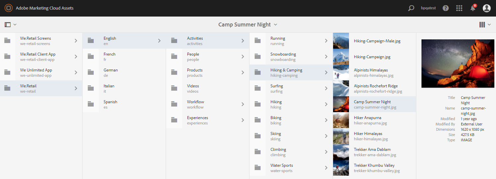

# Nieuw in AEM Assets Brand Portal {#what-s-new-in-aem-assets-brand-portal}

Met Adobe Experience Manager (AEM) Assets Brand Portal kunt u eenvoudig goedgekeurde creatieve middelen aanschaffen, beheren en veilig distribueren aan externe partijen en interne zakelijke gebruikers op verschillende apparaten. Het draagt bij tot een efficiëntere verdeling van activa, versnelt de marktintroductie van activa en vermindert het risico van niet-naleving en ongeoorloofde toegang. Adobe werkt aan een verbetering van de algemene ervaring van het Brand Portal. Hier is een blik in de nieuwe eigenschappen en verhogingen.

## Wat is veranderd in 2021.02.0 {#what-changed-in-feb-2021}

Brand Portal 2021.02.0 is een verbeteringsrelease die de activeringsworkflow van de Brand Portal op AEM Assets als Cloud Service introduceert, de functie Asset Sourcing op AEM Assets als Cloud Service vergemakkelijkt, de functionaliteit voor het downloaden van bedrijfsmiddelen verbetert en kritieke oplossingen bevat. Het laat ook de beheerders toe om het standaarddownloadgedrag van omslagen, inzamelingen, en bulkdownload van activa op huurdersniveau te vormen. Het Brand Portal **[!UICONTROL Usage Report]** is ook aangepast aan de actieve gebruikers van het Brand Portal. Zie de nieuwste [Opmerkingen bij de release Brand Portal](brand-portal-release-notes.md).

### Merkportal op AEM Assets activeren als een Cloud Service {#bp-automation-on-cloud-service}

AEM Assets als Cloud Service heeft nu het recht om een vooraf geconfigureerde Brand Portal-instantie te hebben. De gebruiker van de Manager van de Wolk kan het Portaal van het Merk op de AEM Assets als instantie van de Cloud Service activeren.

Eerder, werd AEM Assets als Cloud Service manueel gevormd met het Portaal van het Merk gebruikend de Console van de Ontwikkelaar van Adobe.

De gebruiker van de Manager van de Wolk activeert het activeringswerkschema dat tot de vereiste configuraties bij het achtereind leidt en activeert Brand Portal op zelfde IMS org zoals van AEM Assets als instantie van de Cloud Service.

Brand Portal activeren op uw AEM Assets als een Cloud Service-exemplaar:

1. Meld u aan bij Adobe Cloud Manager en navigeer naar **[!UICONTROL Environments]**.
1. Selecteer de omgevingen (een voor een) in de lijst om de omgevingsdetails weer te geven. Als u de omgeving hebt gevonden die is gekoppeld aan Brand Portal, klikt u op de knop **[!UICONTROL Activate Brand Portal]** om de activeringsworkflow te starten.
1. Zodra de Poorthuurder van het Merk wordt geactiveerd, verandert de status in Geactiveerd.

Zie [Brand Portal op AEM Assets activeren als een Cloud Service](https://experienceleague.adobe.com/docs/experience-manager-cloud-service/assets/brand-portal/configure-aem-assets-with-brand-portal.html?lang=en).

### Asset Sourting op AEM Assets als een Cloud Service {#asset-sourcing-on-cloud-service}

De functie Asset Sourcing is nu als Cloud Service beschikbaar op AEM Assets. De functie is standaard ingeschakeld voor alle gebruikers van de cloudservice. De geoorloofde gebruikers van het Brand Portal kunnen bijdragen aan het aantrekken van bedrijfsmiddelen door nieuwe middelen te uploaden naar de bijdragemappen en de bijdragemap van Brand Portal naar AEM Assets te publiceren als een instantie van Cloud Servicen. De beheerders kunnen de bijdrage van de gebruikers van het Merkortaal herzien en goedkeuren om hen aan andere gebruikers van het Merkortaal verder te verspreiden.

Eerder was Asset Sourcing alleen beschikbaar op AEM Assets (op locatie en beheerde service).

Zie [Asset Sourcing in Brand Portal](https://experienceleague.adobe.com/docs/experience-manager-brand-portal/using/asset-sourcing-in-brand-portal/brand-portal-asset-sourcing.html?lang=en).

### Downloaden van middelen {#asset-download-setting}

Naast de bestaande **[!UICONTROL Download Settings]**, kunnen de beheerders van het Portaal van het Merk **[!UICONTROL Asset Download]** nu het plaatsen vormen. Met deze instelling kunnen beheerders het standaarddownloadgedrag van mappen, verzamelingen en het bulkdownloaden van elementen (meer dan 20 elementen) op huurdersniveau bepalen.

<!--
Earlier, all the asset renditions were directly downloaded in a zip folder in case of folder, collection, and bulk download of assets. As the **[!UICONTROL Download]** dialog is skipped for folders or collections, there was no mechanism to control the downloading behaviour of the assets. Due to this, the users were finding it difficut to search for a particular asset rendition from a folder containing huge bunch of downloaded renditions. 
-->

Eerder werden alle elementenuitvoeringen rechtstreeks gedownload in een ZIP-map. Het dialoogvenster **[!UICONTROL Download]** is overgeslagen voor mappen en verzamelingen en er was geen methode om het downloadgedrag van de elementen te beheren, waardoor het moeilijk was om te zoeken naar een bepaalde uitvoering van een groot aantal downloads.

**[!UICONTROL Asset Download]** met de instelling kunt u nu een aparte map voor elk element maken terwijl u de mappen, verzamelingen of bestanden bulksgewijs downloadt.

Als de instelling **[!UICONTROL Asset Download]** is uitgeschakeld, worden de mappen of verzamelingen gedownload in een ZIP-map met alle elementuitvoeringen in dezelfde map, behalve voor het downloaden van de elementen via de koppeling voor delen.

Meld u als beheerder aan bij uw Brand Portal-gebruiker en navigeer naar **[!UICONTROL Tools]** > **[!UICONTROL Download]**. De beheerders kunnen **[!UICONTROL Asset Download]** plaatsen toelaten om afzonderlijke omslag voor elk middel tot stand te brengen terwijl het downloaden van omslagen, inzamelingen, en bulkdownload van activa.

Zie [Elementen downloaden van Brand Portal](https://experienceleague.adobe.com/docs/experience-manager-brand-portal/using/download/brand-portal-download-assets.html?lang=en).
<!--
### Download using Share link {#download-using-share-link}

The default behavior of downloading the assets using share link is now independent of the **[!UICONTROL Download Settings]**. A separate folder is created for each asset while downloading the assets using share link. 
-->

### Gebruiksrapport {#usage-report}

Het Brand Portal **[!UICONTROL Usage Report]** is gewijzigd om alleen de actieve merkportalgebruikers weer te geven. De merkportalgebruikers die niet aan enig productprofiel in de Admin Console worden toegewezen worden beschouwd als inactieve gebruikers en niet weerspiegeld in **[!UICONTROL Usage Report]**.

Eerder, zowel werden de actieve als inactieve gebruikers getoond in het Rapport van het Gebruik.

## Wat is veranderd in 2020.10.0 {#what-changed-in-oct-2020}

Brand Portal 2020.10.0 is een verbeteringsrelease die zich richt op het vereenvoudigen van het downloaden van bedrijfsmiddelen en die kritieke oplossingen bevat. De verbetering omvat nieuwe en betere werkschema voor activa downloaden, extra opties om vertoningen uit te sluiten, directe download van **[!UICONTROL Renditions]** paneel, configuratie om toegang en downloadrechten voor specifieke groep gebruikers toe te staan, en gemakkelijke navigatie aan de dossiers, inzamelingen, en gedeelde verbindingen van alle Poortpagina&#39;s van het Merk. Zie de nieuwste [Opmerkingen bij de release Brand Portal](brand-portal-release-notes.md).

### Vereenvoudigde downloadervaring {#download-dialog}

Eerder werd het dialoogvenster **[!UICONTROL Download]** weergegeven met meerdere opties, zoals het maken van een aparte map voor elk element, het e-mailmiddel, het selecteren van het oorspronkelijke element, aangepaste uitvoeringen, dynamische uitvoeringen, het uitsluiten van systeemuitvoeringen en het inschakelen van downloadversnelling, die ambigu waren voor niet-technische of nieuwe gebruikers, met name wanneer meerdere elementen of mappen waren geselecteerd om te worden gedownload. Bovendien kon de gebruiker niet alle elementuitvoeringen zien of een specifieke aangepaste of dynamische uitvoering uitsluiten.

Het nieuwe **[!UICONTROL Download]** dialoogvenster generaliseert het proces voor het selecteren en filteren van elementen, waardoor gebruikers van de Brand Portal eenvoudiger effectieve beslissingen kunnen nemen tijdens het downloaden van de asset-uitvoeringen. Alle geselecteerde elementen en de bijbehorende uitvoeringen worden weergegeven, afhankelijk van de configuratie [**[!UICONTROL Download]**](brand-portal-download-assets.md) en de instellingen **[!UICONTROL Download]**.

>[!NOTE]
>
>Alle gebruikers hebben **[!UICONTROL Fast Download]** standaard ingeschakeld en [IBM Aspera Connect 3.9.9](https://www.ibm.com/support/knowledgecenter/SSXMX3_3.9.9/kc/connect_welcome.html) moet in de browserextensie zijn geïnstalleerd voordat ze de middelen van Brand Portal kunnen downloaden.

<!--
If any of the **[!UICONTROL Custom Rendition]** or **[!UICONTROL System Rendition]** is enabled in the [**[!UICONTROL Download]**](brand-portal-download-assets.md) configuration and **[!UICONTROL Download]** settings are enabled for the group users, the new **[!UICONTROL Download]** dialog appears with all the renditions of the selected assets or folders containing assets in a list view. 
-->

In het dialoogvenster **[!UICONTROL Download]** kunnen gebruikers:

* Alle beschikbare uitvoeringen van elementen in de downloadlijst weergeven.
* Sluit uitvoeringen van de elementen uit die niet vereist zijn voor downloaden.
* Pas met één klik dezelfde set vertoningen toe op alle vergelijkbare elementtypen.
* Verschillende sets uitvoeringen toepassen op verschillende elementtypen.
* Maak afzonderlijke map voor elk element.
* Geselecteerde elementen en de bijbehorende uitvoeringen downloaden.

De downloadworkflow blijft constant voor zelfstandige elementen, meerdere elementen, mappen met elementen, onder licentie of zonder licentie geplaatste elementen en het downloaden van elementen via de koppeling voor delen. Zie [stappen om elementen te downloaden van Brand Portal](https://docs.adobe.com/content/help/en/experience-manager-brand-portal/using/download/brand-portal-download-assets.html#download-assets).

### Snelle navigatie {#quick-navigation}

Eerder, werden de optie om **[!UICONTROL Files]**, **[!UICONTROL Collections]**, en **[!UICONTROL Shared Links]** te bekijken verborgen en vereiste veelvoudige kliks telkens als de gebruiker op een andere mening wilde schakelen.

In Brand Portal 2020.10.0 kunnen gebruikers met één klik naar **[!UICONTROL Files]**, **[!UICONTROL Collections]** en **[!UICONTROL Shared Links]** van alle pagina&#39;s van het Merksportaal navigeren.

### Verbeterd deelvenster voor vertoning {#rendition-panel}

Eerder konden de gebruikers het oorspronkelijke element en de bijbehorende uitvoeringen alleen weergeven in het **[!UICONTROL Renditions]**-deelvenster als een van de **[!UICONTROL Custom Rendition]** of **[!UICONTROL System Rendition]** was ingeschakeld in de **[!UICONTROL Download]**-configuratie. Bovendien moesten de gebruikers alle elementuitvoeringen downloaden omdat er geen filter was om specifieke aangepaste of dynamische uitvoeringen uit te sluiten die niet vereist waren.

<!--
Earlier, if any of the custom or system renditions was enabled in the **[!UICONTROL Download]** settings, an additional **[!UICONTROL Download]** dialog appeared on clicking the **[!UICONTROL Download]** button wherein the user had to manually select the set of renditions (original asset, custom renditions, dynamic renditions) to download.
There was no filter to exclude specific custom or dynamic renditions which were not required for download.
-->

In Brand Portal 2020.10.0 kunnen gebruikers specifieke uitvoeringen uitsluiten en de geselecteerde uitvoeringen direct [downloaden vanuit het deelvenster Uitvoeringen](brand-portal-download-assets.md#download-assets-from-asset-details-page) op de pagina met elementdetails zonder het dialoogvenster **[!UICONTROL Download]** te openen.

<!-- 
In Brand Portal 2020.10.0, direct download and exclude renditions features are introduced in the **[!UICONTROL Renditions]** panel on the asset details page. All the renditions (original asset, custom renditions, dynamic renditions) under the rendition panel are now associated with a check box and are enabled by default. 

The user can clear the check boxes to exclude the renditions which are not required for download. And can click on the **[!UICONTROL Download]** button in the **[!UICONTROL Renditions]** panel to directly download the selected set of renditions in a zip folder without having to open the **[!UICONTROL Download]** dialog.
-->

### Downloadinstellingen {#download-permissions} configureren

Naast de bestaande **[!UICONTROL Download]** configuraties, kunnen de beheerders van het Portaal van het Merk montages voor verschillende groep gebruikers ook vormen om het originele element en zijn vertoningen van de pagina van elementendetails te bekijken en (of) te downloaden.

Meld u als beheerder aan bij uw Brand Portal-gebruiker en navigeer naar **[!UICONTROL Tools]** > **[!UICONTROL Users]**.

Navigeer op de pagina **[!UICONTROL User Roles]** naar het tabblad **[!UICONTROL Groups]** om de weergave- en (of) downloadinstellingen voor de gebruikersgroepen te configureren.

Eerder waren de instellingen alleen beschikbaar om te voorkomen dat groepsgebruikers het oorspronkelijke element konden downloaden.

Met het tabblad **[!UICONTROL Groups]** op de pagina **[!UICONTROL User Roles]** kunnen beheerders de weergave- en downloadinstellingen configureren:

* Als zowel **[!UICONTROL Download Original]** als **[!UICONTROL Download Renditions]** montages worden aangezet, kunnen de gebruikers van de geselecteerde groep de originele activa en hun vertoningen bekijken en downloaden.
* Als beide instellingen zijn uitgeschakeld, kunnen de gebruikers alleen de originele elementen bekijken. De elementuitvoeringen zijn niet zichtbaar voor de gebruikers op de pagina met elementdetails.
* Als alleen de instelling **[!UICONTROL Download Original]** is ingeschakeld, kunnen de gebruikers alleen de oorspronkelijke elementen weergeven en downloaden van de pagina met elementdetails.
* Als alleen de instelling **[!UICONTROL Download Renditions]** is ingeschakeld, kunnen de gebruikers het oorspronkelijke element weergeven, maar niet downloaden. De gebruiker kan de elementuitvoeringen wel weergeven en downloaden.

Zie [asset download configureren](https://docs.adobe.com/content/help/en/experience-manager-brand-portal/using/download/brand-portal-download-assets.html#configure-download-permissions).

>[!NOTE]
>
>Als een gebruiker wordt toegevoegd aan meerdere groepen en als een van deze groepen beperkingen heeft, gelden de beperkingen voor de gebruiker.

<!--
>Restrictions to access the original asset and their renditions do not apply to administrators even if they are members of restricted groups.
 >
 >The users can always download assets and their renditions from the repository using a `curl` request even if the download configurations are turned-off.
 >
-->

## Wat is veranderd in 6.4.7 {#what-changed-in-647}

De release van Brand Portal 6.4.7 introduceert de documentviewer, verbetert de ervaring voor het downloaden van middelen en bevat belangrijke correcties. Zie de nieuwste [Opmerkingen bij de release Brand Portal](brand-portal-release-notes.md).

<!--
Brand Portal 6.4.7 release brings in the Document Viewer, leverages the Brand Portal administrators to configure asset download, and centers top customer requests. See latest [Brand Portal Release Notes](brand-portal-release-notes.md).
-->

### Documentviewer {#doc-viewer}

De documentviewer verbetert de weergave van PDF&#39;s. Deze app biedt een vergelijkbare ervaring als de Adobe Document Cloud bij het bekijken van de PDF-bestanden in Brand Portal.

Eerder waren er beperkte opties beschikbaar om de PDF-bestanden te bekijken.

Met Document Viewer hebben de gebruikers van de Brand Portal nu de opties om pagina&#39;s weer te geven, bladwijzers weer te geven, op pagina te zoeken, in te zoomen, uit te zoomen, naar vorige en volgende pagina&#39;s te navigeren, naar pagina te schakelen, aan venster te passen, op scherm te passen en de werkbalk te verbergen of te verbergen.

>[!NOTE]
>
>De ervaring met het weergeven van andere documentindelingen blijft ongewijzigd.

### Downloadervaring {#download-configurations}

Het proces voor het downloaden van bedrijfsmiddelen is vernieuwd en biedt een vereenvoudigde gebruikerservaring terwijl [middelen worden gedownload van Brand Portal](brand-portal-download-assets.md).

De bestaande workflow voor het downloaden van middelen van het Brand Portal wordt onvermijdelijk gevolgd door het verschijnen van een **[!UICONTROL Download]**-dialoogvenster met meerdere downloadopties waaruit u kunt kiezen.

In het Portaal van het Merk 6.4.7, kunnen de beheerders van het Portaal van het Merk activa **[!UICONTROL Download]** montages vormen. De beschikbare configuraties zijn:
* **[!UICONTROL Fast Download]**
* **[!UICONTROL Custom Renditions]**
* **[!UICONTROL System Renditions]**

De beheerder van het Portaal van het Merk kan om het even welke combinatie toelaten om activadownload te vormen.

<!--In Brand Portal 6.4.7, fast download, custom renditions, and system renditions are the three configurations available.-->

* Als zowel **[!UICONTROL Custom Renditions]** als **[!UICONTROL System Renditions]** configuraties worden uitgezet, worden de originele vertoningen van de activa gedownload zonder enige extra dialoog die de downloadervaring voor de gebruikers van het Portaal van het Merk vereenvoudigt.

* Als een van **[!UICONTROL Custom Rendition]** of **[!UICONTROL System Rendition]** is ingeschakeld, wordt het dialoogvenster **[!UICONTROL Download]** weergegeven en worden het oorspronkelijke element samen met de elementuitvoeringen gedownload. Als u **[!UICONTROL Fast Download]**-configuratie inschakelt, wordt het downloadproces versneld.

Gebaseerd op de configuratie, blijft het downloadwerkschema constant voor stand-alone activa, veelvoudige activa, omslagen die activa, vergunning of unlicensed activa bevatten, en het downloaden van activa gebruikend aandeelverbinding.

## Wat is veranderd in 6.4.6 {#what-changed-in-646}

In Brand Portal 6.4.6 wordt het machtigingskanaal tussen AEM Assets en Brand Portal gewijzigd. Brand Portal wordt nu ondersteund op AEM Assets als Cloud Service, AEM Assets 6.3 en hoger. In AEM Assets 6.3 en hoger werd het Brand Portal eerder geconfigureerd in de klassieke gebruikersinterface via Legacy OAuth Gateway, die de JWT-tokenuitwisseling gebruikt om een IMS Access-token voor verificatie te verkrijgen. AEM Assets is nu geconfigureerd met het Brand Portal via de Adobe Developer Console, die een IMS-token aanschaft voor toestemming van uw Poortmedewerker.

<!-- The steps to configure integration are different depending on your AEM version, and whether you are configuring for the first-time, or upgrading the existing integration:
-->

<!--
  
   | **AEM Version** |**New Integration** |**Upgrade Integration** |
|---|---|---|
| **AEM 6.5** |[Create new integration](../using/brand-portal-configure-integration-65.md) |[Upgrade existing integration](../using/brand-portal-configure-integration-65.md#upgrade-integration-65) | 
| **AEM 6.4** |[Create new integration](../using/brand-portal-configure-integration-64.md) |[Upgrade existing integration](../using/brand-portal-configure-integration-64.md#upgrade-integration-64) | 
| **AEM 6.3** |[Create new integration](../using/brand-portal-configure-integration-63.md) |[Upgrade existing integration](../using/brand-portal-configure-integration-63.md#upgrade-integration-63) | 
| **AEM 6.2** |Contact Support |Contact Support | 

   -->

De stappen voor het configureren van AEM Assets met Brand Portal verschillen afhankelijk van uw AEM versie en of u voor het eerst configureert of de bestaande configuraties bijwerkt:

<!--| **AEM Version** |**New Configuration** |**Upgrade Configuration** |
|---|---|---|
| **AEM 6.5 (6.5.4.0 and above)** |[Create configuration](../using/brand-portal-configure-integration-65.md) |[Upgrade configuration](../using/brand-portal-configure-integration-65.md#upgrade-integration-65) | 
| **AEM 6.4 (6.4.8.0 and above)** |[Create configuration](../using/brand-portal-configure-integration-64.md) |[Upgrade configuration](../using/brand-portal-configure-integration-64.md#upgrade-integration-64) | 
| **AEM 6.3 (6.3.3.8 and above)** |[Create configuration](../using/brand-portal-configure-integration-63.md) |[Upgrade configuration](../using/brand-portal-configure-integration-63.md#upgrade-integration-63) | 
| **AEM 6.2** |Contact Support |Contact Support | 
-->

<!-- AEM Assets configuration with Brand Portal on Adobe I/O is supported on:
* AEM 6.5.4.0 and above
* AEM 6.4.8.0 and above
* AEM 6.3.3.8 and above -->

| **AEM** | **Nieuwe configuratie** | **Upgradeconfiguratie** |
|---|---|---|
| **AEM Assets as a Cloud Service** | [Configuratie maken](https://docs.adobe.com/content/help/en/experience-manager-cloud-service/assets/brand-portal/configure-aem-assets-with-brand-portal.html) | - |
| **AEM 6.5 (6.5.4.0 en hoger)** | [Configuratie maken](https://docs.adobe.com/content/help/en/experience-manager-65/assets/brandportal/configure-aem-assets-with-brand-portal.html) | [Upgradeconfiguratie](https://docs.adobe.com/content/help/en/experience-manager-65/assets/brandportal/configure-aem-assets-with-brand-portal.html#upgrade-integration-65) |
| **AEM 6.4 (6.4.8.0 en hoger)** | [Configuratie maken](https://docs.adobe.com/content/help/en/experience-manager-64/assets/brandportal/configure-aem-assets-with-brand-portal.html) | [Upgradeconfiguratie](https://docs.adobe.com/content/help/en/experience-manager-64/assets/brandportal/configure-aem-assets-with-brand-portal.html#upgrade-integration-64) |
| **AEM 6.3 (6.3.3.8 en hoger)** | [Configuratie maken](https://helpx.adobe.com/experience-manager/6-3/assets/using/brand-portal-configuring-integration.html) | [Upgradeconfiguratie](https://helpx.adobe.com/experience-manager/6-3/assets/using/brand-portal-configuring-integration.html#Upgradeconfiguration) |
| **AEM 6,2** | Contact opnemen met ondersteuning | Contact opnemen met ondersteuning |

>[!NOTE]
>
>Het wordt aanbevolen uw AEM-exemplaar bij te werken naar het nieuwste servicepakket.

Zie de nieuwste [Opmerkingen bij de release Brand Portal](brand-portal-release-notes.md).

Zie [Veelgestelde vragen over Brand Portal](brand-portal-faqs.md).

## Wat is veranderd in 6.4.5 {#what-changed-in-645}

Brand Portal 6.4.5 is een functieversie die zich richt op het bieden van gebruikers van het Brand Portal (externe agentschappen/teams) de mogelijkheid om inhoud te uploaden naar het Brand Portal en deze te publiceren naar AEM Assets, zonder dat toegang nodig is tot de auteursomgeving. Deze functie wordt **[Asset Sourcing genoemd in Brand Portal](brand-portal-asset-sourcing.md)**, en zal klantenervaringen verbeteren door een mechanisme in twee richtingen voor gebruikers te verstrekken om activa zowel bij te dragen als te delen met andere wereldwijd gedistribueerde gebruikers van het Portaal van het Merk.

### Asset Sourting in Brand Portal {#asset-sourcing-in-bp}

Met Asset Sourcing kunnen AEM gebruikers (beheerders/gebruikers zonder beheer) nieuwe mappen maken met een extra eigenschap **Asset Contribution**, zodat de nieuwe map die is gemaakt, kan worden verzonden door gebruikers van Brand Portal. Dit leidt automatisch tot een werkschema dat tot twee extra subomslagen, genoemd NIEUW en GEDEELD, binnen de pas gecreëerde **Bijdrage** omslag leidt.

De AEM gebruiker bepaalt dan het vereiste door een kort overzicht van de types van activa te uploaden die aan de bijdrageomslag, evenals het uploaden van basislijnactiva, aan **SHARED** omslag zouden moeten worden toegevoegd om BP gebruikers de verwijzingsinformatie te verzekeren zij hebben nodig. De beheerder kan de actieve gebruikers van het Portaal van het Merk dan toegang tot de bijdrageomslag verlenen alvorens de pas gecreëerde **omslag** aan het Portaal van het Merk te publiceren.

Zodra de gebruiker klaar is met het toevoegen van inhoud in de map **NEW**, kunnen zij de bijdragemap weer publiceren naar de AEM auteursomgeving. Het kan enkele minuten duren voordat de import is voltooid en de nieuw gepubliceerde inhoud in AEM Assets wordt weerspiegeld.

Bovendien blijft alle bestaande functionaliteit ongewijzigd. Gebruikers van het Brand Portal kunnen middelen weergeven, zoeken en downloaden vanuit de bijdragemap en vanuit de andere toegestane mappen. En beheerders kunnen de bijdragemap verder delen, eigenschappen wijzigen en elementen toevoegen aan verzamelingen.

>[!NOTE]
>
>Asset Sourcing in Brand Portal wordt ondersteund op AEM 6.5.2.0 en hoger.
>
>De functie wordt niet ondersteund in de eerdere versies - AEM 6.3 en AEM 6.4.

### Elementen uploaden naar bijdragemap {#upload-assets-in-bp}

Gebruikers van het Brand Portal met de juiste machtigingen kunnen de elementvereisten downloaden om te begrijpen dat ze een bijdrage moeten leveren en meerdere middelen of mappen met meerdere elementen kunnen uploaden naar de map voor de bijdrage. Merk portalgebruikers kunnen echter alleen elementen uploaden naar de submap **NEW**. De map **SHARED** is bedoeld voor de verdeling van vereisten en basislijnelementen.

### Bijdragemap publiceren naar AEM Assets {#publish-assets-to-aem}

Wanneer het uploaden is voltooid naar de map **NEW**, kunnen gebruikers van het Brand Portal de map met bijdragen weer publiceren naar AEM. Het kan enkele minuten duren om de gepubliceerde inhoud/middelen in AEM Assets te importeren en weer te geven. Zie [Contribute-map publiceren naar AEM Assets](brand-portal-publish-contribution-folder-to-aem-assets.md)

## Wat is veranderd in 6.4.4 {#what-changed-in-644}

Merk Portal 6.4.4 versie concentreert zich op verhogingen aan tekstonderzoek en hoogste klantenverzoeken. Zie de nieuwste [Opmerkingen bij de release Brand Portal](brand-portal-release-notes.md).

### Verbeteringen voor zoeken

Brand Portal 6.4.4 en hoger ondersteunt gedeeltelijk zoeken naar voorspelling van tekst in filtervenster. Om gedeeltelijk tekstonderzoek toe te staan moet u **Gedeeltelijk Onderzoek** in de Voorspelling van het Bezit in de onderzoeksvorm toelaten.

Lees verder voor meer informatie over gedeeltelijk zoeken naar tekst en zoeken naar jokertekens.

#### Gedeeltelijke woordzoekopdracht {#partial-phrase-search}

U kunt nu naar elementen zoeken door alleen een deel (dat een woord of twee is) van de gezochte woordgroep op te geven in het filtervenster.

**Gebruik van**
casePartial-woordzoekopdrachten is handig wanneer u niet zeker weet welke combinatie van woorden in de gezochte woordgroep voorkomt.

Bijvoorbeeld, als uw onderzoeksvorm in het Portaal van het Merk de Voorkeur van het Bezit voor gedeeltelijke onderzoek op activa titel gebruikt, dan specificerend de term **kamp** keert alle activa met het woordkamp in hun titeluitdrukking terug.

#### Zoekopdracht met jokerteken {#wildcard-search}

Het Brand Portal staat toe gebruikend de asterisk (*) in onderzoeksvraag samen met een deel van het woord in uw gezochte uitdrukking.

**Gebruik**
caseAls u niet zeker weet welke woorden precies voorkomen in de gezochte uitdrukking, kunt u een vervangingsonderzoek gebruiken om de hiaten in uw onderzoeksvraag te vullen.

Als u bijvoorbeeld **klimt*** opgeeft, worden alle elementen geretourneerd die woorden hebben die beginnen met de tekens **klimmen** in de titelzin als in het zoekformulier in het Brand Portal Eigenschappenvoorspelling wordt gebruikt voor gedeeltelijk zoeken op de titel van de elementen.

Op dezelfde manier specificeren:

* ***** beklimt alle elementen met woorden die eindigen met tekens die de titelzin  **** klimmen.

* ***klib*** retourneert alle elementen met woorden die bestaan uit de tekens  **** die hun titelzin klimmen.

>[!NOTE]
>
>Als u **Gedeeltelijk zoeken** inschakelt, wordt **Hoofdlettergebruik negeren** standaard geselecteerd.

## Wat is veranderd in 6.4.3 {#what-changed-in}

Merk Portal 6.4.3 release richt zich op — organisaties een alternatieve alias ter beschikking stellen naast hun huurder-id in de toegangs-URL van het Brand Portal, nieuwe configuratie van de mappenhiërarchie, verbeteringen op het gebied van videoondersteuning, gepland publiceren van de AEM-auteur naar het Brand Portal, operationele verbeteringen en op verzoeken van klanten.

### Navigatie in maphiërarchie voor niet-beheerders

Beheerders kunnen nu configureren hoe de mappen bij het aanmelden worden weergegeven aan gebruikers zonder beheer (Editors, Viewers en Gastgebruikers). [Configuratie ](../using/brand-portal-general-configuration.md) van maphiërarchie inschakelen wordt toegevoegd aan  **Algemene instellingen** in het deelvenster met beheergereedschappen. Als de configuratie:

* **Als deze optie is ingeschakeld**, is de mappenstructuur die begint in de hoofdmap zichtbaar voor gebruikers zonder beheerdersrechten. Aldus, die hen een navigatie gelijkend op beheerders verlenen.
* **uitgeschakeld**, worden alleen de gedeelde mappen weergegeven op de bestemmingspagina.

Met de functie [Maphiërarchie inschakelen](../using/brand-portal-general-configuration.md) (indien ingeschakeld) kunt u de mappen onderscheiden met dezelfde namen die worden gedeeld vanuit verschillende hiërarchieën. Bij het aanmelden zien niet-beheerders nu de virtuele bovenliggende mappen (en vooroudermappen) van de gedeelde mappen.

De gedeelde mappen worden in de desbetreffende directory&#39;s in virtuele mappen ingedeeld. U kunt deze virtuele mappen herkennen met een vergrendelingspictogram.

De standaardminiatuur van de virtuele mappen is de miniatuurafbeelding van de eerste gedeelde map.

### Zoeken in specifieke maphiërarchie of pad

**De** Browser van de weg wordt geïntroduceerd in de Vorm van het Onderzoek om het zoeken van activa in een specifieke folder toe te staan. Het standaardzoekpad van zoekvoorspelling voor padbrowser is `/content/dam/mac/<tenant-id>/`, dat kan worden geconfigureerd door het standaardzoekformulier te bewerken.

* Admin-gebruikers kunnen met Padbrowser naar een willekeurige map op het Brand Portal navigeren.
* Gebruikers die geen beheerder zijn, kunnen de padbrowser gebruiken om alleen naar de mappen (en terug te navigeren naar de bovenliggende mappen) te navigeren die met hen worden gedeeld.

   `/content/dam/mac/<tenant-id>/folderA/folderB/folderC` wordt bijvoorbeeld gedeeld met een gebruiker die geen beheerder is. De gebruiker kan naar elementen binnen folderC zoeken gebruikend Browser van de Weg. Deze gebruiker kan ook naar folderB en folderA navigeren (aangezien zij voorouders van folderC zijn die met de gebruiker wordt gedeeld).

U kunt nu het zoeken naar middelen beperken in een specifieke map waarnaar u hebt gebladerd, in plaats van te beginnen bij de hoofdmap.

Het zoeken onder deze mappen resulteert alleen uit de elementen die met de gebruiker zijn gedeeld.

### Ondersteuning voor Dynamic Media-video-uitvoeringen

Gebruikers van wie de AEM-auteur-instantie zich in de hybride Dynamic Media-modus bevindt, kunnen naast de originele videobestanden ook een voorvertoning van de dynamische media-uitvoeringen weergeven en deze downloaden.

Om voorvertoning en download van dynamische media-uitvoeringen op specifieke huurdersaccounts mogelijk te maken, moeten beheerders **Dynamic Media Configuration** (video service URL (DM-Gateway URL) en registratie-id opgeven om de dynamische video op te halen) in **Video**-configuratie vanuit het deelvenster met beheergereedschappen.

Dynamic Media-video&#39;s kunnen worden voorvertoond op:

* Pagina met elementgegevens
* Weergave van de kaart van het element
* Voorvertoningspagina voor delen koppelen

Dynamic Media Video-codering kan worden gedownload van:

* Brand Portal
* Gedeelde koppeling

### Gepland publiceren naar Brand Portal

De activa (en de omslagen) publiceren werkschema van [AEM (6.4.2.0)](https://helpx.adobe.com/experience-manager/6-4/release-notes/sp-release-notes.html#main-pars_header_9658011) de instantie van de Auteur aan het Portaal van het Merk kan voor een recentere datum, tijd worden gepland.

Op dezelfde manier kunnen gepubliceerde elementen op een latere datum (tijd) uit de portal worden verwijderd door de workflow Publiceren via Brand Portal te plannen.

### Configureerbare alias van huurder in URL

Organisaties kunnen hun portal-URL aanpassen door een alternatief voorvoegsel in de URL te plaatsen. Om een alias voor huurdersnaam in hun bestaande portaal URL te krijgen, moeten de organisaties Adobe steun contacteren.

Merk op dat alleen het voorvoegsel van de Brand Portal-URL kan worden aangepast en niet de volledige URL.\
Zo kan een organisatie met een bestaand domein **geomettrix.brand-portal.adobe.com** **geomettrixinc.brand-portal.adobe.com** op verzoek krijgen.

Nochtans, kan de instantie van de Auteur AEM [gevormd ](https://helpx.adobe.com/experience-manager/6-5/assets/using/brand-portal-configuring-integration.html) slechts met huurder identiteitskaart URL en niet met huurder alias (afwisselend) URL zijn.

Organisaties kunnen aan hun merkingsbehoeften voldoen door de portaal-URL aan te passen in plaats van zich aan de URL van Adobe te houden.

### Verbeteringen in downloadervaring

De release biedt een vereenvoudigde downloadervaring met een beperkt aantal klikken en waarschuwingen, op:

* Opdat alleen de uitvoeringen (en niet de oorspronkelijke elementen) worden gedownload.
* De elementen downloaden wanneer de toegang tot de oorspronkelijke uitvoeringen beperkt is.

## Wat is veranderd in 6.4.6 {#what-changed-in-1}

De introductie van Brand Portal 6.4.2 biedt een aantal mogelijkheden om te voldoen aan de behoeften van organisaties op het gebied van middelendistributie en helpt hen om een groot aantal gebruikers te bereiken die wereldwijd via gasttoegang en optimale ervaring met versnelde downloads worden gedistribueerd. Het Portaal van het merk verstrekt ook grotere controle aan organisaties door nieuwe configuraties voor beheerders, onlangs toegevoegd rapport, en caters aan klantenverzoeken.

### Toegang voor gasten

AEM Brand-portaal biedt gasten toegang tot het portaal. Een gastgebruiker vereist geen geloofsbrieven om het portaal in te gaan en kan tot alle openbare omslagen en inzamelingen toegang hebben en downloaden. Gastgebruikers kunnen elementen toevoegen aan hun lichtbak (privéverzameling) en deze downloaden. Ze kunnen ook zoeken naar slimme tags en voorspelden van zoekopdrachten weergeven die door beheerders zijn ingesteld. De gastzitting staat gebruikers niet toe om inzamelingen tot stand te brengen en bewaarde onderzoeken of hen verder te delen, tot omslag en inzamelingsmontages toegang te hebben, en activa als verbindingen te delen.

In een organisatie zijn meerdere gelijktijdige gastsessies toegestaan, wat beperkt is tot 10% van de totale gebruikersquota per organisatie.

Een gastsessie blijft twee uur actief. Daarom wordt de staat van de lichtbak ook bewaard tot twee uur vanaf de tijd van het zittingsbegin. Na twee uur, moet de gastzitting opnieuw beginnen, zodat wordt de lichtbakstaat verloren.

### Versnelde downloads

Gebruikers van het Brand Portal kunnen gebruikmaken van snelle downloads op basis van IBM Aspera Connect om snelheden tot 25x sneller te kunnen gebruiken en genieten van een naadloze downloadervaring, ongeacht hun locatie over de hele wereld. Als gebruikers de elementen sneller van Brand Portal of de gedeelde koppeling willen downloaden, moeten ze de optie **Downloadversnelling inschakelen** selecteren in het dialoogvenster Downloaden, op voorwaarde dat downloadversnelling is ingeschakeld in hun organisatie.

Beheerders **Downloadversnelling inschakelen** (deze optie is standaard uitgeschakeld) vanuit [Algemene instellingen](brand-portal-general-configuration.md#allow-download-acceleration) in het deelvenster met beheergereedschappen om versnelde download voor de organisatie in te schakelen op basis van IBM Aspera. Raadpleeg [Guide om downloads vanaf Brand Portal](../using/accelerated-download.md#main-pars-header) te versnellen voor meer informatie over vereisten en stappen voor het oplossen van problemen waarmee elementbestanden sneller kunnen worden gedownload van Brand Portal en gedeelde koppelingen.

### Rapport voor gebruikersaanmelding

Er is een nieuw rapport geïntroduceerd om gebruikersaanmeldingen bij te houden. Het **Logins van de Gebruiker** rapport kan nuttig zijn in het toelaten van organisaties om een controle op de gedelegeerde beheerders en andere gebruikers van het Portaal van het Merk te controleren en te houden.

De rapportlogboeken tonen namen, e-mail IDs, persona&#39;s (admin, kijker, redacteur, gast), groepen, laatste login, activiteitenstatus, en login telling van elke gebruiker van Poort 6.4.2 plaatsing van het Merk tot de tijd van rapportgeneratie. De beheerders kunnen het rapport als .csv uitvoeren. Samen met andere rapporten, laat het rapport van Logins van de Gebruiker organisaties toe om gebruikersinteractie met de goedgekeurde merkmiddelen beter te controleren, daardoor ervoor zorgend conformiteit aan collectieve nalevingsbureaus.

### Toegang tot oorspronkelijke vertoningen

Beheerders kunnen de gebruikerstoegang tot originele afbeeldingsbestanden (.jpeg, .tiff, .png, .bmp, .gif, .pjpeg, x-portable-anymap, x-portable-bitmap, x-portable-graymap, x-portable-pixmap, x-rgb, x-xbitmap, x-xpixmap, x-icon, image/photoshop, image/x-photoshop, .psd, image/vnd.adobe.photoshop) en geeft toegang tot vertoningen met lage resolutie die zij van het Portaal van het Merk of gedeelde verbinding downloaden. Deze toegang kan op het niveau van de gebruikersgroep van het lusje van Groepen van de pagina van Rollen van de Gebruiker in het paneel van Admin hulpmiddelen worden gecontroleerd.

* Standaard kunnen alle gebruikers de originele uitvoeringen downloaden, omdat de optie Toegang tot origineel voor iedereen is ingeschakeld.
* Beheerders moeten de selectie van de desbetreffende selectievakjes opheffen om te voorkomen dat een groep gebruikers toegang krijgt tot de oorspronkelijke uitvoeringen.
* Als een gebruiker lid is van meerdere groepen, maar slechts één van de groepen heeft beperkingen, gelden de beperkingen voor die gebruiker.
* De beperkingen zijn niet van toepassing op beheerders, ook al zijn zij lid van beperkte groepen.
* De machtigingen van de gebruiker die elementen deelt als koppeling zijn van toepassing op de gebruikers die elementen downloaden via gedeelde koppelingen.

### Pad met maphiërarchie op kaart- en lijstweergaven

In de Kaarten van mappen wordt in de Kaartweergave nu informatie over de maphiërarchie weergegeven voor gebruikers die geen beheerder zijn (Editor, Viewer en gastgebruiker). Deze functionaliteit laat de gebruikers de plaats van de omslagen kennen, die zij, met betrekking tot de ouderhiërarchie toegang hebben.

Informatie over de maphiërarchie is vooral handig om onderscheid te maken tussen de mappen waarvan de namen overeenkomen met andere mappen die vanuit een andere maphiërarchie worden gedeeld. Als de gebruikers die geen beheerder zijn niet op de hoogte zijn van de mapstructuur van de elementen die met hen worden gedeeld, lijken elementen/mappen met vergelijkbare namen verwarrend.

* De paden die op de betreffende kaarten worden weergegeven, worden afgekapt om in de kaartgrootten te passen. Gebruikers kunnen het volledige pad echter zien als knopinfo bij het aanwijzen over het afgebroken pad.

De Mening van de lijst toont omslagWeg van activa in een kolom aan alle gebruikers van het Portaal van het Merk.

### Overzicht, optie om de eigenschappen van elementen weer te geven

Brand Portal biedt een overzichtsoptie voor gebruikers die geen beheerder zijn (Editors, Viewers, Gastgebruikers) om de eigenschappen van bedrijfsmiddelen van geselecteerde elementen/mappen weer te geven. De optie Overzicht is zichtbaar:

1. Selecteer bovenaan op de werkbalk een middel/map.
2. In de vervolgkeuzelijst selecteert u de spoorkiezer.

Als u de optie Overzicht selecteert terwijl een middel/map is geselecteerd, kunnen gebruikers de titel, het pad en het tijdstip van het maken van de elementen zien. Terwijl de gebruiker met de optie Overzicht op de pagina met elementdetails de metagegevens van het element kan bekijken.

## Nieuwe configuraties

Er worden zes nieuwe configuraties toegevoegd voor beheerders om de volgende functies in of uit te schakelen voor specifieke huurders:

* Toegang voor gasten toestaan
* Gebruikers toegang tot Brand Portal laten aanvragen
* Beheerders toestaan elementen te verwijderen uit Brand Portal
* Openbare collecties maken
* Maken van openbare slimme verzamelingen toestaan
* Downloadversnelling toestaan

De bovenstaande configuraties zijn beschikbaar onder Toegang en Algemene instellingen in het deelvenster met beheergereedschappen.

### Adobe I/O UI om de Integraties van de Auth te vormen

Brand Portal 6.4.2 en hoger gebruiken Adobe.io [https://legacy-oauth.cloud.adobe.io/](https://legacy-oauth.cloud.adobe.io/) interface om JWT toepassing tot stand te brengen, die het vormen van de Integraties van Auth toelaat om de integratie van AEM Assets met het Portaal van het Merk toe te staan. Eerder werd de interface voor het configureren van OAuth-integratie gehost in `https://marketing.adobe.com/developer/`. Raadpleeg [AEM Assets-integratie configureren met Brand Portal](https://docs.adobe.com/content/help/en/experience-manager-64/assets/brandportal/configure-aem-assets-with-brand-portal.html) voor meer informatie over het integreren van AEM Assets met Brand Portal voor het publiceren van middelen en verzamelingen naar Brand Portal.

## Verbeteringen zoeken

Beheerders kunnen de eigenschap instellen dat niet-hoofdlettergevoelig wordt voorspeld door de bijgewerkte eigenschap predikaat te gebruiken, die een controle op Hoofdlettergebruik negeren heeft. Deze optie is beschikbaar voor de voorspelling van eigenschappen en eigenschappen met meerdere waarden.\
Nochtans, is het niet-hoofdlettergevoelige onderzoek relatief langzamer dan standaardonderzoek naar bezitspredikaat. Als het zoekfilter te veel niet-hoofdlettergevoelige voorspellingen bevat, kan de zoekopdracht vertragen. Daarom wordt het aanbevolen de niet-hoofdgevoelige zoekopdracht op oordeelkundige wijze te gebruiken.

## Wat is veranderd in 6.4.1 {#what-changed-in-2}

Brand Portal 6.4.1 is een platform upgraderelease die verschillende nieuwe functies en essentiële verbeteringen bevat, zoals bladeren, zoeken en prestatieverbeteringen om een bevredigende klantervaring te bieden.

### Verbeteringen voor bladeren

* Nieuwe contentstructuurrails om snel door de hiërarchie van elementen te navigeren.

* Nieuwe sneltoetsen geïntroduceerd, bijvoorbeeld _(p)_ voor navigatie naar eigenschappenpagina, _(e)_ voor Bewerken en _(ctrl+c)_ voor kopieerbewerkingen.
* Verbeterde schuifervaring, luie laadervaring in kaart- en lijstweergave voor het bladeren door een groot aantal elementen.
* Uitgebreide kaartweergave met ondersteuning voor kaarten van verschillende grootte op basis van weergave-instelling.

* In de kaartweergave wordt nu datum-/tijdstempel weergegeven wanneer u de muis boven het datumlabel plaatst.

* Verbeterde kolomweergave met **Meer details** onder de elementmomentopname, waarmee u naar de detailpagina van een element kunt navigeren.

* In de lijstweergave worden nu standaard de bestandsnamen van elementen in de eerste kolom weergegeven, naast de landinstelling, het type element, de afmetingen, de grootte, de classificatie en de publicatiegegevens. Nieuwe **Weergave-instellingen** kunnen worden gebruikt om de hoeveelheid details te configureren die in de lijstweergave moet worden weergegeven.

* Betere ervaring met middelendetails, omdat u met nieuwe navigatieknoppen heen en weer kunt navigeren tussen elementen en elementen kunt weergeven.

* Nieuwe mogelijkheid om audiobestanden, geüpload vanaf AEM, voor te vertonen op de detailpagina van het element.
* New Related Assets capabilities provided in Asset properties. Activa die verwant zijn aan andere bron/afgeleide middelen op AEM en op Brand Portal worden gepubliceerd, hebben hun relatie nu intact in Brand Portal, met koppelingen naar de gerelateerde elementen op de eigenschappenpagina.
* Er is een nieuwe configuratie geïntroduceerd om te voorkomen dat gebruikers zonder beheerdersrechten openbare verzamelingen maken. Organisaties kunnen met het team van de Steun van Adobe samenwerken om dit vermogen op specifieke rekeningen te vormen.

### Verbeteringen voor zoeken

* Mogelijkheid geïntroduceerd om terug te keren naar dezelfde positie in zoekresultaten, na navigatie naar een zoekopdracht, zonder de zoekquery opnieuw uit te voeren.
* Er is een aantal nieuwe zoekresultaten opgegeven waarmee het aantal zoekresultaten wordt weergegeven.
* Het verbeterde filter van het Onderzoek van het Type van Dossier met de capaciteit om onderzoeksresultaten te filtreren die op verfijnde types MIME zoals .jpg, .png, en .psd worden gebaseerd in vergelijking met vroegere Beelden, Documenten, Multimedia opties.
* Verbeterde zoekfilters voor verzamelingen, met nauwkeurige tijdstempels in plaats van de vorige tijdschuifregelaar.
* De nieuwe het type van Toegang filters zijn geïntroduceerd om naar de inzamelingen te zoeken die openbaar of niet-Openbaar zijn.

### Optimalisaties downloaden

* Eén groot bestand wordt rechtstreeks gedownload, zonder dat er een ZIP-bestand wordt gemaakt. Hierdoor wordt de snelheid en de doorvoer verhoogd.
* De Zip-downloadlimiet voor de functie voor het delen van koppelingen is gestegen naar 5 GB, van 1 GB.

* Gebruikers kunnen nu alleen de aangepaste en originele bestanden downloaden en uitvoeringen buiten de box voorkomen tijdens het downloaden van elementen van het Brand Portal of via de functie voor gedeelde koppelingen.

### Prestatieverbeteringen

* Tot 100% betere downloadsnelheid voor middelen.
* Tot 40% verbetering in zoekactie voor middelen.
* Tot 40% betere bladerprestaties.

**Opmerking**: Bewegde verbeteringen zijn volgens de tests die in het laboratorium worden uitgevoerd.

### Verbeterde rapporteringsmogelijkheden

**Het geïntroduceerde Rapport**
ReportA van het Aandeel van de Verbinding, om informatie over gedeelde verbindingen te verstrekken, is geïntroduceerd. Het rapport van het Aandeel van de Verbinding maakt een lijst van alle URLs, aan de activa, die met interne en externe gebruikers over organisatie in het gespecificeerde tijdkader worden gedeeld. Het deelt ook wanneer de verbinding werd gedeeld, door wie, en wanneer het verlopen.

**Gewijzigd het ingangspunt voor toegang tot**
rapportGebruiksrapport van het Gebruik wordt nu geconsolideerd met andere rapporten en kan nu van de console van de Rapporten van Activa worden bekeken. Navigeer naar **Rapporten maken/beheren** vanuit het deelvenster met beheergereedschappen om de console voor middelenrapporten te bereiken.

**De verbeterde gebruikerservaring met**
reportingReporting interface op het Portaal van het Merk is intuïtiever geworden en verleent grotere controle aan organisaties. Naast het maken van verschillende rapporten kunnen beheerders nu terugkeren naar de gegenereerde rapporten en deze downloaden of verwijderen, aangezien deze rapporten worden opgeslagen in Brand Portal.

Elk van de rapporten die kunnen worden gecreeerd worden aangepast door standaardkolommen toe te voegen of te verwijderen. Bovendien kunnen aangepaste kolommen worden toegevoegd aan de rapporten Downloaden, Verlopen en Publiceren om de mate van granulariteit van de kolommen te bepalen.

### Verbeterde beheerfuncties

Verbeterde eigenschappenkiezer in de beheerfuncties voor metagegevens, zoeken en rapporten met Type-ahead- en bladermogelijkheden om de beheerervaring te vereenvoudigen.

### Andere verbeteringen

* Middelen die vanuit AEM 6.3.2.1 en 6.4 naar Brand Portal zijn gepubliceerd, kunnen nu openbaar worden gemaakt voor algemene gebruikers van het Merkortaal door het selectievakje Openbare map publiceren in te schakelen in het dialoogvenster AEM Assets Merkorportreplicatie.

* Beheerders worden via e-mails met een verzoek om toegang op de hoogte gesteld, behalve de meldingen in het aanmeldingsgebied van het Brand Portal, als iemand toegang tot het Brand Portal heeft aangevraagd.

## Wat is veranderd in 6.3.2 {#what-changed-in-3}

Brand Portal 6.3.2 bevat nieuwe en verbeterde functionaliteit die gericht is op de belangrijkste verzoeken van klanten en algemene prestatieverbeteringen.

### Toegang aanvragen tot Brand Portal {#request-access-to-brand-portal}

Gebruikers kunnen nu toegang aanvragen tot het Brand Portal met behulp van de nieuwe **need access** mogelijkheid die beschikbaar is op het aanmeldingsscherm van het Brand Portal.

Afhankelijk van of gebruikers een Adobe ID hebben of een Adobe ID moeten maken, kunnen gebruikers de juiste workflow volgen om een aanvraag in te dienen. Merk Portal-productbeheerders ontvangen dergelijke verzoeken in hun aanmeldingsgebied en verlenen toegang via Adobe Admin Console.

Voor meer informatie, zie [Verzoek om toegang tot het Portaal van het Merk](../using/brand-portal.md#requestaccesstobrandportal).

### Verbetering in het rapport {#enhancement-in-the-assets-downloaded-report} gedownloade elementen

Het gedownloade rapport voor elementen bevat nu het aantal gedownloade elementen per gebruiker binnen het opgegeven datum- en tijdbereik. Gebruikers kunnen dit rapport downloaden in de .csv-indeling en gegevens compileren, zoals het totale aantal downloads voor een onder licentie geplaatst element.

Voor meer informatie, zie Stap 3 en 6 in [creeer en beheer extra rapporten](../using/brand-portal-reports.md#createandmanageadditionalreports).

### Meldingen {#brand-portal-maintenance-notification} over onderhoud aan Brand Portal

Brand Portal geeft nu een meldingsbanner weer enkele dagen voor een aanstaande onderhoudsactiviteit. Een voorbeeldmelding:

Voor meer informatie, zie [Meldingen van het het onderhoud van het Portaal van het Merk](https://helpx.adobe.com/experience-manager/brand-portal/using/brand-portal.html#BrandPortalmaintenancenotification).

### Verbetering voor gelicentieerde elementen die worden gedeeld met de functie voor het delen van koppelingen {#enhancement-for-licensed-assets-shared-using-the-link-share-feature}

Tijdens het downloaden van gelicentieerde middelen met de functie voor het delen van koppelingen, wordt u nu gevraagd akkoord te gaan met de licentieovereenkomst voor deze elementen.

Zie Stap 12 in [Elementen delen als een koppeling](../using/brand-portal-link-share.md#shareassetsasalink) voor meer informatie.

### Verbetering van de gebruikerkiezer {#user-picker-enhancement}

De prestaties van de kiezer van de gebruiker worden nu verbeterd om tegemoet te komen aan de behoeften van klanten met een grote gebruikersbasis.

### Ervaar wijzigingen in cloud branding {#experience-cloud-branding-changes}

Brand Portal voldoet nu aan de nieuwe Adobe Experience Cloud-merknaam.

## Wat is veranderd in 6.3.1 {#what-changed-in-4}

Brand Portal 6.3.1 bevat nieuwe en verbeterde functionaliteit die gericht is op het uitlijnen van Brand Portal op AEM.

### Bijgewerkte gebruikersinterface {#upgraded-user-interface}

Als u de gebruikerservaring van Brand Portal wilt uitlijnen op AEM, gaat Adobe over naar de gebruikersinterface van Coral 3. Deze wijziging verbetert de algemene bruikbaarheid, waaronder navigatie en vormgeving.

#### Verbeterde navigatie-ervaring {#enhanced-navigational-experience}

* Snelle toegang tot administratieve hulpmiddelen door het nieuwe embleem van de Adobe:

* Productnavigatie door een overlay:

* Snelle navigatie naar bovenliggende mappen:

* Snel zoeken en navigeren naar de vereiste inhoud en gereedschappen:

### Verbeterde bladerervaring {#enhanced-browsing-experience}

* Nieuwe kolomweergave om door geneste mappen te bladeren:

 

* In de lijst met elementen in een map wordt bovenaan het laatst geüploade element weergegeven.

### Verbeterde zoekervaring {#enhanced-search-experience}

* Met de nieuwe zoekfunctie Universeel hebt u snel toegang tot relevante inhoud, mogelijkheden of tags via automatische suggesties wanneer u zoektrefwoorden typt. Universeel onderzoek is beschikbaar over alle onderzoekseigenschappen.

* U kunt ook zoekfilters toevoegen aan de zoekopdracht in Universeel om de zoekopdracht verder te verfijnen en sneller te laten verlopen.

* Met de nieuwe zoekopdracht op basis van assetbeoordeling kunt u zoeken naar elementen met waarderingen, indien gepubliceerd vanuit AEM Assets.
* De nieuwe zoekfunctie met meerdere waarden accepteert meerdere trefwoorden met de operator AND om elementen sneller te detecteren.
* Met de nieuwe zoekfunctie kunt u de zoekrelevantie verbeteren, zodat specifieke elementen boven aan de zoekresultaten worden weergegeven.
* Met de nieuwe zoekfunctie op basis van paden kunt u het pad naar een geneste map opgeven om te kunnen zoeken naar elementen in die map.

#### Nieuwe slim zoeken op basis van tags {#new-smart-tags-based-search}

Als afbeeldingen met slimme tags van AEM Assets naar Brand Portal worden gepubliceerd, kunt u deze afbeeldingen zoeken in Brand Portal met de slimme-tagnamen als zoektrefwoorden. Deze functie is alleen beschikbaar voor bestanden.

### Verbeterde downloadervaring {#enhanced-downloading-experience}

Nadat u een geneste map hebt gedownload, kunt u de oorspronkelijke maphiërarchie behouden. Elementen in een geneste map kunnen in één map worden gedownload, in tegenstelling tot afzonderlijke mappen.

### Verbeterde prestaties {#improved-performance}

Verbeteringen in de mogelijkheden voor bladeren, zoeken en downloaden verbeteren de prestaties van Brand Portal aanzienlijk.

### Nieuw digitaal rechtenbeheer voor middelen {#new-digital-rights-management-for-assets}

Beheerders kunnen de vervaldatum en -tijd voor elementen instellen voordat ze deze delen. Nadat een element is verlopen, is het zichtbaar voor viewers en editors, maar kan het niet worden gedownload. Wanneer een element vervalt, ontvangen beheerders een melding.

### Verbeterde middelensortering {#enhanced-asset-sorting}

Het sorteren van middelen in een omslag in lijstmening is niet meer beperkt tot het aantal activa die op de eerste pagina worden getoond. Alle elementen in een map worden gesorteerd, ongeacht of alle elementen op de eerste pagina worden weergegeven.

### Verbeterde rapportage {#reporting-capabilities}

Beheerders kunnen drie typen rapporten maken en beheren: gedownloade, verlopen en gepubliceerde elementen. De capaciteit om de kolommen in een rapport te vormen, en de rapporten naar formaat uit te voeren CSV is ook beschikbaar.

### Aanvullende metagegevens {#additional-metadata}

Merkortaal 6.3.1 introduceert aanvullende metagegevens, die overeenkomen met AEM Assets 6.3. U kunt het formulier Schema-editor gebruiken om de metagegevens te beheren die zichtbaar moeten zijn op de pagina Eigenschappen van elementen. Metagegevens van elementen zijn niet zichtbaar voor gebruikers die gebruikmaken van een externe koppeling en die alleen elementen kunnen voorvertonen en downloaden via de gedeelde URL van de koppeling.

### Extra mogelijkheden voor beheerders {#additional-capabilities-for-administrators}

* Voordat u aanpassingen in de achtergrond voor het aanmeldingsscherm voltooit, kunnen beheerders een voorvertoning van de wijzigingen bekijken.

* Nadat een beheerder nieuwe gebruikers toevoegt, moeten zij geen uitnodigingen goedkeuren om aan het Portaal van het Merk worden toegevoegd, worden zij automatisch toegevoegd.

### Nieuwe publicatiemogelijkheden in AEM Assets 6.3 {#new-publishing-capabilities-in-aem-assets}

* AEM beheerders kunnen het schema van meta-gegevens van AEM Assets aan het Portaal van het Merk publiceren gebruikend AEM 6.3 SP1-GFP 1 (6.3.1.1), die in Q4 2017 beschikbaar zal zijn.

* AEM beheerders kunnen alle tags van AEM Assets naar Brand Portal publiceren met behulp van AEM 6.2 SP1-GVB7 en AEM 6.3 SP1-GVB 1 (6.3.1.1).

* Vanuit AEM Assets kunt u elementen en verzamelingen publiceren die tags, waaronder slimme tags, bevatten. U kunt vervolgens naar deze elementen of verzamelingen zoeken met deze tags als zoektrefwoorden in Brand Portal.
