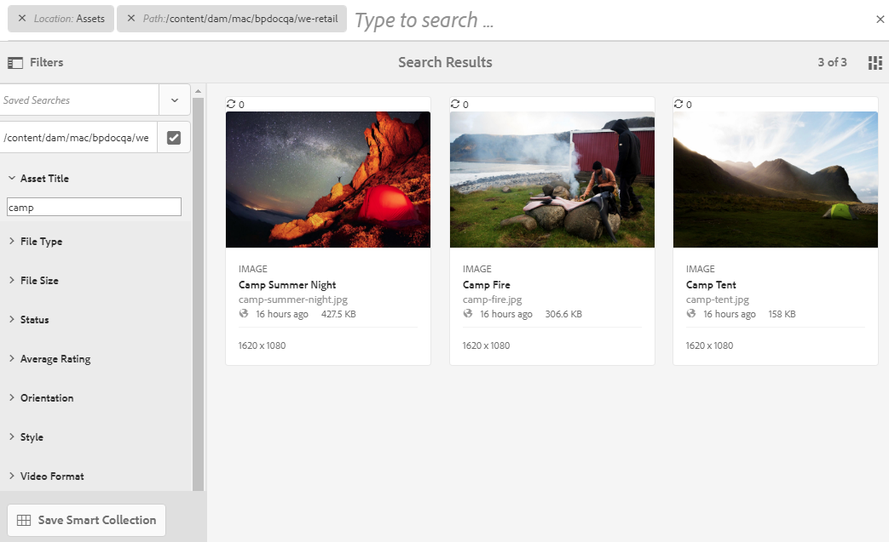
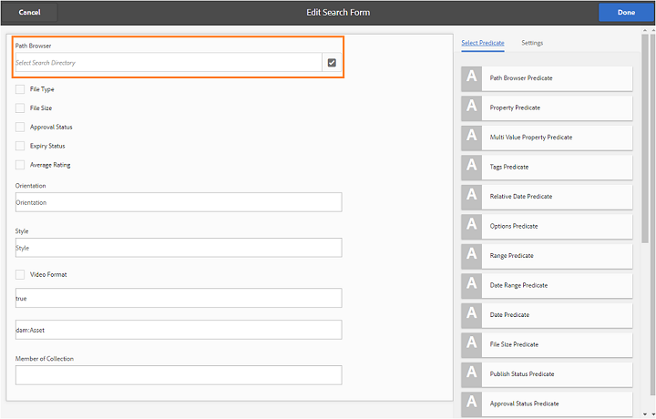
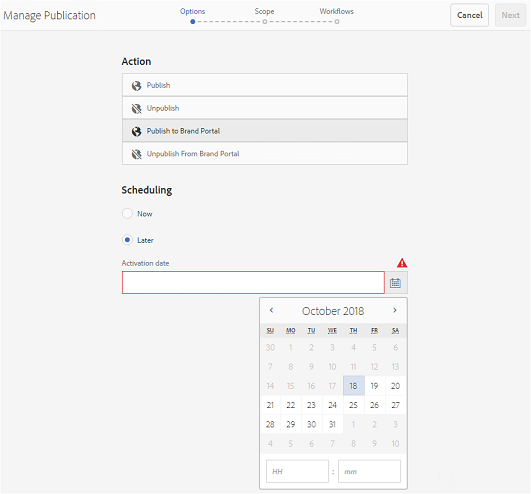
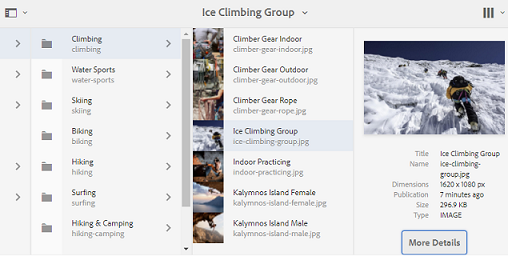

# Nieuwe functies in Experience Manager Assets Brand Portal {#what-s-new-in-aem-assets-brand-portal}

Met Adobe Experience Manager Assets Brand Portal kunt u eenvoudig goedgekeurde creatieve elementen aanschaffen, beheren en veilig distribueren aan externe partijen en interne zakelijke gebruikers op verschillende apparaten. Het draagt bij tot een efficiëntere verdeling van activa, versnelt de marktintroductie van activa en vermindert het risico van niet-naleving en ongeoorloofde toegang. Adobe werkt aan een verbetering van de algehele Brand Portal-ervaring. Hier is een blik in de nieuwe eigenschappen en verhogingen.

## Wat veranderde in 2024.10.0 {#what-changed-in-October-2024}

Brand Portal 2024.10.0 is een interne release die oplossingen voor de kritieke problemen bevat. Zie de recentste [&#x200B; Nota&#39;s van de Versie van Brand Portal &#x200B;](brand-portal-release-notes.md).

## Wat veranderde in 2024.02.0 {#what-changed-in-February-2024}

Brand Portal 2024.02.0 is een interne release die oplossingen voor de kritieke problemen bevat. Zie de recentste [&#x200B; Nota&#39;s van de Versie van Brand Portal &#x200B;](brand-portal-release-notes.md).

## Wat veranderde in 2023.10.0 {#what-changed-in-October-2023}

Brand Portal 2023.10.0 is een interne release die oplossingen voor de kritieke problemen bevat. Zie de recentste [&#x200B; Nota&#39;s van de Versie van Brand Portal &#x200B;](brand-portal-release-notes.md).

## Wat veranderde in 2023.08.0 {#what-changed-in-August-2023}

Brand Portal 2023.08.0 is een interne release die oplossingen voor de kritieke problemen bevat. Zie de recentste [&#x200B; Nota&#39;s van de Versie van Brand Portal &#x200B;](brand-portal-release-notes.md).

## Wat veranderde in 2023.05.0 {#what-changed-in-May-2023}

Brand Portal 2023.05.0 is een interne release die oplossingen voor de kritieke problemen bevat. Zie de recentste [&#x200B; Nota&#39;s van de Versie van Brand Portal &#x200B;](brand-portal-release-notes.md).

## Wat veranderde in 2023.02.0 {#what-changed-in-February-2023}

Brand Portal 2023.02.0 is een interne release die oplossingen voor de kritieke problemen bevat. Zie de recentste [&#x200B; Nota&#39;s van de Versie van Brand Portal &#x200B;](brand-portal-release-notes.md).

## Wat veranderde in 2022.10.0 {#what-changed-in-October-2022}

Brand Portal 2022.10.0 is een interne release die oplossingen voor de kritieke problemen bevat. Zie de recentste [&#x200B; Nota&#39;s van de Versie van Brand Portal &#x200B;](brand-portal-release-notes.md).

## Wat veranderde in 2022.08.0 {#what-changed-in-August-2022}

Brand Portal 2022.08.0 is een interne release die oplossingen voor de kritieke problemen bevat. Zie de recentste [&#x200B; Nota&#39;s van de Versie van Brand Portal &#x200B;](brand-portal-release-notes.md).

## Wat veranderde in 2022.05.0 {#what-changed-in-May-2022}

Brand Portal voert nu automatisch om de twaalf uur taken uit om alle Brand Portal-middelen te verwijderen die naar AEM zijn gepubliceerd. U hoeft daarom de middelen in de map Contribution niet handmatig te verwijderen om de mapgrootte onder de drempelwaarde te houden. U kunt de status van de automatisch uitgevoerde verwijdertaken ook controleren met de optie **[!UICONTROL Tools]** > **[!UICONTROL Asset Contribution Status]** > **[!UICONTROL Deletion Reports]** in Brand Portal. Het rapport voor een baan verstrekt de volgende details:

* Begintijd taak
* Eindtijd van taak
* Taakstatus
* Totaal aan activa inbegrepen in een baan
* Totaal aantal elementen is verwijderd in een taak
* Totale opslag beschikbaar gesteld als gevolg van de uitvoering van de taak

U kunt ook verder naar beneden boren om de details van elk middel te bekijken inbegrepen in een schrappingsbaan. De details zoals activa titel, grootte, auteur, schrappingsstatus, en schrappingstijd zijn inbegrepen in het rapport.

Bovendien bevat Brand Portal 2022.05.0 oplossingen voor de kritieke problemen. Zie de recentste [&#x200B; Nota&#39;s van de Versie van Brand Portal &#x200B;](brand-portal-release-notes.md).

## Wat veranderde in 2022.02.0 {#what-changed-in-Feb-2022}

Brand Portal 2022.02.0 is een interne release die oplossingen voor de kritieke problemen bevat. Zie de recentste [&#x200B; Nota&#39;s van de Versie van Brand Portal &#x200B;](brand-portal-release-notes.md).

## Wat veranderde in 2021.10.0 {#what-changed-in-october-2021}

Brand Portal 2021.10.0 is een interne release die oplossingen voor de kritieke problemen bevat. Zie de recentste [&#x200B; Nota&#39;s van de Versie van Brand Portal &#x200B;](brand-portal-release-notes.md).

## Wat veranderde in 2021.08.0 {#what-changed-in-august-2021}

Brand Portal 2021.08.0 is een interne release waarin bedrijfsprofielen worden geïntroduceerd voor bedrijven en teams die klanten kunnen gebruiken om organisaties betere controle over hun middelen te geven. De gebruikers hebben nu organisatiespecifieke rechten in de nieuwe en gemigreerde organisaties. Tijdens de migratie worden alle bestaande Adobe ID-accounts overgebracht naar Business ID&#39;s.

* Zakelijke id&#39;s naar alle nieuwe en bestaande organisaties nadat deze zijn gemigreerd.
* Voor bedrijfs-id&#39;s is geen specifieke instelling vereist, zoals het opvragen van een domein of het instellen van een SSO.
* U kunt gebruikers toevoegen met elk e-mailadres, inclusief openbare e-maildomeinen zoals gmail.com of outlook.com.

**Gevolgen voor de gebruikers van Brand Portal**

De migratie heeft geen invloed op uw bestaande gegevensset, elementen, gebruikers of instellingen. De enige interne wijziging die tijdens de migratie plaatsvindt, is het recht van uw bestaande organisatie op bedrijfsprofielen.

>[!NOTE]
>
>De bedrijfsprofielen zijn momenteel van toepassing op de nieuwe organisaties die na 16 augustus 2021 worden gecreeerd.
>
>Totdat uw organisatie is gemigreerd, kunt u Adobe ID-, Enterprise ID- of Federated ID-typen blijven gebruiken om toegang te krijgen tot de organisatie.

### Referentieartikelen {#reference-articles}

* [&#x200B; Introducerend de Profielen van Adobe &#x200B;](https://helpx.adobe.com/nl/enterprise/kb/introducing-adobe-profiles.html)

* [&#x200B; beheer Adobe Profielen &#x200B;](https://helpx.adobe.com/nl/enterprise/using/manage-adobe-profiles.html)

* [&#x200B; Update om in ervaring voor gebruikers en beheerders te ondertekenen &#x200B;](https://helpx.adobe.com/nl/enterprise/using/storage-for-business.html#new-admin-sign-in-exp)

* [&#x200B; Login beperking tijdens migratie &#x200B;](https://helpx.adobe.com/nl/enterprise/kb/account-temporarily-unavailable.html)

* [&#x200B; beheert gebruikers in Admin Console &#x200B;](https://helpx.adobe.com/nl/enterprise/using/manage-users-individually.html)

* [&#x200B; beheer productprofielen voor ondernemingsgebruikers &#x200B;](https://helpx.adobe.com/nl/enterprise/using/manage-product-profiles.html#assign-users)

* [&#x200B; Vertrouwen van het Domein &#x200B;](https://helpx.adobe.com/nl/enterprise/admin-guide.html/enterprise/using/set-up-identity.html#directory-trusting)

<!--   
### Add new users to T2E organization   {#add-users-to-T2E-org}

On adding a new user in Admin Console for a new or migrated T2E organization, the user will have to perform an additional step **Join Team** to get entitled to the T2E organization. 

The user is entitled only if the user chooses to **Join Team**, otherwise the user won't get access to the selected T2E organization in Brand Portal. 

>[!NOTE]
>
>The workflow is not applicable to the existing Brand Portal users.

### Additional screen while navigating to Admin Console   {#navigate-to-admin-console}

The administrators will have to perform an additional step of selecting the T2E organization while navigating from Brand Portal to Admin Console. The workflow applies on the new and migrated T2E organizations.   

Selection of the T2E organization is a one-time activity and is not required everytime the administrator navigates from Brand Portal to Admin Console.

1. Log in to a T2E organization in Brand Portal as administrator.
1. Go to **[!UICONTROL Tools]** > **[!UICONTROL Users]** > **[!UICONTROL Management]** and click on the link **[!UICONTROL Launch Admin Console]**. 

   Or, go to **[!UICONTROL Unified Shell]** > **[!UICONTROL Administration]** and click on the link **[!UICONTROL Launch Admin Console]**. 
1. Search the T2E organization to login to Admin Console.

   

### Restriction during migration of an organization   {#login-restriction}

When an organization is undergoing T2E migration, the users of that organization will not be able to login to Brand Portal. The following error message appears on the screen. However, the migration won't impact the active user session until the token expires. 

Once the migration is complete, the users can login to Brand Portal. The users will receive an email notification containing the entitlement changes. If the users are entitled to more than one organization, they will have to select the organization at the time of login. 
-->

<!--
For a new or migrated T2E orgnization, the users will have an organization specific entitlement. A user can have multiple entitlements with the same email id for different T2E organizations. 
-->

## Wat veranderde in 2021.06.0 {#what-changed-in-june-2021}

Brand Portal 2021.06.0 is een interne release die oplossingen voor de kritieke problemen bevat. Zie de recentste [&#x200B; Nota&#39;s van de Versie van Brand Portal &#x200B;](brand-portal-release-notes.md).

## Wat veranderde in 2021.02.0 {#what-changed-in-feb-2021}

Brand Portal 2021.02.0 verbetert AEM Assets as a Cloud Service met de activeringswerkstroom en de functie voor middelenbron. Het verbetert ook de ervaring van de activadownload en omvat kritieke moeilijke moeilijke situaties. Het laat ook de beheerders toe om het standaarddownloadgedrag van omslagen, inzamelingen, en bulkdownload van activa op huurdersniveau te vormen. De Brand Portal **[!UICONTROL Usage Report]** is ook aangepast aan de actieve Brand Portal-gebruikers.

>[!IMPORTANT]
>
> * Brand Portal bevindt zich in de onderhoudsmodus. Alle nieuwe productinnovaties zijn beschikbaar op [&#x200B; Content Hub &#x200B;](https://experienceleague.adobe.com/nl/docs/experience-manager-cloud-service/content/assets/content-hub/product-overview).
> * Als u Brand Portal nog steeds moet activeren, neemt u contact op met uw Adobe-vertegenwoordiger voor meer informatie over uw gebruiksgeval en andere specifieke vereisten.
> * Brand Portal is niet beschikbaar met [&#x200B; Assets Prime &#x200B;](https://experienceleague.adobe.com/nl/docs/experience-manager-cloud-service/content/assets/assets-prime) of [&#x200B; Assets Ultimate &#x200B;](https://experienceleague.adobe.com/nl/docs/experience-manager-cloud-service/content/assets/assets-ultimate-overview). Bestaande Assets as a Cloud Service-klanten, die al toegang hebben tot Brand Portal, kunnen deze echter blijven gebruiken wanneer ze naar Assets Ultimate overstappen.

<!--

### Activate Brand Portal on AEM Assets as a Cloud Service {#bp-automation-on-cloud-service}

AEM Assets as a Cloud Service is now entitled to have a pre-configured Brand Portal instance. The Cloud Manager user can activate Brand Portal on the AEM Assets as a Cloud Service instance.

Earlier, AEM Assets as a Cloud Service was manually configured with Brand Portal using Adobe Developer Console.

The Cloud Manager user triggers the activation workflow that creates the required configurations at the backend and activates Brand Portal on the same IMS org as of the AEM Assets as a Cloud Service instance. 

To activate Brand Portal on your AEM Assets as a Cloud Service instance:

1. Log in to Adobe Cloud Manager and navigate to **[!UICONTROL Environments]**.
1. Select the environments (one by one) from the list. Once you find the environment associated with Brand Portal, click on the **[!UICONTROL Activate Brand Portal]** button to begin the activation workflow. 
1. Once the Brand Portal tenant is activated, the status changes to Activated.

See [activate Brand Portal on AEM Assets as a Cloud Service](https://experienceleague.adobe.com/nl/docs/experience-manager-cloud-service/content/assets/brand-portal/configure-aem-assets-with-brand-portal).

### Asset Sourcing on AEM Assets as a Cloud Service {#asset-sourcing-on-cloud-service}

The Asset Sourcing feature is now available on AEM Assets as a Cloud Service. The feature is by default enabled for all the cloud service users. The permitted Brand Portal users can contribute to Asset Sourcing by uploading new assets to the contribution folders and publish the contribution folder from Brand Portal to AEM Assets as a Cloud Service instance. Administrators can review and approve contributions from Brand Portal users before distributing them to other users.     

Earlier, Asset Sourcing was only available on AEM Assets (on premise and managed service). 

See [Asset Sourcing in Brand Portal](https://experienceleague.adobe.com/nl/docs/experience-manager-brand-portal/using/asset-sourcing-in-brand-portal/brand-portal-asset-sourcing).
-->

### Asset Download {#asset-download-setting}

Naast de bestaande **[!UICONTROL Download Settings]** kunnen de Brand Portal-beheerders nu de instelling **[!UICONTROL Asset Download]** configureren. Met deze instelling kunnen beheerders het standaarddownloadgedrag van mappen, verzamelingen en het bulkdownloaden van elementen (meer dan 20 elementen) op huurdersniveau bepalen.

<!--
Earlier, all the asset renditions were directly downloaded in a zip folder in case of folder, collection, and bulk download of assets. As the **[!UICONTROL Download]** dialog box is skipped for folders or collections, there was no mechanism to control the downloading behaviour of the assets. Due to this, the users were finding it difficut to search for a particular asset rendition from a folder containing huge bunch of downloaded renditions. 
-->

Eerder werden alle elementenuitvoeringen rechtstreeks gedownload in een ZIP-map. Het dialoogvenster **[!UICONTROL Download]** is overgeslagen voor mappen en verzamelingen. En er was geen methode om het downloadgedrag van de activa te controleren, waardoor het moeilijk werd om naar een bepaalde vertoning van vele downloads te zoeken.

Met de instelling **[!UICONTROL Asset Download]** kunt u nu een aparte map voor elk element maken terwijl u de mappen, verzamelingen of bestanden bulksgewijs downloadt.

Als de instelling **[!UICONTROL Asset Download]** is uitgeschakeld, worden de mappen of verzamelingen gedownload in een ZIP-map met alle elementuitvoeringen in dezelfde map, behalve voor het downloaden van de elementen via de koppeling voor delen.

Meld u als beheerder aan bij de Brand Portal-medewerker en navigeer naar **[!UICONTROL Tools]** > **[!UICONTROL Download]** . De beheerders kunnen de instelling **[!UICONTROL Asset Download]** inschakelen om een aparte map voor elk element te maken tijdens het downloaden van mappen, verzamelingen en het bulkdownloaden van elementen.

Zie [&#x200B; downloadactiva van Brand Portal &#x200B;](https://experienceleague.adobe.com/nl/docs/experience-manager-brand-portal/using/download/brand-portal-download-assets).
<!--
### Download using Share link {#download-using-share-link}

The default behavior of downloading the assets using share link is now independent of the **[!UICONTROL Download Settings]**. A separate folder is created for each asset while downloading the assets using share link. 
-->

### Gebruiksrapport {#usage-report}

De Brand Portal **[!UICONTROL Usage Report]** is gewijzigd om alleen de actieve Brand Portal-gebruikers weer te geven. De Brand Portal-gebruikers die niet aan een productprofiel in de Admin Console zijn toegewezen, worden beschouwd als inactieve gebruikers en worden niet weergegeven in de **[!UICONTROL Usage Report]** .

Eerder, zowel werden de actieve als inactieve gebruikers getoond in het Rapport van het Gebruik.

## Wat veranderde in 2020.10.0 {#what-changed-in-oct-2020}

Brand Portal 2020.10.0 is een verbeteringsrelease die zich richt op het vereenvoudigen van het downloaden van bedrijfsmiddelen en die belangrijke oplossingen bevat. De verbetering introduceert een nieuwe en verbeterde workflow voor het downloaden van elementen, met opties om uitvoeringen en directe downloads uit te sluiten van het deelvenster **[!UICONTROL Renditions]** . Het staat ook configuratie van toegang en downloadrechten voor specifieke gebruikersgroepen toe, en verstrekt gemakkelijke navigatie aan dossiers, inzamelingen, en gedeelde verbindingen van alle pagina&#39;s van Brand Portal. Zie de [&#x200B; Nota&#39;s van de Versie van Brand Portal &#x200B;](brand-portal-release-notes.md).

### Vereenvoudigde downloadervaring {#download-dialog}

Eerder werden in het dialoogvenster **[!UICONTROL Download]** meerdere opties geboden, zoals het maken van aparte mappen voor elk element, het verzenden van e-mailmiddelen, het selecteren van originele elementen en nog veel meer. Deze opties waren verwarrend voor niet-technische of nieuwe gebruikers, vooral wanneer het downloaden van veelvoudige activa of omslagen. Bovendien kon de gebruiker niet alle elementuitvoeringen zien of een specifieke aangepaste of dynamische uitvoering uitsluiten.

Het nieuwe dialoogvenster **[!UICONTROL Download]** generaliseert het proces voor het selecteren en filteren van elementen, waardoor Brand Portal-gebruikers gemakkelijker effectieve beslissingen kunnen nemen tijdens het downloaden van de elementuitvoeringen. Alle geselecteerde elementen en de bijbehorende uitvoeringen worden weergegeven, afhankelijk van de instellingen voor [**[!UICONTROL Download]**](brand-portal-download-assets.md) configuration en **[!UICONTROL Download]** .

>[!NOTE]
>
>Alle gebruikers hebben nu **[!UICONTROL Fast Download]** toegelaten door gebrek en vereist IBM® [&#x200B; Aspera Connect 3.9.9 &#x200B;](https://www.ibm.com/support/fixcentral/swg/selectFixes?parent=ibm~Other%20software&product=ibm/Other+software/IBM+Aspera+Connect&release=3.9.9&platform=All&function=all) geïnstalleerd in hun browser uitbreiding alvorens de activa van Brand Portal te downloaden.

<!--
If any of the **[!UICONTROL Custom Rendition]** or **[!UICONTROL System Rendition]** is enabled in the [**[!UICONTROL Download]**](brand-portal-download-assets.md) configuration and **[!UICONTROL Download]** settings are enabled for the group users, the new **[!UICONTROL Download]** dialog box appears with all the renditions of the selected assets or folders containing assets in a List View. 
-->

In het dialoogvenster **[!UICONTROL Download]** kunnen gebruikers:

* Alle beschikbare uitvoeringen van elementen in de downloadlijst weergeven.
* Sluit uitvoeringen van de elementen uit die niet vereist zijn voor downloaden.
* Pas met één klik dezelfde set uitvoeringen toe op alle vergelijkbare elementtypen.
* Pas een andere set uitvoeringen toe voor verschillende elementtypen.
* Maak een aparte map voor elk element.
* Geselecteerde elementen en de bijbehorende uitvoeringen downloaden.

De downloadworkflow is consistent voor zelfstandige elementen, meerdere elementen, mappen met elementen, gelicentieerde of niet-gelicentieerde elementen en bij het downloaden van elementen via de koppeling voor delen. Zie [&#x200B; stappen om activa van Brand Portal &#x200B;](https://experienceleague.adobe.com/nl/docs/experience-manager-brand-portal/using/download/brand-portal-download-assets) te downloaden.

### Snelle navigatie {#quick-navigation}

Eerder waren de opties voor weergave van **[!UICONTROL Files]** , **[!UICONTROL Collections]** en **[!UICONTROL Shared Links]** verborgen en moesten meerdere klikken telkens wanneer de gebruiker naar een andere weergave wilde overschakelen.

In Brand Portal 2020.10.0 kunnen gebruikers met één klik via de snelkoppelingen naar **[!UICONTROL Files]** -, **[!UICONTROL Collections]** - en **[!UICONTROL Shared Links]** -pagina&#39;s navigeren.

### Verbeterd deelvenster voor uitvoering {#rendition-panel}

Eerder konden de gebruikers het oorspronkelijke element en de bijbehorende uitvoeringen alleen weergeven in het deelvenster **[!UICONTROL Renditions]** als een van de **[!UICONTROL Custom Rendition]** of **[!UICONTROL System Rendition]** was ingeschakeld in de **[!UICONTROL Download]** -configuratie. Bovendien moesten de gebruikers alle elementuitvoeringen downloaden omdat er geen filter was om specifieke aangepaste of dynamische uitvoeringen uit te sluiten die niet vereist waren.

<!--
Earlier, if any of the custom or system renditions was enabled in the **[!UICONTROL Download]** settings, an additional **[!UICONTROL Download]** dialog box appeared on clicking the **[!UICONTROL Download]** button wherein the user had to manually select the set of renditions (original asset, custom renditions, dynamic renditions) to download.
There was no filter to exclude specific custom or dynamic renditions which were not required for download.
-->

In Brand Portal 2020.10.0, kunnen de gebruikers specifieke vertoningen uitsluiten en direct [&#x200B; de geselecteerde vertoningen van het paneel van Vertoningen &#x200B;](brand-portal-download-assets.md#download-assets-from-asset-details-page) in de pagina van elementendetails downloaden zonder het moeten **[!UICONTROL Download]** dialoogdoos openen.

<!-- 
In Brand Portal 2020.10.0, direct download and exclude renditions features are introduced in the **[!UICONTROL Renditions]** panel on the asset details page. All the renditions (original asset, custom renditions, dynamic renditions) under the rendition panel are now associated with a check box and are enabled by default. 

The user can clear the check boxes to exclude the renditions which are not required for download. And can click on the **[!UICONTROL Download]** button in the **[!UICONTROL Renditions]** panel to directly download the selected set of renditions in a zip folder without having to open the **[!UICONTROL Download]** dialog box.
-->

### Downloadinstellingen configureren {#download-permissions}

Brand Portal-beheerders kunnen nu instellingen voor gebruikersgroepen configureren om originele elementen en uitvoeringen, of beide, weer te geven of te downloaden vanaf de pagina met elementdetails, naast de bestaande **[!UICONTROL Download]** -configuraties.

Meld u als beheerder aan bij de Brand Portal-medewerker en navigeer naar **[!UICONTROL Tools]** > **[!UICONTROL Users]** .

Navigeer op de pagina **[!UICONTROL User Roles]** naar het tabblad **[!UICONTROL Groups]** om de weergave- en (of) downloadinstellingen voor de gebruikersgroepen te configureren.

Eerder waren de instellingen alleen beschikbaar om te voorkomen dat groepsgebruikers het oorspronkelijke element konden downloaden.

Met het tabblad **[!UICONTROL Groups]** op de pagina **[!UICONTROL User Roles]** kunnen beheerders de weergave- en downloadinstellingen configureren:

* Als de instellingen voor **[!UICONTROL Download Original]** en **[!UICONTROL Download Renditions]** beide zijn ingeschakeld, kunnen de gebruikers van de geselecteerde groep de oorspronkelijke elementen en hun uitvoeringen weergeven en downloaden.
* Als beide instellingen zijn uitgeschakeld, kunnen de gebruikers alleen de originele elementen bekijken. De elementuitvoeringen zijn niet zichtbaar voor de gebruikers op de pagina met elementdetails.
* Als alleen de instelling **[!UICONTROL Download Original]** is ingeschakeld, kunnen gebruikers alleen de oorspronkelijke elementen weergeven en downloaden van de pagina met elementdetails.
* Als alleen de instelling **[!UICONTROL Download Renditions]** is ingeschakeld, kunnen gebruikers het oorspronkelijke element weergeven, maar kunnen ze het niet downloaden. De gebruiker kan de elementuitvoeringen wel weergeven en downloaden.

Zie [&#x200B; activadownload &#x200B;](https://experienceleague.adobe.com/nl/docs/experience-manager-brand-portal/using/download/brand-portal-download-assets#configure-download-permissions) vormen.

>[!NOTE]
>
>Als een gebruiker wordt toegevoegd aan meerdere groepen en als een van deze groepen beperkingen heeft, gelden de beperkingen voor de gebruiker.

<!--
>Restrictions to access the original asset and their renditions do not apply to administrators even if they are members of restricted groups.
 >
 >The users can always download assets and their renditions from the repository using a `curl` request even if the download configurations are turned-off.
 >
-->

## Wat veranderde in 6.4.7 {#what-changed-in-647}

De release van Brand Portal 6.4.7 biedt de documentviewer, verbetert de ervaring voor het downloaden van middelen en bevat belangrijke correcties. Zie de recentste [&#x200B; Nota&#39;s van de Versie van Brand Portal &#x200B;](brand-portal-release-notes.md).

<!--
Brand Portal 6.4.7 release brings in the Document Viewer, leverages the Brand Portal administrators to configure asset download, and centers top customer requests. See latest [Brand Portal Release Notes](brand-portal-release-notes.md).
-->

### Documentviewer {#doc-viewer}

De documentviewer verbetert de weergave van PDF. De toepassing biedt een vergelijkbare ervaring als de Adobe Document Cloud terwijl de PDF-bestanden in Brand Portal worden weergegeven.

Eerder waren er beperkte opties beschikbaar om de PDF-bestanden te bekijken.

Brand Portal-gebruikers kunnen met de documentviewer pagina&#39;s en bladwijzers weergeven, tekst zoeken, in- en uitzoomen en door pagina&#39;s navigeren. Ze kunnen overschakelen naar een specifieke pagina, passen in een venster of scherm en de zichtbaarheid van de werkbalk in- en uitschakelen.

>[!NOTE]
>
>De ervaring met het weergeven van andere documentindelingen blijft ongewijzigd.

### Downloadervaring {#download-configurations}

Het proces van de activadownload wordt herzien, die een vereenvoudigde gebruikerservaring verstrekken terwijl [&#x200B; het downloaden activa van Brand Portal &#x200B;](brand-portal-download-assets.md).

De bestaande workflow voor het downloaden van middelen van Brand Portal wordt onvermijdelijk gevolgd door de weergave van een dialoogvenster **[!UICONTROL Download]** met meerdere downloadopties waaruit u kunt kiezen.

In Brand Portal 6.4.7 kunnen de Brand Portal-beheerders de instellingen voor het element **[!UICONTROL Download]** configureren. De beschikbare configuraties zijn:

* **[!UICONTROL Fast Download]**
* **[!UICONTROL Custom Renditions]**
* **[!UICONTROL System Renditions]**

De Brand Portal-beheerder kan elke combinatie inschakelen om het downloaden van middelen te configureren.

<!--In Brand Portal 6.4.7, fast download, custom renditions, and system renditions are the three configurations available.-->

* Als zowel **[!UICONTROL Custom Renditions]** als **[!UICONTROL System Renditions]** -configuraties zijn uitgeschakeld, worden de oorspronkelijke uitvoeringen van de elementen gedownload zonder extra dialoogvenster. Dit vereenvoudigt het downloaden voor Brand Portal-gebruikers.

* Als een van de opties **[!UICONTROL Custom Rendition]** of **[!UICONTROL System Rendition]** is ingeschakeld, wordt het dialoogvenster **[!UICONTROL Download]** weergegeven en worden het oorspronkelijke element en de elementuitvoeringen gedownload. Als u **[!UICONTROL Fast Download]** -configuratie inschakelt, wordt het downloadproces versneld.

Gebaseerd op de configuratie, blijft het downloadwerkschema constant voor stand-alone activa, veelvoudige activa, en omslagen die activa bevatten. Het omvat ook gelicentieerde of niet-gelicentieerde activa, en het downloaden van activa die een aandeelverbinding gebruiken.

## Wat veranderde in 6.4.6 {#what-changed-in-646}

In Brand Portal 6.4.6 wordt het machtigingskanaal tussen AEM Assets en Brand Portal gewijzigd. Brand Portal wordt nu ondersteund op AEM Assets as a Cloud Service, AEM Assets 6.3 en hoger. In AEM Assets 6.3 en hoger werd Brand Portal aanvankelijk geconfigureerd in de klassieke gebruikersinterface met behulp van de Legacy OAuth Gateway. Deze gateway gebruikt de het symbolenuitwisseling JWT om een token van de Toegang IMS voor vergunning te verkrijgen. AEM Assets is nu geconfigureerd met Brand Portal via Adobe Developer Console, dat een IMS-token aanschaft voor toestemming van uw Brand Portal-huurder.

<!-- The steps to configure integration are different depending on your AEM version, and whether you are configuring for the first-time, or upgrading the existing integration:
-->

<!--
  
   | **AEM Version** |**New Integration** |**Upgrade Integration** |
|---|---|---|
| **AEM 6.5** |[Create new integration](../using/brand-portal-configure-integration-65.md) |[Upgrade existing integration](../using/brand-portal-configure-integration-65.md#upgrade-integration-65) | 
| **AEM 6.4** |[Create new integration](../using/brand-portal-configure-integration-64.md) |[Upgrade existing integration](../using/brand-portal-configure-integration-64.md#upgrade-integration-64) | 
| **AEM 6.3** |[Create new integration](../using/brand-portal-configure-integration-63.md) |[Upgrade existing integration](../using/brand-portal-configure-integration-63.md#upgrade-integration-63) | 
| **AEM 6.2** | | 

   -->

De stappen voor het configureren van AEM Assets met Brand Portal zijn afhankelijk van uw AEM-versie en of u de configuratie voor het eerst configureert of de bestaande configuraties bijwerkt:

<!--| **AEM Version** |**New Configuration** |**Upgrade Configuration** |
|---|---|---|
| **AEM 6.5 (6.5.4.0 and above)** |[Create configuration](../using/brand-portal-configure-integration-65.md) |[Upgrade configuration](../using/brand-portal-configure-integration-65.md#upgrade-integration-65) | 
| **AEM 6.4 (6.4.8.0 and above)** |[Create configuration](../using/brand-portal-configure-integration-64.md) |[Upgrade configuration](../using/brand-portal-configure-integration-64.md#upgrade-integration-64) | 
| **AEM 6.3 (6.3.3.8 and above)** |[Create configuration](../using/brand-portal-configure-integration-63.md) |[Upgrade configuration](../using/brand-portal-configure-integration-63.md#upgrade-integration-63) | 

-->

<!-- AEM Assets configuration with Brand Portal on Adobe I/O is supported on:
* AEM 6.5.4.0 and above
* AEM 6.4.8.0 and above
* AEM 6.3.3.8 and above -->

| **Versie van AEM** | **Nieuwe Configuratie** | **Configuratie van de Verbetering** |
|---|---|---|
| **AEM Assets as a Cloud Service** | [&#x200B; creeer configuratie &#x200B;](https://experienceleague.adobe.com/nl/docs/experience-manager-cloud-service/content/assets/brand-portal/configure-aem-assets-with-brand-portal) | - |
| **AEM 6.5 (6.5.4.0 en hierboven)** | [&#x200B; creeer configuratie &#x200B;](https://experienceleague.adobe.com/nl/docs/experience-manager-65/content/assets/brandportal/configure-aem-assets-with-brand-portal) | [&#x200B; de configuratie van de Verbetering &#x200B;](https://experienceleague.adobe.com/nl/docs/experience-manager-65/content/assets/brandportal/configure-aem-assets-with-brand-portal#upgrade-integration-65) |

>[!NOTE]
>
>Adobe raadt u aan uw AEM-exemplaar bij te werken om het nieuwste servicepakket te gebruiken.

Zie de [&#x200B; Nota&#39;s van de Versie van Brand Portal &#x200B;](brand-portal-release-notes.md).

Zie [&#x200B; FAQs van Brand Portal &#x200B;](brand-portal-faqs.md).

## Wat veranderde in 6.4.5 {#what-changed-in-645}

Met Brand Portal 6.4.5 kunnen externe bureaus en teams inhoud uploaden naar Brand Portal en deze publiceren naar AEM Assets, zonder dat ze toegang hoeven te hebben tot de auteursomgeving. Deze eigenschap wordt genoemd **[Middelen van Activa in Brand Portal](brand-portal-asset-sourcing.md)**, en verbetert klantenervaringen door een bidirectioneel mechanisme voor gebruikers te verstrekken om activa met andere globaal verdeelde gebruikers van Brand Portal zowel bij te dragen als te delen.

### Asset Sourting in Brand Portal {#asset-sourcing-in-bp}

De Middelen van activa staan de gebruikers van AEM (beheerders/niet-admin gebruikers) toe om omslagen met een extra **bezit van de Bijdrage van Activa te creëren**, die de nieuwe omslag verzekeren open aan activa voorlegging door de gebruikers van Brand Portal wordt gecreeerd. Het brengt automatisch een werkschema in werking dat tot twee extra subomslagen, genoemd NIEUW en GEDEELD, binnen de pas gecreëerde **omslag van de Bijdrage** leidt.

De gebruiker van AEM uploadt een korte en basislijnactiva aan de **GEDEELDE** omslag. Ze definiëren de typen elementen die nodig zijn in de bijdragemap, zodat Brand Portal-gebruikers over de benodigde referentie-informatie beschikken. De beheerder kan actieve gebruikers van Brand Portal toegang tot de bijdrageomslag dan verlenen alvorens de pas gecreëerde **omslag van de Bijdrage** aan Brand Portal te publiceren.

Zodra de gebruiker wordt gebeëindigd toevoegend inhoud in de **NIEUWE** omslag, kunnen zij de bijdrageomslag terug naar het milieu van de Auteur van AEM publiceren. Het kan enkele minuten duren voordat de import is voltooid en de nieuw gepubliceerde inhoud in AEM Assets wordt weerspiegeld.

Bovendien blijven alle bestaande functies ongewijzigd. Brand Portal-gebruikers kunnen middelen weergeven, zoeken en downloaden vanuit de map met bijdragen en vanuit de andere toegestane mappen. En beheerders kunnen de bijdragemap verder delen, eigenschappen wijzigen en elementen toevoegen aan verzamelingen.

>[!NOTE]
>
>Asset Sourcing in Brand Portal wordt ondersteund op AEM 6.5.2.0 en hoger.
>
>De functie wordt niet ondersteund in eerdere versies, AEM 6.3 en AEM 6.4.

### Elementen uploaden naar de bijdragemap {#upload-assets-in-bp}

Brand Portal-gebruikers met de juiste machtigingen kunnen afzonderlijke elementen of mappen (.zip-bestand) met meerdere elementen uploaden naar de map met bijdragen. Een gebruiker kan meerdere elementen uploaden naar een map voor middelenbijdragen. Er kan echter maar één map tegelijk worden gemaakt.

De gebruikers van Brand Portal kunnen slechts activa aan **NIEUWE** subfolder uploaden. De **GEDEELDE** omslag wordt bedoeld voor de distributie van vereisten en basislijnactiva.

### Bijdragemap publiceren naar AEM Assets {#publish-assets-to-aem}

Zodra uploaden aan de **NIEUWE** omslag volledig is, kunnen de gebruikers van Brand Portal de bijdrageomslag terug naar AEM dan publiceren. Het kan een paar minuten duren om de gepubliceerde inhoud/middelen in AEM Assets te importeren en weer te geven. Zie [&#x200B; bijdragen omslag aan AEM Assets &#x200B;](brand-portal-publish-contribution-folder-to-aem-assets.md) publiceren.

## Wat veranderde in 6.4.4 {#what-changed-in-644}

De release van Brand Portal 6.4.4 richt zich op verbeteringen in het zoeken naar tekst en op verzoeken van klanten. Zie de recentste [&#x200B; Nota&#39;s van de Versie van Brand Portal &#x200B;](brand-portal-release-notes.md).

### Verbeteringen voor zoeken

Vanaf Brand Portal 6.4.4 steunt gedeeltelijk tekstonderzoek in de Predicate van het Bezit in de het filtreren ruit. Om gedeeltelijk tekstonderzoek toe te staan, laat **Gedeeltelijk Onderzoek** in Bezit in de onderzoeksvorm toe.

Lees verder om meer te weten over gedeeltelijk tekstonderzoek en vervangingsonderzoek.

#### Gedeeltelijke woordzoekopdracht {#partial-phrase-search}

U kunt nu naar elementen zoeken door alleen een deel, dat wil zeggen een woord of twee, van de gezochte uitdrukking op te geven in het filtervenster.

**Geval van het Gebruik**
Gedeeltelijke woordzoekactie is handig als u niet zeker weet welke combinatie van woorden in de gezochte uitdrukking voorkomt.

Bijvoorbeeld, als uw onderzoeksvorm in Brand Portal het Predicaat van het Bezit voor gedeeltelijk onderzoek op activa titel gebruikt, dan die het term **kamp** specificeert keert alle activa met het woordkamp in hun titeluitdrukking terug.

#### Zoekopdracht met jokertekens {#wildcard-search}

Brand Portal staat het gebruiken van de asterisk (&#42;) met een deel van een woord in uw onderzoeksvraag toe.

Als u niet zeker weet welke woorden precies voorkomen in de gezochte uitdrukking, kunt u een vervangingsonderzoek gebruiken om de hiaten in uw onderzoeksvraag te vullen.

Bijvoorbeeld, die **klimt&#42;** alle activa specificeren die woorden hebben die met de karakters **beginnen klimmen** in hun titeluitdrukking als de onderzoeksvorm in Brand Portal de Predicate van het Bezit voor gedeeltelijk onderzoek op activa titel gebruikt.

Op dezelfde manier specificeren:

* **&#42;klimt** keert alle activa terug die woorden hebben die met karakters **beëindigen klimt** in hun titeluitdrukking.

* **&#42;klimt&#42;** keert alle activa terug die woorden bevatten die de karakters **&#x200B;**&#x200B;in hun titeluitdrukking klimmen.

>[!NOTE]
>
>Bij het selecteren van **Gedeeltelijk Onderzoek** checkbox, **wordt het Geval van de Negeer** geselecteerd door gebrek.

## Wat veranderde in 6.4.3 {#what-changed-in}

Brand Portal 6.4.3 introduceert een alternatieve alias voor toegang URLs, een nieuwe omslaghiërarchie, en videosteunverhogingen. Het introduceert ook geplande publicatie van AEM Author aan Brand Portal, operationele verbeteringen, en richt klantenverzoeken.

### Navigatie in maphiërarchie voor niet-beheerders

Beheerders kunnen nu configureren hoe de mappen bij het aanmelden worden weergegeven aan gebruikers zonder beheer (Editors, Viewers en Gastgebruikers). [&#x200B; laat de Configuratie van de Hiërarchie van de Omslag toe &#x200B;](../using/brand-portal-general-configuration.md) wordt toegevoegd in **Algemene Montages**, in het admin hulpmiddelenpaneel. Als de configuratie:

* **toegelaten**, is de omslagboom die van de wortelomslag begint zichtbaar aan gebruikers niet-admin. Aldus, die hen een navigatie ervaring gelijkend op beheerders verlenen.
* **gehandicapt**, slechts worden de gedeelde omslagen getoond op de het landen pagina.

[&#x200B; laat de functionaliteit van de Hiërarchie van de Omslag toe &#x200B;](../using/brand-portal-general-configuration.md) (wanneer toegelaten) helpt u de omslagen met de zelfde namen onderscheiden die van verschillende hiërarchieën worden gedeeld. Bij het aanmelden zien niet-beheerders nu de virtuele bovenliggende mappen (en vooroudermappen) van de gedeelde mappen.

De gedeelde mappen worden in de desbetreffende directory&#39;s in virtuele mappen ingedeeld. U kunt deze virtuele mappen herkennen met een vergrendelingspictogram.

De standaardminiatuur van de virtuele mappen is de miniatuurafbeelding van de eerste gedeelde map.

### Zoeken in een specifieke maphiërarchie of een bepaald pad

**Browser van de Weg** voorspelt wordt geïntroduceerd in onderzoeksvorm om het zoeken van activa in een specifieke folder toe te staan. Het standaardzoekpad van de zoekvoorspelling voor de padbrowser is `/content/dam/mac/<tenant-id>/` , dat kan worden geconfigureerd door het standaardzoekformulier te bewerken.

* Admin-gebruikers kunnen met de Padbrowser naar een willekeurige mapmap op Brand Portal navigeren.
* Gebruikers die geen beheerder zijn, kunnen de padbrowser gebruiken om alleen naar de mappen (en terug te navigeren naar de bovenliggende mappen) te navigeren die met hen worden gedeeld.

  `/content/dam/mac/<tenant-id>/folderA/folderB/folderC` wordt bijvoorbeeld gedeeld met een gebruiker die geen beheerder is. De gebruiker kan naar elementen binnen folderC zoeken gebruikend Browser van de Weg. Deze gebruiker kan ook naar folderB en folderA navigeren (aangezien zij voorouders van folderC zijn die met de gebruiker wordt gedeeld).

U kunt nu het zoeken naar middelen beperken in een specifieke map waarnaar u hebt gebladerd, in plaats van te beginnen bij de hoofdmap.

Als u onder deze mappen zoekt, wordt alleen gezocht naar elementen die met de gebruiker zijn gedeeld.

### Ondersteuning voor dynamische media-video-uitvoeringen

Gebruikers van wie de AEM Author-instantie zich in de hybride modus Dynamische media bevindt, kunnen naast de originele videobestanden ook een voorvertoning van de dynamische media-uitvoeringen weergeven en deze downloaden.

Om voorproef en download van dynamische media vertoningen op specifieke huurdersrekeningen toe te laten, specificeren de beheerders a **Dynamische Configuratie van Media**. Deze stap omvat de videodienst URL en registratie identiteitskaart in de **Video** configuratie van het admin hulpmiddelenpaneel.

Dynamische mediavideo&#39;s kunnen worden voorvertoond op:

* Pagina met elementgegevens
* Weergave van de kaart van het element
* Voorvertoningspagina voor delen koppelen

Dynamische videocodes voor media kunnen worden gedownload van:

* Brand Portal
* Gedeelde koppeling

### Gepland publiceren naar Brand Portal

De publicatieworkflow van Assets (en mappen) van de AEM 6.4.2.0 Author-instantie naar Brand Portal kan voor een latere datum en tijd worden gepland.

Op dezelfde manier kunnen gepubliceerde elementen later uit het portaal worden verwijderd door de workflow Publiceren via Brand Portal te plannen.

### Configureerbare alias van huurder in URL

Organisaties kunnen hun portal-URL aanpassen door een alternatief voorvoegsel in de URL te plaatsen. Om een alias voor de huurdersnaam in hun bestaande portaal URL te krijgen, moeten de organisaties de Steun van de Klant contacteren.

Alleen het voorvoegsel van de Brand Portal-URL kan worden aangepast en niet de volledige URL.\
Bijvoorbeeld, kan een organisatie met een bestaand domein **geomettrix.brand-portal.adobe.com** **geomettrixinc.brand-portal.adobe.com** krijgen die op verzoek wordt gecreeerd.

Nochtans, kan de instantie van de Auteur van AEM [&#x200B; worden gevormd &#x200B;](https://experienceleague.adobe.com/nl/docs/experience-manager-65/content/assets/brandportal/configure-aem-assets-with-brand-portal) slechts met huurderidentiteitskaart URL en niet met huurder alias (afwisselend) URL.

Organisaties kunnen aan hun merkingsbehoeften voldoen door de portaal-URL aan te passen in plaats van zich aan de URL van Adobe te houden.

### Verbeteringen in downloadervaring

De release biedt een vereenvoudigde downloadervaring met een beperkt aantal klikken en waarschuwingen op:

* Opdat alleen de uitvoeringen (en niet de oorspronkelijke elementen) worden gedownload.
* De elementen downloaden wanneer de toegang tot de oorspronkelijke uitvoeringen beperkt is.

## Wat veranderde in 6.4.2 {#what-changed-in-1}

Brand Portal 6.4.2 introduceert functies die voldoen aan de behoeften van organisaties op het gebied van de distributie van bedrijfsmiddelen, waardoor gasttoegang en snellere downloads wereldwijd bereik mogelijk maken. Het biedt ook verbeterde controle met nieuwe adminconfiguraties, een toegevoegd rapport, en richt klantenverzoeken aan.

### Toegang voor gasten

AEM Brand Portal staat gasttoegang tot het portaal toe. Een gast-gebruiker heeft geen referenties nodig om het portaal in te voeren en kan alle openbare mappen en verzamelingen openen en downloaden. Gastgebruikers kunnen elementen toevoegen aan hun lichtbak (privéverzameling) en deze downloaden. Ze kunnen ook zoeken naar slimme tags en voorspelden van zoekopdrachten weergeven die door beheerders zijn ingesteld. De gastzitting staat gebruikers niet toe om inzamelingen tot stand te brengen en bewaarde onderzoeken of hen verder te delen, tot omslag en inzamelingsmontages toegang te hebben, en activa als verbindingen te delen.

In een organisatie zijn meerdere gelijktijdige gastsessies toegestaan, wat beperkt is tot 10% van de totale gebruikersquota per organisatie.

Een gastsessie blijft twee uur actief. Daarom wordt de staat van de lichtbak ook bewaard tot twee uur vanaf de tijd van het zittingsbegin. Na twee uur, moet de gastzitting opnieuw beginnen, zodat wordt de lichtbakstaat verloren.

### Versnelde downloads

Brand Portal-gebruikers kunnen snelle downloads toepassen op basis van IBM® Aspera Connect, zodat ze 25x sneller kunnen downloaden en overal ter wereld probleemloos kunnen downloaden. Om de activa van Brand Portal of de gedeelde verbinding sneller te downloaden, moeten de gebruikers de **toelaten optie van de Versnelling van de Download** in de doos van de downloaddialoog selecteren, op voorwaarde dat de downloadversnelling in hun organisatie wordt toegelaten.

Om op IBM® Aspera gebaseerde versnelde download voor de organisatie toe te laten, laten de beheerders **de optie van de Versnelling van de Download** toe (die door gebrek) van [&#x200B; Algemene Montages &#x200B;](brand-portal-general-configuration.md#allow-download-acceleration) in het administratieve hulpmiddelenpaneel wordt onbruikbaar gemaakt.

Voor eerste vereisten en het oplossen van problemenstappen om activadossiers van Brand Portal en gedeelde verbindingen sneller te downloaden, zie [&#x200B; Gids om downloads van Brand Portal &#x200B;](../using/accelerated-download.md#main-pars-header) te versnellen.

### Rapport voor gebruikersaanmelding

Er wordt nu een nieuw rapport voor het bijhouden van gebruikersaanmelding geïntroduceerd. Het **Logins van de Gebruiker** rapport kan in het toelaten van organisaties zijn om een controle op de gedelegeerde beheerders en andere gebruikers van Brand Portal te controleren en te houden.

De rapportlogboeken tonen namen, e-mail IDs, persona&#39;s (admin, kijker, redacteur, gast), groepen, laatste login, activiteitenstatus, en login telling van elke gebruiker van de plaatsing van Brand Portal 6.4.2 tot de tijd van rapportgeneratie. De beheerders kunnen het rapport als .csv uitvoeren. Samen met andere rapporten, laat het rapport van de Logins van de Gebruiker organisaties gebruikersinteractie met goedgekeurde merkmiddelen nauwlettend controleren, die naleving aan collectieve nalevingsbureaus verzekeren.

### Toegang tot oorspronkelijke vertoningen

Beheerders kunnen de toegang tot originele afbeeldingsbestanden beperken en toegang tot uitvoeringen met een lage resolutie bieden om te downloaden van Brand Portal of gedeelde koppelingen. Deze toegang kan op het niveau van de gebruikersgroep van het lusje van Groepen van de pagina van de Rollen van de Gebruiker worden gecontroleerd.

* Standaard kunnen alle gebruikers de originele uitvoeringen downloaden, omdat de optie Toegang tot origineel voor iedereen is ingeschakeld.
* Beheerders moeten de selectie van de desbetreffende selectievakjes opheffen om te voorkomen dat een groep gebruikers toegang krijgt tot de oorspronkelijke uitvoeringen.
* Als een gebruiker lid is van meerdere groepen, maar slechts één van de groepen heeft beperkingen, gelden de beperkingen voor die gebruiker.
* De beperkingen zijn niet van toepassing op beheerders, ook al zijn zij lid van beperkte groepen.
* De machtigingen van de gebruiker die elementen deelt als koppeling zijn van toepassing op de gebruikers die elementen downloaden via gedeelde koppelingen.

### Pad met maphiërarchie op kaart- en lijstweergaven

In de Kaarten van mappen wordt in de Kaartweergave nu informatie over de maphiërarchie weergegeven voor gebruikers die geen beheerder zijn (Editor, Viewer en gastgebruiker). Deze functionaliteit laat gebruikers de plaats van de omslagen kennen zij met betrekking tot de ouderhiërarchie toegang hebben.

Informatie over de maphiërarchie is vooral handig voor het onderscheiden van de mappen. Dat wil zeggen dat mappen waarvan de namen overeenkomen met die van andere mappen, worden gedeeld vanuit een andere maphiërarchie. Als de gebruikers die geen beheerder zijn niet op de hoogte zijn van de mapstructuur van de elementen die met hen worden gedeeld, lijken elementen/mappen met vergelijkbare namen verwarrend.

* De paden die op de betreffende kaarten worden weergegeven, worden afgekapt om in de kaartgrootten te passen. Gebruikers kunnen het volledige pad echter zien als knopinfo door de muisaanwijzer boven het ingekorte pad te houden.

In de lijstweergave wordt het pad van de elementen in een kolom weergegeven voor alle gebruikers van Brand Portal.

### Overzicht, optie om de eigenschappen van elementen weer te geven

Brand Portal biedt een overzichtsoptie voor gebruikers die geen beheerder zijn (Editors, Viewers, gastgebruikers) om de eigenschappen van middelen van geselecteerde elementen/mappen weer te geven. De optie Overzicht is zichtbaar:

1. Kies bovenaan op de werkbalk een middel/map om een bestand/map te selecteren.
2. Selecteer in de vervolgkeuzelijst de spoorkiezer.

Als u de optie Overzicht selecteert en een element/map is geselecteerd, kunnen gebruikers de titel, het pad en het tijdstip van het maken van de elementen zien. Terwijl de gebruikers op de pagina met elementdetails de optie Overzicht selecteren, metagegevens van het element kunnen bekijken.

## Nieuwe configuraties

Er worden zes nieuwe configuraties toegevoegd voor beheerders om de volgende functies op specifieke huurders in of uit te schakelen:

* Toegang voor gasten toestaan
* Gebruikers toegang tot Brand Portal aanvragen
* Beheerders toestaan elementen te verwijderen uit Brand Portal
* Openbare collecties maken
* Maken van openbare slimme verzamelingen toestaan
* Downloadversnelling toestaan

De bovenstaande configuraties zijn beschikbaar onder de instellingen Toegang en Algemeen in het deelvenster met beheergereedschappen.

### `Adobe I/O` UI voor het configureren van Auth-integratie

Vanaf Brand Portal 6.4.2 gebruikt de Verouderde interface OAuth (`https://legacy-oauth.cloud.adobe.io/`) om toepassing tot stand te brengen JWT, die het vormen van de Integraties van Auth toelaat om de integratie van AEM Assets met Brand Portal toe te staan. Eerder werd de interface voor het configureren van OAuth-integratie gehost in `https://marketing.adobe.com/developer/` . Meer over het integreren van AEM Assets met Brand Portal voor het publiceren van activa en inzamelingen aan Brand Portal verwijs [&#x200B; de integratie van AEM Assets met Brand Portal &#x200B;](https://experienceleague.adobe.com/nl/docs/experience-manager-65/content/assets/brandportal/configure-aem-assets-with-brand-portal) vormen.

## Verbeteringen zoeken

Beheerders kunnen de eigenschap instellen dat niet-hoofdlettergevoelig wordt voorspeld door het bijgewerkte eigenschappenvoorvoegsel te gebruiken, dat een controle op Hoofdlettergebruik negeren bevat. Deze optie is beschikbaar voor Predicate van het Bezit en multi-value Voorkeur van het Bezit.\
De niet-hoofdlettergevoelige zoekopdracht verloopt echter relatief trager dan de standaardzoekopdracht naar Eigenschapprognose. Als het zoekfilter te veel niet-hoofdlettergevoelige voorspellingen bevat, kan de zoekopdracht vertragen. Adobe raadt u aan de niet-hoofdlettergevoelige zoekopdracht verstandig te gebruiken.

## Wat veranderde in 6.4.1 {#what-changed-in-2}

Brand Portal 6.4.1 is een platformupgraderelease. Het introduceert verscheidene nieuwe eigenschappen en essentiële verhogingen zoals het doorbladeren, het zoeken, en prestatiesverhogingen.

### Verbeteringen voor bladeren

* Met de nieuwe contentstructuurrails kunnen gebruikers snel door een elementhiërarchie navigeren.

* Nieuwe toetsenbordkortere weg, bijvoorbeeld _(p)_ voor navigatie aan eigenschappenpagina, _(e)_ voor Edit, en _(ctrl+c)_ voor exemplaarverrichtingen.
* Verbeterde schuifervaring en een luie laadervaring in Kaart en Lijstweergave voor het bladeren door een groot aantal elementen.
* Uitgebreide kaartweergave met ondersteuning voor kaarten van verschillende grootte op basis van de instelling van de weergave.

* In de kaartweergave wordt nu een datum-/tijdstempel weergegeven wanneer u de muis boven het datumlabel plaatst.

* De verbeterde mening van de Kolom met **Meer Details** onder de activamomentopname, die u aan de detailspagina van een activa laat navigeren.

* In de lijstweergave worden nu standaard bestandsnamen van elementen in de eerste kolom weergegeven. Ook wordt informatie over de landinstelling, het type element, de afmetingen, de grootte, de classificatie en publicatie weergegeven. De nieuwe **Montages van de Mening** kunnen worden gebruikt om de hoeveelheid detail te vormen in de Mening van de Lijst te tonen.

* Betere ervaring met middelendetails, omdat u met nieuwe navigatieknoppen heen en weer kunt navigeren tussen elementen en elementen kunt weergeven.

* Nieuwe mogelijkheid om audiobestanden die vanuit AEM zijn geüpload, voor te vertonen op de detailpagina van het element.
* Nieuwe Gerelateerde Assets-mogelijkheden die worden geboden in Eigenschappen van bedrijfsmiddelen. Gerelateerde activa die op Brand Portal van AEM zijn gepubliceerd, onderhouden nu hun relaties, waarbij koppelingen naar deze gerelateerde activa beschikbaar zijn op de eigenschappenpagina.
* Er is een nieuwe configuratie geïntroduceerd om gebruikers zonder beheerdersrechten te beletten openbare verzamelingen te maken. Organisaties kunnen samenwerken met het Customer Support-team om deze mogelijkheid te configureren voor specifieke accounts.

### Verbeteringen voor zoeken

* Mogelijkheid geïntroduceerd om terug te keren naar dezelfde positie in zoekresultaten, na navigatie naar een zoekopdracht, zonder de zoekquery opnieuw uit te voeren.
* Er is een aantal nieuwe zoekresultaten beschikbaar waarmee het aantal zoekresultaten wordt weergegeven.
* Met het verbeterde filter voor het zoeken naar bestandstypen kunt u nu zoekresultaten filteren op specifieke MIME-typen, zoals .jpg, .png en .psd, in plaats van alleen globale categorieën, zoals Afbeeldingen, Documenten en Multimedia.
* Verbeterde zoekfilters voor verzamelingen, met nauwkeurige tijdstempels in plaats van de vorige tijdschuifregelaar.
* De nieuwe het type van Toegang filters zijn geïntroduceerd om naar de inzamelingen te zoeken die openbaar of niet-Openbaar zijn.

### Optimalisaties downloaden

* Eén groot bestand wordt rechtstreeks gedownload, zonder dat een ZIP-bestand wordt gemaakt, waardoor de snelheid en doorvoer worden verbeterd.
* De downloadgrens per dossiergrootte voor de eigenschap van het verbindingsaandeel is **1** GB.

* Gebruikers kunnen nu alleen de aangepaste en originele bestanden downloaden en uitvoeringen buiten de box voorkomen tijdens het downloaden van elementen van Brand Portal of via de functie voor gedeelde koppelingen.

### Prestatieverbeteringen

* Tot 100% betere downloadsnelheid voor middelen.
* Tot 40% verbetering in zoekactie voor middelen.
* Tot 40% betere bladerprestaties.

**Nota**: Bewegde verbeteringen zijn zoals per de tests die in het laboratorium worden geleid.

### Verbeterde rapporteringsmogelijkheden

**Introduced het Rapport van het Aandeel van de Verbinding**
Er is een nieuw rapport geïntroduceerd om informatie te verschaffen over gedeelde koppelingen. Het rapport van het Aandeel van de Verbinding maakt een lijst van alle URLs aan de activa die met interne en externe gebruikers worden gedeeld. Het rapporteert voor gebruikers over de organisatie in het gespecificeerde tijdkader. Het deelt ook wanneer de verbinding werd gedeeld, door wie, en wanneer het vervalt.

**wijzigde het ingangspunt om tot het Rapport van het Gebruik toegang te hebben**
Het verbruiksrapport is nu geconsolideerd met andere rapporten en kan nu worden bekeken vanaf de console voor rapporten van bedrijfsmiddelen. Om de console van de Rapporten van Activa te bereiken, navigeer aan **leidt tot/leidt Rapporten** van het administratieve hulpmiddelenpaneel.

**Een betere gebruikerservaring voor het melden van**
De rapportinterface over Brand Portal is intuïtiever geworden en geeft organisaties meer controle. Naast het maken van verschillende rapporten kunnen beheerders nu terugkeren naar de gegenereerde rapporten en deze downloaden of verwijderen, omdat deze rapporten in Brand Portal worden opgeslagen.

Elk van de rapporten die kunnen worden gecreeerd worden aangepast door standaardkolommen toe te voegen of te verwijderen. Bovendien kunnen aangepaste kolommen worden toegevoegd aan de rapporten Downloaden, Verlopen en Publiceren om de mate van granulariteit van de kolommen te bepalen.

### Verbeterde beheerfuncties

De verbeterde kiezer van het Bezit in de hulpmiddelen Admin voor Meta-gegevens, Onderzoek, en Rapporten met Type-vooruit en bladerend vermogen om de admin ervaring te vereenvoudigen.

### Andere verbeteringen

* Assets dat vanuit AEM 6.3.2.1 en 6.4 naar Brand Portal is gepubliceerd, kan nu openbaar worden gemaakt via het selectievakje Openbare map publiceren in het dialoogvenster AEM Assets Brand Portal Replication.

* Beheerders worden via e-mails met een verzoek om toegang op de hoogte gesteld, behalve de meldingen in het Brand Portal-systeemvak, als iemand toegang tot de Brand Portal heeft aangevraagd.

## Wat veranderde in 6.3.2 {#what-changed-in-3}

Brand Portal 6.3.2 bevat nieuwe en verbeterde functionaliteit die gericht is op de belangrijkste verzoeken van klanten en algemene prestatieverbeteringen.

### Toegang tot Brand Portal aanvragen {#request-access-to-brand-portal}

De gebruikers kunnen toegang tot Brand Portal nu verzoeken gebruikend het nieuwe **vereist toegang** vermogen beschikbaar op het login scherm van Brand Portal.

Afhankelijk van of gebruikers een Adobe ID hebben of een Adobe ID moeten maken, kunnen gebruikers de juiste workflow volgen om een aanvraag in te dienen. Brand Portal-productbeheerders ontvangen dergelijke verzoeken in hun meldingsgebied en verlenen toegang via de Adobe Admin Console.

Voor meer informatie, zie [&#x200B; Toegang van het Verzoek tot Brand Portal &#x200B;](../using/brand-portal.md#requestaccesstobrandportal).

### Verbetering in het rapport over gedownloade elementen {#enhancement-in-the-assets-downloaded-report}

Het gedownloade rapport voor elementen bevat nu het aantal gedownloade elementen per gebruiker binnen het opgegeven datum- en tijdbereik. Gebruikers kunnen dit rapport downloaden in .csv-indeling om gegevens zoals het totale aantal downloads voor een onder licentie geplaatst element te compileren.

Voor meer informatie, zie Stappen 3 en 6 in [&#x200B; creëren en leiden extra rapporten &#x200B;](../using/brand-portal-reports.md#createandmanageadditionalreports).

### Brand Portal-onderhoudsmelding {#brand-portal-maintenance-notification}

Brand Portal geeft nu een paar dagen voor een aanstaande onderhoudsactiviteit een berichtenbanner weer. Een voorbeeldmelding:

Voor meer informatie, zie het [&#x200B; het onderhoudsbericht van Brand Portal &#x200B;](https://experienceleague.adobe.com/nl/docs/experience-manager-brand-portal/using/introduction/brand-portal).

### Verbetering voor gelicentieerde elementen die worden gedeeld met de functie voor het delen van koppelingen {#enhancement-for-licensed-assets-shared-using-the-link-share-feature}

Tijdens het downloaden van gelicentieerde middelen met de functie voor het delen van koppelingen, wordt u nu gevraagd akkoord te gaan met de licentieovereenkomst voor deze elementen.

Voor meer informatie, zie Stap 12 in [&#x200B; activa van het Aandeel als verbinding &#x200B;](../using/brand-portal-link-share.md#shareassetsasalink).

### Verbetering van gebruikerenkiezer {#user-picker-enhancement}

De prestaties van de kiezer van de gebruiker worden nu verbeterd om tegemoet te komen aan de behoeften van klanten met een grote gebruikersbasis.

### Wijzigingen in Experience Cloud-branding {#experience-cloud-branding-changes}

Brand Portal past nu de nieuwe merknaam Adobe Experience Cloud aan.

## Wat veranderde in 6.3.1 {#what-changed-in-4}

Brand Portal 6.3.1 bevat nieuwe en verbeterde functionaliteit die gericht is op het uitlijnen van Brand Portal met AEM.

### Bijgewerkte gebruikersinterface {#upgraded-user-interface}

Om de Brand Portal-gebruikerservaring uit te lijnen met AEM, gaat Adobe over naar de gebruikersinterface van Coral 3. Deze wijziging verbetert de algemene bruikbaarheid, waaronder navigatie en vormgeving.

#### Verbeterde navigatie-ervaring {#enhanced-navigational-experience}

* Snelle toegang tot beheertools via het nieuwe Adobe-logo:

* Productnavigatie door een overlay:

* Snelle navigatie naar bovenliggende mappen:

* Snel zoeken en navigeren naar de vereiste inhoud en gereedschappen:

### Verbeterde bladerervaring {#enhanced-browsing-experience}

* Nieuwe kolomweergave om door geneste mappen te bladeren:

 

* In de lijst met elementen in een map wordt bovenaan het laatst geüploade element weergegeven.

### Verbeterde zoekervaring {#enhanced-search-experience}

* Met de nieuwe zoekfunctie Universeel hebt u snel toegang tot relevante inhoud, mogelijkheden of tags via automatische suggesties wanneer u zoektrefwoorden typt. Universeel onderzoek is beschikbaar over alle onderzoekseigenschappen.

* U kunt ook zoekfilters toevoegen aan de algemene zoekopdracht, zodat u de zoekopdracht verder kunt beperken en versnellen.

* Met de nieuwe zoekopdracht op basis van assetbeoordeling kunt u zoeken naar elementen met waarderingen, indien gepubliceerd vanuit AEM Assets.
* De nieuwe zoekfunctie met meerdere waarden accepteert meerdere trefwoorden met de operator AND om elementen sneller te detecteren.
* Met de nieuwe zoekfunctie kunt u de zoekrelevantie verbeteren, zodat specifieke elementen boven aan de zoekresultaten worden weergegeven.
* Met de nieuwe zoekfunctie op basis van paden kunt u het pad naar een geneste map opgeven om te kunnen zoeken naar elementen in die map.

#### Nieuwe op slimme tags gebaseerde zoekopdracht {#new-smart-tags-based-search}

Als afbeeldingen met slimme tags van AEM Assets naar Brand Portal worden gepubliceerd, kunt u deze afbeeldingen in Brand Portal zoeken met de slimme-tagnamen als zoektrefwoorden. Deze functie is alleen beschikbaar voor bestanden.

### Verbeterde downloadervaring {#enhanced-downloading-experience}

Nadat u een geneste map hebt gedownload, kunt u de oorspronkelijke maphiërarchie behouden. Assets in een geneste map kan in één map worden gedownload en niet in afzonderlijke mappen.

### Verbeterde prestaties {#improved-performance}

Verbeteringen in de mogelijkheden voor bladeren, zoeken en downloaden verbeteren de Brand Portal-prestaties aanzienlijk.

### Nieuwe Digital Rights Management voor middelen {#new-digital-rights-management-for-assets}

Beheerders kunnen de vervaldatum en -tijd voor elementen instellen voordat ze deze delen. Nadat een element is verlopen, is het zichtbaar voor viewers en editors, maar kan het niet worden gedownload. Wanneer een element vervalt, ontvangen beheerders een melding.

### Verbeterde middelensortering {#enhanced-asset-sorting}

Het sorteren van middelen in een omslag in de Mening van de Lijst is niet meer beperkt tot het aantal activa die op de eerste pagina worden getoond. Alle elementen in een map worden gesorteerd, ongeacht of alle elementen op de eerste pagina worden weergegeven.

### Verbeterde rapportage {#reporting-capabilities}

Beheerders kunnen drie typen gedownloade, verlopen en gepubliceerde rapporten-elementen maken en beheren. De capaciteit om de kolommen in een rapport te vormen, en de rapporten naar formaat uit te voeren CSV is ook beschikbaar.

### Aanvullende metagegevens {#additional-metadata}

Brand Portal 6.3.1 introduceert aanvullende metagegevens, die overeenkomen met AEM Assets 6.3. U kunt het formulier Schema-editor gebruiken om de metagegevens te beheren die zichtbaar moeten zijn op de pagina Assets-eigenschappen. Metagegevens van elementen zijn niet zichtbaar voor gebruikers die gebruikmaken van een externe koppeling en die alleen elementen kunnen voorvertonen en downloaden via de gedeelde URL van de koppeling.

### Extra functies voor beheerders {#additional-capabilities-for-administrators}

* Voordat u aanpassingen in de achtergrond voor het aanmeldingsscherm voltooit, kunnen beheerders een voorvertoning van de wijzigingen bekijken.

* Nadat een beheerder nieuwe gebruikers heeft toegevoegd, worden deze automatisch opgenomen in Brand Portal zonder dat ze uitnodigingen hoeven te accepteren.

### Nieuwe publicatiemogelijkheden in AEM Assets 6.3 {#new-publishing-capabilities-in-aem-assets}

* AEM-beheerders kunnen het metagegevensschema van AEM Assets naar Brand Portal publiceren met gebruik van AEM 6.3 SP1-GVB 1 (6.3.1.1), beschikbaar in het vierde kwartaal van 2017.

* De beheerders van AEM kunnen alle markeringen van AEM Assets aan Brand Portal publiceren gebruikend AEM 6.2 SP1-GVB7 en AEM 6.3 SP 1-GFP 1 (6.3.1.1).

* Vanuit AEM Assets kunt u elementen en verzamelingen publiceren die tags, waaronder slimme tags, bevatten. U kunt vervolgens naar deze elementen of verzamelingen zoeken met deze tags als zoektrefwoorden in Brand Portal.
