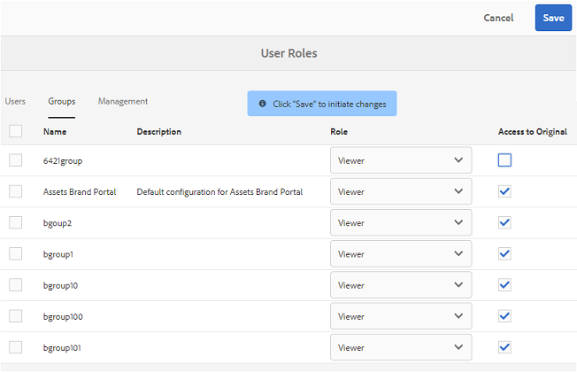
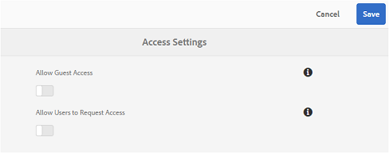

# Nieuwe functies in Experience Manager Assets Brand Portal {#what-s-new-in-aem-assets-brand-portal}

Met Adobe Experience Manager Assets Brand Portal kunt u eenvoudig goedgekeurde creatieve elementen aanschaffen, beheren en veilig distribueren aan externe partijen en interne zakelijke gebruikers op verschillende apparaten. Het draagt bij tot een efficiëntere verdeling van activa, versnelt de marktintroductie van activa en vermindert het risico van niet-naleving en ongeoorloofde toegang. Adobe werkt aan een verbetering van de algemene Brand Portal-ervaring. Hier is een blik in de nieuwe eigenschappen en verhogingen.

## Wat veranderde in 2022.08.0 {#what-changed-in-August-2022}

Brand Portal 2022.08.0 bevat oplossingen voor de kritieke problemen. Zie de nieuwste [Opmerkingen bij de release van Brand Portal](brand-portal-release-notes.md).

## Wat veranderde in 2022.05.0 {#what-changed-in-May-2022}

Brand Portal voert nu om de twaalf uur automatische taken uit om alle Brand Portal-middelen te verwijderen die naar AEM worden gepubliceerd. U hoeft daarom de middelen in de map Contribution niet handmatig te verwijderen om de mapgrootte onder de drempelwaarde te houden. U kunt ook de status van de automatisch uitgevoerde verwijdertaken controleren met de opdracht **[!UICONTROL Tools]** > **[!UICONTROL Asset Contribution Status]** > **[!UICONTROL Deletion Reports]** in Brand Portal. Het rapport voor een baan verstrekt de volgende details:

* Begintijd taak
* Eindtijd van taak
* Taakstatus
* Totaal aan activa inbegrepen in een baan
* Totaal aantal elementen is verwijderd in een taak
* Totale opslag beschikbaar gesteld als gevolg van de uitvoering van de taak

U kunt ook verder naar beneden boren om de details van elk middel te bekijken inbegrepen in een schrappingsbaan. De details zoals activa titel, grootte, auteur, schrappingsstatus, en schrappingstijd zijn inbegrepen in het rapport.

Bovendien bevat Brand Portal 2022.05.0 oplossingen voor de kritieke problemen. Zie de nieuwste [Opmerkingen bij de release van Brand Portal](brand-portal-release-notes.md).

## Wat veranderde in 2022.02.0 {#what-changed-in-Feb-2022}

Brand Portal 2022.02.0 is een interne release die oplossingen voor de kritieke problemen bevat. Zie de nieuwste [Opmerkingen bij de release van Brand Portal](brand-portal-release-notes.md).

## Wat veranderde in 2021.10.0 {#what-changed-in-october-2021}

Brand Portal 2021.10.0 is een interne release die oplossingen voor de kritieke problemen bevat. Zie de nieuwste [Opmerkingen bij de release van Brand Portal](brand-portal-release-notes.md).

## Wat veranderde in 2021.08.0 {#what-changed-in-august-2021}

Brand Portal 2021.08.0 is een interne release waarin bedrijfsprofielen worden geïntroduceerd voor bedrijven en teams die klanten kunnen gebruiken om organisaties betere controle over hun middelen te geven. De gebruikers hebben nu organisatiespecifieke rechten voor de nieuwe en gemigreerde organisaties. Tijdens de migratie worden alle bestaande Adobe ID-accounts overgebracht naar bedrijfs-id&#39;s.

* Zakelijke id&#39;s naar alle nieuwe en bestaande organisaties zodra deze zijn gemigreerd.
* Voor bedrijfs-id&#39;s is geen specifieke instelling vereist, zoals het opvragen van een domein of het instellen van een SSO.
* U kunt gebruikers toevoegen met elk e-mailadres, inclusief openbare e-maildomeinen zoals gmail.com of outlook.com.

**Gevolgen voor de Brand Portal-gebruikers**

De migratie heeft geen invloed op uw bestaande gegevensset, elementen, gebruikers of instellingen. De enige interne wijziging die tijdens de migratie plaatsvindt, is het recht van uw bestaande organisatie op bedrijfsprofielen.

>[!NOTE]
>
>De bedrijfsprofielen zijn momenteel van toepassing op de nieuwe organisaties die na 16 augustus 2021 worden gecreeerd.
>
>Totdat uw organisatie is gemigreerd, kunt u Adobe ID, Enterprise ID, of de types van Federated ID blijven gebruiken om tot de organisatie toegang te hebben.

### Referentieartikelen {#reference-articles}

* [Introductie van Adobe-profielen](https://helpx.adobe.com/enterprise/kb/introducing-adobe-profiles.html)

* [Adobe-profielen beheren](https://helpx.adobe.com/enterprise/using/manage-adobe-profiles.html)

* [Bijwerken om u aan te melden voor gebruikers en beheerders](https://helpx.adobe.com/enterprise/using/storage-for-business.html#new-admin-sign-in-exp)

* [Aanmeldingsbeperking tijdens migratie](https://helpx.adobe.com/enterprise/kb/account-temporarily-unavailable.html)

* [Gebruikers in Admin Console beheren](https://helpx.adobe.com/enterprise/using/manage-users-individually.html)

* [Productprofielen beheren voor zakelijke gebruikers](https://helpx.adobe.com/enterprise/using/manage-product-profiles.html#assign-users)

* [Domeinvertrouwen](https://helpx.adobe.com/enterprise/admin-guide.html/enterprise/using/set-up-identity.ug.html#directory-trusting)

<!--   
### Add new users to T2E organization   {#add-users-to-T2E-org}

On adding a new user in Admin Console for a new or migrated T2E organization, the user will have to perform an additional step **Join Team** to get entitled to the T2E organization. 

The user is entitled only if the user chooses to **Join Team**, otherwise the user won't get access to the selected T2E organization in Brand Portal. 

>[!NOTE]
>
>The workflow is not applicable to the existing Brand Portal users.

### Additional screen while navigating to Admin Console   {#navigate-to-admin-console}

The administrators will have to perform an additional step of selecting the T2E organization while navigating from Brand Portal to Admin Console. The workflow applies on the new and migrated T2E organizations.   

Selection of the T2E organization is a one-time activity and is not required everytime the administrator navigates from Brand Portal to Admin Console.

1. Log in to a T2E organization in Brand Portal as administrator.
1. Go to **[!UICONTROL Tools]** > **[!UICONTROL Users]** > **[!UICONTROL Management]** and click on the link **[!UICONTROL Launch Admin Console]**. 

   Or, go to **[!UICONTROL Unified Shell]** > **[!UICONTROL Administration]** and click on the link **[!UICONTROL Launch Admin Console]**. 
1. Search the T2E organization to login to Admin Console.

   

### Restriction during migration of an organization   {#login-restriction}

When an organization is undergoing T2E migration, the users of that organization will not be able to login to Brand Portal. The following error message appears on the screen. However, the migration won't impact the active user session until the token expires. 

Once the migration is complete, the users can login to Brand Portal. The users will receive an email notification containing the entitlement changes. If the users are entitled to more than one organization, they will have to select the organization at the time of login. 
-->

<!--
For a new or migrated T2E orgnization, the users will have an organization specific entitlement. A user can have multiple entitlements with the same email id for different T2E organizations. 
-->

## Wat veranderde in 2021.06.0 {#what-changed-in-june-2021}

Brand Portal 2021.06.0 is een interne release die oplossingen voor de kritieke problemen bevat. Zie de nieuwste [Opmerkingen bij de release van Brand Portal](brand-portal-release-notes.md).

## Wat is er veranderd in 2021.02.0 {#what-changed-in-feb-2021}

Brand Portal 2021.02.0 is een verbeteringsrelease die de activeringsworkflow van Brand Portal op AEM Assets as a Cloud Service instelt, de functie voor het aantrekken van bedrijfsmiddelen op AEM Assets as a Cloud Service vereenvoudigt, de functionaliteit voor het downloaden van bedrijfsmiddelen verbetert en kritieke oplossingen bevat. Het laat ook de beheerders toe om het standaarddownloadgedrag van omslagen, inzamelingen, en bulkdownload van activa op huurdersniveau te vormen. De Brand Portal **[!UICONTROL Usage Report]** is ook aangepast aan de actieve Brand Portal-gebruikers.

### Brand Portal activeren op AEM Assets as a Cloud Service {#bp-automation-on-cloud-service}

AEM Assets as a Cloud Service heeft nu het recht om een vooraf geconfigureerde Brand Portal-instantie te hebben. De gebruiker van Cloud Manager kan Brand Portal activeren op het as a Cloud Service AEM Assets-exemplaar.

Eerder werd AEM Assets as a Cloud Service handmatig geconfigureerd met Brand Portal met Adobe Developer Console.

De gebruiker van de Manager van de Wolk activeert het activeringswerkschema dat tot de vereiste configuraties bij het achtereind leidt en Brand Portal op zelfde IMS org activeert zoals van de as a Cloud Service instantie van AEM Assets.

Brand Portal activeren op je as a Cloud Service AEM Assets-exemplaar:

1. Meld u aan bij Adobe Cloud Manager en navigeer naar **[!UICONTROL Environments]**.
1. Selecteer de omgevingen (een voor een) in de lijst. Als u de omgeving van Brand Portal hebt gevonden, klikt u op de knop **[!UICONTROL Activate Brand Portal]** om de activeringsworkflow te starten.
1. Zodra de Brand Portal-huurder is geactiveerd, verandert de status in Geactiveerd.

Zie [Brand Portal activeren op AEM Assets as a Cloud Service](https://experienceleague.adobe.com/docs/experience-manager-cloud-service/assets/brand-portal/configure-aem-assets-with-brand-portal.html).

### Asset Sourting op AEM Assets as a Cloud Service {#asset-sourcing-on-cloud-service}

De functie Asset Sourcing is nu beschikbaar op AEM Assets as a Cloud Service. De functie is standaard ingeschakeld voor alle gebruikers van de cloudservice. De toegestane Brand Portal-gebruikers kunnen een bijdrage leveren aan het aanschaffen van middelen door nieuwe middelen te uploaden naar de mappen voor bijdragen en de map met bijdragen te publiceren van Brand Portal naar AEM Assets as a Cloud Service. De beheerders kunnen de bijdrage van de Brand Portal-gebruikers controleren en goedkeuren om deze verder te verspreiden onder andere Brand Portal-gebruikers.

Eerder was Asset Sourcing alleen beschikbaar op AEM Assets (op locatie en beheerde service).

Zie [Asset Sourting in Brand Portal](https://experienceleague.adobe.com/docs/experience-manager-brand-portal/using/asset-sourcing-in-brand-portal/brand-portal-asset-sourcing.html).

### Asset Download {#asset-download-setting}

Naast de bestaande **[!UICONTROL Download Settings]** kunnen de Brand Portal-beheerders nu de **[!UICONTROL Asset Download]** instellen. Met deze instelling kunnen beheerders het standaarddownloadgedrag van mappen, verzamelingen en het bulkdownloaden van elementen (meer dan 20 elementen) op huurdersniveau bepalen.

<!--
Earlier, all the asset renditions were directly downloaded in a zip folder in case of folder, collection, and bulk download of assets. As the **[!UICONTROL Download]** dialog is skipped for folders or collections, there was no mechanism to control the downloading behaviour of the assets. Due to this, the users were finding it difficut to search for a particular asset rendition from a folder containing huge bunch of downloaded renditions. 
-->

Eerder werden alle elementenuitvoeringen rechtstreeks gedownload in een ZIP-map. De **[!UICONTROL Download]** is het dialoogvenster voor mappen en verzamelingen overgeslagen en er was geen methode om het downloadgedrag van de elementen te bepalen, waardoor het moeilijk was om te zoeken naar een bepaalde uitvoering van vele downloads.

**[!UICONTROL Asset Download]** met de instelling kunt u nu een aparte map voor elk element maken terwijl u de mappen, verzamelingen of bestanden bulksgewijs downloadt.

Als de **[!UICONTROL Asset Download]** Als deze instelling is uitgeschakeld, worden de mappen of verzamelingen gedownload in een ZIP-map met alle elementuitvoeringen in dezelfde map, behalve voor het downloaden van de elementen via de koppeling voor delen.

Meld u als beheerder aan bij uw Brand Portal-medewerker en navigeer naar **[!UICONTROL Tools]** > **[!UICONTROL Download]**. De beheerders kunnen de **[!UICONTROL Asset Download]** het plaatsen om afzonderlijke omslag voor elk middel tot stand te brengen terwijl het downloaden van omslagen, inzamelingen, en bulkdownload van activa.

Zie [middelen van Brand Portal downloaden](https://experienceleague.adobe.com/docs/experience-manager-brand-portal/using/download/brand-portal-download-assets.html).
<!--
### Download using Share link {#download-using-share-link}

The default behavior of downloading the assets using share link is now independent of the **[!UICONTROL Download Settings]**. A separate folder is created for each asset while downloading the assets using share link. 
-->

### Gebruiksrapport {#usage-report}

De Brand Portal **[!UICONTROL Usage Report]** is gewijzigd om alleen de actieve Brand Portal-gebruikers weer te geven. De Brand Portal-gebruikers die niet aan een productprofiel in de Admin Console zijn toegewezen, worden als niet-actieve gebruikers beschouwd en worden niet weergegeven in de **[!UICONTROL Usage Report]**.

Eerder, zowel werden de actieve als inactieve gebruikers getoond in het Rapport van het Gebruik.

## Wat veranderde in 2020.10.0 {#what-changed-in-oct-2020}

Brand Portal 2020.10.0 is een verbeteringsrelease die zich richt op het vereenvoudigen van het downloaden van bedrijfsmiddelen en die belangrijke oplossingen bevat. De verbetering omvat nieuwe en verbeterde werkstroom voor activa downloaden, extra opties om vertoningen uit te sluiten, directe download van **[!UICONTROL Renditions]** -deelvenster, configuratie om toegang en downloadrechten toe te staan voor een specifieke groep gebruikers en eenvoudige navigatie naar de bestanden, verzamelingen en gedeelde koppelingen op alle Brand Portal-pagina&#39;s. Zie de nieuwste [Opmerkingen bij de release van Brand Portal](brand-portal-release-notes.md).

### Vereenvoudigde downloadervaring {#download-dialog}

Eerder, **[!UICONTROL Download]** Er is een dialoogvenster weergegeven met meerdere opties, zoals het maken van een aparte map voor elk element, het e-mailmiddel, het selecteren van het oorspronkelijke element, aangepaste uitvoeringen, dynamische uitvoeringen, het uitsluiten van systeemuitvoeringen en het inschakelen van downloadversnelling, die ambigu waren voor niet-technische of nieuwe gebruikers, met name wanneer er meerdere middelen of mappen waren geselecteerd om te worden gedownload. Bovendien kon de gebruiker niet alle elementuitvoeringen zien of een specifieke aangepaste of dynamische uitvoering uitsluiten.

De nieuwe **[!UICONTROL Download]** wordt het proces van selectie en filtratie van elementen veralgemeend, waardoor het voor Brand Portal-gebruikers gemakkelijker wordt om effectieve beslissingen te nemen tijdens het downloaden van de rendities van elementen. Alle geselecteerde elementen en de bijbehorende uitvoeringen worden weergegeven, afhankelijk van de opties [**[!UICONTROL Download]**](brand-portal-download-assets.md) configuratie en **[!UICONTROL Download]** instellingen.

>[!NOTE]
>
>Alle gebruikers hebben nu **[!UICONTROL Fast Download]** standaard ingeschakeld en vereist IBM Aspera Connect 3.9.9 (`https://www.ibm.com/docs/en/aspera-connect/3.9.9`) geïnstalleerd in de extensie van hun browser voordat de middelen van Brand Portal worden gedownload.

<!--
If any of the **[!UICONTROL Custom Rendition]** or **[!UICONTROL System Rendition]** is enabled in the [**[!UICONTROL Download]**](brand-portal-download-assets.md) configuration and **[!UICONTROL Download]** settings are enabled for the group users, the new **[!UICONTROL Download]** dialog appears with all the renditions of the selected assets or folders containing assets in a list view. 
-->

Van de **[!UICONTROL Download]** kunnen de gebruikers:

* Alle beschikbare uitvoeringen van elementen in de downloadlijst weergeven.
* Sluit uitvoeringen van de elementen uit die niet vereist zijn voor downloaden.
* Pas met één klik dezelfde set vertoningen toe op alle vergelijkbare elementtypen.
* Verschillende sets uitvoeringen toepassen op verschillende elementtypen.
* Maak afzonderlijke map voor elk element.
* Geselecteerde elementen en de bijbehorende uitvoeringen downloaden.

De downloadworkflow blijft constant voor zelfstandige elementen, meerdere elementen, mappen met elementen, onder licentie of zonder licentie geplaatste elementen en het downloaden van elementen via de koppeling voor delen. Zie [stappen voor het downloaden van middelen van Brand Portal](https://experienceleague.adobe.com/docs/experience-manager-brand-portal/using/download/brand-portal-download-assets.html).

### Snelle navigatie  {#quick-navigation}

Eerder, de optie om te bekijken **[!UICONTROL Files]**, **[!UICONTROL Collections]**, en **[!UICONTROL Shared Links]** waren verborgen en vereiste veelvoudige kliks telkens als de gebruiker op een andere mening wilde schakelen.

In Brand Portal 2020.10.0 kunnen gebruikers navigeren naar **[!UICONTROL Files]**, **[!UICONTROL Collections]**, en **[!UICONTROL Shared Links]** van alle Brand Portal-pagina&#39;s in één klik met de snelkoppelingen.

### Verbeterd deelvenster voor uitvoering {#rendition-panel}

Eerder konden de gebruikers alleen het oorspronkelijke middel en de bijbehorende uitvoeringen bekijken in de **[!UICONTROL Renditions]** als een van de **[!UICONTROL Custom Rendition]** of **[!UICONTROL System Rendition]** is ingeschakeld in het dialoogvenster **[!UICONTROL Download]** configuratie. Bovendien moesten de gebruikers alle elementuitvoeringen downloaden omdat er geen filter was om specifieke aangepaste of dynamische uitvoeringen uit te sluiten die niet vereist waren.

<!--
Earlier, if any of the custom or system renditions was enabled in the **[!UICONTROL Download]** settings, an additional **[!UICONTROL Download]** dialog appeared on clicking the **[!UICONTROL Download]** button wherein the user had to manually select the set of renditions (original asset, custom renditions, dynamic renditions) to download.
There was no filter to exclude specific custom or dynamic renditions which were not required for download.
-->

In Brand Portal 2020.10.0 kunnen gebruikers specifieke uitvoeringen uitsluiten en rechtstreeks [de geselecteerde uitvoeringen downloaden vanuit het deelvenster Uitvoeringen](brand-portal-download-assets.md#download-assets-from-asset-details-page) op de pagina met elementdetails zonder dat u de **[!UICONTROL Download]** .

<!-- 
In Brand Portal 2020.10.0, direct download and exclude renditions features are introduced in the **[!UICONTROL Renditions]** panel on the asset details page. All the renditions (original asset, custom renditions, dynamic renditions) under the rendition panel are now associated with a check box and are enabled by default. 

The user can clear the check boxes to exclude the renditions which are not required for download. And can click on the **[!UICONTROL Download]** button in the **[!UICONTROL Renditions]** panel to directly download the selected set of renditions in a zip folder without having to open the **[!UICONTROL Download]** dialog.
-->

### Downloadinstellingen configureren {#download-permissions}

Naast de bestaande **[!UICONTROL Download]** -configuraties kunnen de Brand Portal-beheerders ook instellingen configureren voor verschillende groepen gebruikers om het oorspronkelijke element en de uitvoeringen te bekijken en (of) downloaden van de pagina met elementdetails.

Meld u als beheerder aan bij uw Brand Portal-medewerker en navigeer naar **[!UICONTROL Tools]** > **[!UICONTROL Users]**.

In de **[!UICONTROL User Roles]** pagina, naar de **[!UICONTROL Groups]** om de weergave en (of) downloadinstellingen voor de gebruikersgroepen te configureren.

Eerder waren de instellingen alleen beschikbaar om te voorkomen dat groepsgebruikers het oorspronkelijke element konden downloaden.

De **[!UICONTROL Groups]** op het tabblad **[!UICONTROL User Roles]** op de pagina kunnen beheerders de weergave- en downloadinstellingen configureren:

* Als beide **[!UICONTROL Download Original]** en **[!UICONTROL Download Renditions]** Als de instellingen zijn ingeschakeld, kunnen de gebruikers van de geselecteerde groep de oorspronkelijke elementen en hun uitvoeringen weergeven en downloaden.
* Als beide instellingen zijn uitgeschakeld, kunnen de gebruikers alleen de originele elementen bekijken. De elementuitvoeringen zijn niet zichtbaar voor de gebruikers op de pagina met elementdetails.
* Alleen **[!UICONTROL Download Original]** Als deze instelling is ingeschakeld, kunnen gebruikers alleen de oorspronkelijke elementen weergeven en downloaden van de pagina met elementdetails.
* Alleen **[!UICONTROL Download Renditions]** Als deze instelling is ingeschakeld, kunnen gebruikers het oorspronkelijke element weergeven, maar kunnen ze het niet downloaden. De gebruiker kan de elementuitvoeringen wel weergeven en downloaden.

Zie [middelendownload configureren](https://experienceleague.adobe.com/docs/experience-manager-brand-portal/using/download/brand-portal-download-assets.html#configure-download-permissions).

>[!NOTE]
>
>Als een gebruiker wordt toegevoegd aan meerdere groepen en als een van deze groepen beperkingen heeft, gelden de beperkingen voor de gebruiker.

<!--
>Restrictions to access the original asset and their renditions do not apply to administrators even if they are members of restricted groups.
 >
 >The users can always download assets and their renditions from the repository using a `curl` request even if the download configurations are turned-off.
 >
-->

## Wat veranderde in 6.4.7 {#what-changed-in-647}

De release van Brand Portal 6.4.7 biedt de documentviewer, verbetert de ervaring voor het downloaden van middelen en bevat belangrijke correcties. Zie de nieuwste [Opmerkingen bij de release van Brand Portal](brand-portal-release-notes.md).

<!--
Brand Portal 6.4.7 release brings in the Document Viewer, leverages the Brand Portal administrators to configure asset download, and centers top customer requests. See latest [Brand Portal Release Notes](brand-portal-release-notes.md).
-->

### Documentviewer {#doc-viewer}

De documentviewer verbetert de weergave van PDF. De toepassing biedt een vergelijkbare ervaring als de Adobe Document Cloud terwijl de PDF-bestanden in Brand Portal worden weergegeven.

Eerder waren er beperkte opties beschikbaar om de PDF-bestanden weer te geven.

Met Documentviewer hebben de Brand Portal-gebruikers nu de opties om pagina&#39;s weer te geven, bladwijzers weer te geven, op pagina&#39;s te zoeken, in te zoomen, uit te zoomen, naar vorige en volgende pagina&#39;s te navigeren, naar pagina te schakelen, aan venster te passen, op scherm te passen en de werkbalk te verbergen of te verbergen.

>[!NOTE]
>
>De ervaring met het weergeven van andere documentindelingen blijft ongewijzigd.

### Downloadervaring {#download-configurations}

Het proces voor het downloaden van bedrijfsmiddelen is vernieuwd, zodat gebruikers er eenvoudiger mee kunnen werken terwijl [bestanden downloaden van Brand Portal](brand-portal-download-assets.md).

De bestaande workflow voor het downloaden van middelen van Brand Portal wordt onvermijdelijk gevolgd door het verschijnen van een  **[!UICONTROL Download]** met meerdere downloadopties waaruit u kunt kiezen.

In Brand Portal 6.4.7 kunnen de Brand Portal-beheerders het element configureren  **[!UICONTROL Download]** instellingen. De beschikbare configuraties zijn:

* **[!UICONTROL Fast Download]**
* **[!UICONTROL Custom Renditions]**
* **[!UICONTROL System Renditions]**

De Brand Portal-beheerder kan elke combinatie inschakelen om het downloaden van middelen te configureren.

<!--In Brand Portal 6.4.7, fast download, custom renditions, and system renditions are the three configurations available.-->

* Als beide **[!UICONTROL Custom Renditions]** en **[!UICONTROL System Renditions]** zijn uitgeschakeld, worden de oorspronkelijke uitvoeringen van de middelen gedownload zonder extra dialoogvenster dat het downloaden voor de Brand Portal-gebruikers vereenvoudigt.

* Indien een van de **[!UICONTROL Custom Rendition]** of **[!UICONTROL System Rendition]** is ingeschakeld, wordt de **[!UICONTROL Download]** wordt weergegeven en het oorspronkelijke element wordt samen met de elementuitvoeringen gedownload. Inschakelen  **[!UICONTROL Fast Download]** -configuratie versnelt het downloadproces.

Gebaseerd op de configuratie, blijft het downloadwerkschema constant voor stand-alone activa, veelvoudige activa, omslagen die activa, vergunning of unlicensed activa bevatten, en het downloaden van activa gebruikend aandeelverbinding.

## Wat veranderde in 6.4.6 {#what-changed-in-646}

In Brand Portal 6.4.6 wordt het machtigingskanaal tussen AEM Assets en Brand Portal gewijzigd. Brand Portal wordt nu ondersteund op AEM Assets as a Cloud Service, AEM Assets 6.3 en hoger. In AEM Assets 6.3 en hoger werd Brand Portal eerder geconfigureerd in de klassieke gebruikersinterface via Legacy OAuth Gateway, die de JWT-tokenuitwisseling gebruikt om een IMS Access-token voor verificatie te verkrijgen. AEM Assets is nu geconfigureerd met Brand Portal via Adobe Developer Console, die een IMS-token aanschaft voor toestemming van uw Brand Portal-huurder.

<!-- The steps to configure integration are different depending on your AEM version, and whether you are configuring for the first-time, or upgrading the existing integration:
-->

<!--
  
   | **AEM Version** |**New Integration** |**Upgrade Integration** |
|---|---|---|
| **AEM 6.5** |[Create new integration](../using/brand-portal-configure-integration-65.md) |[Upgrade existing integration](../using/brand-portal-configure-integration-65.md#upgrade-integration-65) | 
| **AEM 6.4** |[Create new integration](../using/brand-portal-configure-integration-64.md) |[Upgrade existing integration](../using/brand-portal-configure-integration-64.md#upgrade-integration-64) | 
| **AEM 6.3** |[Create new integration](../using/brand-portal-configure-integration-63.md) |[Upgrade existing integration](../using/brand-portal-configure-integration-63.md#upgrade-integration-63) | 
| **AEM 6.2** | | 

   -->

De stappen voor het configureren van AEM Assets met Brand Portal zijn afhankelijk van uw AEM en of u de configuratie voor het eerst configureert of de bestaande configuraties bijwerkt:

<!--| **AEM Version** |**New Configuration** |**Upgrade Configuration** |
|---|---|---|
| **AEM 6.5 (6.5.4.0 and above)** |[Create configuration](../using/brand-portal-configure-integration-65.md) |[Upgrade configuration](../using/brand-portal-configure-integration-65.md#upgrade-integration-65) | 
| **AEM 6.4 (6.4.8.0 and above)** |[Create configuration](../using/brand-portal-configure-integration-64.md) |[Upgrade configuration](../using/brand-portal-configure-integration-64.md#upgrade-integration-64) | 
| **AEM 6.3 (6.3.3.8 and above)** |[Create configuration](../using/brand-portal-configure-integration-63.md) |[Upgrade configuration](../using/brand-portal-configure-integration-63.md#upgrade-integration-63) | 

-->

<!-- AEM Assets configuration with Brand Portal on Adobe I/O is supported on:
* AEM 6.5.4.0 and above
* AEM 6.4.8.0 and above
* AEM 6.3.3.8 and above -->

| **AEM** | **Nieuwe configuratie** | **Upgradeconfiguratie** |
|---|---|---|
| **AEM Assets as a Cloud Service** | [Configuratie maken](https://experienceleague.adobe.com/docs/experience-manager-cloud-service/assets/brand-portal/configure-aem-assets-with-brand-portal.html) | - |
| **AEM 6.5 (6.5.4.0 en hoger)** | [Configuratie maken](https://experienceleague.adobe.com/docs/experience-manager-65/assets/brandportal/configure-aem-assets-with-brand-portal.html) | [Upgradeconfiguratie](https://experienceleague.adobe.com/docs/experience-manager-65/assets/brandportal/configure-aem-assets-with-brand-portal.html#upgrade-integration-65) |
| **AEM 6.4 (6.4.8.0 en hoger)** | [Configuratie maken](https://experienceleague.adobe.com/docs/experience-manager-64/assets/brandportal/configure-aem-assets-with-brand-portal.html) | [Upgradeconfiguratie](https://experienceleague.adobe.com/docs/experience-manager-64/assets/brandportal/configure-aem-assets-with-brand-portal.html#upgrade-integration-64) |
| **AEM 6.3 (6.3.3.8 en hoger)** | [Configuratie maken](https://helpx.adobe.com/experience-manager/6-3/assets/using/brand-portal-configuring-integration.html) | [Upgradeconfiguratie](https://helpx.adobe.com/experience-manager/6-3/assets/using/brand-portal-configuring-integration.html#Upgradeconfiguration) |
| **AEM 6,2** | Contact opnemen met Klantenondersteuning | Contact opnemen met Klantenondersteuning |

>[!NOTE]
>
>Het wordt aanbevolen uw AEM-exemplaar bij te werken naar het nieuwste servicepakket.

Zie de nieuwste [Opmerkingen bij de release van Brand Portal](brand-portal-release-notes.md).

Zie [Veelgestelde vragen over Brand Portal](brand-portal-faqs.md).

## Wat veranderde in 6.4.5 {#what-changed-in-645}

Brand Portal 6.4.5 is een release met functies die zich richt op het bieden van Brand Portal-gebruikers (externe agentschappen/teams) de mogelijkheid om inhoud te uploaden naar Brand Portal en deze te publiceren naar AEM Assets, zonder dat toegang nodig is tot de auteursomgeving. Deze functie wordt aangeroepen **[Asset Sourting in Brand Portal](brand-portal-asset-sourcing.md)** en verbetert de ervaring van klanten door gebruikers een mechanisme in twee richtingen te bieden waarmee zij hun middelen kunnen leveren en delen met andere wereldwijd gedistribueerde Brand Portal-gebruikers.

### Asset Sourting in Brand Portal {#asset-sourcing-in-bp}

Met Asset Sourcing kunnen AEM gebruikers (beheerders/gebruikers die geen beheerder zijn) mappen maken met een extra **Bijdrage activa** -eigenschap, zodat de nieuwe map die is gemaakt, toegankelijk is voor verzending van middelen door Brand Portal-gebruikers. Het leidt automatisch tot een werkschema dat tot twee extra subomslagen, genoemd NIEUW en GEDEELD, binnen pas gecreeerd leidt **Bijdrage** map.

De AEM gebruiker definieert vervolgens de vereiste door een korte beschrijving te uploaden van de typen elementen die moeten worden toegevoegd aan de map Contribution en door basislijnelementen te uploaden naar de **GEDEELD** om ervoor te zorgen dat Brand Portal-gebruikers beschikken over de benodigde informatie. De beheerder kan actieve Brand Portal-gebruikers dan toegang verlenen tot de bijdragemap voordat het zojuist gemaakte **Bijdrage** naar Brand Portal.

Wanneer de gebruiker klaar is met het toevoegen van inhoud in de **NIEUW** , kunnen zij de bijdrageomslag terug naar het AEM auteursmilieu publiceren. Het kan enkele minuten duren voordat de import is voltooid en de nieuw gepubliceerde inhoud in AEM Assets wordt weerspiegeld.

Bovendien blijven alle bestaande functies ongewijzigd. Brand Portal-gebruikers kunnen middelen weergeven, zoeken en downloaden vanuit de map met bijdragen en vanuit de andere toegestane mappen. En beheerders kunnen de bijdragemap verder delen, eigenschappen wijzigen en elementen toevoegen aan verzamelingen.

>[!NOTE]
>
>Asset Sourcing in Brand Portal wordt ondersteund op AEM 6.5.2.0 en hoger.
>
>De functie wordt niet ondersteund in de eerdere versies - AEM 6.3 en AEM 6.4.

### Elementen uploaden naar de bijdragemap {#upload-assets-in-bp}

Brand Portal-gebruikers met de juiste machtigingen kunnen afzonderlijke elementen of mappen (.zip-bestand) met meerdere elementen uploaden naar de map met bijdragen. Een gebruiker kan meerdere elementen uploaden naar een map voor middelenbijdragen. Er kan echter maar één map tegelijk worden gemaakt.

De Brand Portal-gebruikers kunnen alleen elementen uploaden naar de **NIEUW** submap. De **GEDEELD** map is bedoeld voor de distributie van vereisten en basislijnelementen.

### Bijdragemap publiceren naar AEM Assets {#publish-assets-to-aem}

Wanneer het uploaden is voltooid naar de **NIEUW** Brand Portal-gebruikers kunnen de bijdragemap vervolgens weer naar AEM publiceren. Het kan enkele minuten duren om de gepubliceerde inhoud/middelen in AEM Assets te importeren en weer te geven. Zie [Contribute-map publiceren naar AEM Assets](brand-portal-publish-contribution-folder-to-aem-assets.md).

## Wat veranderde in 6.4.4 {#what-changed-in-644}

De release van Brand Portal 6.4.4 richt zich op verbeteringen in het zoeken naar tekst en op verzoeken van klanten. Zie de nieuwste [Opmerkingen bij de release van Brand Portal](brand-portal-release-notes.md).

### Verbeteringen voor zoeken

Vanaf Brand Portal 6.4.4 steunt gedeeltelijke tekstonderzoek op bezitspredikaat in het filtreren ruit. Als u gedeeltelijk zoeken van tekst wilt toestaan, moet u **Gedeeltelijk zoeken** in Voorspelling eigenschap in het zoekformulier.

Lees verder voor meer informatie over gedeeltelijk zoeken naar tekst en zoeken naar jokertekens.

#### Gedeeltelijke woordzoekopdracht {#partial-phrase-search}

U kunt nu naar elementen zoeken door alleen een deel (dat een woord of twee is) van de gezochte woordgroep op te geven in het filtervenster.

**Hoofdletters gebruiken**
Gedeeltelijke woordzoekactie is handig wanneer u niet zeker weet welke combinatie van woorden in de gezochte uitdrukking voorkomt.

Als in uw zoekformulier in Brand Portal bijvoorbeeld Eigenschapvoorspelling wordt gebruikt voor gedeeltelijk zoeken naar de titel van de elementen, geeft u de term op **kamp** geeft alle bezittingen terug met het woordkamp in hun titelzin.

#### Zoekopdracht met jokertekens {#wildcard-search}

De Brand Portal staat het gebruik van de asterisk toe (&#42;) in zoekquery samen met een deel van het woord in de gezochte uitdrukking.

**Gebruik hoofdletters/kleine letters. Als u niet zeker weet welke woorden precies voorkomen in de gezochte uitdrukking, kunt u een vervangingsonderzoek gebruiken om de hiaten in uw onderzoeksvraag te vullen.

Als u bijvoorbeeld **klimmen&#42;** retourneert alle elementen met woorden die beginnen met de tekens **klimmen** in hun titelzin als het zoekformulier in Brand Portal de functie Voorspelling van eigenschap gebruikt voor gedeeltelijk zoeken naar de titel van de elementen.

Op dezelfde manier specificeren:

* **&#42;klimmen** retourneert alle elementen met woorden die eindigen met tekens **klimmen** in hun titelzin.

* **&#42;klimmen&#42;** retourneert alle elementen met woorden die de tekens omvatten **klimmen** in hun titelzin.

>[!NOTE]
>
>Bij selecteren **Gedeeltelijk zoeken** selectievakje, **Hoofdlettergebruik negeren** is standaard geselecteerd.

## Wat veranderde in 6.4.3 {#what-changed-in}

De release van Brand Portal 6.4.3 richt zich op het bieden van een alternatieve alias aan organisaties naast hun huurder-id in Brand Portal access URL, de nieuwe configuratie van de mappenhiërarchie, de verbetering van de videoondersteuning, de geplande publicatie van AEM Author-instantie naar Brand Portal, operationele verbeteringen — en voorziet in verzoeken van klanten.

### Navigatie in maphiërarchie voor niet-beheerders

Beheerders kunnen nu configureren hoe de mappen bij het aanmelden worden weergegeven aan gebruikers zonder beheer (Editors, Viewers en Gastgebruikers). [Maphiërarchie inschakelen](../using/brand-portal-general-configuration.md) configuratie is toegevoegd in **Algemene instellingen** in het deelvenster met beheergereedschappen. Als de configuratie:

* **enabled**, is de mappenstructuur die begint in de hoofdmap zichtbaar voor niet-beheerders. Aldus, die hen een navigatie ervaring gelijkend op beheerders verlenen.
* **uitgeschakeld** worden alleen de gedeelde mappen weergegeven op de bestemmingspagina.

De [Maphiërarchie inschakelen](../using/brand-portal-general-configuration.md) Met de functie (indien ingeschakeld) kunt u de mappen onderscheiden met dezelfde namen die worden gedeeld van verschillende hiërarchieën. Bij het aanmelden zien niet-beheerders nu de virtuele bovenliggende mappen (en vooroudermappen) van de gedeelde mappen.

De gedeelde mappen worden in de desbetreffende directory&#39;s in virtuele mappen ingedeeld. U kunt deze virtuele mappen herkennen met een vergrendelingspictogram.

De standaardminiatuur van de virtuele mappen is de miniatuurafbeelding van de eerste gedeelde map.

### Zoeken in specifieke maphiërarchie of pad

**Padbrowser** predikaat wordt geïntroduceerd in de Vorm van het Onderzoek om het zoeken van activa in een specifieke folder toe te staan. Het standaardzoekpad van zoekvoorspelling voor padbrowser is `/content/dam/mac/<tenant-id>/`, die kan worden geconfigureerd door het standaardzoekformulier te bewerken.

* Admin-gebruikers kunnen met de Padbrowser naar een willekeurige mapmap op Brand Portal navigeren.
* Gebruikers die geen beheerder zijn, kunnen de padbrowser gebruiken om alleen naar de mappen (en terug te navigeren naar de bovenliggende mappen) te navigeren die met hen worden gedeeld.

   Bijvoorbeeld: `/content/dam/mac/<tenant-id>/folderA/folderB/folderC` wordt gedeeld met een gebruiker die geen beheerder is. De gebruiker kan naar elementen binnen folderC zoeken gebruikend Browser van de Weg. Deze gebruiker kan ook naar folderB en folderA navigeren (aangezien zij voorouders van folderC zijn die met de gebruiker wordt gedeeld).

U kunt nu het zoeken naar middelen beperken in een specifieke map waarnaar u hebt gebladerd, in plaats van te beginnen bij de hoofdmap.

Als u onder deze mappen zoekt, wordt alleen gezocht naar elementen die met de gebruiker zijn gedeeld.

### Ondersteuning voor Dynamic Media-video-uitvoeringen

Gebruikers van wie de AEM-auteur-instantie zich in de hybride Dynamic Media-modus bevindt, kunnen naast de originele videobestanden ook een voorvertoning van de dynamische media-uitvoeringen weergeven en deze downloaden.

Beheerders moeten opgeven dat dynamische media-uitvoeringen op specifieke huurdersaccounts kunnen worden voorvertoond en gedownload **Dynamic Media-configuratie** (videoservice-URL (DM-Gateway URL) en registratie-id om de dynamische video op te halen) in **Video** configuratie via het deelvenster met beheergereedschappen.

Dynamic Media-video&#39;s kunnen worden voorvertoond op:

* Pagina met elementgegevens
* Weergave van de kaart van het element
* Voorvertoningspagina voor delen koppelen

Dynamic Media Video-codering kan worden gedownload van:

* Brand Portal
* Gedeelde koppeling

### Gepland publiceren naar Brand Portal

Middelen (en mappen) publiceren, workflow vanuit [AEM (6.4.2.0)](https://experienceleague.adobe.com/docs/experience-manager-64/release-notes/sp-release-notes.html) De instantie van de auteur aan Brand Portal kan voor een recentere datum, tijd worden gepland.

Op dezelfde manier kunnen gepubliceerde elementen later uit het portaal worden verwijderd door de workflow Publiceren via Brand Portal te plannen.

### Configureerbare alias van huurder in URL

Organisaties kunnen hun portal-URL aanpassen door een alternatief voorvoegsel in de URL te plaatsen. Om een alias voor huurdersnaam in hun bestaande portaal URL te krijgen, moeten de organisaties de Steun van de Klant contacteren.

Alleen het voorvoegsel van de Brand Portal-URL kan worden aangepast en niet de volledige URL.\
Bijvoorbeeld een organisatie met een bestaand domein **geomettrix.brand-portal.adobe.com** kan **geomettrixinc.brand-portal.adobe.com** op verzoek gemaakt.

De instantie AEM-auteur kan echter [geconfigureerd](https://experienceleague.adobe.com/docs/experience-manager-65/assets/brandportal/configure-aem-assets-with-brand-portal.html) alleen met de URL van de huurder en niet met alias (alternatief) URL van de huurder.

Organisaties kunnen aan hun merkingsbehoeften voldoen door de portaal-URL aan te passen in plaats van zich aan de URL van Adobe te houden.

### Verbeteringen in downloadervaring

De release biedt een vereenvoudigde downloadervaring met een beperkt aantal klikken en waarschuwingen, op:

* Opdat alleen de uitvoeringen (en niet de oorspronkelijke elementen) worden gedownload.
* De elementen downloaden wanneer de toegang tot de oorspronkelijke uitvoeringen beperkt is.

## Wat veranderde in 6.4.2 {#what-changed-in-1}

De release van Brand Portal 6.4.2 biedt een groot aantal mogelijkheden om tegemoet te komen aan de behoeften van organisaties op het gebied van de distributie van bedrijfsmiddelen en hen te helpen bij het bereiken van een groot aantal gebruikers die wereldwijd gedistribueerd zijn via gasttoegang en optimale ervaring met versnelde downloads. Brand Portal verstrekt ook grotere controle aan organisaties door nieuwe configuraties voor beheerders, onlangs toegevoegd rapport, en caters aan klantenverzoeken.

### Toegang voor gasten

AEM Brand-portaal biedt gasten toegang tot het portaal. Een gastgebruiker vereist geen geloofsbrieven om het portaal in te gaan en kan tot alle openbare omslagen en inzamelingen toegang hebben en downloaden. Gastgebruikers kunnen elementen toevoegen aan hun lichtbak (privéverzameling) en deze downloaden. Ze kunnen ook zoeken naar slimme tags en voorspelden van zoekopdrachten weergeven die door beheerders zijn ingesteld. De gastzitting staat gebruikers niet toe om inzamelingen tot stand te brengen en bewaarde onderzoeken of hen verder te delen, tot omslag en inzamelingsmontages toegang te hebben, en activa als verbindingen te delen.

In een organisatie zijn meerdere gelijktijdige gastsessies toegestaan, wat beperkt is tot 10% van de totale gebruikersquota per organisatie.

Een gastsessie blijft twee uur actief. Daarom wordt de staat van de lichtbak ook bewaard tot twee uur vanaf de tijd van het zittingsbegin. Na twee uur, moet de gastzitting opnieuw beginnen, zodat wordt de lichtbakstaat verloren.

### Versnelde downloads

Brand Portal-gebruikers kunnen snelle downloads toepassen op basis van IBM Aspera Connect, zodat ze 25x sneller kunnen downloaden en overal ter wereld probleemloos kunnen downloaden. Als gebruikers de middelen sneller van Brand Portal of de gedeelde koppeling willen downloaden, moeten ze **Downloadversnelling inschakelen** in het dialoogvenster Downloaden, op voorwaarde dat downloadversnelling is ingeschakeld in hun organisatie.

Beheerders kunnen versneld downloaden op basis van IBM Aspera inschakelen voor de organisatie **Downloadversnelling inschakelen** (standaard uitgeschakeld) van [Algemene instellingen](brand-portal-general-configuration.md#allow-download-acceleration) in het deelvenster met beheergereedschappen. Raadpleeg voor meer informatie over voorwaarden en stappen voor het oplossen van problemen om bestanden met elementen sneller te downloaden van Brand Portal en gedeelde koppelingen de [Handleiding om downloads van Brand Portal te versnellen](../using/accelerated-download.md#main-pars-header).

### Rapport voor gebruikersaanmelding

Er is een nieuw rapport geïntroduceerd om gebruikersaanmeldingen bij te houden. De **Aanmeldingsgegevens gebruiker** het rapport kan nuttig zijn om organisaties toe te laten om een controle van de gedelegeerde beheerders en andere gebruikers van Brand Portal te controleren en te houden.

De rapportlogboeken tonen namen, e-mail IDs, persona&#39;s (admin, kijker, redacteur, gast), groepen, laatste login, activiteitenstatus, en login telling van elke gebruiker van de plaatsing van Brand Portal 6.4.2 tot de tijd van rapportgeneratie. De beheerders kunnen het rapport als .csv uitvoeren. Samen met andere rapporten, laat het rapport van Logins van de Gebruiker organisaties toe om gebruikersinteractie met de goedgekeurde merkmiddelen beter te controleren, daardoor ervoor zorgend conformiteit aan collectieve nalevingsbureaus.

### Toegang tot oorspronkelijke vertoningen

Beheerders kunnen de gebruikerstoegang tot originele afbeeldingsbestanden (.jpeg, .tiff, .png, .bmp, .gif, .pjpeg, x-portable-anymap, x-portable-bitmap, x-portable-graymap, x-portable-pixmap, x-rgb, x-xbitmap, x-xpixmap, x-icon, image/photoshop, image/x-photoshop, .psd, image/vnd.adobe.photoshop) en geef toegang tot vertoningen met lage resolutie die zij van Brand Portal of gedeelde verbinding downloaden. Deze toegang kan op het niveau van de gebruikersgroep van het lusje van Groepen van de pagina van Rollen van de Gebruiker in het paneel van Admin hulpmiddelen worden gecontroleerd.

* Standaard kunnen alle gebruikers de originele uitvoeringen downloaden, omdat de optie Toegang tot origineel voor iedereen is ingeschakeld.
* Beheerders moeten de selectie van de desbetreffende selectievakjes opheffen om te voorkomen dat een groep gebruikers toegang krijgt tot de oorspronkelijke uitvoeringen.
* Als een gebruiker lid is van meerdere groepen, maar slechts één van de groepen heeft beperkingen, gelden de beperkingen voor die gebruiker.
* De beperkingen zijn niet van toepassing op beheerders, ook al zijn zij lid van beperkte groepen.
* De machtigingen van de gebruiker die elementen deelt als koppeling zijn van toepassing op de gebruikers die elementen downloaden via gedeelde koppelingen.

### Pad met maphiërarchie op kaart- en lijstweergaven

In de Kaarten van mappen wordt in de Kaartweergave nu informatie over de maphiërarchie weergegeven voor gebruikers die geen beheerder zijn (Editor, Viewer en gastgebruiker). Deze functionaliteit laat de gebruikers de plaats van de omslagen kennen, die zij, met betrekking tot de ouderhiërarchie toegang hebben.

Informatie over de maphiërarchie is vooral handig om onderscheid te maken tussen de mappen waarvan de namen overeenkomen met andere mappen die vanuit een andere maphiërarchie worden gedeeld. Als de gebruikers die geen beheerder zijn niet op de hoogte zijn van de mapstructuur van de elementen die met hen worden gedeeld, lijken elementen/mappen met vergelijkbare namen verwarrend.

* De paden die op de betreffende kaarten worden weergegeven, worden afgekapt om in de kaartgrootten te passen. Gebruikers kunnen het volledige pad echter zien als knopinfo bij het aanwijzen over het afgebroken pad.

In de lijstweergave wordt het mappad van elementen in een kolom weergegeven voor alle gebruikers van Brand Portal.

### Overzicht, optie om de eigenschappen van elementen weer te geven

Brand Portal biedt een overzichtsoptie voor gebruikers die geen beheerder zijn (Editors, Viewers, Gastgebruikers) om de eigenschappen van middelen van geselecteerde elementen/mappen weer te geven. De optie Overzicht is zichtbaar:

1. Selecteer bovenaan op de werkbalk een middel/map.
2. In de vervolgkeuzelijst selecteert u de spoorkiezer.

Als u de optie Overzicht selecteert terwijl een middel/map is geselecteerd, kunnen gebruikers de titel, het pad en het tijdstip van het maken van de elementen zien. Terwijl de gebruiker met de optie Overzicht op de pagina met elementdetails de metagegevens van het element kan bekijken.

## Nieuwe configuraties

Er worden zes nieuwe configuraties toegevoegd voor beheerders om de volgende functies in of uit te schakelen voor specifieke huurders:

* Toegang voor gasten toestaan
* Gebruikers toegang tot Brand Portal aanvragen
* Beheerders toestaan elementen te verwijderen uit Brand Portal
* Openbare collecties maken
* Maken van openbare slimme verzamelingen toestaan
* Downloadversnelling toestaan

De bovenstaande configuraties zijn beschikbaar onder Toegang en Algemene instellingen in het deelvenster met beheergereedschappen.

### Adobe I/O UI om de Integraties van de Auth te vormen

Brand Portal 6.4.2 en hoger gebruikt Legacy OAuth (`https://legacy-oauth.cloud.adobe.io/`) gebruiken om JWT-toepassingen te maken, waardoor Auth-integratie kan worden geconfigureerd voor AEM Assets-integratie met Brand Portal. Eerder werd de interface voor het configureren van OAuth-integratie gehost in `https://marketing.adobe.com/developer/`. Meer informatie over het integreren van AEM Assets met Brand Portal voor het publiceren van middelen en verzamelingen naar Brand Portal vindt u in [AEM Assets-integratie configureren met Brand Portal](https://experienceleague.adobe.com/docs/experience-manager-64/assets/brandportal/configure-aem-assets-with-brand-portal.html).

## Verbeteringen zoeken

Beheerders kunnen de eigenschap instellen dat niet-hoofdlettergevoelig wordt voorspeld door de bijgewerkte eigenschap predikaat te gebruiken, die een controle op Hoofdlettergebruik negeren heeft. Deze optie is beschikbaar voor de voorspelling van eigenschappen en eigenschappen met meerdere waarden.\
Nochtans, is het niet-hoofdlettergevoelige onderzoek relatief langzamer dan standaardonderzoek naar bezitspredikaat. Als het zoekfilter te veel niet-hoofdlettergevoelige voorspellingen bevat, kan de zoekopdracht vertragen. Daarom wordt het aanbevolen de niet-hoofdgevoelige zoekopdracht op oordeelkundige wijze te gebruiken.

## Wat veranderde in 6.4.1 {#what-changed-in-2}

Brand Portal 6.4.1 is een upgraderelease voor platformen die verschillende nieuwe functies en essentiële verbeteringen bevat, zoals bladeren, zoeken en prestatieverbeteringen, om een bevredigende klantervaring te bieden.

### Verbeteringen voor bladeren

* Nieuwe contentstructuurrails om snel door de hiërarchie van elementen te navigeren.

* Nieuwe sneltoetsen, bijvoorbeeld _p)_ voor navigatie naar eigenschappenpagina, _e)_ voor Bewerken, en _(ctrl+c)_ voor kopieerbewerkingen.
* Verbeterde schuifervaring, luie laadervaring in kaart- en lijstweergave voor het bladeren door een groot aantal elementen.
* Uitgebreide kaartweergave met ondersteuning voor kaarten van verschillende grootte op basis van de instelling voor weergave.

* In de kaartweergave wordt nu datum-/tijdstempel weergegeven wanneer u de muis boven het datumlabel plaatst.

* Verbeterde kolomweergave met **Meer details** onder de elementmomentopname, waarmee u naar de detailpagina van een element kunt navigeren.

* In de lijstweergave worden nu standaard de bestandsnamen van elementen in de eerste kolom weergegeven, naast de landinstelling, het type element, de afmetingen, de grootte, de classificatie en de publicatiegegevens. Nieuw **Instellingen weergeven** kan worden gebruikt om de hoeveelheid details te vormen om in de mening van de Lijst te tonen.

* Betere ervaring met middelendetails, omdat u met nieuwe navigatieknoppen heen en weer kunt navigeren tussen elementen en elementen kunt weergeven.

* Nieuwe mogelijkheid om audiobestanden, geüpload vanaf AEM, voor te vertonen op de detailpagina van het element.
* New Related Assets capabilities provided in Asset properties. Activa die op AEM verband houden met andere bron/afgeleide activa en op Brand Portal zijn gepubliceerd, hebben hun relatie in Brand Portal nu intact, met koppelingen naar de gerelateerde activa op de eigenschappenpagina.
* Er is een nieuwe configuratie geïntroduceerd om te voorkomen dat gebruikers zonder beheerdersrechten openbare verzamelingen maken. Organisaties kunnen samenwerken met het team van Klantenondersteuning om deze mogelijkheid te configureren voor specifieke accounts.

### Verbeteringen voor zoeken

* Mogelijkheid geïntroduceerd om terug te keren naar dezelfde positie in zoekresultaten, na navigatie naar een zoekopdracht, zonder de zoekquery opnieuw uit te voeren.
* Er is een aantal nieuwe zoekresultaten opgegeven waarmee het aantal zoekresultaten wordt weergegeven.
* Het verbeterde filter van het Onderzoek van het Type van Dossier met de capaciteit om onderzoeksresultaten te filtreren die op verfijnde types MIME zoals .jpg, .png, en .psd worden gebaseerd in vergelijking met vroegere Beelden, Documenten, Multimedia opties.
* Verbeterde zoekfilters voor verzamelingen, met nauwkeurige tijdstempels in plaats van de vorige tijdschuifregelaar.
* De nieuwe het type van Toegang filters zijn geïntroduceerd om naar de inzamelingen te zoeken die openbaar of niet-Openbaar zijn.

### Optimalisaties downloaden

* Eén groot bestand wordt rechtstreeks gedownload, zonder dat er een ZIP-bestand wordt gemaakt. Hierdoor wordt de snelheid en de doorvoer verhoogd.
* De downloadlimiet per bestandsgrootte voor de functie voor delen van koppeling is **1** GB.

* Gebruikers kunnen nu alleen de aangepaste en originele bestanden downloaden en uitvoeringen buiten de box voorkomen tijdens het downloaden van elementen van Brand Portal of via de functie voor gedeelde koppelingen.

### Prestatieverbeteringen

* Tot 100% betere downloadsnelheid voor middelen.
* Tot 40% verbetering in zoekactie voor middelen.
* Tot 40% betere bladerprestaties.

**Opmerking**: Bewegde verbeteringen zijn volgens de tests die in het laboratorium worden uitgevoerd.

### Verbeterde rapporteringsmogelijkheden

**Inleiding tot Rapport van het Aandeel van de Verbinding**
Er is een nieuw rapport geïntroduceerd om informatie te verschaffen over gedeelde koppelingen. Het rapport van het Aandeel van de Verbinding maakt een lijst van alle URLs, aan de activa, die met interne en externe gebruikers over organisatie in het gespecificeerde tijdkader worden gedeeld. Het deelt ook wanneer de verbinding werd gedeeld, door wie, en wanneer het verlopen.

**Het ingangspunt voor toegang tot het rapport van het Gebruik gewijzigd**
Het verbruiksrapport wordt nu geconsolideerd met andere rapporten en kan nu worden bekeken vanaf de console voor rapporten van bedrijfsmiddelen. Navigeer naar de console Asset Reports om deze te bereiken **Rapporten maken/beheren** in het deelvenster met beheergereedschappen.

**Verbeterde gebruikerservaring bij rapportage**
De rapportinterface over Brand Portal is intuïtiever geworden en geeft organisaties meer controle. Naast het maken van verschillende rapporten kunnen beheerders nu terugkeren naar de gegenereerde rapporten en deze downloaden of verwijderen, omdat deze rapporten in Brand Portal worden opgeslagen.

Elk van de rapporten die kunnen worden gecreeerd worden aangepast door standaardkolommen toe te voegen of te verwijderen. Bovendien kunnen aangepaste kolommen worden toegevoegd aan de rapporten Downloaden, Verlopen en Publiceren om de mate van granulariteit van de kolommen te bepalen.

### Verbeterde beheerfuncties

Verbeterde eigenschappenkiezer in de beheerfuncties voor metagegevens, zoeken en rapporten met Type-ahead- en bladermogelijkheden om de beheerervaring te vereenvoudigen.

### Andere verbeteringen

* Middelen die vanaf AEM 6.3.2.1 en 6.4 naar Brand Portal zijn gepubliceerd, kunnen nu openbaar worden gemaakt voor algemene gebruikers van Brand Portal door het selectievakje Openbare map publiceren in te schakelen in het dialoogvenster AEM Assets Brand Portal Replication.

* Beheerders worden via e-mails met een verzoek om toegang op de hoogte gesteld, behalve de meldingen in het Brand Portal-systeemvak, als iemand toegang tot de Brand Portal heeft aangevraagd.

## Wat veranderde in 6.3.2 {#what-changed-in-3}

Brand Portal 6.3.2 bevat nieuwe en verbeterde functionaliteit die gericht is op de belangrijkste verzoeken van klanten en algemene prestatieverbeteringen.

### Toegang tot Brand Portal aanvragen {#request-access-to-brand-portal}

Gebruikers kunnen nu toegang tot Brand Portal aanvragen met de nieuwe **toegang nodig** op het aanmeldingsscherm van Brand Portal beschikbaar.

Afhankelijk van of gebruikers een Adobe ID hebben of een Adobe ID moeten maken, kunnen gebruikers de juiste workflow volgen om een aanvraag in te dienen. Brand Portal-productbeheerders ontvangen dergelijke verzoeken in hun meldingsgebied en verlenen toegang via Adobe Admin Console.

Zie voor meer informatie [Toegang tot Brand Portal aanvragen](../using/brand-portal.md#requestaccesstobrandportal).

### Verbetering in het rapport over gedownloade elementen {#enhancement-in-the-assets-downloaded-report}

Het gedownloade rapport voor elementen bevat nu het aantal gedownloade elementen per gebruiker binnen het opgegeven datum- en tijdbereik. Gebruikers kunnen dit rapport downloaden in de .csv-indeling en gegevens compileren, zoals het totale aantal downloads voor een onder licentie geplaatst element.

Zie voor meer informatie de stappen 3 en 6 in [Aanvullende rapporten maken en beheren](../using/brand-portal-reports.md#createandmanageadditionalreports).

### Brand Portal-onderhoudsmelding {#brand-portal-maintenance-notification}

Brand Portal geeft nu een paar dagen voor een aanstaande onderhoudsactiviteit een berichtenbanner weer. Een voorbeeldmelding:

Zie voor meer informatie [Brand Portal-onderhoudsmelding](https://experienceleague.adobe.com/docs/experience-manager-brand-portal/using/introduction/brand-portal.html).

### Verbetering voor gelicentieerde elementen die worden gedeeld met de functie voor het delen van koppelingen {#enhancement-for-licensed-assets-shared-using-the-link-share-feature}

Tijdens het downloaden van gelicentieerde middelen met de functie voor het delen van koppelingen, wordt u nu gevraagd akkoord te gaan met de licentieovereenkomst voor deze elementen.

Voor meer informatie, zie Stap 12 in [Elementen delen als koppeling](../using/brand-portal-link-share.md#shareassetsasalink).

### Verbetering van gebruikerenkiezer {#user-picker-enhancement}

De prestaties van de kiezer van de gebruiker worden nu verbeterd om tegemoet te komen aan de behoeften van klanten met een grote gebruikersbasis.

### Ervaar wijzigingen in cloud-branding {#experience-cloud-branding-changes}

Brand Portal past nu de nieuwe merknaam Adobe Experience Cloud aan.

## Wat veranderde in 6.3.1 {#what-changed-in-4}

Brand Portal 6.3.1 bevat nieuwe en verbeterde functionaliteit die gericht is op het uitlijnen van Brand Portal op AEM.

### Bijgewerkte gebruikersinterface {#upgraded-user-interface}

Als u de Brand Portal-gebruikerservaring wilt uitlijnen op AEM, gaat Adobe over naar de gebruikersinterface van Coral 3. Deze wijziging verbetert de algemene bruikbaarheid, waaronder navigatie en vormgeving.

#### Verbeterde navigatie-ervaring {#enhanced-navigational-experience}

* Snelle toegang tot administratieve hulpmiddelen door het nieuwe embleem van de Adobe:

* Productnavigatie door een overlay:

* Snelle navigatie naar bovenliggende mappen:

* Snel zoeken en navigeren naar de vereiste inhoud en gereedschappen:

### Verbeterde bladerervaring {#enhanced-browsing-experience}

* Nieuwe kolomweergave om door geneste mappen te bladeren:

 

* In de lijst met elementen in een map wordt bovenaan het laatst geüploade element weergegeven.

### Verbeterde zoekervaring {#enhanced-search-experience}

* Met de nieuwe zoekfunctie Universeel hebt u snel toegang tot relevante inhoud, mogelijkheden of tags via automatische suggesties wanneer u zoektrefwoorden typt. Universeel onderzoek is beschikbaar over alle onderzoekseigenschappen.

* U kunt ook zoekfilters toevoegen aan de zoekopdracht in Universeel om de zoekopdracht verder te verfijnen en sneller te laten verlopen.

* Met de nieuwe zoekopdracht op basis van assetbeoordeling kunt u zoeken naar elementen met waarderingen, indien gepubliceerd vanuit AEM Assets.
* De nieuwe zoekfunctie met meerdere waarden accepteert meerdere trefwoorden met de operator AND om elementen sneller te detecteren.
* Met de nieuwe zoekfunctie kunt u de zoekrelevantie verbeteren, zodat specifieke elementen boven aan de zoekresultaten worden weergegeven.
* Met de nieuwe zoekfunctie op basis van paden kunt u het pad naar een geneste map opgeven om te kunnen zoeken naar elementen in die map.

#### Nieuwe op slimme tags gebaseerde zoekopdracht {#new-smart-tags-based-search}

Als afbeeldingen met slimme tags van AEM Assets naar Brand Portal worden gepubliceerd, kunt u deze afbeeldingen in Brand Portal zoeken met de slimme-tagnamen als zoektrefwoorden. Deze functie is alleen beschikbaar voor bestanden.

### Verbeterde downloadervaring {#enhanced-downloading-experience}

Nadat u een geneste map hebt gedownload, kunt u de oorspronkelijke maphiërarchie behouden. Elementen in een geneste map kunnen in één map worden gedownload, in tegenstelling tot afzonderlijke mappen.

### Verbeterde prestaties {#improved-performance}

Verbeteringen in de mogelijkheden voor bladeren, zoeken en downloaden verbeteren de Brand Portal-prestaties aanzienlijk.

### Nieuw digitaal rechtenbeheer voor middelen {#new-digital-rights-management-for-assets}

Beheerders kunnen de vervaldatum en -tijd voor elementen instellen voordat ze deze delen. Nadat een element is verlopen, is het zichtbaar voor viewers en editors, maar kan het niet worden gedownload. Wanneer een element vervalt, ontvangen beheerders een melding.

### Verbeterde middelensortering {#enhanced-asset-sorting}

Het sorteren van middelen in een omslag in lijstmening is niet meer beperkt tot het aantal activa die op de eerste pagina worden getoond. Alle elementen in een map worden gesorteerd, ongeacht of alle elementen op de eerste pagina worden weergegeven.

### Verbeterde rapportage {#reporting-capabilities}

Beheerders kunnen drie typen rapporten maken en beheren: gedownloade, verlopen en gepubliceerde elementen. De capaciteit om de kolommen in een rapport te vormen, en de rapporten naar formaat uit te voeren CSV is ook beschikbaar.

### Aanvullende metagegevens {#additional-metadata}

Brand Portal 6.3.1 introduceert aanvullende metagegevens, die overeenkomen met AEM Assets 6.3. U kunt het formulier Schema-editor gebruiken om de metagegevens te beheren die zichtbaar moeten zijn op de pagina Eigenschappen van elementen. Metagegevens van elementen zijn niet zichtbaar voor gebruikers die gebruikmaken van een externe koppeling en die alleen elementen kunnen voorvertonen en downloaden via de gedeelde URL van de koppeling.

### Extra functies voor beheerders {#additional-capabilities-for-administrators}

* Voordat u aanpassingen in de achtergrond voor het aanmeldingsscherm voltooit, kunnen beheerders een voorvertoning van de wijzigingen bekijken.

* Nadat een beheerder nieuwe gebruikers heeft toegevoegd, hoeven ze geen uitnodigingen te accepteren om aan Brand Portal te worden toegevoegd, maar worden ze automatisch toegevoegd.

### Nieuwe publicatiemogelijkheden in AEM Assets 6.3 {#new-publishing-capabilities-in-aem-assets}

* AEM beheerders kunnen het schema van meta-gegevens van AEM Assets aan Brand Portal publiceren gebruikend AEM 6.3 SP1-GFP 1 (6.3.1.1), die in Q4 2017 beschikbaar zullen zijn.

* AEM beheerders kunnen alle tags van AEM Assets naar Brand Portal publiceren met AEM 6.2 SP1-GVB7 en AEM 6.3 SP1-GVB 1 (6.3.1.1).

* Vanuit AEM Assets kunt u elementen en verzamelingen publiceren die tags, waaronder slimme tags, bevatten. U kunt vervolgens naar deze elementen of verzamelingen zoeken met deze tags als zoektrefwoorden in Brand Portal.
